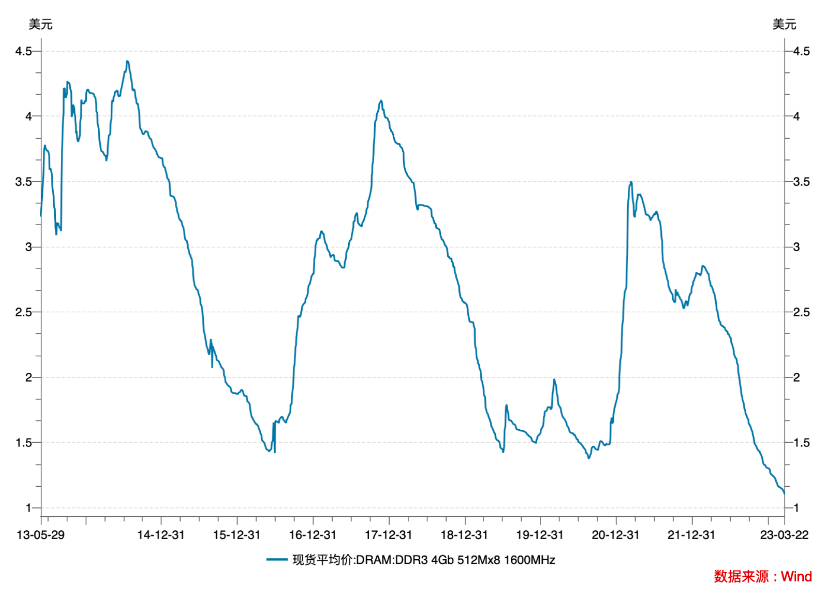

# 芯片寒冬？韩国4月出口持续低迷，一季度对华出口重挫

由于全球经济放缓以及半导体行业疲软，韩国4月份出口连续第七个月下降。

周一，韩国海关公布数据显示， **韩国4月对外出口额同比下降14.2%，超过经济学家预期的下降12.2%。**

其中，4月韩国对中国的出口下降26.5%，为连续第11个月下降。

与此同时，由于芯片需求下降、价格下跌， **韩国4月主要出口产品半导体的出口额下降了41%** ，连续第九个月下跌。

韩国今年首季对华出口降近三成

今年第一季度，在中国的主要贸易伙伴中，韩国对中国的出口降幅最大。

根据中国海关总署24日公布的数据， **今年1-3月，韩国对华出口额为382亿美元，较去年同期减少了28.2%。**

一季度，中国进口总额同比下降7.1%。而在23个主要贸易伙伴中，韩国对华出口降幅居首。日本同比下降19.5%，美国降幅仅为1.7%。

从对华出口规模来看，去年韩国对华出口规模排名第二，今年一季度则降至第五。

很大原因是半导体出口低迷

据韩国贸易协会和韩国央行的数据，受全球半导体需求下滑，存储器市场价格出现滑坡影响，一季度韩国半导体出口较去年同期锐减四成。半导体产品对华出口增长率从去年四季度的-31.7%，进一步下滑至今年一季度的-44.5%。

自去年下半年以来，全球存储芯片行业进入“寒冬”，而韩国是全球最大存储芯片制造国，占据全球7成的DRAM市场。
**半导体也是韩国最重要出口商品之一，在其出口额中所占的比重约为20%，而在韩国出口的半导体中，又以存储芯片为主。**

分析指出，中国经济重启后，在进口依赖程度较低的餐饮、住宿等面对面服务迅速恢复的推动下，消费火速升温。相反，手机、汽车等耐用品消费偏弱，最终产品及中间产品的进口尚未能恢复。

市场预计半导体价格年中见底

韩国产业通商资源部3月1日曾宣布，由于需求萎缩和库存增加，DRAM、NAND和系统芯片价格进一步下滑，半导体出口继续受到影响，芯片价格预计将继续下跌一段时间。

业内普遍认为，本轮半导体价格下行周期已经持续了一年半， **从周期性来看，已经是接近尾声，预计在2023年年中见底。**

4月经工作日调整后出货量降幅为去年12月以来最小

进口方面，继3月份下降6.4%之后，4月份韩国进口下降13.3%至522.3亿美元，降幅也快于经济学家预期的10.6%。

韩国4月份的贸易逆差为26.2亿美元，为该国连续第14个月出现月度贸易逆差， **不过逆差幅度为去年6月以来最小。**

值得注意的是，周一发布的数据显示， **4月韩国经工作日差异调整后的出口量同比下降10.4%，为去年12月以来的最小降幅。**

韩国被称为“全球经济的金丝雀”，分析认为， **这可能表明全球需求的疲软开始出现转机。**

