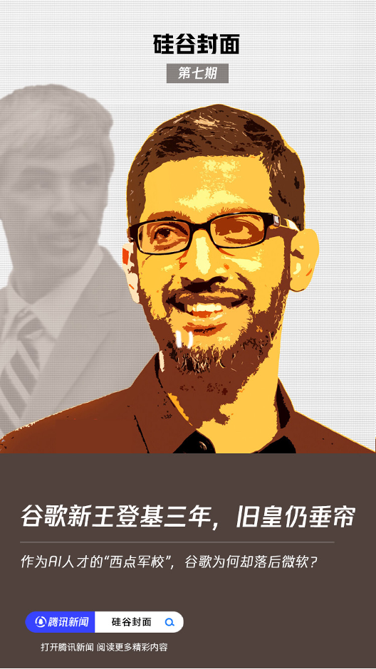
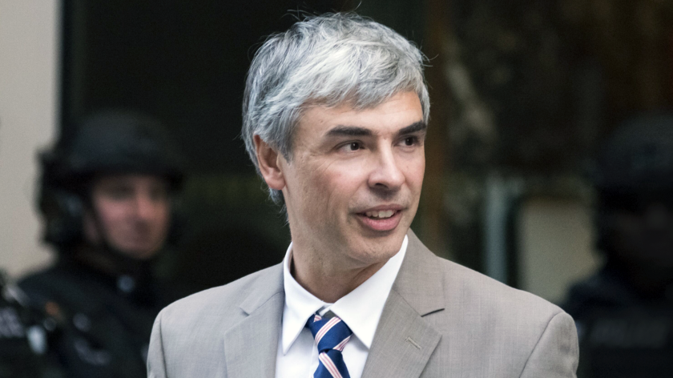
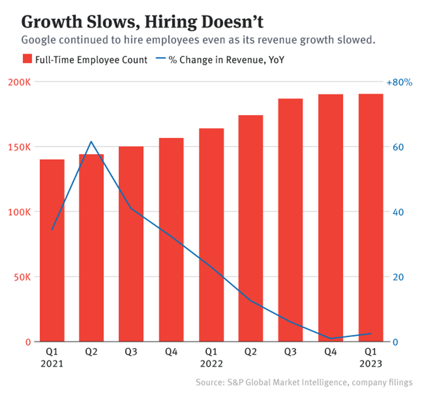
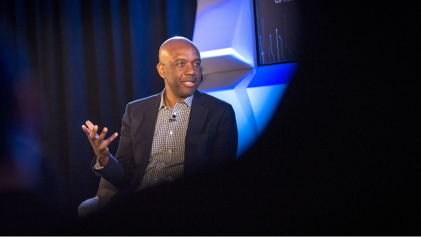
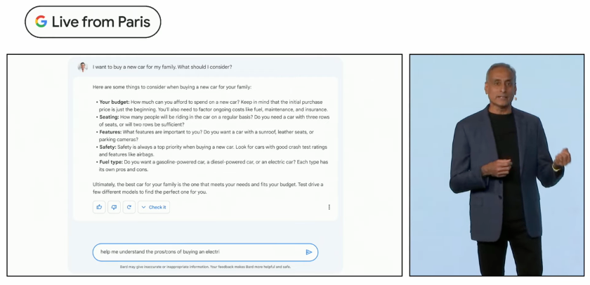

# 谷歌AI败局揭秘：CEO权力有限 创始人垂帘听政｜硅谷封面

划重点：

  * _1_ 身为Alphabet首席执行官，桑德尔·皮查伊私下却抱怨无法管理一些高管。究其原因，可能是创始人佩奇仍在垂帘听政。
  * _2_ Alphabet首席执行官与微软首席执行官截然不同，后者权力更大，能够让管理层步调一致。
  * _3_ Google Play在2022年获得了100亿至120亿美元的营业利润，占Alphabet总营业利润的13%至16%。
  * _4_ 在今年的谷歌年度软件开发者大会Google I/O上，皮查伊可能会宣布搜索、谷歌文档和谷歌云产品的新人工智能功能。

_「硅谷封面」系列聚焦硅谷科技大公司动态、科技大咖访谈、重磅研究报告等，旨在为科技资讯爱好者提供全球最前沿的深度好文。本期聚焦作为AI人才的“西点军校”，谷歌为何却落后微软。_

腾讯科技讯
5月1日消息，外媒日前撰文指出，在人工智能领域，谷歌一直如同“西点军校”般的存在，就连OpenAI创始团队中的研发人员也都基本来自谷歌。但是在ChatGPT因过于优秀的表现火爆出圈，将OpenAI带入大众视野，让砸下重金的微软喜笑颜开的同时，谷歌沦为AI竞赛中的失意者。内部官僚主义横行、管理层厌恶风险、联合创始人垂帘听政，是导致谷歌母公司Alphabet首席执行官桑德尔·皮查伊无法将AI研发成果植入到搜索等现有产品的主因。以下为文章内容全文：

自皮查伊2019年出任谷歌母公司Alphabet首席执行官以来，他一直坦诚地向挚友讲述管理规模庞大的Alphabet所面临的种种困难：长期存在的内部权力斗争、监管机构的严格监督、以及桀骜不驯的员工不断向管理层施压。据知情人士称，皮查伊几年前曾在一次内部会议中表示，出任Alphabet首席执行官让他付出了代价，按照他自己的设想，会在几年后交出帅印。

在最近几个月困扰谷歌的恐慌出现之前，皮查伊向挚友分享了这些感受。时至今日，Alphabet的帅印还在皮查伊手中。恐慌的出现，迫使他变得更加投入。随着广告商从去年秋天开始削减支出，谷歌业务开始停滞不前。此外，竞争对手微软和OpenAI推出了新一代人工智能服务，可能威胁到谷歌在搜索领域的主导地位，以及与之相关的每年超过1500亿美元的广告营收。突然之间，谷歌必须在它曾主导的领域去追赶竞争对手微软。

“当前的形势正第一次呼唤着桑德拉成为战时首席执行官，我们还没有看到他是否准备好迎接挑战，”阿德里安·奥恩（Adrian
Aoun）说。奥恩过去把自己创办的初创公司出售给了谷歌，并在2015年协助谷歌联合创始人拉里·佩奇（Larry Page），把谷歌重组为Alphabet。

这场危机暴露出的问题在皮查伊执掌帅印期间开始恶化，但在Alphabet广告营收和利润开始萎缩之前，这些问题似乎并不重要：他喜欢对产品进行渐进式改进，而不是大幅调整；能够容忍员工数量的膨胀、懒散的企业文化和组织架构的低效。也许最重要的是，尽管皮查伊身为Alphabet首席执行官，却没有太多的权力去管理一些高管。

多年来，皮查伊一直向身边的挚友抱怨说，他无法管理一些高管。皮查伊曾表示，他无法让Alphabet旗下总部设在伦敦的人工智能部门DeepMind的首席执行官戴密斯·哈萨比斯（Demis
Hassabis）优先考虑一些项目，或与Brain共享软件代码。Brain是谷歌内部另一个大型人工智能部门，经常开发与DeepMind相同类型的机器学习软件。

在谷歌长期任职的高管们把这种现状归因于类似于学术或政府机构的企业文化。在这种文化中，老员工可能会也可能不会服从上级的命令。此外，多位Alphabet员工表示皮查伊厌恶与同事发生冲突。

皮查伊无法直接领导市值达1.3万亿美元的Alphabet的管理层，可能还有一个原因：皮查伊的前任拉里·佩奇（Larry
Page）仍在垂帘听政。作为开发出摇钱树般的搜索引擎的谷歌联合创始人，佩奇目前仍然是Alphabet董事会的成员，并与另一位联合创始人谢尔盖·布林（Sergey
Brin）通过特殊股票控制着公司。知情人士透露，尽管佩奇迄今基本上没有插手Alphabet内部事务，但当DeepMind首席执行长哈萨比斯希望自身业务独立于谷歌之外时，皮查伊还是与曾长时间担任自己上司的佩奇就此事进行了交谈。

与微软CEO截然不同

就连遁世的佩奇也认识到了谷歌人工智能霸主地位面临的外部威胁。长期以来，佩奇一直把谷歌视为最终开发通用人工智能的载体--
能够自主学习并超越人类推理的计算机。最近几个月，他和布林参加了Alphabet内部举行的多场人工智能战略会议，这一举动反映出Alphabet对OpenAI可能带来的威胁感到异常担忧。

上周，Alphabet宣布DeepMind将与Brain合并，共同组建新部门谷歌DeepMind。Alphabet表示，重组将“极大的加快我们在人工智能领域的进展。”虽然整合这些团队看起来似乎合乎逻辑，因为它们一直在并行开发同类软件，但这一举动让许多谷歌员工感到震惊，因为两个团队有着不同的文化，还因为多年来Brain的负责人杰夫·迪恩（Jeff
Dean）与DeepMind的哈萨比斯一直是竞争关系，但迪恩在这次重组中选择了让位。

之前曾有媒体报道称，佩奇多次参加了公司内部会议。据一名员工透露，在最近的Alphabet董事会会议后不久，谷歌宣布了合并人工智能团队的决定，哈萨比斯将出任合并后新团队的负责人。这一时间节点表明，最终决定可能来自于董事会层面，而不是皮查伊。

皮查伊在Alphabet的权力与微软首席执行官萨提亚·纳德拉（Satya
Nadella）在微软的权力形成了鲜明对比。纳德拉似乎能够让他的管理层团队步调一致，因为他通过投资百亿美元建立的合作伙伴关系，把微软的未来与OpenAI的未来联系在一起。这意味着，一些微软高管和经理人不得不做出牺牲：微软正在全公司范围内为训练人工智能模型分配算力，以便与OpenAI相关的努力，包括把OpenAI的技术植入微软的核心产品，能够有更大的机会取得成功。微软的Azure云业务为OpenAI滚雪球般扩大的计算基础设施和人工智能开发提供了资金。在纳德拉对微软内部数量庞大的人工智能研究人员失去耐心之后，他把人工智能开发业务外包给了OpenAI。

站好最后一班岗

在出任首席执行官后的几年中，皮查伊不断告诉一些同事，他怀念过去的工作方式。但一位与他密切合作的人说，皮查伊计划带领Alphabet度过最近的财务和竞争挑战。皮查伊的公关人员把他推到了聚光灯下，展示谷歌开发下一代人工智能产品的工作。最近，他参加了哥伦比亚广播公司的“60分钟”和《纽约时报》的播客节目。

皮查伊能否留任可能不是他说了算。根据Alphabet现任和前任员工的说法，公司上下普遍认为，他可能不适合这个时候继续担任首席执行官。鉴于自他上任以来Alphabet相对强劲的股价表现，投资人似乎没有要求Alphabet换帅，但还是有一些激进投资人呼喊着要求他削减成本。根据Koyfin的数据，最近几周市场已发出警告信号，原因是Alphabet的股票估值(动态市销率)一年来首次低于Facebook母公司Meta。

随着皮查伊将Alphabet重新定位于人工智能，一些高管已经得到擢升。有媒体报道称，被提拔的高管包括谷歌云负责人托马斯·库里安(Thomas
Kurian)。在提拔之前，库里安刚接手谷歌负责设计支持人工智能的特殊芯片的团队。此前，库里安呼吁要获得更多火力，在向云客户出售人工智能服务的业务中与微软抗衡。随着谷歌广告收入增长停滞，云业务比以往任何时候都更加重要。在最新一季的财报中，Alphabet首次披露旗下云业务已实现运营利润。

除库里安外，得到擢升的高管还包括哈萨比斯以及詹姆斯·曼尼卡（James
Manyika），后者曾是奥巴马时代的政府官员和咨询公司麦肯锡的顾问，也是与皮查伊共同出现在《60分钟》节目中的几位高管之一。曼尼卡刚刚从Brain的原负责人迪恩手中接手了一个大约2000人的研究小组，并深度参与了Alphabet的人工智能产品战略。

皮查伊今年还有一个目标，可能要比人工智能更加重要：与苹果续约，把谷歌作为iPhone和MacBook上Safari浏览器的默认搜索引擎。知情人士透露，这份长期协议能够帮助谷歌继续在搜索领域保持领先优势，每年为谷歌带来数百亿美元的收入。

最循规守矩的高管

皮查伊曾是一名软件工程师和商业顾问，2004年加入谷歌时只是一名普通的产品经理，但在随后的十年当中，他成为了佩奇的指定接班人。皮查伊之所以一路高升，是因为在佩奇清除那些他认为分歧太大或道德败坏的高管期间，他是公司最低调、最循规守矩的高管。

当佩奇在2015年把谷歌重组为Alphabet，并出任母公司首席执行官后，皮查伊被擢升为子公司谷歌的首席执行官。作为母公司，Alphabet负责监管谷歌和各类子公司，为无人驾驶汽车和智慧城市等长远项目设定目标。通过与谷歌的分离，这些技术有望得到更好的发展。

在Alphabet成立后的几年里，谷歌依靠搜索引擎和Android移动操作系统，让营收和净利润实现了稳步增长。从2015年开始，因为迪安的团队和谷歌从学术界聘请的其他研究人员开发的机器学习技术，让谷歌的广告业务从中受益。

同一时期，安卓也开始赚钱。与苹果的应用商店App Store一样，谷歌的应用商店Google
Play的运营成本相对较低，并从数十亿Android设备用户的应用内支付和内容销售中获得分成。Alphabet的财务披露和Epic
Games提起的诉讼显示，Google Play在2022年获得了100亿至120亿美元的营业利润，占Alphabet总营业利润的13%至16%。

总体而言，自皮查伊在2015年底担任首席执行官以来，谷歌的年营收从约750亿美元飙升至2022年的2800多亿美元，净利润从160亿美元跃升至600亿美元。但皮查伊的批评者表示，无论谁担任谷歌首席执行官，该公司在同一时期营收和利润增幅都会非常出彩。

皮查伊的低调风格并不总是有助于他处理任期内出现的各种小争议。举例来说，在新冠肺炎疫情之前，皮查伊经常因为员工抗议谷歌包庇曾性骚扰同事的“安卓之父”安迪·鲁宾而遭到批评。出现的其他有争议的问题还包括谷歌与美国军方的合作等等。

谷歌负责Pixel手机开发的高级副总裁里克·奥斯特洛（Rick
Osterloh）在2018年曾向媒体表示：“如果皮查伊发觉自己的意见没有被听到，亦或是有团队完全没有听从他的意见，皮查伊仍会强调自己的观点，但绝不会提高嗓门。我想这就是他给人的印象，恭敬且谦逊。他从未宣称自己是公司的掌舵人。”

官僚主义和风险规避

与此同时，从事人工智能开发工作的Alphabet员工对官僚主义和管理层的风险厌恶感到恼火，这阻止了他们推出新产品。例如，谷歌Lamda聊天机器人--
谷歌今年发布的Bard聊天机器人的前身--的开发人员在2021年集体离职，原因是他们不被允许在语音助手Google
Assistant中植入聊天机器人。“我离开是因为我不知道他们会发布什么产品，”Lamda的开发者之一诺阿姆·萨泽尔（Noam Shazeer）
去年年底向媒体表示。（谷歌在2021年5月展示了Lamda，但从未正式发布该产品。）

在推迟发布聊天机器人的问题上，谷歌有充分的理由。早在2015年，Google
Photos中的图像识别人工智能就把一些黑人标记为“大猩猩”，谷歌随后为此道歉并承诺修复错误。2020年，Lamda可以被用于生成自杀方式的列表。

谷歌为自己的谨慎付出了代价。该公司开发了可以根据简单提示快速生成原始图像的技术，但没有发布，这让OpenAI有机会推出自己的同类技术Dall-E
2。Dall-E
2很快在全球范围内声名鹊起。在谷歌员工可以使用该公司的图像生成技术Imagen之前，他们必须申请访问该技术；为了防止潜在的滥用，谷歌员工不允许使用Imagen生成人脸。此外，谷歌员工还必须签署一份放弃声明书，免除谷歌对系统生成内容的责任。

在2022年11月推出ChatGPT之前的几个月里，OpenAI从谷歌挖来一些重要的人工智能研究人员和工程师，承诺该公司将推出实际性的产品。这些前谷歌员工在ChatGPT的推出中发挥了重要作用。软件开发人员已经发现了ChatGPT的许多用途，例如在几秒钟内创建复杂的网站和应用。OpenAI有望通过向开发者收取技术使用费每年产生数亿美元的收入，并预计未来几年收入会扩大至数十亿美元。

一些谷歌经理私下表示，从长远来看，ChatGPT等技术可能会得到足够的改进，成为人们和企业用来寻找复杂问题答案的工具，而不是在谷歌上搜索网站列表。这将降低谷歌提供广告的能力。这些经理说，如果聊天机器人提高了与人交谈的能力，包括通过语音互动，人们可能会花更少的时间在电脑或手机屏幕上搜索信息。这不仅会给谷歌带来问题，也会给苹果带来问题。

新项目无法落地

皮查伊谨慎的管理风格也体现在他对海外版抖音TikTok崛起的回应上。去年年初，随着TikTok在年轻用户群体中越来越受欢迎，这些用户越来越多地使用它来搜索想要购买的产品或想要去旅行的地方，这对谷歌搜索构成了威胁。

知情人士透露，多年来，皮查伊一直向员工暗示，谷歌的搜索引擎--20多年来变化甚微--
应该升级了。TikTok带来的威胁促使谷歌采取行动。数百名员工被分配到一个被称为“重要的搜索转移”（Great Search
Shift）的项目中工作。据两位对该计划有直接了解的人士称，除了显示更多图像和视频之外，它还旨在使搜索结果更加个性化。

据悉，皮查伊最终选择只对搜索引擎的外观和感觉做最小的改动。该消息称，调整后的功能大部分在2022年底和2023年初推出，包括一些图像和视频的圆角，搜索结果中的更大图像，以及针对某些搜索的定制过滤器，比如让用户在购买服装时决定按性别对结果进行排序。

Autodesk前首席执行官、曾担任佩奇顾问的卡尔·巴斯（Carl Bass）表示：“Alphabet一直故步自封……在这种情况下，很难推动员工前进。”

注重成本限制发展

2022年末，随着OpenAI的ChatGPT带来的威胁变得明显，警钟开始在谷歌敲响。皮查伊要求团队将新的人工智能技术整合到众多谷歌产品中。

然而，皮查伊在追赶OpenAI和微软时面临障碍。员工们表示，将聊天机器人整合到谷歌搜索中可能会增加成本，因为用聊天机器人进行查询比提供常规搜索结果更昂贵。离开谷歌后创建了医疗创业公司Forward的奥恩表示，谷歌将广告融入聊天机器人互动也将变得更加困难，这可能会给利润率带来压力。“一旦进入助手的世界，比如聊天界面或语音界面，就很难在这种模式中植入广告，”奥恩说。

谷歌在3月份发布了Bard，但限制了它可以做的事情，并且只针对相对较小的用户群体，这在一定程度上是一种节省成本的措施。据一位对此事有直接了解的人士透露，为了支持这项服务，谷歌最初选择使用一种能力较弱的机器学习模型，这种模型的计算强度不如谷歌开发的其他模型。然而，Bard的推出受到了一名杰出研究人员的离职的影响，原因是他在发现团队的一名负责人使用ChatGPT的数据训练Bard后感到不安，担心这可能违反了OpenAI的服务条款。在离职并加入OpenAI之前，这位研究人员直接向包括皮查伊和迪安在内的高层领导提出了他的担忧。

知情人士称，最近几周，谷歌一直在推进一项计划，把Bard的机器学习模型规模扩大约一倍，以提高其能力。与此同时，迪安正与DeepMind合作负责代号为“Gemini”的项目，开发一种全新的大型机器学习模型，希望它能帮助谷歌赶上ChatGPT的能力。皮查伊一直在密切关注这一秘密计划。

在5月10日谷歌年度软件开发者大会Google
I/O召开前的几周里，谷歌员工的压力越来越大。与微软一样，谷歌在准备新产品时，一直在开发机器学习模型的员工中分配算力。员工们表示，预计皮查伊将利用此次活动宣布搜索、谷歌文档和谷歌云产品的新人工智能功能，这些功能允许软件开发人员自动生成复杂的文本图像、视频和音频。

谷歌还计划宣布让用户注册搜索实验室（Search
Labs）的选项，该计划在新的人工智能功能广泛可用之前提供早期访问。知情人士说，与Bard的推出类似，搜索实验室的用户最初将限制在100万左右，到今年年底将扩大到3000万左右。搜索实验室之前没有被报道过。

据谷歌前任、现任员工和经理们表示，谷歌仍然比竞争对手有优势，这要归功于丰富的人才库和训练复杂的机器学习模型所需的先进硬件。一些人认为，皮查伊曾担任产品经理的背景正是该公司将人工智能研究转化为产品所需的。皮查伊监管Chrome等成功产品的履历表明，他可能会成功应对谷歌的最新挑战。业内人士表示：“在谷歌所有的优秀高管当中，皮查伊能够脱颖而出升迁到首席执行官的位置并不是偶然的。”（无忌）

相关阅读：

AIGC爆火，苹果失声，来自谷歌的“高管救星”难化危机｜硅谷封面

