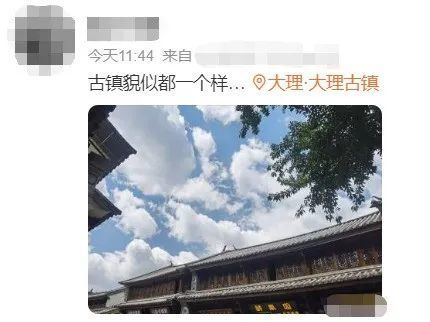
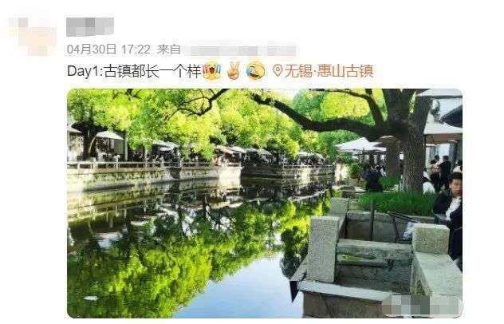
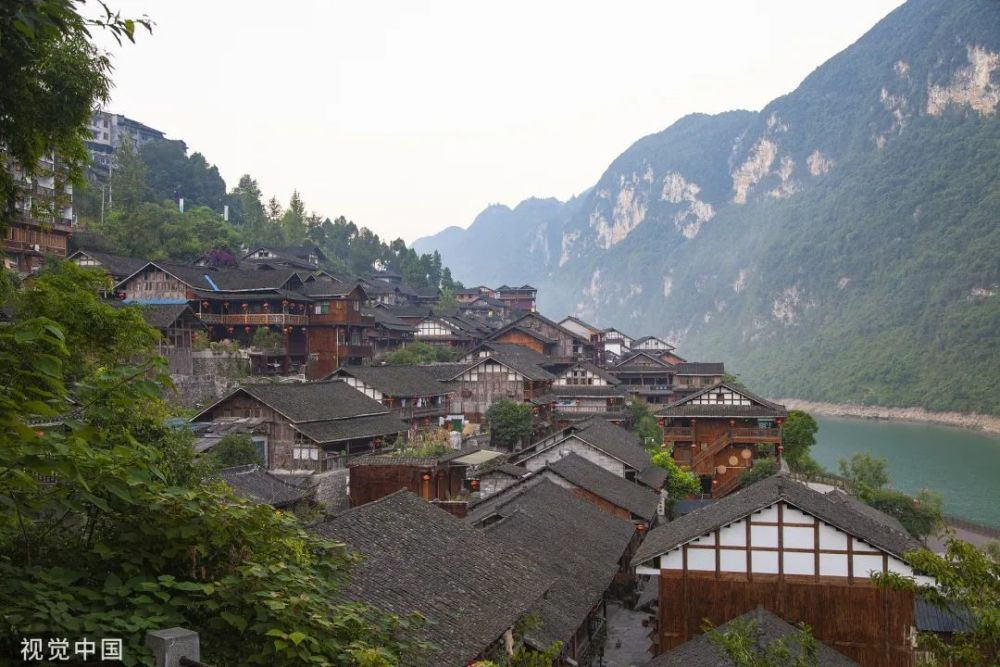
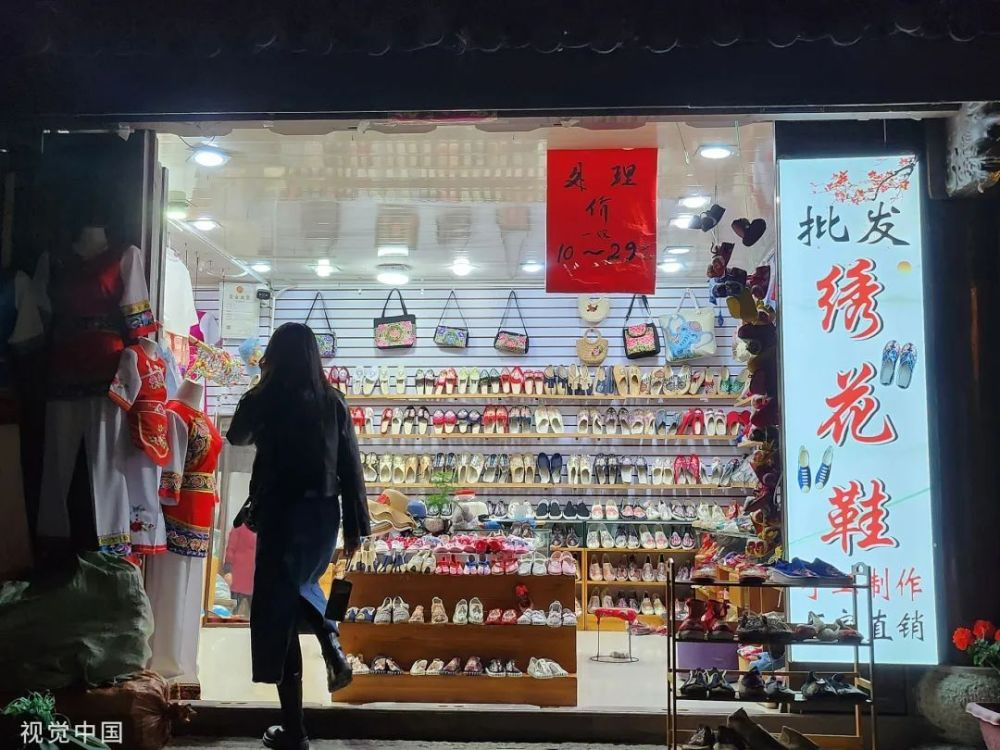
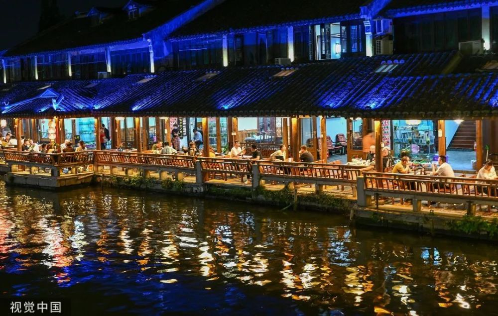
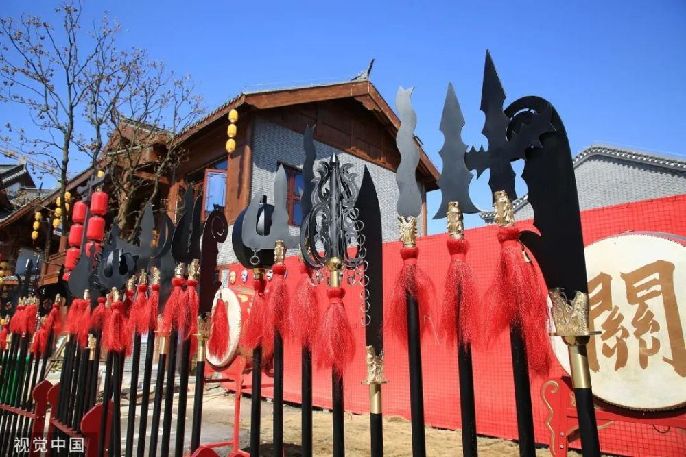

# 遍地网红餐饮、汉服体验、纪念品店，媒体：古镇“重复率”有点太高了

“五一”假期你去哪玩了？不少人出门旅游都会选择去当地的古镇逛一逛感受当地最原始的风土人情，但是也有不少人吐槽，如今的古镇貌似都长一个样。网红餐饮、“汉服”体验店、纪念品店......从北到南，从东到西卖的都是同一套东西，简直旅游了个寂寞。

经过岁月洗礼的古镇，原本应该是最具地方内涵的景点，怎么如今却变成了千篇一律的网红街？古镇发展的道路怎样才能越走越宽？

**古镇的“新生活”**

重庆市酉阳土家族苗族自治县的龚滩古镇，地处乌江之畔。它既是著名画家吴冠中名画中的《乌江老街》《乌江小镇》，也是不少游客心驰神往的“世外桃源”。

在龚滩古镇，有保存完好且颇具规模的明清建筑群。其中就包括清代建筑西秦会馆的一座雕花戏台。“过去这里供商人汇聚、议事、休闲听戏之用，如今成了游客了解当地风土人情的‘舞台’。”古镇讲解员介绍，每到旅游旺季，戏台上就有酉阳民歌、酉阳古歌、酉阳摆手舞、土家面具阳戏等非遗表演。

“很多游客都觉得龚滩古镇有魅力，因为这儿不仅有美景，还有美食。”古镇吴冠中纪念馆馆长戚玉龙举例说，绿豆粉、土家酿豆腐、土家腊肉等，可以摆齐一桌菜。

_2019年7月29日，重庆酉阳，龚滩古镇。_

在山西省吕梁市临县，碛口古镇成了打卡地，慕名而来的游客日益增多。95后刘倩倩在此注册了一家旅游公司，着重培养专业导游和主播。她自己也经常在平台直播，通过镜头，让各地观众都能欣赏古渡风光。

碛口，曾是黄河上的重要商贸渡口，鼎盛时期每天往来船只就达150多艘。然而，随着陆路交通的发展，碛口商贸凋敝，大批古建筑年久失修。

经过当地的保护开发，现在的碛口被誉为“活着的古镇”：镖局、当铺、货栈等古建在西市街边诉说着古镇往昔的繁荣，驼帮文化在东市街全景展示。

_2019年7月14日，山西吕梁，碛口古镇。_

何为“古镇”？中国文化管理协会文化旅游专业委员会副会长孙小荣表示，古镇一般是指拥有百年以上历史、从古代一直续存到现在的集镇，往往具有建筑风貌保存相对完好、历史人文底蕴相对独特、生活方式传承相对完整等特点。

我国历史悠久，广阔土地上现存古镇数量可观。“这些古镇不仅是中国的建筑遗产，有些还进入世界遗产名录，成为全人类共同的文化财富。”同济大学国家历史文化名城研究中心主任阮仪三说。

古镇游缘何兴起？孙小荣认为，相较于城市生活节奏的“快”，古镇生活“慢”；和城市空间的“新”不同，古镇保留了“旧”；与城市设计管理的“标准化”“国际化”相比，古镇则呈现“个性化”“地域化”特性，烟火气更足。“古镇为人们提供了一种‘回归传统生活’和‘怀念旧时光’的氛围与场景，满足了众多游客的现实需求。”

游客一饱眼福、收获体验，古镇百姓借此增收致富，这本是件“双赢”的事。

依托附近村落的自然和历史资源，碛口古镇打造了民俗文化村、摄影写生艺术村和红色文化村。“这是一项非常有意义的工作。”古镇景区规划科相关负责人介绍，古镇得到保护后，更多人认识到历史文化的价值，也让当地百姓吃上了“旅游饭”。

**古镇的独特之美，别丢了**

“逛了那么多古镇，不少地方几乎是一个模子刻出来的！”王女士是一位旅游达人，上学时就开始游览古镇，如今工作后依旧热爱。在她眼中，不同古镇因循各自水土，因而呈现不同风土人情。

然而这几年，在各地新开发的古镇观光后，王女士坦言各古镇间并无太大差异。

来古镇玩，自然是想看点古建筑、自然景观，感受当地的特色文化氛围。“如果到了一个古镇，看不到原住居民的生活状态和风貌，品尝不了当地特有的美味小吃，走过后留不下关于此地的独有记忆，心中难免会有一些失落。”王女士说。

很多游客也这样认为，有人总结出了这些古镇的“套路”：青砖配上红灯笼，商铺里摆些民族服饰、手工银饰、丝绸制品，小吃主要就是臭豆腐、烤鱿鱼、糖葫芦，毫无特色。“简直就是披着古镇外壳的小商品批发城”。

孙小荣指出，当前，古镇开发建设“地产化”明显，跟风、仿制的情形较多，致使不同古镇从建筑风貌到业态内容千篇一律，渐渐丧失了独特性。有的古镇为了营造“游客空间”，让古镇原住居民全部搬离，浓郁的生活气息随之飘走，古镇游变成了逛街购物、喝茶吃饭、参观表演的“复制+粘贴”模式。

专家表示，这种复制粘贴的思维，短期看可能会带来一些蝇头小利。但随着时间的推移，它最终会被游客用脚投票，淘汰出局。

千镇一面，从何而来？最主要的原因在于过度商业化，很多古镇由此“褪色”，丢掉了文化之魂、独特之美。“过分强调古镇商业功能，使游客满眼看到的是各式店铺和同质化的旅游商品，而无法领略古镇的历史魅力与文化内涵。”贵州省旅游经济研究所原所长肖进源说。

_2023年4月8日，河南驻马店，皇家驿站景区_

业内人士指出，商业化确实给古镇开发带来较大压力。

一方面，古镇只有通过商业开发，才能让沉睡的传统文化“活起来”，使之得到更好的保护和传承，并适应满足游客多方面的需求。

另一方面，商业开发或多或少会改变古镇环境，而过度商业化必然破坏古镇原有的自然环境与人文氛围，致使其吸引力下降。因此，古镇开发如何在文化和商业化之间找到一个平衡点，需要进一步思考与探索。

“不少古镇的运营存在短板，影响了游客消费体验和重游率。”孙小荣说，真正的集镇是开放式的生活空间，一旦变为文旅消费空间，就要加入更丰富的业态、产品和服务。

但有的古镇目前仍保持传统运营思路，创新性不足，“交互式、体验式、沉浸式”场景缺乏，“二次消费”供给不够，加剧了古镇类景区的“空壳效应”，即看上去很美，但不好玩。

**保护和开发，并不冲突**

古镇开发，贵在独特。告别“千镇一面”，古镇才能新生。历史文化是皮，旅游商业是毛，皮之不存，毛将焉附？

怎样打造自身特色？古镇，首要“讲古”。在古镇保护工作中，阮仪三主张对旧建筑进行修缮或复原旧建筑，而非以旅游商业为目的，使用快捷的现代材料、现代工艺另起炉灶。以周庄为例，在整修中使用许多旧木梁、旧木柱、旧门窗、旧石板等，修出了原汁原味的房子。

_江苏昆山：水乡古镇周庄灯火阑珊_

有专家还提出，对于尚未完全开发的古镇，应在保持原始风貌的同时，尽可能提升旅游设施与旅游服务的质量；对于已充分开发的古镇，如何保留住真正的古色古香，则是凸显差异化旅游魅力的重点。

挖掘特色文化是重要突破口，古镇要从自身的历史文化中找到独有的文化符号。

这一点，各地已有不少探索，如位于湖北省襄阳市樊城区的关圣古镇，以关公文化为特色，处处可见三国文化的印记；在江苏省泰州市姜堰区的溱潼古镇，每年清明节第二天，四乡八镇的数百只会船云集十里溱湖，参加一年一度的溱潼会船节……

_2021年10月1日，湖北省襄阳市，樊西新区关圣古镇_

专家建议，古镇开发者、管理者应对当地历史文化进行完整、详细梳理，并在此基础上，制定长远统筹规划。通过保护和传承本地文化，保存古镇本地特色的习俗、产品，使古镇保持独特的文化特色和历史记忆。

让古镇游走出同质化误区，应不断提升游客体验。“不仅要‘讲古’，也要‘上新’。”孙小荣表示，古镇要在精致化产品、精细化服务、精彩性活动和精益化运营上下功夫，要常变常新、常新常变。比如乌镇戏剧节，每届剧目都不一样，吸引人们年年如约而至。要鼓励商家推出独特商业创意，丰富体验场景，增加游客对古镇的兴趣与了解。

_2021年10月15日，浙江桐乡，第八届乌镇戏剧_

“古镇保护，离不开当地居民。”阮仪三指出，民居是城镇历史文化遗存重要组成部分，直接体现着不同地区的建筑风格和风土人情。只有把原住居民留住、把那里传统的生活方式留下来，城镇历史文化保护才能永葆生命力。

有居民，古镇才有生活气息，这是商业化无论如何都无法替代的。

对此，不少业内人士深有体会。他们认为，在古镇开发方面，“乌镇模式”值得借鉴。乌镇能取得商业成功，除了古镇本身景致优美之外，还把特有的民居水阁、老宅深巷、船拳皮影和民间作坊当作重要的财富精心呵护，并对民间传统文化进行了深层次挖掘。

（来源：央视网综合人民日报海外版、中安在线）

