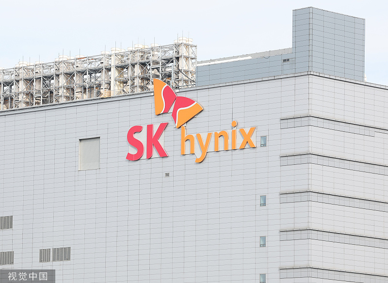

# 韩芯片制造商海力士：出售在大连工厂的传闻是没有根据的

【环球时报-环球网报道 记者马梦阳】韩国The
Elec网站此前报道称，鉴于贸易限制和全球存储芯片市场需求下滑，韩国存储芯片制造商SK海力士正考虑处理其位于辽宁省大连市的3D
NAND闪存工厂，该工厂是SK海力士于2021年12月以90亿美元从英特尔公司收购的。

_资料图_

对于这一消息，SK海力士在4月27日接受香港《南华早报》采访时表示：“有关出售该工厂的传闻是没有根据的。”这家全球第二大存储芯片制造商称，“SK海力士大连工厂的建设将按计划完成”。

《南华早报》报道称，美国当下正在向韩国和其他经济盟友施加压力，要求将中国从全球科技供应链中孤立出去。有关SK海力士关闭中国工厂的“猜测”反映了韩国芯片制造商三星电子和SK海力士在中国投资的不确定性。

对于SK海力士来说，目前摆脱对中国市场的依赖难度很大。据报道，该公司在中国无锡的另一座工厂承担了SK海力士约一半的DRAM芯片产量，约占全球DRAM芯片产量的15%。

在该消息释出之际，SK海力士于4月26日公布了创纪录亏损的第一季度财报。据韩联社报道，SK海力士26日披露的初步核实数据显示，按合并报表口径，该公司2023年第一季度营业亏损3.4023万亿韩元（约合人民币176亿元）。同期，销售额为5.0881万亿韩元，同比下滑58.1%。4月27日，韩国三星也公布了其半导体部门创纪录的季度亏损。根据电子研究公司TrendForce的数据，全球内存市场在第一季度因需求疲软而受挫。该研究公司表示，第一季度DRAM
和 NAND产品的平均售价下降了15%。

