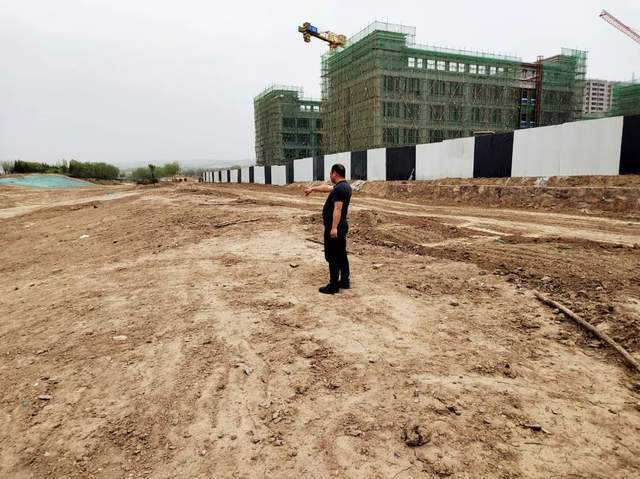
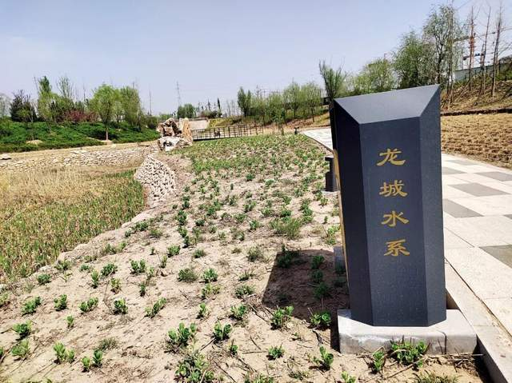

# 9.5亿元项目未批先建，晋中违法占地事件调查

近日，自然资源部集中公开通报在2022年耕地保护督察中发现的67个重大典型问题，包括侵占耕地挖湖造景问题，地方党委政府及部门非法批地、违法征地以及主导推动违法占地、监督不力问题等。

自然资源部九大督察局对部分土地违法违规严重的地市政府开展约谈。其中，山西省晋中市被北京督察局约谈，因通报对该市的用词十分严厉，晋中的相关问题备受关注。

根据通报，晋中市非农建设违法违规占用耕地总量较大，2021、2022两个年度发现重大典型问题12个，高发频发；晋中市城市管理局连续在榆次区违法占用耕地挖湖造景，同类问题边改边犯、性质严重，对山西省自然资源部门指出问题置若罔闻；往年督察发现问题整改进展缓慢。

_山西晋中市，河口河整治时占用的榆次区南砖井村耕地，树木被移除，已初步具备耕种条件。摄影/本刊记者
周群峰_

约谈会上，晋中市政府主要负责同志进行了原因剖析和反思，表示对督察指出的问题照单全收，并将深刻吸取教训，认真落实要求，坚决采取有效措施认真整改。山西省政府分管副秘书长代表省政府表态发言，表示将深刻汲取教训，检视自身问题，加强省级统筹，压实整改责任，强化工作举措，坚决彻底整改。

近日，《中国新闻周刊》从晋中获悉，北京督察局已经将晋中相关线索移交给中央纪委国家监委和最高检，晋中市纪委和检察院也已到市城市管理局了解情况，上述12个重大典型问题目前已下达到山西省级层面。

晋中市城市管理局提供的数据显示，被通报的项目总投资约9.5亿元，此外还涉及到土地征收补偿费用达到2.5亿元。当地违法违规占用耕地，大手笔力推甚至边改边犯背后，究竟发生了什么？

**土地手续缺失的9.5亿元项目**

晋中主要涉及的项目为龙城大街区域水系综合治理项目（以下简称龙城水系项目）。上述通报提到，2019年5月至2021年10月，山西省晋中市城市管理局主导推动龙城水系项目违法侵占耕地897.25亩，开挖河道、建设景观设施。

据了解，龙城水系项目位于晋中之北、太原之南，主要包括水利、水系和生态绿化三部分，总占地1524.3亩。晋中市城市管理局负责该项目建设，2019年12月开工，2021年7月完成初验。

_总投资9.5亿的晋中龙城水系项目，被认定为违法占地。摄影/本刊记者
周群峰_

多位受访者告诉《中国新闻周刊》，龙城水系项目的建设，与晋中的发展需求、防汛需求相关。晋中位于山西省中部，北与太原毗邻，从太原南站坐高铁去晋中，只有11分钟车程。但是，晋中北部虽靠近太原却发展滞后。该区域是城乡结合处，长期缺乏规划建设，基础条件极差。

该区域内有5条季节性河流，自西向东依次为河口河、泉子河、黑河、涧河、白龙河，河道边坡由自然冲刷形成，因年久失修，不少河段坍塌，河道泄洪功能很受影响。另外，生态环境损坏严重，垃圾堆放、水体黑臭、违章建筑问题突出，再加上此地交通不便，群众反映强烈。

2016年，山西提出了太原晋中一体化发展，晋中决定以晋中北部的龙城大街作为融入太原都市核心区的具体抓手，“以雄安新区为榜样，让龙城大街区域成为太原都市区城市建设的新地标”。

治理这片区域内的五条河流成为首要任务。晋中市城市管理局原二级调研员赵金树全程参与了龙城水系项目从开工到初步验收的全过程，他也是该项目的最初负责人。

_龙城水系中的河口河。摄影/本刊记者
周群峰_

在接受《中国新闻周刊》采访时，赵金树表示，龙城水系项目按照50年一遇的设防标准设计，对河道进行疏浚拓宽是基础性工程之一。

晋中市城市管理局副局长史锋告诉《中国新闻周刊》，之所以叫龙城水系综合治理，就是为了实现山水林田湖草沙一体化保护，同时为了整个片区的开发建设，就沿着河道设计了部分景观，包括修筑抢险道路、绿化等，“如果只是把河道疏通了，周边脏乱差的环境没有改善，附近居民反映强烈，也会影响城市形象”。

在当地看来正是这些疏浚、景观工程，最终占用了耕地，成为了自然资源部通报中的晋中“违法占用耕地挖湖造景”问题。而据《中国新闻周刊》了解，这些耕地的用地审批手续确实不齐全。

当地一位官员告诉《中国新闻周刊》，很多地方政府做工程都是边开工边补手续，“特别是一项大的工程，如果把相关手续办完再开工，可能几年时间就过去了，而一个主政者在一个职务上的任期往往只有数年，主政者都想在自己任期内，把自己力推的项目完成”。

2019年，明知土地的相关手续不全，晋中市政府仍然启动了龙城水系项目。项目按照EPC（工程总承包）模式实施，由城市管理局负责，确保2年内建成。该项目还列入2019年和2020年市城区市政重点工程，2021年列入山西省重点工程。

晋中市城市管理局提供给《中国新闻周刊》的数据显示，该项目总投资94922.37万元，资金来源市财政。项目土地征收由榆次区政府负责，费用不列入项目总投资，包干补偿费用2.5亿元。

**耕地的“糊涂账”**

自然资源部的通报称，龙城水系项目违法所占耕地面积为897.25亩。对这个数据，当地部分官员给出了自己的解释。

首先是占地中是否有897.25亩耕地的问题。史锋认为，上述面积在“二调”（第二次全国土地调查）时确实属于耕地，2019年龙城水系项目实施时，“三调”已经开始，但数据尚未公布。如果依据“三调”数据，很多地方已不属于耕地。

不过，对于897.25亩耕地在“三调”中有多少不再被认定为耕地，晋中市规划和自然资源局并未回复《中国新闻周刊》。该局四级调研员彭飞向《中国新闻周刊》强调，数量的变化不影响北京督察局指出的问题，“还是要按照通报的数据进行整改”。

此外，这些耕地在历史上是否是耕地，晋中市城市管理局的部分官员也表示了质疑。一名官员告诉《中国新闻周刊》，一位在基层工作了多年的国土所所长曾告诉他，“二调”时，榆次区耕地面积比“一调”时少了很多。当地国土部门就在未征求水利部门意见的前提下，把龙城水系内一些常年干涸、河流两岸的地，新增统计为耕地，而这些地并不适合种庄稼。

“这件事我们自身有责任。但从实事求是的角度看，这些地并不适合耕种。”这名官员说。

晋中市城市管理局向《中国新闻周刊》提供的一份文字资料也写道，“枯水季节下游河道河床干涸，农民与水争地、侵占河道现象严重，绝大多数河道被侵占为耕地，导致河道狭窄、滩涂湿地尽失，在‘二调’当中，将大部分河道确认为耕地。河道现状防洪功能与两岸群众生命财产及社会经济发展越来越高的防洪安保的要求形成了尖锐的矛盾。”

《中国新闻周刊》记者在走访时发现，河道附近的土地确实有很多处于撂荒状态。榆次区南砖井村紧邻河口河，该村党支部副书记殷根寿告诉《中国新闻周刊》，他们村在河口河附近的土地，因为下面沙子多，庄稼收成少，所以已经撂荒多年，“别的土地种粮食亩产有1000多斤，这里只有一二百斤，所以村民都不愿在这里种地”。

赵金树认为，应实事求是看待“二调”数据。作为自然存在的河流，它们理应占有相当规模的面积，但在“二调”数据中少得可怜。他认为，应按照《水利部关于加强河湖水域岸线空间管控的指导意见》要求，纠正“一些地区人为束窄、侵占河湖空间资源、与水争地”等问题。

不过，即便这片区域在“二调”耕地减少时被划为耕地，后来地方发展需要用地、不认同这片区域是耕地，但可以肯定的是，这片区域在国土调查数据库中仍是耕地的性质。正如彭飞所说，只要其仍然是耕地，就应按照耕地进行管理。有些耕地可能因为各种原因暂时没有耕种，但这不能成为违规占用的理由，“搞任何建设，必须建立在合理合法用地的前提下。只要占用土地就必须办理相关的用地审批手续，经批准同意后方可占用”。

**两部门各执一词**

2021年10月10日，北京督察局指出晋中市建设龙城水系项目涉嫌存在占用耕地和基本农田用于建设公园绿地问题。6天后，晋中市政府召开专题会议提出“将位于自然河流两侧的不可长期利用的耕地（含基本农田），在基本农田整改补划中申请调出、补划，确保土地手续合法合规”。

经过努力，2022年后半年，晋中市规划和自然资源局将基本农田调整为一般耕地。城市管理局告诉《中国新闻周刊》，这个过程中，他们积极推进用地审批手续的办理，但由于种种原因办理较慢,目前仍在推进之中。

史锋也告诉《中国新闻周刊》，2021年，晋中第一次被通报后，立即实施了整改，但因土地手续没完善，所以没有整改到位，“针对通报中提到的问题，城管部门也照单全收，态度上没问题，行动上也在积极跟进整改”。

然而，根据此次自然资源部的通报，晋中在此后“边改边犯”。《中国新闻周刊》了解到，这一表述是指晋中在尚未对龙城水系项目涉及的问题整改到位时，在参与太原武宿机场配套行洪工程时，又涉及到违规占用土地问题。

通报还指出，晋中市城市管理局对山西省自然资源部门指出问题置若罔闻。晋中市榆次区自然资源局2022年3月、8月两次下达《责令停止违法行为通知书》，2022年6月山西省自然资源厅发现并指出问题，晋中市城市管理局仍未停工。

但对这一问题，晋中市城市管理局、规划和自然资源局各执一词。

城市管理局相关负责人告诉《中国新闻周刊》，该局接到了山西省自然资源厅的相关文件，但没有接到过晋中市榆次区自然资源局下达的上述《通知书》，“我们因违法占地接受过两次市规划和自然资源局的罚款，共计100多万元”。

对上述说法，晋中市规划和自然资源局负责人表示，不清楚他们因什么原因没有接到《通知书》，可能是他们有人看到后没有签收，或者是相关人员工作交接时没有看到，“按照执法的执法程序，都是先下《责令停止违法行为通知书》，再进行罚款”。

不过，两局虽然说法不一，但整改工作已在推进。

通报称，晋中市政府整改主体责任落实不到位，对2022年督察通报的问题没有组织有效整改。截至2022年12月，项目违法所占的897.25亩耕地中，仅182.19亩通过移除种植的树木、草皮并恢复耕种条件的方式进行整改。

彭飞说，此次晋中被通报后，按照城市管理局的整改方案拟采取两种方式进行整改：一是采用拆除建（构）筑物、移栽树木等方式，平整土地，恢复耕种条件，二是组卷报批，完善土地手续。

晋中市城市管理局一位工作人员告诉《中国新闻周刊》，已把原来栽种的树木移除，河道里的景观设施也已拆除平整，现已初步具备耕种条件。

龙城水系项目施工方负责人赵利勇告诉《中国新闻周刊》，该水系所涉及的5条河中，除白龙河在神堂沟村附近直接汇入涧河，其他河道互不相连。因晋中地区常年干旱、少雨，为了旱季补水，充分利用再生水资源（中水），原设计按明渠与暗管的两种形式联通河道。通报后，根据市政府会议纪要，将已完成的明渠进行了拆除、填平处理，恢复了原貌，经测算，这些地方共有241.86亩（其中耕地182.19亩）。恢复上述地貌后，通过铺设暗管的形式让4条河保持连通，恢复了河道利用再生水（中水）补水功能。

另外，市规划和自然资源局也向《中国新闻周刊》表示，为实现占补平衡，晋中购买土地面积约为520亩，费用总计约1.9亿元，“我们会在市内购买指标，资金到位后就会马上解决”。

**12地市被密集约谈背后**

晋中只是此轮被约谈的城市之一。

2022年10月~11月，国家自然资源督察机构对31个省（区、市）和新疆生产建设兵团开展了耕地保护和矿产资源实地督察，发现了一批违法违规问题。

根据自然资源部的通报，部分地方仍“顶风”侵占耕地挖湖造景、超标准建设绿化带和绿色通道，一些市县政府及其部门非法批地、违法征地、主导推动违法占地，一些地方补充耕地不实，有的甚至弄虚作假等，这些违法违规行为严重冲击耕地红线，危害国家粮食安全。

今年4月12日~4月17日，六天之中，辽宁朝阳、山东烟台、福建宁德等12地市因违法违规严重被国家自然资源督察机构约谈。

从此次通报和约谈的情况来看，违法占用耕地的问题上，地方政府是主导者。被约谈的城市均做出积极表态。今年是全面落实耕地保护党政同责的第一年。在通报之后，云南、四川等省都召开了相关会议。云南省在会议上强调，要逐级签订耕地保护责任书，立下“军令状”，落实最严格的耕地保护制度。四川省长黄强也表示，要坚决杜绝“未批先建”，坚持“凡用地、先挖潜”。

第三次全国土壤普查专家技术指导组外业技术组副组长、中国地质大学（北京）土地科学技术学院教授吴克宁告诉《中国新闻周刊》，目前和未来一段时间，国家自然资源督察机构的督察重点目标仍然还是耕地。

正如自然资源部在此次通报中指出，耕地保护是国之大者，事关国家粮食安全，关乎14亿人民生存和中华民族永续发展。习近平总书记在党的二十大报告中强调，要全方位夯实粮食安全根基，牢牢守住十八亿亩耕地红线，确保中国人的饭碗牢牢端在自己手中。习近平总书记多次强调，要采取“长牙齿”的硬措施，全面压实各级地方党委和政府耕地保护责任，签订耕地保护“军令状”，严格考核、终身追责，确保18亿亩耕地实至名归。

吴克宁告诉《中国新闻周刊》，在对耕地的保护上，约谈起到了警示作用，但只有对相关负责人严肃问责，才能以儆效尤。在此次通报中，自然资源部门也明确指出，国家自然资源督察机构将持续跟踪督促通报问题的整改，对拖延整改或整改不实、弄虚作假应付的，将按照与纪检监察贯通协调工作机制要求移交移送。

不过，自然资源部门在查处相关案件后，移送司法机关也会碰到难题。《中国新闻周刊》在采访中获知，因地方保护主义，存在地方公安局、检察院不认可自然资源部门所查处的案件、将案件退回的情况。也正因此，土地违法案件的查处效果大打折扣。据了解，到目前为止，政府官员因土地违法案件受到刑事处罚的，寥寥无几。

发于2023.5.1总第1090期《中国新闻周刊》杂志

杂志标题：晋中违法占地事件调查

记者：周群峰

