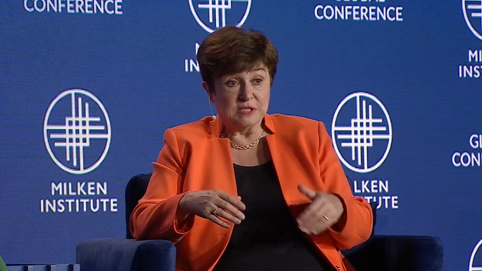
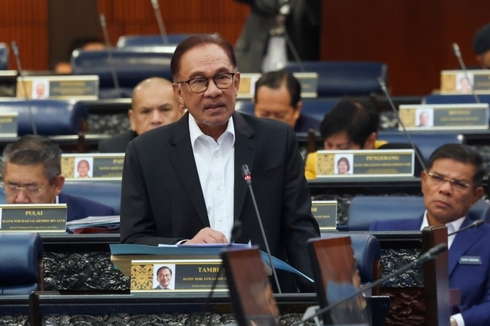

# IMF总裁：美元的确正逐渐被抛弃，但储备货币地位不会很快被取代

（观察者网讯）当地时间5月1日，国际货币基金组织（IMF）总裁克里斯塔利娜·格奥尔基耶娃在美国加州参加美国知名经济智库米尔肯研究所主办的2023年全球会议。她表示，“美元的确正逐渐被各国抛弃”，但她认为在可预见的未来，美元作为世界储备货币的地位不会被取代。

_IMF总裁格奥尔基耶娃5月1日发表讲话，视频截图_

根据米尔肯研究所网站发布视频，对谈中，主持人、彭博社经济与政府部门主管兼彭博经济研究主管弗兰德斯（Stephanie
Flanders）就“去美元化”趋势向格奥尔基耶娃提问。

弗兰德斯表示，以往大家认为“世界抛弃美元”的进程会在很久之后发生，但现在看来这一趋势来得越来越快。她说，美元的主导地位具有深厚的结构基础，所以“我们倾向于认为美元失去其作为储备货币的特殊地位会产生消极影响”，不过，“我们确实在国际金融体系中看到有很多去美元化迹象”。

弗兰德斯问道：“从IMF的角度，如何看待这一发展趋势，是否认为这一迹象会对世界有利？”

“去美元化不是我最担心的问题”，格奥尔基耶娃回答。

格奥尔基耶娃援引数据称：“的确，美元正在逐渐被抛弃，（各国央行持有的美元储备的比例）已从70%逐渐下降到60%以下。美元最大的竞争对手是欧元……其他货币，包括英镑、日元和人民币，它们的作用比较有限（very
modest role）。”

谈及不那么担心“去美元化”的原因时，她解释道：“美元发挥作用的原因，在于美国经济的实力和美国资本市场的深度。在一个我们可能大规模转向CBDC（中央银行数字货币）的世界里，如果考虑美元之外的选择，可能会有不同的主张。但最终，美国经济的实力、资本市场的深度、对货币的信任能力将是主要因素。”

格奥尔基耶娃重申：“我看不到其他选择，我不认为它（取代美元的货币）会很快到来（I don’t see alternative, I don’t see it
coming anytime soon）。”她最后对在场观众说，“好好持有美元吧”。

_彭博经济研究主管弗兰德斯（左）与IMF总裁格奥尔基耶娃对谈，视频截图_

这并非首次有IMF官员表示类似观点。早在去年3月，国际货币基金组织（IMF）副总裁戈皮纳特就指出，美西方对俄制裁，可能会鼓励使用其他货币的较小贸易集团的出现，从而削弱美元的主导地位。她当时表示，虽然美元仍将是全球主要货币，“但出现较小水平的分裂，肯定是很有可能的”。

尽管IMF方面认为“美元在可预见的未来不会被取代”，但不可否认的是，各国纷纷推动“去美元化”进程，以摆脱对美元的依赖 。

从“美国后院”拉美到“能源基地”非洲、中东，再到欧洲和亚太，越来越多的国家着手计划或已经实施了“去美元化”方案，在跨境贸易和投资中加强本币结算。路透社援引环球银行金融电信协会（SWIFT）1月数据指出，美元在国际支付总额中的份额已降至40%。

一段时间以来，东南亚地区国家也在不断讨论本国正在进行的“去美元化”和“本地货币交易”进程。各国认为，由于美元持续走强削弱了当地货币，该地区的经济体都在采取各种措施来降低风险。

4月4日，刚刚结束访华行程的马来西亚总理安瓦尔曾公开表示，他在中国访问时公开提出成立“亚洲货币基金组织”，因为亚洲国家经济实力已今非昔比，马来西亚“没有理由继续依赖美元”了。安瓦尔补充说，马来西亚央行已经就双边贸易可用林吉特和人民币结算一事与中方进行谈判。

马来西亚总理安瓦尔：已提议成立亚洲货币基金组织，没理由再依赖美元。图自外媒

马斯克近期表示，国际社会出现的“去美元化”趋势“是一个严重的问题”。

他分析称：“美国的政策过于强硬，使得各国都想要抛弃美元……再加上（美国）政府开支过大，这迫使其他国家承受了我们很大一部分的通货膨胀。”

4月17日，欧洲央行行长克里斯蒂娜·拉加德指出，随着更多国家倾向于增持人民币，对美元和欧元的依赖有所下降，不应再将美元和欧元的国际货币地位视为“理所当然”。她还称，中美竞争“加剧紧张局势”将动摇美元“统治地位”。“制裁行动当然会使俄罗斯和伊朗等国想要找一种替代货币。”

**本文系观察者网独家稿件，未经授权，不得转载。**

