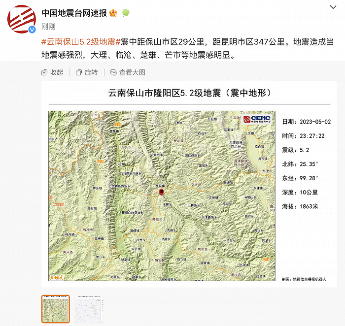

# 云南保山隆阳发生2次地震：最高震级5.2级，大理等地震感明显

中国地震台网正式测定：05月02日23时38分在云南保山市隆阳区（北纬25.35度，东经99.29度）发生4.4级地震，震源深度10千米。

此前中国地震台网正式测定：05月02日23时27分在云南保山市隆阳区（北纬25.35度，东经99.28度）发生5.2级地震，震源深度10千米。震中距保山市区29公里，距昆明市区347公里。地震造成当地震感强烈，大理、临沧、楚雄、芒市等地震感明显。

