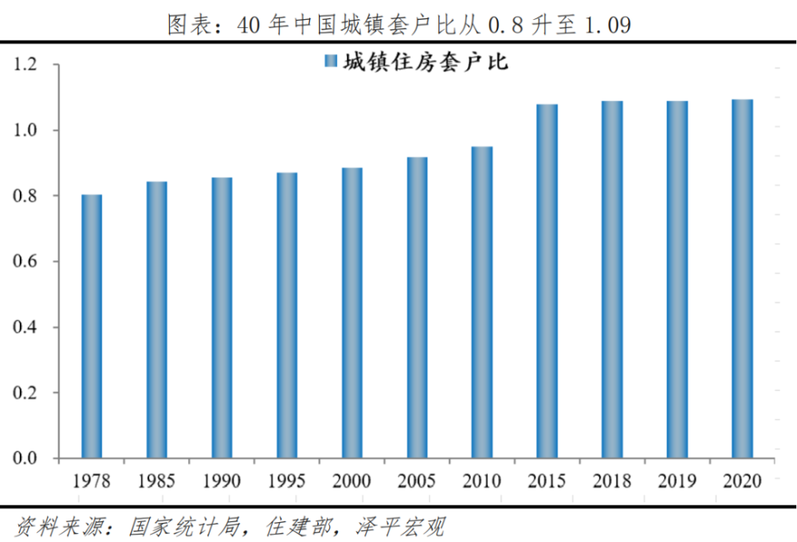

# 任泽平：是该取消预售制了，一手交钱一手交房，天经地义

文：任泽平团队

**导读**

是该取消预售制了。1月17日召开的全国住房和城乡建设工作会议提出“有条件的可以进行现房销售”，不足一个月时间，已有山东、安徽、河南、四川、广东等地明确表态，试点现房销售。

1、是该取消商品房预售制了，用你的钱，建你的房子，还烂尾了，这是对购房者的不公平。

以后谁有钱谁建房，没钱没实力的别建了，不能把包袱甩给老百姓和社会，这是房地产从大开发时代步入高质量发展阶段的必然趋势，也是对购房老百姓的最大保护。

98年房改时，全国缺房子，开发商缺钱，预售制是权宜之计，现在全国套户比超过1，从大开发进入存量时代，对购房民众不公平的预售制已经过时了，该取消了，改为现房销售。

以后一手交钱，一手交房，天经地义。当然二次房改是个技术活，兼顾化解停贷、复工保交楼、重组房企债务、恢复市场信心以及长效机制，长效机制四大关键是推动城市群战略、人地挂钩、金融中性稳定和房地产税。

如果按照经济规律办事，中国一定能实现房地产软着陆和长期平稳健康发展，跨过这道关，解好这道世界难题。

2、为什么要取消预售制、改为现房销售？大家想想，绝大部分商品是一手交钱一手交货，预售制是对购买者的单方面不公平制度，购房老百姓几乎承担了所有商品不能交付的风险。

从个人层面看，预售制对购房者非常不公平，比如，交房等待期一般为两年，在此期间，购房者不仅承担银行利息，还要承担延迟交房、房屋质量、房产证延期办理甚至不能交房的风险。

从行业层面看，预售制助推部分房企过度举债、高杠杆扩张，若遇到下行周期，会引发资金链断裂、项目搁置等系列风险。

取消预售制，改为现房销售，这样有助于落实中央房住不炒精神、有助于保障购房老百姓权益、有助于房企稳健发展，一举多得，谋划长远。

3、为什么建议取消预售制度？预售制度怎么来的？国外什么情况？

简单科普一下：商品房预售最早源于中国香港，俗称卖楼花，卖期房，是一种开发商放杠杆的方式。98年房改，由于商品房短缺，房企缺资金，借鉴中国香港，引入了商品房预售制度。其实，当前世界不少国家存在预售制。

但是，重点来了！发达国家一般有严格的监管保障措施，开发商在项目获得政府批准后才可以开始销售，买家在购买期房后并非像中国一样在支付完首付款后从银行一次性贷款支付剩余全部房款，而是根据开发商工程进度在完全交房前进行分期支付。

所以，预售制度是需要严格的资金监管、分期支付以及违约处罚措施作为保障的，如果没有这些保障措施，一定会触发风险，对购房民众不公平，所以不如借机取消预售制度，以后改为现房销售。

客观讲预售制度有一定历史阶段性，现在中国住房进入存量时代，取消预售制度有助于降负债降杠杆，不再把烂尾风险甩给老百姓和社会，当然这需要配套房企债务重组、复工保交楼、恢复市场信心和房地产长效机制。

这是个技术活，只要坚持市场化改革，中国一定能化解这个难题，让房地产回归实体经济和居住属性，安居乐业。

4、简单讲，如果取消预售制，改为现房销售，开发商将拼的不是五花八门、眼花缭乱、不知道能不能兑现的营销手段，而是所见即所得的过硬的产品质量和诚信，这才是对购房民众的最根本最实质的保障，这样将极大的提升开发商的建筑质量，实现良币驱逐劣币。

所有商业的本质是向善，是以客户为中心，房地产也不能例外，老百姓买房子是天大的事，烂尾毁三代，好房幸福一家人。

从这个角度，取消预售制、实施现房销售是实现老百姓安居乐业、社会长治久安、行业企业健康发展的重大措施。在当前的情况下，取消预售制要结合稳楼市、房地产软着陆、打通金融支持当期三好生、新模式等综合施策。

作者十年前在国务院发展研究中心参与财税改革方案研究时，对预售制、房地产税、人地挂钩、金融稳定、房企杠杆率等进行过长期系统的专项研究。

**目录**

**1 中国内地商品房预售制的前世今生**

**1.1 起源：分层销售+“按揭”，霍英东创造“卖楼花”模式**

**1.2 住房需求大、供给量少，引进“卖楼花”模式，形成“中国内地版预售制”**

**1.3 预售制推动城市化进程，但背后潜藏的风险确实存在**

**2 国际经验**

**2.1 美国：交付前预售资金第三方全程监管，交付时开发商凭验收凭证取得房款**

**2.2 德国：可零首付购房，提供期房烂尾险**

**2.3 英国：10%定金保险保护机制，55%-80%房款交房时支付**

**2.4 日本：为规范期房交易立法，设置期房预付款保全措施**

**2.5 新加坡：买方资金由银行监管，享1年保修期后付尾款**

**3 启示**

**正文**

**1 中国内地商品房预售制的前世今生**

**1.1 起源：分层销售+“按揭”，霍英东创造“卖楼花”模式**

**二十世纪五十年代在中国香港，楼宇出租是地产行业盛行的方式，但有着转让难、出租资金周转期长等问题，分层销售孕育而生。**

20世纪50年代，中国香港还未推行公共房屋制度，许多人栖身于木屋或者其他临时住宅，住房的需求是相当高，不过大多数居民的储蓄很少。当时楼宇买卖多数以一整栋楼为单位，需要雄厚的资金实力才能购买。

虽然楼宇出租是中国香港地产行业盛行的方式，但有着转让难、出租资金周转期长等问题。

针对这一系列问题，不少地产商开始探求新的方式，如把楼宇契约切开，即“分契”，然后将楼宇分层出售。这模式一经推行，购买楼宇的市民数量有所增加，开发商资金周转加快。

**在分层出售的基础上，将“按揭”模式引入房地产销售，霍英东创造“卖楼花”模式。**

1953年底霍英东创办立信置业有限公司，凭借商业直觉和多年经营杂货铺、海上驳运业务的经验，对于商品流通、资金周转有着独到的见解，在努力寻求方法加快自身资金周转。当时其在购下九龙的一块地盘后，除了分层出售、还印发售楼说明书，上有文字详尽说明楼宇的地势环境、建筑材料、分层价格、订购方法等。

此外，“卖楼花”是另外一个亮点，即先收取买家的订金，采用类似租金的分期付款形式，等新楼落成时，收齐买家的钱，买家就拥有了自己的房产。这种方式减轻了民众购房的资金压力，加速了房屋的建造和销售，也解决了制造商的资金问题，降低投资风险，在当时可谓是“双赢”的举措。

“预售楼花+分期付款”的销售模式成为当时中国香港房地产市场的一大特色，纵观中国香港房地产市场的改革，“卖楼花”模式高效率地解决了核心的住房供不应求的问题，使房市发展进入新阶段。

**预售楼花模式推动了中国香港楼市几十年繁荣，但期间也出现过“烂尾楼”的情况，但监管部门不断完善、规范化，建立健全的监管机制，促进市场健康发展。**

例如，1960年，位于大角咀的一个楼盘因建筑费用超支停工，出现“烂尾”情况。在1961年后，中国香港管理部门提升了对于预售楼花制度的监管，即要求开发商在预售前，确保地价款已经全部支付，还要证明自身有资金等能力把项目完成，资金需放入律师所托管，支取时需律所和建筑师的核准。

为了防止开发商、律所、建筑师等造假，套取监管账户资金，中国香港要求律师行在银行开设的信托账户（监管账户）、开发商操作等采取全透明化机制，且银行的责任上升，如出现房屋“烂尾”情况，银行将成最大风险方，后续需自身推动项目完工。随着监管体系逐步完善，出现“烂尾”的现象较少。

**1.2 住房需求大、供给量少，引进“卖楼花”模式，形成“中国内地版预售制”**

**二十世纪九十年代，中国内地面临住房需求大和供给量短缺问题，引入“卖楼花”制度。**

建国以来，中国内地优先发展重工业，强调基础建设，这一导向使前期发展工业化的进程大于城市化进程，唯有解决住房基础等城市化配套问题，才能进一步推进城市化。

但当时推行的是“统一管理，统一分配，以租养房”的福利分房制度，住房市场发展起步较晚、增速较慢，福利分房制度也出现了分配不公、效率低、配套差等问题，因此福利分房制度不再适用于当时的国情。

叠加房地产市场面临商品房的需求量大，而社会缺少大型房地产开发商，商品房供应量小的困境，此时引入中国香港的“卖楼花”模式无疑是对内地房地产市场的一针强心剂。从1994年起，中国内地逐步引进中国香港预售商品房制度，先后出台多项文件，大力支持国内房地产市场改革。

例如，1998年，国务院出台《关于进一步深化城镇住房制度改革，加快住房建设的通知》文件，决定停止住房无偿实物分配，逐步实行住房分配货币化、住房供给商品化、社会化的住房新体制，从计划经济下的福利分房转向市场经济的商品房。

房地产市场采用预售制，允许开发商卖期房，解决了房企缺少资金和开发时间周期长的两大难题，开发商以预售款撬动下一个项目的开发，形成滚动开发模式，住房供应速度加快。

自此中国内地开始房改货币化，中国人民银行等多方迅速出台相关的信贷政策，支持购房者，极大作用推动了房地产市场的发展。

**引入中国香港“卖楼花”模式后，经调整形成契合中国内地的商品房预售制度。** 预售制的初衷是为了缓解房企资金压力，加快城镇住房建设。

具体来说，是指房地产开发企业将正在建设中的房屋预先出售给购房者，由购房者支付定金或房款的行为。

区别于中国香港，在中国内地实践过程中，商品房预售流程为：房地产开发商办理预售许可证-签订商品房买卖合同-进行备案登记和预告登记-交付房屋。

在购房过程中，购房者需要一次性付清首付款，并采用银行贷款的形式一次性付清剩余房款，换言之，房屋未建成，开发商可能已拿到了全部购房款，这点与中国香港的按照工程进度付款有所不同。

对中国内地的开发商而言，预售制商品房也开启了高周转、高杠杆的运作模式。

**1.3 预售制推动城市化进程，但背后潜藏的风险确实存在**

**作为中国内地商品房销售的最主要方式，预售制极大缩短房企现金回笼周期，同时增加市场商品房供应，推动了城镇化发展进程。**

预售制在过去20多年对中国内地房地产市场的稳步发展起到了重要作用，不仅解决了房地产市场快速发展阶段的资金需求，也提高了居民居住水平，中国内地城镇居民从筒子楼住到住宅小区，从全民蜗居到基本适居，住房事业取得巨大进步，数十年时间走完发达国家几百年城镇化路程。

改革开放以来，城镇化进程进入快速发展时期。1978-2021年，城镇人口由1.7亿人增长至9.1亿人，43年间增长4.4倍；1981-2020年，全国城市建成区面积由7438平方公里增长至60721平方公里，增长7.2倍。

根据我们发布的《中国住房存量报告：2021》测算，1978-2020年中国内地城镇住宅存量从不到14亿平增至313.2亿平，城镇人均住房建筑面积从8.1平方米增至34.7平方米，城镇住房套数从约3100万套增至3.63亿套，套户比从0.8增至1.09。

预售制在当前已成为中国内地商品房销售最主要方式，2005年中国内地商品住宅期房销售面积占总销售面积的比重为63%，而2021年期房累计销售面积达15.6亿平，比重上升至87%。

**预售制也推动了中国内地房地产行业的发展。**
中国内地房地产历经二十多年长周期繁荣，行业各项指标大幅增长。1999-2021年，房屋新开工面积从2.2亿平增至19.9亿平，累计上涨8.2倍，年复合增速10.6%。

房地产开发投资完成额从0.4万亿元增至14.8万亿元，累计上涨35.8倍，年复合增速17.8%。

商品房销售面积和销售金额分别从1.5亿平增至17.9亿平、0.3万亿元增至18.2万亿元，累计上涨11.3、65.3倍，年复合增速12.1%、21%。

伴随房地产业的快速发展，房地产企业从无到有、从国企先行到民企崛起，队伍逐渐壮大。2018年，房地产企业数量达9.8万个，比1998年的2.4万个增长3.1倍。

**二十年来房地产也成为拉动中国内地经济高增长的火车头。**

**1）从经济增长渠道，**
房地产带动的上下游产业链特别长，高达50多个行业。2020年房地产及其产业链占GDP的17.2%（完全贡献），其中房地产业增加值占GDP的7.3%（直接贡献），房地产带动产业链占GDP的9.9%（间接贡献），其中房地产对金融、批发、建材的带动最为明显。

**2)从投资渠道，** 2020年房地产完全拉动的投资占全社会固定资产投资的51.5%，其中，房地产开发投资占固定资产投资的27.3%。

**3）从金融渠道，** 从房地产贷款占银行各项贷款余额的比重看，2021年12月为27.07%，如果加上信托等通道业务，占比超过三分之一。

从房地产融资存量占社融存量比重看，2021年12月占比为18.76%。如果房企大面积违约，将导致银行不良率大幅上升。

**4)从居民财富效应渠道，**
根据我们的《中国住房市值测算报告》，2020年中国住房市值为62.6万亿美元，大于美国的33.6万亿美元、日本的10.8万亿美元、英法德三国合计的31.5万亿美元。

从住房市值占股债房市值的比例看，2020年中国为66.6%，高于美国的27%、日本的37%、英国的49%、法国的56%、德国的64%。

中国住房市值与股债房市值的比例较高，主要是因为住房市值高，以及中国资本市场发育尚不成熟，直接融资比例较低，股票、债券市值较低，居民投资渠道缺乏。

**不可否认，预售制背后潜藏的风险确实存在，当前的负面效应愈发凸显。**

**从个人层面看，** 绝大部分商品是一手交钱一手交货，预售制是对购买者的单方面不公平制度，购房老百姓几乎承担了所有商品不能交付的风险。

比如，交房等待期一般为两年，在此期间，购房者不仅承担银行利息，还要承担延迟交房、“一房二卖”、房屋质量、房产证延期办理甚至不能交房等风险。

另外，购房者和开发商之间的购房合同、购房者和银行的按揭贷款合同是两个独立的合同关系，如果开发商发生违约，购房者只能根据购房合同向开发商主张权力，但依旧需要根据按揭贷款合同按时向银行进行贷款偿还，因此购房者承担的风险较大。

**从行业层面看，**
预售制助推部分房企过度举债、高杠杆扩张，资金若遇到下行周期，会引发资金链断裂、项目搁置等系列风险，进行影响自身信用和购房者对行业的信心。

**从金融层面看，**
银行作为按揭贷款的发放方，一旦房企因为市场波动或经营不善，出现资金链断裂等一系列问题，导致“烂尾”等情况，而房企通过与购房者签订的预售合同和按揭合同，已经从银行获得房款，如果购房者丧失还款能力或短期不能还款等，则风险完全由银行承担，银行将面临较大的坏账压力。

**从监管角度看，购房者的预售监管资金去哪了？楼盘“烂尾”，归根结底两个字那就是“没钱”，即没钱付工程款。**

在2004版的《城市商品房预售管理办法》中明确规定了开发企业预售商品房所得款项应当用于有关的工程建设，商品房预售款监管的具体办法，由房地产管理部门制定。

但多年以来全国并没有统一的预售资金监管规定，各地实行“一城一策”。例如，太原、昆明、重庆、长沙等城市重点监管资金比例为总预售款的15-40%左右，郑州、福州、合肥等城市则按照项目的建安成本乘以建筑面积或者项目工程总额报价计算重点资金。

而事实是，不少购房款未进入监管账户、或进入监管账户后被挪用，导致楼盘没有资金继续建设。收楼遥遥无期，月供却被迫继续还款。

那么，监管账户资金如何被挪走的？实际上，在过去房地产大开发时代的高周转背景下，抽调预售款监管账户资金，是行业“潜规则”。

比如工程总承包方，以工程建设名义，获得监管账户拨付资金，再由工程方将资金转给房企，而拨付的工程款，远超工程进度所需。

通过这些方式套取的资金，在房企各地项目间流动，变相加杠杆，这样做提供了资金流动性，房企抽调资金统筹拿地、还款和楼盘建设，形成一种资金循环高周转模式，但一定程度上把风险甩给了购房者。

**2 国际经验**

整体来说，国外商品房预售制度呈现以下特点：

**1）预付款保护：** 对于购房者预付资金，一般设有定金或预付款保护机制，如英国、日本；

**2）预付款比重：** 要求购房者支付的预付款比例相对较低，绝大部分房款在房屋交付后开始支付；

**3）预付款支付方式：** 预付款一般以定金方式支付，或按工程进度分期支付，或二者结合；

**4）按揭贷款方式：** 一般采用两种方式发放按揭贷款，一是按工程进度付款，按揭贷款按照工程进度逐渐发放，购房者开始月供；二是房屋交付后发放按揭贷款；

**5）房屋烂尾保护：** 为预售商品房提供期房烂尾保险，在商品房出现重大延期或重大缺陷时，保障购房者权益；

**6）房屋交付保护：**
房屋交付质量的保障有两种方式，一是期房由政府或第三方验收合格并提供验收凭证后，开发商凭验收凭证取得购房者支付的房款。二是开发商为购房者提供一定的保修期，通常1-5年，保修期满，购房者支付尾款。

**2.1 美国：交付前预售资金第三方全程监管，交付时开发商凭验收凭证取得房款**

**美国期房定金一定期限内无条件返还，最低首付比例为3.5%，交房前仅支付首付，其余房款交付后按揭还款，交付前资金由第三方全程监管，交付时开发商凭验收凭证取得房款。**

定金及首付环节，定金比例一般为房款的1%-5%，首付比例最低可低于3.5%，根据美国官方数据，2021年美国平均首付比例为12%。

余款支付方面，除定金或首付外，购房者在房屋交付后通过按揭贷款支付剩余房款。

资金监管方面，美国为防止开发商挪用资金，购房者的定金及首付款由第三方公证行或产权保险公司的信托账户监管。如果开发商倒闭导致楼盘烂尾，购房者资金可通过申请仲裁取回，且不承担任何责任与损失。

而开发商在房屋建设过程中的资金全部来自银行，银行根据工程进度向开发商提供一定比例的贷款，由于开发商挪用资金直接损害银行利益，银行有充分动机监管开发商施工进度。

开发商在房屋交付时需取得由政府相关部门经审查后发放的验收凭证，通过验收凭证向银行得到购房者支付的房款。

**2.2 德国：可零首付购房，提供期房烂尾险**

**德国期房可零首付购房，房款按建造工期进度支付，按揭按工期放款后还贷，房贷利率采用固定利率，开发商或购房者可购买期房烂尾保险。**

预售门槛方面，德国开发商在项目获批后即可预售房屋。签署购房合同前，购房者需支付约2000欧的定金并进行预约公证，签订合同后定金退还。如由于任何原因不能购买，定金按照德国法律全部退还。

签署购房合同后，购房者需支付公证费和土地交易税，分别为房屋售价的1.5%-2%、3.5%-6.5%，两种费用不包含在购房款中，属于购房附加费。

首付方面，德国没有规定最低首付比例，可零首付购房。

余款方面，德国也采取按工期支付房款的制度，一般分7笔进行支付，具体支付节点、比例因项目而异。一般来说，支付节点可分为公证后、主体完工、内部水暖电路完工、窗户玻璃完工、室内清洁及墙面完工、地板完工、全部完工，支付比例可能是30%、28%、11.9%、7%、6.3%、4.9%、11.9%。

按揭方面，购房者可在支付房款前申请房贷，房贷利率采用固定利率，银行按施工节奏分多次发放贷款，每笔贷款给予购房者一定使用期限，期限结束后，购房者开始还贷。

保险方面，德国保险公司针对期房设计了两种保险，保险的功能是当房屋出现重大延期或重大缺陷时，保险公司保证开发商赔偿或修复，开发商破产，由保险公司负责相应赔偿。保险由开发商或购房者购买。

**2.3 英国：10%定金保险保护机制，55%-80%房款交房时支付**

**英国预售制设有10%定金保险保护机制，交房前付款比例仅20%-45%，资金由买卖双方律师严格监管。**

订立合同前，买卖双方均有一名律师，负责沟通期房交易中的房产、资金、合同等各个环节，各环节内容确认无误后签订首付交换合同。

定金方面，英国设置了10%定金保险保护机制，当开发商出现财务、经营问题时，购房者10%的定金由保险公司赔付，而超出10%的部分较难追回。

首付方面，首付比例通常为10%-25%，首付需要在合同签订21天内支付。

余款支付环节，英国采取按工程进度付款的方式，但是交房前付款比例相对较低，一般会在合同签订6-24个月分别支付两笔5%-10%的款项，即交房前付款比例在20%-45%之间，剩余款项交房后支付。

交付环节，英国规定房屋必须经过房产公证公司的检验验收后才能交付，交付后方可按揭还贷。

资金监管环节，英国期房预售资金监管极为严格，资金也由律师监管，在确认工程进度、支付相关款项过程中，由买房律师将资金转给卖方律师，卖方律师转给开发商，即资金在进入开发商账户前经过两道关口，有利于保障购房者资金安全。

**2.4 日本：为规范期房交易立法，设置期房预付款保全措施**

**日本期房交易立法，定金超5%或1000万日元时，开发商必须完成“预售房定金保全措施”，交房前付款比例不超房款的20%，开发商违约需返还定价并赔偿约10%房款，交房后按揭还款。**

立法方面，日本二战结束后由于房屋供给严重失衡，叠加法律空白，社会上“一房二卖”现象普遍，为此，日本政府1952年出台《宅地建筑物交易法》，经多次修订，目前是唯一一部规范期房交易的法律。

定金保护方面，根据日本《宅地建物取引业法》，对购房者支付定金超过5%或超1000万日元的部分，法律要求开发商必须完成定金保全措施才可预售。

什么是定金保全措施？即买卖双方签订购房合同时，开发商向金融机构或指定保证机构或保险机构签订定金保证委托合同，设置购房者定金的保证或保险，并将相应的保证金证明书交付给购房者。

除定金外，其他预先支付的购房款也受该措施保护。若开发商倒闭导致期房烂尾，购房者可凭保证金证明书向金融机构或保证机构或保险公司兑付，同时，开发商需向购房者赔付违约金，一般约为房价的10%。

房款支付环节，交房前只需支付最多不超20%的定金，签订购房合同后，购房者即可向银行申请贷款，但交房后才开始按揭贷款，除定金外的剩余房款在交房后开始支付。

**2.5 新加坡：买方资金由银行监管，享1年保修期后付尾款**

**新加坡期房购房者违约可返还相当于3.75%房款的订金，首付比例20%，余款按工程进度支付，所有资金进银行专门项目资金账户，交房后满1年保修期后支付15%尾款。**

订金支付环节，新加坡开发商有统一的选购权合同以及订金返还机制，即OTP，签订OTP后需支付5%房款作为订金，OTP有效期14天，执行OTP则进一步签订购买合同，不执行OTP则退还3.75%的房款。

首付比例方面，签订购房合同后，购房者需支付15%的首付及印花税，同时购房者向银行申请按揭贷款。

余款支付上，新加坡期房同样采取按工程进度付款的方式，《发展商条例》对期房付款流程做了统一详细规定，要求所有开发商遵守，支付节点一般为合同签订后、地基完工、框架完工、管道门窗等完工等，支付比例约为20%、10%、10%、5%、25%。银行按揭贷款也依照工程进度放款，月供在此过程中随着放出贷款的增加而增加，未放款部分无需月供。

资金监管方面，购房者的订金与付款会存入银行专门的项目资金账户，账户资金提取须与房屋建设有关。房屋交付后，购房者享受1年的房屋保修期，此后购房者支付15%的尾款。

**3 启示**

**一，短期来看，当前房地产到了政策出手临界点，重点是保交楼和房企重组。**

一方面，加大对刚需和改善型需求的支持力度，长短兼顾妥善应对局部停贷现象，重点是保交楼保复工保民生，给予强有力的金融工具支持。

另一方面，从现在起，对还在正常运转的房企包括民营企业，加大支持力度，由优质房企牵头并购重组整个行业，为每个房企配套AMC和财团，给予金融工具配套。

**二，中期来看，应充分估计形势复杂性和人性复杂性，兼顾化解停贷、复工保交楼、重组房企债务、恢复市场信心以及长效机制。**

长效机制四大关键是推动城市群战略、人地挂钩、金融中性稳定和房地产税。定金环节，建立开发商违约后定金保护机制，如将已支付定金冻结至房屋交付阶段，保障购房者定金安全。签订合同环节，鼓励保险公司介入，为房屋重大延期以及重大缺陷等情况提供充分的保障。

余款支付环节，建立按工程进度付款机制或交房后按揭贷款机制，充分保护购房者的权益。资金监管环节，引入独立于开发商、银行的第三方资金监管机构，或由政府相关部门直接监管，以此防止资金挪用现象。交付环节，建立商品房保修期制度。保修期内，开发商应对房屋质量问题全权负责、免费维修，购房者在保修期结束后支付尾款。

**三，长期来看，取消商品房预售制是大势所趋。**

一方面，98年房改时，全国缺房子，开发商缺钱，预售制是权宜之计，现在全国套户比超过1，从大开发进入存量时代，对购房民众不公平的预售制已经过时了，该取消了，改为现房销售。

另一方面，取消预售制，改为现房销售，开发商将拼的不是五花八门、眼花缭乱、不知道能不能兑现的营销手段，而是所见即所得的过硬的产品质量和诚信，这才是对购房民众的最根本最实质的保障，这样将极大的提升开发商的建筑质量，实现良币驱逐劣币。

