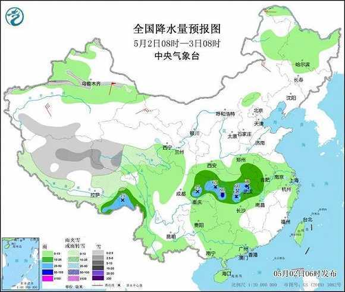
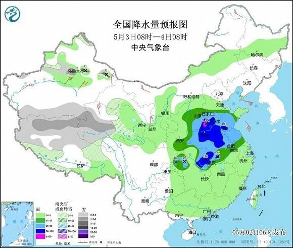
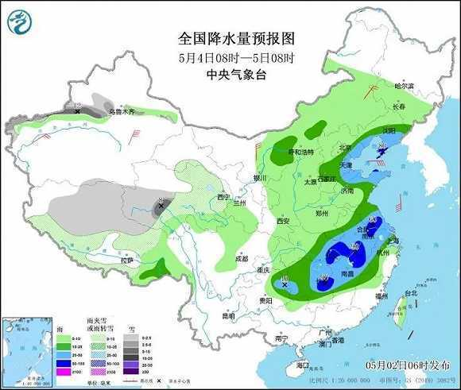

# 假期返程遇上强降雨提前“返岗”！应急管理部发布避险提醒

应急管理部官微消息，五一假期进入“收尾”阶段，强降雨已提前“返岗”，中央气象台预计，5月2日至4日江汉黄淮江淮等地将有强降雨过程，今天白天到夜间降雨将从四川盆地东部、湖北等地开始增强。明后两天降雨范围迅速扩大、强度增强，河南、山东、河北、山西、安徽、江苏、湖南、江西等地部分地区有大到暴雨，局地有大暴雨，强降雨时段集中在3日夜间至4日。

预计5日至6日，强降雨带逐渐南压，江南、华南北部等地自北向南有中到大雨，湖南中部、江西中部、浙江西部、福建北部等地有暴雨，局地大暴雨。

正值假期返程，强降雨提前“返岗”，将对公众生活和出行交通带来不利影响。

暴雨天，该如何科学避险

戳图了解

↓↓↓

