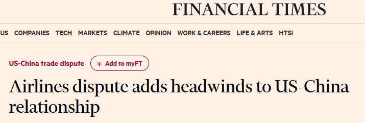

# 因禁飞俄罗斯领空成本增高，美国航司要求中国航司也不许飞越俄领空

据《金融时报》（FT）4月30日报道，有知情人士透露，美国同意将中国赴美航班从每周的8个班次增加到12班次，但前提是中国赴美航班不得飞越俄罗斯领空。

报道称，俄乌冲突后，华盛顿因对俄制裁导致美国航司被禁止进入俄领空，不得不花费更多路程和燃油以绕行俄罗斯。而美方不仅不自省，反称中国、印度、阿联酋等航司获得了“不平等”优势，威胁他国航司不准从俄罗斯上空经过，这也导致中美航线完全恢复的谈判陷入僵局。

过去三年时间，受新冠疫情影响，中美航班大范围削减。2020年1月底，由于中国疫情较为严重，美联航、达美航空、美国航空等先后暂停了中美航线运营。国内航空公司在民航局“五个一”政策限制下，只保留少量中美航班的运营。

自今年1月8日起，我国正式对新冠病毒感染实施“乙类乙管”，各类国际客运航班管控措施悉数取消，中外航司纷纷宣布恢复或增加国际及地区航班。

中国民航局运输司司长梁楠表示，民航局正在按照程序抓紧做好审批工作，欢迎中美航空公司依照协定和市场需求运营两国间航班。在航班恢复过程中，民航局也会加强与美国民航主管部门沟通，推进中美之间航班顺利复航。

但在这样国内外航司全力备战中外航线全面恢复的局面下，中美航线依然是“纹丝不动”，与“乙类乙管”前的航班量保持一致，没有任何新增。

中美航线始终无法完全恢复，除了受到美交通部命令的限制未批准增加外，据FT报道，美国航司一直对因华盛顿对俄制裁而被禁止进入俄罗斯领空而耿耿于怀，认为绕行俄罗斯导致美国航司面临的燃油成本远高于中国竞争对手，对此颇为不满，正游说拜登政府阻止中国航司获准在两国之间开通更多航班。

美国航司每周有12班飞往中国的航班，中国航司有8班飞往美国。美国航司目前从美国飞往上海的航班需经停韩国仁川，而中国航司可以通过俄罗斯领空直飞美国。

FT报道称，有6名知情人士透露，美国已提出给予中国航司与美国航司相同的每周往返航班数量，但以此作要挟——前提是，要求中国航司必须同意赴美航班不飞越俄领空。

美国国家安全委员会和国务院拒绝就此发表评论，但国家安全委员会发言人表示，他们“意识到”美国航空公司的担忧。其声称，“面对俄罗斯在乌克兰的战争，（我们）不能像往常一样与俄罗斯做生意。”

《纽约时报》今年3月早些时候曾报道称，美国参议院外交委员会主席梅南德兹（Robert
Menendez）等早就对中美航班大放厥词，称督促美国政府禁止中国及其他非美国航司在执飞美国航班时飞越俄罗斯领空，否则“不公平”。

同时，他们还建议所有美国公民、绿卡持有者等不要乘坐飞越俄罗斯领空的航班，包括美国政府人员在出公差时也不得搭乘飞越俄领空的航班。

代表美国航空、联合航空、达美航空等美国航司的行业游说团体“美国航空”（Airlines for
America）在国会山的一次演讲中表示，外国航司可以获得更短的飞行时间、更低的成本、更少的燃油消耗，这使美国航司处于竞争劣势。其估计，美国航空公司因此每年损失的市场份额总计为20亿美元。

但美国航司落入如此尴尬境地，归根结底还是美西方挑起俄乌冲突，并对俄实施一轮接一轮的制裁所导致。但美方非但没有反思自己的原因，反倒无理取闹威胁他国航司不准从俄上空经过，充分反映了美国的霸权心态和“双标”做派。

**本文系观察者网独家稿件，未经授权，不得转载。**

