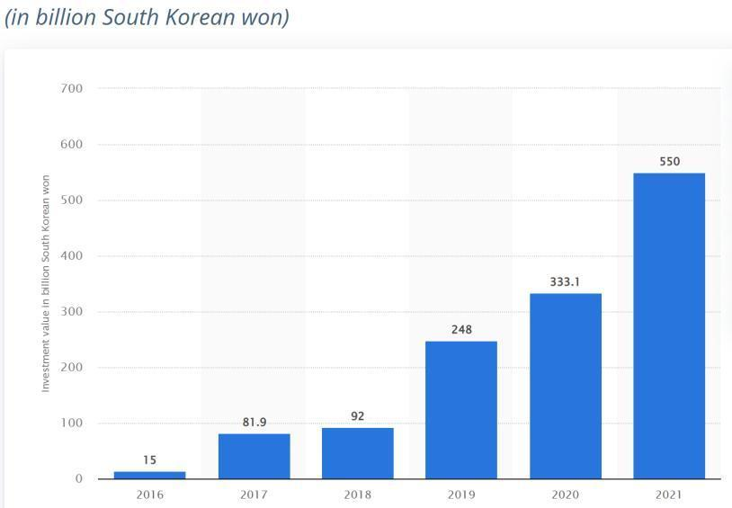
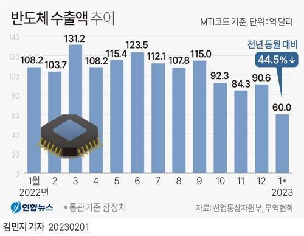
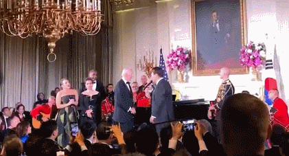

# 引发韩国连锁危机的第一张骨牌，可能已经倒下

【文/观察者网专栏作者 常洛闻】

韩国总统尹锡悦对美国进行国事访问，受到美国的高度重视和热情接待。首脑会谈形成了6份成果文件，加上几场风光的英文演说，尹锡悦总统完成了既定目标，还吸引到了至少59亿美元的投资承诺。

但引发韩国连锁危机的第一张骨牌，可能已经倒下。

**美国浇了盆冷水**

今年1月，尹锡悦在接受《朝鲜日报》采访时，曾提出“韩美共同规划、共同实施核演习”，作为应对朝鲜核、导弹威胁的对策，并表示“这实际上是一个不亚于核共享的有效方案”。这一方案被称为“韩国式核共享”。

在韩国看来，作为主权盟国，韩美应该共享核武器相关信息，并共同策划和执行。如果美国拒绝在韩国部署核武器，那么应该考虑韩国自主拥核的选项。可以说尹总统此次访美真正看中的，是拜登武官携带的“足球”核手提箱。

对于这样热切的大国梦，美国当然不会吝惜一盆冷水。

此次尹锡悦访美签署的《华盛顿宣言》，核心在于提出加强对朝鲜延伸威慑的方案，成立韩美核咨商小组（Nuclear Consultative
Group，NCG）。所谓延伸威慑，指如果美国的盟国受到核攻击，美国将动用核武器、导弹防御能力、常规武器等进行报复。宣言用到了“朝鲜对韩国的任何核攻击都将得到迅速、压倒性和果断的回应”这样的措辞。

但《华盛顿宣言》没有对《韩美共同防御条约》作出任何实质性的延伸，发布实施核打击命令仍然是在任美国总统的“独断权限”，有垄断性、凌驾性和排他性。而且《宣言》仍然强调半岛无核化和核不扩散体系的重要性，这一姿态虽然虚伪，但也说明美国还不能现在就为了韩国公然挑战《不扩散核武器条约》，相当于否决了韩国自主拥核及核技术转移等一系列可能，朝鲜半岛在可见未来内，仍将处于核不对等状态。

在这种情况下，韩美核咨商小组的实质只能是一个折中之后的无奈之举，将美国对韩国的核保护伞实体化，算是对安全承诺的一种兑现，也可以应付韩国国内极端保守势力的鼓噪。此前，韩美外交、国防部次官或室、局长级人士参加的延伸威慑战略协议体（EDSCG）会议原本是不定期举行，尹锡悦政府上台后决定每年举行一次，本意是希望提高韩国的知情权和参与度，同时提高总统府在国内军界的威望，新的NCG仍然保持了美主韩从的结构，换成咨商的名头，不改变美国做决策、韩国等通知的实质。

美国将核保护伞实体化的另一个动作，是计划在朝鲜半岛周边部署更多“战略资源”，包括战略核潜艇、航空母舰、战略轰炸机等。尤其是美国弹道导弹核潜艇将访问韩国（目前消息是俄亥俄级缅因号），是1980年代之后四十年来首次，这与美国维护核不扩散的惺惺作态背道而驰。

但核潜艇的战略价值在于隐蔽，这种事前公开的访问象征意义大于实际意义，而且与此前美英两国与澳大利亚结成AUKUS安全伙伴关系，并向澳大利亚转移核潜艇、参与配套设施建设，协助训练艇员相比，韩国主动将靶纸贴在了自己背上，得到的却非常有限。

“延伸威慑”的对象，是距离首尔只有80多公里的朝鲜民主主义人民共和国。从立国开始韩国保守党就与北方天然敌对，李明博、朴槿惠时期南北关系也非常紧张。但是尹锡悦现在大肆渲染朝鲜威胁，促使美国重申安全承诺，增加美军在韩国的存在，相当于彻底关上了与朝鲜修好的大门，半岛局势必然进一步恶化，李朴时代朝鲜使用的“逆贼败党”“傀儡鼠辈”等称呼很可能再次落到尹锡悦头上。

**尹锡悦没有争的意思**

除了防务，尹总统还有一份经济合作成绩单。韩国总统府画出的战果是：美国空气化工产品公司和普拉格能源公司等氢能企业，安森美半导体、格林特威德等芯片企业，以及PureCycle
Technologies和EMP BELSTAR等绿色企业，决定对韩国进行相当于19亿美元的投资。网飞公司将在接下来四年中对韩国投资25亿美元用于内容制作。

白宫强调的重点，则是现代汽车陆续投资54亿美金在佐治亚州的电动汽车工厂已经开始兴建，将会创造8100个就业岗位。SK创新将和福特将投资114亿美元在肯塔基州和田纳西州分别建造电池产业园，创造11000个就业岗位。三星电子在得克萨斯州修建的半导体制造厂总投资将达到250亿美元。韩华将在佐治亚州投资25亿美元扩充光伏工厂的规模，提供3000个就业岗位。同样提到了网飞公司将投资25亿用于购买韩国制作的内容。

作为亚洲娱乐工业的高地，双方都很满意的网飞投资算是什么水平呢？

2016年到2021年，网飞公司在韩国投资的规模如上表，2021年投资额5500亿韩元，约折合4.1亿美元。按照增幅比例和此次承诺的金额，网飞在韩国的投资不仅没有大幅增加，甚至增幅还有放缓的趋势。但美国输出了硬标准，韩国输出了软实力，确实是双赢。

其他的几项成绩，就很难让人乐观看待了。能源、芯片、氢能行业的6家美国顶尖公司，对韩国总投资额还不如网飞这个媒体公司，而韩国的大企业则宁可去大洋彼岸的农业州建城设厂，也不肯将同样的工作岗位留在国内。不知道此次陪同访美的韩方产业界人士，韩国三星电子会长李在镕、SK集团会长崔泰源、现代汽车集团会长郑义宣、LG集团会长具光谟、乐天会长辛东彬、韩华集团副会长金东官这些世袭财阀，其中不乏上届政府的阶下囚，本届政府的座上宾，到底作何打算？

而经济方面还有一个隐藏的重点，那就是日本和韩国在美国的市场地位问题。日韩的产业重叠程度很高，美国小型汽车市场更是两国企业的命脉。但《削减通胀法案》给两国都带来了巨大的贸易压力，美国还有针对韩国钢铁、铝制品的专门关税门槛。这次访美，尹锡悦似乎完全没有向美方争取合理贸易利益的意思。

至于为什么有这样的局面，就不能不提美国人发明的friendshoring（友岸外包）了。

简而言之，就是以意识形态划分阵营，将供应链尽量建设在己方阵营的友岸地区，以应对可能存在的政治风险。这一方面创设了民主社会创造经济繁荣的议程设置，另一方面将盟国绑定在自己的产业链中下游，达则我肉你渣，穷则肆意压榨。

根据英国媒体报道，美国曾经在尹锡悦出发前，明确要求韩国政府敦促国内财团，如果中国禁止美国存储芯片制造商美光在华销售，韩国企业不要填补美光留下的市场缺口。这一要求连法案的表面功夫都懒得做，视韩国经济主权如无物，完全不考虑韩国的产业发展和经济利益，按道理应该是双方争议的焦点，但无论是演讲、声明、还是宣言，韩美都对经贸方面的实质性问题默契地保持了沉默。

尹锡悦政府急迫地倒向美国，和美国对韩国及尹政府的压榨和利用，我认为是由于同一个动因导致。

据韩国产业通商资源部年初发布的《2022年12月及全年进出口动向》报告显示，2022年韩国出口额为6839亿美元，同比增长6.1%；进口额为7312亿美元，同比增长18.9%。贸易收支出现472亿美元的逆差，创历史新高。这是自2008年全球金融危机以来，韩国时隔14年首次出现贸易逆差。规模为金融危机前1996年（206.2亿美元）的两倍多，刷新历史最高纪录。

韩国出口月出货量的萎缩始于2022年10月份，下降的最主要原因是芯片出口走弱。

贸易部数据显示，2022年12月韩国半导体销售额同比下降29.1%，为连续第五个月下降。韩国财政部预计，2023年出口可能下降4.5%，进口可能下降6.4%。

韩国央行发布《经济展望更新报告》，将2023年韩国实际国内生产总值（GDP）增长预期从原先的2.1%下调至1.7%，调降了0.4个百分点。而亚洲开发银行最近对明年韩国经济增长率的预期更是低至1.5%，较9月公布的2.3%下调了0.8个百分点。

据韩国央行预估，明年韩国民间消费增长率仅为2.7%，较今年下降2个百分点；内需对净增长的贡献度也将从今年的1.8%减少到明年的1.4%，报复性消费对于经济的提振更多是一种美好的愿望。

作为出口导向型经济体，韩国经济出现这样严重的结构性问题，与韩国选择的政策路线有直接关系。

韩国科技企划评价院的《技术水平报告》，多年来一直评估韩国各行业“领先”中国的时间。如2022年的报告结论认为，2010年还领先中国3年的韩国技术水平，到2020年已落后中国0.1年。

“在调查的11个产业种类中，除了国防领域，调查分析了建设交通、防灾安全、航空航天、机械制造、纳米材料、农林水产食品、生物医疗、能源资源、环境气象、信息通信技术和软件10个领域。2010年，韩国除了在航空航天领域落后中国0.1年外，其他9个都领先。但到2020年，韩国在多个领域被中国赶超——航空航天、生物医疗、能源资源、信息通信科技和软件。其中最引人注目的是，原本被视为IT强国的韩国，如今在移动通信、系统软件、人工智能、虚拟技术等新一代技术上，已把主导权让给中国。”

_韩国半导体出口额走势图。图自韩联社_

由于中国的市场体量巨大，国内市场有充足的竞争机制，新兴产业有足够的发展空间，成熟后就能够面对国际竞争，往往后来居上。科技领域发展不够快速的韩国本来面对的就是要么与中国合作，要么和中国对卷的两难局面。如果不是美国全面打压中资企业，推行“友岸外包”，韩国财团恐怕连现在的市场份额都保不住。

2013年三星手机在中国市场份额为19.7%，高居第一，后来跌到1%。但从全球市场来看，三星维持住了第一的份额，这其中美国对于中资手机品牌的打压和抹黑起了巨大作用。

2021年，中国大陆面板厂商终结韩国17连霸，市场份额41.5%，2022年增至43%。2023年2月，大陆面板厂占全球电视面板市场份额的70%，台湾20%，日韩9%。LCD面板领域，2021年大陆面板厂商份额50.9%，韩国厂商份额14.4%，处于不断放弃状态。韩企占优的OLED面板领域，2021年份额有82.8%，中国厂商份额从1.1%增至16.6%。2022年第三季度，在智能手机OLED面板市场，中国厂商已经占据全球30%份额。

2012年，韩系起亚、现代等汽车在中国市场份额超过10%，2019年降至4.7%，2022年一季度降至1.8%。2022年现代、起亚等韩系汽车品牌在全球有8.1%的市场分额，排在第三，但是随着2022年中国出口汽车达到331万辆，2023年中国将没有悬念地超过日本成为世界第一汽车出口国，韩国汽车企业的好日子也进入了日落时刻。

韩国产业界面对的不再是以往潮起潮落、总有退去时的经济危机，而是一夜之间沧海桑田的历史大势，其无力和绝望可想而知。

面对巨大压力，尹锡悦虽然没有替历届政府做“裱糊匠”的义务，但也用访美期间的实际行动，表明了不打算担负起总统历史责任，宁愿饮鸩止渴的态度。长期的国家尊严和政治信用，可以用来换取短期的个人业绩和经济刺激。只要五年任期内，财团仍然能提供足够的就业岗位作为安慰，基层民众就只能继续卷生卷死，参加财阀设计好的鱿鱼游戏。至于整艘大船是不是正在沉没，那是下一任船长的问题。

_韩国总统尹锡悦在白宫晚宴献唱《美国派》_

**比起出访，回国后更麻烦**

美国当然也看清了大势所趋，一方面加紧挖空韩国高附加值产业的速度，要求韩国企业在美国设厂、派人、转移技术，另一方面已经顾不上吃相，疯狂压榨韩国的地缘政治价值。除了前文提到的动作之外，美国还将提升韩国的“合成作战能力”认知作战部队、网络作战部队、无人机作战部队，都将是韩国下半年的“重点工作”。

除了这些外部因素，尹锡悦团队内部也有一些令人不安的变化。

在访美之前，国家安保室室长金圣翰闪电辞职，韩国高级官员匿名透露，这位与尹锡悦相识50多年的小学同学是被开除出总统团队的。表面原因是美国方面7次向韩国约请，想请韩国组合Black
Pink和美国歌手Lady Gaga在两位总统的会面现场做联合演出，但是金圣翰团队没有将此事报告总统和夫人，导致演出没能成行。

实际原因则是金圣翰反对尹锡悦激进的一边倒，被尹总统亲自辞退。国家安保室室长的位子虽然由韩国驻美大使赵太庸暂代，但实际上掌握了对美外交话语权的是之前在对日绥靖中颇有心得的国家安保室次长金泰孝。

对于《华盛顿宣言》内容是否事前知会了中国，美韩两国，韩国总统府和韩国外交部有互相矛盾的表述，足见韩国总统室与外交部之间的矛盾已经公开化——毕竟外交部由职业外交官组成，而职业公务员往往都是一路考试的普通家庭子弟，与保守党有天然隔阂是情理之中，但公然互相拆台则非常罕见，考虑到金圣翰的结局，外交部长官朴振此次访美又异常低调，恐怕也是官位不稳的征兆。

最后还有一个不得不提的人，各国媒体尤其是韩国官办媒体，对在野党这几天的动态似乎有意忽略，实际上以李在明为首的共同民主党一直在对尹锡悦连篇累牍地大加挞伐。虽然现在停留在文斗，但在野党一定会想方设法地将这股热风吹向法案修订和国会选举的方向，这也很可能是尹总统回国后，要面对的最挠头的一个麻烦。

这些大大小小的麻烦，访美之行一个都没有解决，不知道在尹总统看来，到底值不值得？

