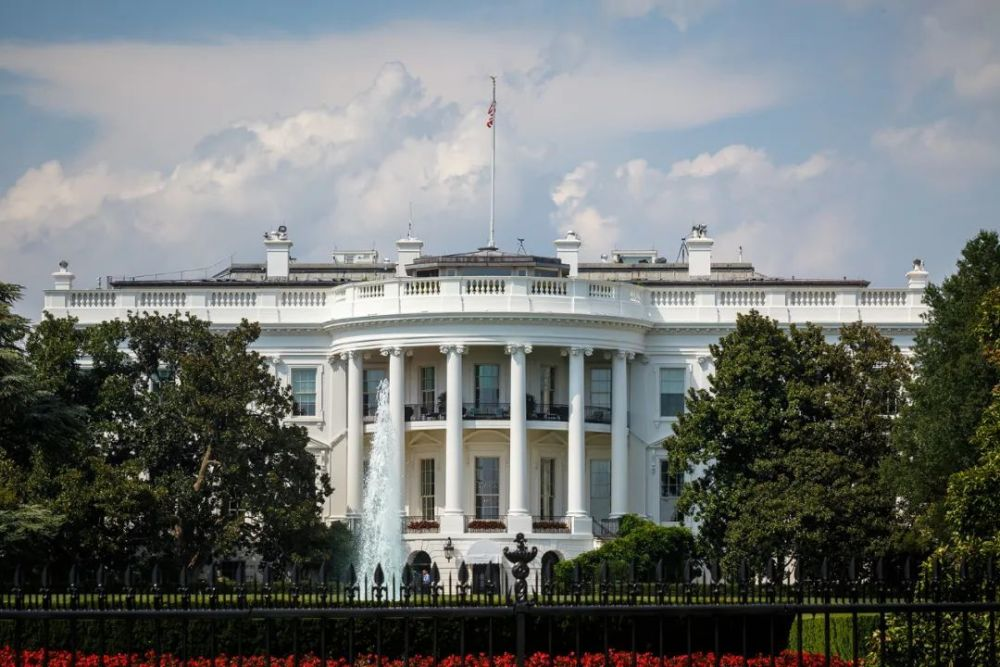
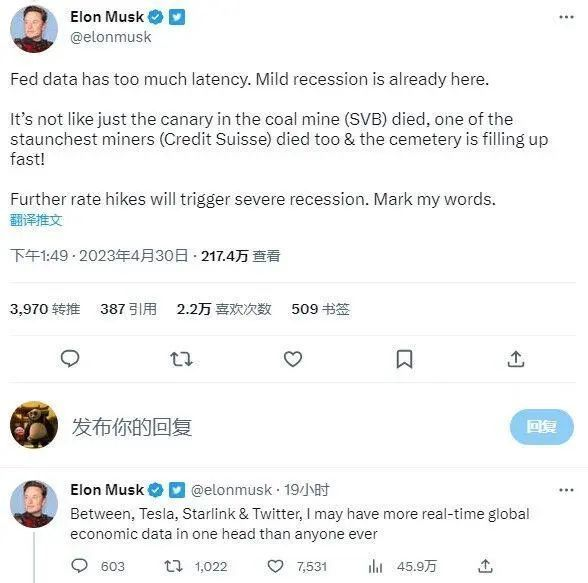

# 最快下个月！欠债31.4万亿，美国史上首次债务违约？拜登：马上开会谈

美国历史上第一次债务违约要来了？

当地时间5月1日，美国财政部长耶伦在致美国众议院议长凯文·麦卡锡的一封信中表示，如果国会无法在6月之前再次提高债务上限，
**美国最早将于6月1日突破债务上限，产生债务违约。** 耶伦指出，这一预测是基于目前的运行数据。

一位共和党国会助手称，美国总统拜登致电国会四位领袖，要求就债务上限问题启动谈判。政治媒体Punchbowl此前报道称拜登希望各方5月9日开会。

_白宫图片来源：视觉中国_

美国联邦政府债务规模在1月19日达到 **31.4万亿美元**
的法定债务上限。美国财政部已于1月19日开始采取非常规措施，以避免政府债务违约。财政部长耶伦此前表示，非常规措施将帮助联邦政府履行义务至6月初。

美国首次债务违约要来？

耶伦警告：将引发灾难

据环球网报道，美国财政部长耶伦当地时间5月1日致函众议院议长麦卡锡和其他高级议员，她在信中表示，美国政府可能“最早在6月1日”发生债务违约，这将是美国历史上的首次债务违约。

报道称，耶伦敦促麦卡锡等人，"国会必须尽快采取行动，提高债务上限或暂时使债务上限失效”。她表示，美国政府1月时达到了债务上限，从那时开始一直在采用“非常规措施”维持以避免债务违约。另一方面，她还说，
**“不可能完全预测财政部无法支付政府账单的确切日期，我将在未来几周继续通知国会最新情况”。**

关于美国政府债务违约问题，报道称，在众议院拥有多数席位的共和党表示，如果民主党人不在支出和政府预算方面做出妥协，他们就不会进一步提高债务上限，美国总统拜登拒绝妥协，他表示提高上限应该不附加任何条件，就像以前提高上限时那样。报道还称，多个熟悉情况的消息来源向ABC证实，随着面临6月1日这一可能的最后期限，拜登于5月1日下午致电所有4名国会高层，邀请他们参加5月9日的债务上限会议。

据21财经，面对潜在的债务违约风险，美国财政部长耶伦曾在4月25日警告过，他说
**如果国会接下来未能提高债务上限、由此产生违约，届时将引发一场经济和金融灾难，并在未来几年推高利率。**
“我们的债务违约将导致经济和金融灾难，违约会永久提高借款成本，未来的投资成本将大大增加。”

耶伦还表示，如果不提高债务上限，美国企业将面临不断恶化的信贷市场，美国政府可能无法向依赖社会保障的军人家庭和老年人发放款项。美国债务违约还将导致失业，同时推高家庭抵押贷款、汽车贷款和信用卡的还款额。

共和党通过“提高债务上限”提案

白宫：拜登会否决

据央视新闻，当地时间26日，美国众议院共和党人通过了一项提高债务上限提案，提议 **提高美国31.4万亿美元的债务上限，以换取大幅削减政府支出。**
这标志着众议长麦卡锡经过几天艰苦谈判后取得了胜利，但也充分展现了共和党会议内部的深刻分歧。

另外，共和党在方案中要求国会把定于今年9月30日结束的2023财政年度所批联邦财政开支 **缩减**
至1.47万亿美元；除关联老龄人口的退休和医保项目外，今后10年联邦财政开支年度增幅 **不超过** 1%。共和党同时要求：

**停发** 国会此前批准的2020年至2022年5.2万亿美元抗疫纾困资金剩余部分，据白宫介绍，不足800亿美元；

**取消** 拜登政府允许暂停偿付总值4000亿美元贷款的学生贷款优惠政策；

**取消** 拜登政府《通胀削减法》所含“绿色税惠”，即针对可再生能源、电动汽车等环境友好型技术的税收激励；

**取消** 向国家税务局增发800亿美元预算，这些预算本用于雇用新员工、启用新技术以加强税务欺诈审计。

据美联社报道，共和党控制的众议院有望下周就这一方案举行表决，但几乎可以肯定的是，民主党人会投票反对。共和党希望借方案施压拜登作回应，同时有意团结共和党内部的强硬保守派。

据中新网4月27日援引美国《国会山报》报道，美国参议院多数党领袖舒默驳斥了共和党的债务上限法案，称其为“美国违约法案”。白宫称该法案是“为获取极端让步而进行的鲁莽尝试”，并
**表示如果该法案到达拜登的办公桌，他将予以否决。**

_图片来源：视觉中国_

美联储或又要加息

马斯克：将引发严重经济衰退

据央视新闻报道，美联储定于5月2日到3日举行货币政策会议，市场普遍预测 **美联储为了遏制通胀将宣布继续加息。**
舆论指出，当前美国经济增速放缓、银行业危机继续发酵，在这种情况下美联储激进加息可能进一步拖累经济增长，将导致美国经济更快地陷入衰退。

美国商务部当地时间27日公布的预估数据显示，2023年第一季度美国实际国内生产总值按年率计算增长1.1%，显著低于去年第四季度的2.6%，也低于市场预期的2%。与此同时，美国通胀指标加速上升，第一季度个人消费支出价格指数上涨4.2%，高于预期值3.7%，并创下一年来最大涨幅。

市场人士据此预测，美联储或将宣布继续加息以应对通胀。然而自3月以来，受美联储激进加息影响，美国多家银行接连关闭，存款外流、信贷收紧等情况在美国银行业随处可见，舆论认为继续激进加息不仅不会使通胀率应声而降，反倒会为陷入危机的美国银行业甚至美国经济火上浇油，让美国离衰退更近一步。

据财联社，哈佛大学经济学家、美国前财长拉里·萨默斯在4月29日发表的推文中写道，“如果美联储继续采取紧缩措施遏制通胀，我预计经济放缓可能会到来。我认为，未来12个月某个时候发生这种情况的可能性相当大，概率可能为70%。”

而特斯拉CEO埃隆·马斯克在这条推文下表达了他对美联储再次加息的后果的担忧。马斯克当地时间4月30日在推特上写道，美联储使用的数据有太多的延迟，并补充说，
**“温和的衰退已经到来。”** 马斯克还提出了严重衰退的可能性。“进一步加息将引发严重的经济衰退。记住我的话。”

_截图自推特_

**编辑|** 王月龙杜恒峰

**校对|** 汤亚文

每日经济新闻综合自央视新闻、环球网、21财经、中新网、财联社

