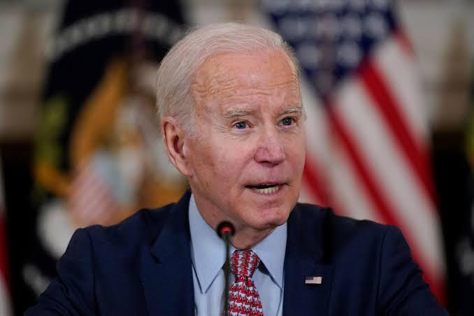

# 耶伦警告美国国会“可能最早6月1日发生债务违约”，拜登也在行动

【环球网报道】据美国广播公司（ABC）报道，美国财政部长珍耶伦当地时间5月1日致函众议院议长麦卡锡和其他高级议员，她在信中表示，美国政府可能“最早在6月1日”发生债务违约，这将是美国历史上的首次债务违约。

_美国财长耶伦资料图_

报道称，耶伦敦促麦卡锡等人，“国会必须尽快采取行动，提高债务上限或暂时使债务上限失效”。她表示，美国政府1月时达到了债务上限，从那时开始一直在采用“非常规措施”维持以避免债务违约。另一方面，她还说，“不可能完全预测财政部无法支付政府账单的确切日期，我将在未来几周继续通知国会最新情况”。

关于美国政府债务违约问题，报道称，在众议院拥有多数席位的共和党表示，如果民主党人不在支出和政府预算方面做出妥协，他们就不会进一步提高债务上限，美国总统拜登拒绝妥协，他表示提高上限应该不附加任何条件，就像以前提高上限时那样。报道还称，多个熟悉情况的消息来源向ABC证实，随着面临6月1日这一可能的最后期限，拜登于5月1日下午致电所有4名国会高层，邀请他们参加5月9日的债务上限会议。

_美国总统拜登资料图_

据媒体此前报道，美国国会近几十年来不断提高公共债务上限，使其当前达到31.4万亿美元的创纪录水平。这是大规模减税和无节制支出双重作用下的后果。当地时间4月19日，美国国会众议院议长凯文·麦卡锡公布2023年“限制、储蓄、增长”法案，法案计划将联邦政府债务上限提高1.5万亿美元，并将限制政府开支，将联邦预算削减至2022年的水平，同时将未来的支出增幅限制在每年1%，为美国纳税人节省超过4.5万亿美元。麦卡锡呼吁拜登政府就此计划进行谈判，以避免债务违约。美国白宫4月19日则再次重申立场，呼吁国会无条件提高债务上限，以避免历史性违约。

