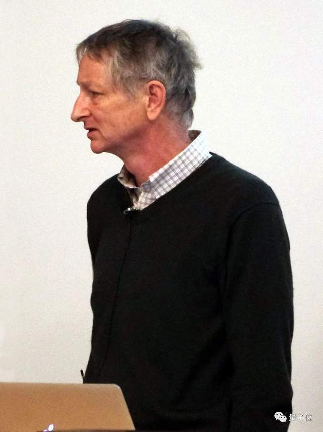
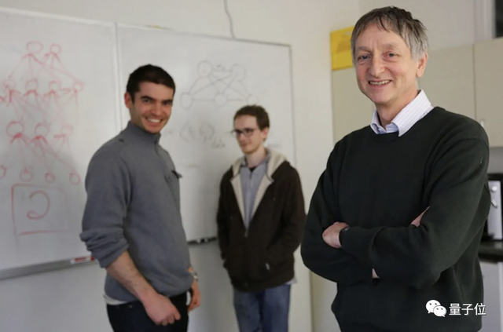

# 谷歌突失Hinton！深度学习之父警告AI风险，对毕生工作表示遗憾

杨净 明敏 发自 凹非寺

量子位 | 公众号 QbitAI

Breaking News！

深度学习三巨头、神经网络之父Geoffrey Hinton已离职谷歌，结束十载生涯。

最新推文中透露了原因：为了自由地讨论人工智能的风险。

消息一出，整个科技圈炸了，人们震惊于AI已经让Hinton感到害怕了。

有网友直接懵住：到底发生了什么？还是我漏掉了什么？你不是曾说过GPT-4为人类的蝴蝶吗？

不少人还认为Hinton此举有待商榷，应该将关注人工智能安全工作常态化而不是离职。

甚至还有人劝他理解AI，而不是通过延迟研究来限制。现在潘多拉魔盒已经打开。

但Hinton的态度似乎十分坚定，在访谈中直言：对自己毕生的工作感到后悔。

而另一位巨头LeCun这边也表示，对Hinton的离职并不惊讶。

不少网友在底下已经开始就AI的各种问题寻求Hinton的见解：

你对开源AI有什么看法？你觉得需要注意和避免的最大危险是什么？

“对自己毕生的工作感到后悔”

据《纽约时报》消息，Hinton的离职是在4月提出的。辞职的理由一言以蔽之，是对人工智能风险的担忧。

这种忧虑甚至让这位深度学习之父表示：

我对自己毕生的工作，感到非常后悔。

我用一个借口来安慰自己，如果我没有这么做，还会有其他人。

梳理来看，引发Hinton担忧情绪的因素，有近期和远期两个方面。

先说近期影响，就是ChatGPT趋势下的新一轮AI竞争。

在微软将ChatGPT引入Bing后，挑战了谷歌的核心业务搜索引擎，然后谷歌马上推出了Bard作为应对。这让Hinton觉得，谷歌似乎不再扮演AI“好管家”的角色了。

而且科技巨头们正在掀起一场无法停止的角逐。由此带来的影响，将是生成式AI生产出非常多真假难辨的内容。

而从长远来看，Hinton认为，AI将会对就业市场造成巨大影响。如助理、翻译等各行各业都可能被扰乱。

再进一步，AI或许也会对人类构成威胁。

因为个人和企业不仅允许AI生成代码，实际上AI也有能力运行这些代码。因此Hinton认为有朝一日那种具有自主能力的杀手机器人，会成为现实。

他表示，AI实际上可以比人类拥有更聪明的想法——一些人相信这一点。但是他没有预料到人工智能的发展速度会像过去7个月那样快。

我曾以为这需要30-50年之久，但是现在我不这么想了。

这种想法，和之前十余位美国人工智能协会专家联名发出的警告，有些相似之处。不过在那时，Hinton并没有参与这项活动。

据《纽约时报》消息，离职前，谷歌CEO桑达尔·皮查伊和他通过电话，但具体内容Hinton不愿透露。

这场离职风暴中，谷歌研究首席科学家、谷歌高级副总裁Jeff Dean发表了一份声明，表示：

我们仍会坚持对AI采取负责任的态度。我们在不断学习理解新出现的风险时，也在大胆创新。

对于Hinton的离职，另一位深度学习三巨头之一LeCun表示，Hinton并没有和他透露要离开谷歌的打算，不过他对比并不感到十分惊讶。

OpenAI首席科学家是他学生

此番离职，或许对于Hinton来说，也是时候了。

ChatGPT、大模型让全球对于通用人工智能的想象更加具象，其背后的安全与风险等问题也被搬上日程。

一直以来，Hinton对于通用人工智能抱有赞叹和期待。

早在GPT-3刚出炉、其他两位图灵奖得主LeCun和Bengio都持不看好态度时，Hinton却表示，从GPT-3出色的性能可以推断，生命、宇宙和万物的答案“不过是4.398万亿个参数而已”。

直至ChatGPT出现时，他还将GPT-4比作人类的蝴蝶：

毛毛虫提取营养物质，然后转化为蝴蝶。人们已经提取了数十亿的理解金块，而 GPT-4 是人类的蝴蝶。

他惊叹其效果的同时也透露出不少隐忧。

RLHF机制是在培养一个超常的早熟儿。

而现在，随着ChatGPT风暴席卷越来越多的行业，Hinton想要站出来承担人工智能危机“敲钟人”的角色，就已经到了关键时刻。

值得一提的是，在通用人工智能探索的最前沿，Hinton的学生们仍扮演着重要角色。

比如，现在OpenAI的首席科学家Ilya Sutskever。

_△左：Ilya
Sutskever，右：Hinton；图源：多伦多大学_

当年，Hinton与他的两位学生Ilya Sutskever和Alex
Krizhevsky共同发明了卷积神经网络AlexNet，拿下当年最权威的人工智能大赛ImageNet第一名，而且精确度是第二名的两倍。

后来，他们还一起成立了公司DNNResearch，后被谷歌4400万美元收购。

Ilya Sutskever担任Google
Brain的研究科学家，并成为后来AlphaGO众多合著者之一。直至2015年底他离开谷歌，加入OpenAI担任联合创始人以及首席科学家。

好了，期待Hinton大佬的新动向，对于他此番离职谷歌，你怎么看呢？

参考链接：

[1]https://www.theverge.com/2023/5/1/23706311/hinton-godfather-of-ai-threats-
fears-warnings

[2]https://twitter.com/geoffreyhinton/with_replies

[3]https://www.nytimes.com/2023/05/01/technology/ai-google-chatbot-engineer-
quits-hinton.html

