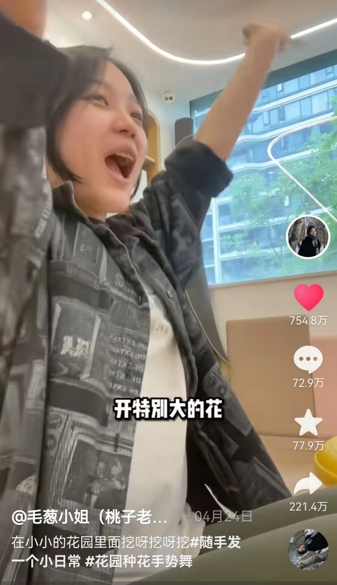

# “挖呀挖呀”洗脑全网！00后美女幼师回应走红：没想靠平台赚钱

“在小小的花园里面挖呀挖呀挖，种小小的种子开小小的花。”这个五一假期，不少网友都被这一首儿童歌曲“洗脑”，欢乐的节奏、有趣的动作，也让不少疲于生活的成年人回忆起童年那一份纯真。

女幼师自拍上课视频爆火，网友表示很“治愈”

今年五一假期前夕，浙江省杭州市一幼儿园老师“桃子老师”在抖音平台中上传的这一条“挖呀挖呀挖”的上课视频意外走红网络。“在小小的花园里面挖呀挖呀挖，种小小的种子开小小的花。”视频中，极具亲和力的女幼师带领着班上的小朋友们一起唱着童歌，手上比划着可爱的动作。歌声甜美纯真，一首童谣《花园种花》不仅激发起小孩子们的学习热情，更是引得千万网友的围观点赞。

记者在“毛葱小姐（桃子老师）”的抖音账号上看到，截至目前，桃子老师的粉丝已有100余万，这条最早发布于4月24日的视频点赞量已达700余万，评论71万余条，浏览量过亿。不少网友直言：“相当洗脑！相当治愈！”

一条简单的视频为何会走红网络，有网友留言表示，“虽然是跟小朋友说话那种嗲嗲的语气，但是很舒服，很自然，不是那种刻意的夹子音，谁懂啊，每次刷到这个BGM我都要再来看一遍原视频，每看一遍心情就很好。”也有网友称“好不容易在家待了一上午，听着挖呀挖呀挖一上午，最终明白，原来是我们还保持童真。”

各行各业网友争先模仿 成年人也有一份“童真”

视频爆火后，各行各业的网友也争先模仿起来，虽然已经不再是小孩，但成年人也永远具有一颗童心。

比如一位挖掘机司机晒出了夜晚施工的照片，并留言称“在小小的工地里面挖呀挖呀挖，挣小小的马尼给我媳妇花。”一位矿工上传了自己满脸黑炭的工作照，并留言“在深深的矿井里面挖呀挖呀挖，挖多多的煤炭点亮千万家。”一位地铁建设人员上传了自己铺设铁轨的照片，留言“在黑黑的地底下挖呀挖呀挖，修长长的地铁，连接千万家。”

还有摆摊的小贩也发视频调侃自己的日常，称“在小小的城市里被抓呀抓呀抓，摆小小的摊子养小小的家。”有建筑工人晒出屋顶做防水的照片，称“在小小的水沟里刷呀刷呀刷，挣小小的钱呀给媳妇花”等等。

挖掘机司机、建筑工人、摆摊小贩、牙医、出租车司机……同样的音乐和节奏，不一样的工作和背景，正值五一劳动节，众多为生活奔波辛苦的成年人被这首儿童歌曲治愈的同时，也同样用这一首儿童歌曲抒发出自身对生活的期待和憧憬，既欢乐，又感动。

28岁的刘先生嘴里时不时蹦出“挖呀挖呀挖”的歌声，“看了之后很洗脑也很治愈，手机前的我仿佛瞬间成为了一名幼儿园学生，无忧无虑的感觉。”刘先生说，长大后才懂得生活的艰辛和不易，他也把视频分享给了不少朋友，大家看到视频后，跟着老师唱起儿歌，短暂地忘掉生活中的烦恼，确实很解压。

本人回应：没想到会带领小朋友治愈那么多成年人

5月3日，记者联系到了“桃子老师”，桃子是一名00后，去年三月进入到杭州这家幼儿园工作，因为从小就喜欢和孩子们打交道，这让她工作起来十分顺手，很快就由幼儿园的一名配班老师变为正班老师，“和孩子们在一起，会让人变得单纯许多，平常工作和生活中我也会有一些烦心事，但一见到孩子们我就会非常开心。”桃子说，其实，很多网友都在说她带领着小朋友们治愈了很多成年人，其实小朋友们也一直在治愈着她，她非常爱这些孩子和这份工作。

桃子介绍，视频中的歌曲名为“手指谣”，篇幅不长、琅琅上口，同时以手指的动作辅助孩子们理解记忆，达到启迪幼儿心智、寓教于乐的效果，这种课程一般放在早课中，带动孩子们的学习氛围。

说起发布的视频在网络平台中爆火，桃子表示自己也没想到，“起初我只在账号中发布视频记录自己的生活日常，也就100多个粉丝，‘挖呀挖’的视频最早是发布在了自己的微信朋友圈里，反响特别好，有朋友就建议我发布在网络平台中，没想到一下就火了。”桃子认为，走红实属意外，甚至对于她来说有些“莫名其妙”，“很多人喜欢我，也有很多人不喜欢，我的情绪会受到一定影响，更多的是不知所措，现在还是想专注于我本职工作，我就是一个普通人。”

身为一名普通的幼教老师，桃子也很高兴能以这样的方式让更多人认识到幼教这个职业，“这样的精神面貌也是每个幼教老师的常态，哪怕工作、生活中再疲惫，面对孩子的时候也要拿出100％的状态，大家也可能是喜欢我的这种淳朴和亲和。”桃子说，虽然自己“火”了，但目前没有打算换工作，没有想过利用网络平台赚钱，在做好本职工作的同时会利用空闲时间就发布自己的日常，“像一些偏远地区的公益项目，需要我的话我也会过去支教，利用我的力量提供一些帮助。”

>>网友热议：眼睛里藏着童真和温柔

@一个月半老师：须知少时凌云志，曾许人间第一流。支持你，加油。因为从第一次看到你的视频到每天都要看，用你的视频哄我的小宝睡觉，用你的视频让我的大宝回忆他幼儿园的时光。

@用户09872610:这首挖呀挖能引起这么多人的共鸣，估计是在这疲乏的现实里只有那么放松有趣的儿歌能舒缓人们。

@北冥有鱼：我小孩很喜欢你唱的歌，我也天天要唱给小孩听。太治愈了，百听不厌，我每天都要听好多遍，你的声音太好听了。

@喔兔：我是一个父亲，孩子即将上幼儿园，看了你的视频，感到很治愈。

@地崩去上班：救命，我闺女已经挖了一天一夜了。

@晓芬：最治愈的就是祖国花朵们的笑容。

@dym99890:幼师的眼睛里藏着童真和温柔。

@大头呀爱分享：成年人的世界是有多大的压力，现在都喜欢上幼儿园的课了。

>>一首简单的童谣 为何火爆网络？

心理咨询师：挖的是辛勤的付出，种的是满怀希望，开花是劳动的回报

国家二级心理咨询师杨逍表示，童谣的简单和重复让成年人不需要大脑加工，就能形成自动化反应，让人感觉更轻松。对于处于压力环境下的人们，生活已经让他们很累，渴望有那么一刻是不需要加工、记忆的，不需要调用大脑资源，就能完成的事情。

“我们的左半脑主管语言、数字和逻辑性思维，右半脑主管音乐、空间及形象思维。在紧张的思维后，动动手，弹弹琴，做家务等，都可以使易疲劳的大脑皮层得到休息。歌曲配有简单的动作，形象、易学，在疲惫的时候动动手指，也是大脑休息的一种方式。”杨逍说，歌词中的三个动作：挖，种，开花，挖的是辛勤的付出，种的是满怀希望，开花是劳动的回报。现在人们怕的不是付出，而是不能有对等的回报。从歌曲里听到的是少付出小回报，多付出大回报，这正符合人们对美好生活的期望，可以抚慰内心，温暖心灵，使疲惫的心灵得到安慰。

**华商报大风新闻记者 于震 编辑 王喆楠**

