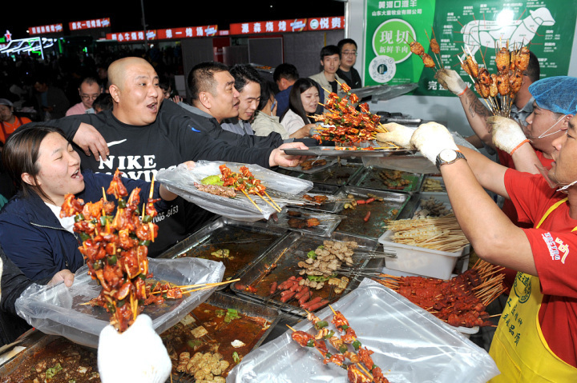

# 三四线“宝藏城市”为何能逆袭？淄博举城迎宾的人情味，大城市难有

_图源
视觉中国_

今年是三四线城市的“大年”。

先有江门口碑借势“狂飙”，后有洛阳靠汉服全城“剧本杀”杀出重围，还有芒市泼水节“泼”出一种叫云南的生活，更有淄博烧烤引爆全国口碑，五一期间蜂拥而至的游客劝都劝不退。

这些以往隐于大众视线之外的三四线城市，通常在各类榜单里鲜见身影，有的名字说出来听的人都得反应半天。今天这些城市，却能在机缘巧合加持下，成了万众瞩目的宝藏城市，C位出道、风头无两。

这一切，到底是命运之神启动了“金手指”，还是“悄悄努力然后惊艳所有人”的谋划已久？从宝藏城市的“养成”之路中，你既可以看见中国三四线城市的野心与前途，也能窥见群体心理对内需消费、中国经济的深刻影响。

**（一）爱上宝藏城市的理由**

宝藏城市火起来，原因不外乎这么几种：

**首先，大家都憋坏了——** 五一期间出行人次的大幅度暴涨，再次印证了这个感受。

这也是文旅业热起来的一个基本前提。疫情三年的流动受限，无限放大了大家对大好河山的向往。今年以来，大家再也不用走火入魔似的演“居家旅游”了，说走就走的出行意愿格外强烈。文化和旅游部公布最新数据显示，2023年一季度，国内旅游总人次12.16亿，比上年同期增加3.86亿，同比增长46.5%。这个过程中，传统的旅游目的地之外，一些新、奇、怪、特的目的地开始进入大众视野，多样化的选择增加了旅游的丰富性。

**其次，宝藏城市自己争气。** 出圈这种事，“剃头挑子一头热”不行，供需对接很关键：公众想走出去，城市想迎进来，才会一拍即合、双向奔赴。

这波小众旅游目的地火起来之前，各地文旅局长“才艺秀”，充分展现了大大小小城市的迎客热情，相关准备铺垫工作已经酝酿了很久。正如淄博烧烤“炙手可热”后，沿着各种线索回溯，大家才恍然发现：原来淄博早就写好了“逆袭”的“剧本”。从2015年大规模开展的烧烤“三进”行动，到经得起美食博主缺斤少两的突袭检查，到火了之后增加“烧烤专列”、定制“烧烤地图”、设立“金炉奖”等一通组合拳。
**淄博就像个谦虚的艺人，哪怕早就练习好了获奖感言，也要在被镜头锁定的一刻假装意外。**

还有，经济层面的原因。 **经济学家有种说法：所有看上去很“迷”的事情，一旦回归到经济视角，其义自见。**

央行数据显示，一季度人民币存款增加了15.39亿元，相当于今年一度存完了去年半年存的钱，“多存钱”成为普通人应对经济下行最简单粗暴的方法。为什么要说这个？因为你发现没，不管是到江门打卡《狂飙》拍摄地，到芒市菜市场找低至几块钱的特色美食，还是百元吃到撑的淄博烧烤，这些项目主打的就是一个性价比。包括之前的“特种兵式旅游”，如今不少大学生是“时间管理大师”，更是“金钱管理大师”。三四线城市的消费往往远低于一二线城市和一些热门旅游目的地，可以大大缩减旅游预算，难免戳中囊中羞涩又爱玩者的心巴。反而造就了经济复苏中“疤痕效应”的正面案例。

**最后，社交媒体的放大器效应。**
信息冗杂时代，注意力是稀缺产品，KOL（意见领袖）变得格外重要。博主、潮人的打卡，媒体的跟进，网友们的推波助澜，共同创造了城市出圈的天时地利人和。

重庆“李子坝站”一张穿楼而过的魔幻照片，就能让无数人徘徊在居民楼下等拍错位照；博主镜头下，台州温岭石塘的海景照，时而是五彩斑斓的“小圣托里尼”，时而是唯美浪漫“现实版宫崎骏”，令人神往；一个帅小伙丁真，能让甘孜理塘从国内火到国外……一旦社交媒体上的裂变式传播被触发，流量汹涌而至，一朝成名天下知就不是难事。大众也乐得用集体的狂欢，参与“造神运动”，体现普通人选择中蕴含的能量，也就是大家常说的用脚投票。

**（二）如何成为下一个宝藏城市**

淄博之火，可以被复制吗？

很多人想知道答案。虽然爆红与小火不同、头部网红与腰部网红有别，但我们确实能看到，江门、洛阳、芒市之类宝藏城市名单越来越长。
**一旦成为现象，就有规律可循。等着“抄作业”的三四线城市，不妨咂摸一下这么几点。**

**以小博大，机会公平。**
这个时代，互联网前所未有地拉平很多“起跑线”。按照以往逻辑，一线大城市、盛会城市无论在人口、经济等硬实力还是服务业基础、宣推策划等软实力上，都要更高一筹。现在不是了。“未来,每个人都能出名15分钟。”
艺术家安迪·沃霍尔的这句话同样适用于城市。

二、三产业基础薄弱、资源禀赋不够、互联网底子不行、人才储备有限……这些都不是三四线城市品牌打不出去的“借口”。弯道超车这条路，已经被证明是可行的，关键在于会不会将自身优势，转化为互联网上最有传播力、记忆力的点，甚至“无中生有”地培育新优势，从而以小博大。

**流量来了得接得住。**
比声名鹊起更难的是名实相符。淄博之前，不少城市都吃到过互联网上“一夜成名”的红利，但是大多数口碑难以持久，服务、品质、交通等等任何一个环节掉链子，出现了负面新闻，口碑就会迅速崩盘。比如被村民拦住收过路费之类。

淄博能连续占据热搜，禁得住舆论“烤”验，与主政者深谋远虑、一棒接着一棒干的务实分不开，与当地治安、环境、卫生、交通、市场、消防安全等部门密切配合分不开，与当地群众齐心打响“好客山东”的招牌分不开。台上一分钟台下十年功，在看不见时候努力，才能在看得见时持续闪耀。

**内需市场真的很深。**
《扩大内需战略规划纲要（2022-2035年）》中，我国最终消费支出占国内生产总值的比重连续11年保持在50%以上。这是一个积极信号。构建新发展格局，扩大内需是重点也是难点。有人曾担心疫情造成的“疤痕效应”短时间内很难修复，消费降级确实是很多人的现实选择。然而，接二连三的城市爆款，恰恰说明内需的潜力无穷，我国这一全球最有潜力的消费市场正在不断成长壮大。

老百姓不是不肯花钱了，而是怕花“冤枉钱”、不肯当“冤大头”。就旅游服务业来说，
**那种“景区宰人很正常”“三年不开张，开张吃三年”的短视论调，早就该被抛弃了。**
今年“五一”假期前，仍旧有不少城市因为“宰客”上热搜，某地民宿为涨价谎称因嫖娼被查封，某地115元买8根炸串游客被骂“穷”……这些“卧龙”“凤雏”，大大败掉城市在大众心中的好感。真正凭本事挖潜，老百姓是绝对愿意买账，反之来把老百姓当“韭菜”，崩盘是早晚的事。

**城市竞争争的是人心。** 存量经济时代，城市竞争的一大要素是对人心的争取。
**尤其是疫情之后，人情的温度、人的尊严体面、人的舒展快乐等精神层面的追求，显得尤为珍贵。**

洛阳搞牡丹文化节、沉浸式国风穿越，有人说,在洛阳穿什么奇装异服都不会突兀，这份个性和放松别的地方找不到。所以这里才能创下20天旅游业总收入87亿元的业绩。而
**淄博烧烤里的烟火气，举城迎宾中的人情味，还有隔离大学生“勿相忘”故事中的义气，都在展现一副温情脉脉的世相图**
。这一点，反而是人口规模巨大的一二线城市难以做到的。不要看不起年轻人的“三瓜两枣”，他们的需求，体现的正是现代化对人本的回归，决定了城市的未来。

**（三）要“前方高能”不要“前方到站”**

一个网络段子说，自己所在城市的文旅部门，已经做好了等淄博翻车就第一时间上去蹭流量的准备。这当然是无稽之谈。但小众城市逆袭为宝藏城市的“爽剧”，剧情要继续写下去，实现网红长红、流量长留，确实需要殚精竭虑、步步为营。

苗头已经出现。淄博火了后，有姑娘发视频说自己在淄博吃烧烤被老板娘多收了9块钱蘸料费，老板娘澄清是顾客自己拿了一瓶芬达，小饼还有一套小餐具，加起来9块钱，并且称说每天一千多个人给她打电话骂她。真相大白，但损失已无法挽回。网络上还传出过“淄博清退城管”“淄博取消城管”“淄博城管人员全部退出”等不实信息。

节前，淄博烧烤街还出现了一群特殊的人，他们是被拐儿童的父母。其中一位已经寻子28年的父亲说，孩子“梁志辉”今年31岁，也正是爱吃烧烤的年纪，最近淄博烧烤比较火，也可能会关注，说不定能找到。

关于淄博亦真亦假的消息不断，人们赋予它的象征意义也越来越多，这一切都让淄博的成名，看上去摇摇欲坠。诚如一位地方干部说的那样：“压力太大了，每天如坐针毡，生怕哪里想不到、做不好，从流量高峰跌落。”

**人红是非多，流量确实常常搞捧杀这一套。** 城市走红之后，关于这座城的点点滴滴，都藏着足以毁掉它的危机。

这就要求治理者打起十二分的精神，既能让流量为我所用、又能不为流量所驱使，不飘不燥、脚踏实地。做好城市管理的每一处细节，文旅、工商、交通、卫生、消防、物价等各条线，都不能掉链子，为守护城市口碑而战。

**既要守，也要攻。趁着高光时刻的亮度，找到并稳固住城市发展的核心竞争力最要紧。**
流量是速朽的，大众注意力的稀释和转移是必然的。若要避免走上“其兴也勃焉，其亡也忽焉”的路子，势必要摆脱流量依赖，找到可以持久支撑发展的产业和专长。

心理学上有个“狄德罗效应”，指人们在拥有了一件新的东西后，不断配置与其相适应的东西，以达到心理上平衡的现象。网红城市恰恰可以利用这种效应，加速为城市赋能，让实力配得上名声。

为了热度能持续“狂飙”，江门趁势大力搞影视产业、造文旅龙头、抓酒店民宿集群招商、建导游讲解员队伍建设，保留“天然影棚”新旧交替及历史痕迹的时代感。而淄博3天就修好一条路，20天新建一座烧烤城，带动全城人民提升文明素养……这些“软硬兼施”的基础设施建设，打下的是城市发展的长远基础，不怪网友夸一句“人间清醒”。

**与其为爆红的宝藏城市“泼冷水”，不如祝福这些城市越努力越幸运，持续输出“前方高能”的惊喜。**

是宝藏，总会被发掘。身处庞大的内需市场，随着人们对品质生活的要求越来越丰富多样，在互联网传播机制助推下，三四线城市走红的故事，一定还会继续上演。用得好了，这些红利能转化为城市发展的动力，也能转化为普通人幸福感的来源。

那么，下一个站上C位的，会是哪座城呢？

