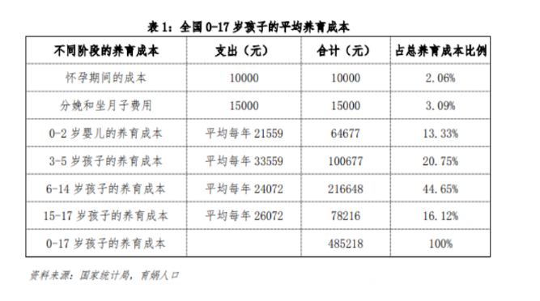

# 中国育儿成本全球第二高？报告称抚养一个孩子到大学毕业需要62万

在中国，养育孩子的成本一直是一个备受关注的话题。根据育娲人口研究智库最新的研究报告显示，在中国，养育一个孩子到18岁所需要的成本是人均国内生产总值（GDP）的6.9倍，这一数字高于德国（3.64）的两倍，高于澳大利亚（2.08）和法国（2.24）的三倍，让中国成为养育成本第二高的国家，仅次于韩国（7.79）。

报告还显示，在中国，把一个孩子从出生养到17岁，平均费用为48.5万元，而抚养一个孩子到大学毕业的费用约为62.7万元。

**养大一个孩子要花多少钱？养育成本由这些方面构成**

养育孩子的成本不仅仅是经济意义上的负担，更是一种责任和义务。在中国，抚养一个孩子的成本已经成为了一个家庭的重要负担之一。那么，这个成本的产生原因是什么呢？

首先，最主要的原因是教育成本。在中国，教育是人们最重视的事情之一。中国父母为了给自己的孩子提供良好的教育，甚至会倾其所有。其中，教育成本包括课程费用、家教费用、考试报名费用等。随着教育的发展，这些费用也在不断地上涨。不仅如此，孩子的校外辅导费用也在逐年增加，这些教育成本几乎占据了整个养育成本的大部分比例。

其次，医疗健康成本也是一个重要的因素。随着医疗技术的发展和生活水平的提高，人们对于孩子的健康成长也越来越关注。孩子的疫苗接种、常规体检、疾病治疗等都需要费用。除此之外，饮食、住房、交通等方面的成本也在逐年上涨。

要想把一个孩子养育到18岁，需要巨大的经济投入。从孩子出生开始，父母就需要为其提供各种基本服务，如医疗保健、教育、衣食住行等。在中国，这些服务的费用相当昂贵，而且还存在着较大的差异。比如，在一线城市生活的孩子需要更多的经济支持，而在农村地区则相对较少。

中国的养育成本之所以高昂，与社会发展水平和生育政策有着密不可分的关系。中国的生育政策长期以来都实行一胎化政策，而且在2016年才正式变为全面二胎政策。这意味着，在过去的几十年里，中国的孩子数量相对较少，父母对孩子的期望和压力也相对较高。此外，中国的教育水平和社会发展水平在不断提高，这也意味着人们对孩子的期望越来越高。

养育成本逐年增加，是否会影响人们的生育意愿？

根据国家统计局2月28日发布的2022年国民经济和社会发展统计公报显示，2022年末全国人口141175万人，比上年末减少85万人，全年出生人口956万人，出生率为6.77‰；死亡人口1041万人，死亡率为7.37‰；自然增长率为-0.60‰，我国人口61年来首次出现负增长。

为什么现在的年轻人不愿意生育？养育成本是否是制约年轻人生育意愿的重要因素？

长江云新闻记者通过梳理发现，教育成本、养育成本和房价依然是影响生育意愿和生育水平的三大因素。

家住湖北襄阳的小王是一位“85后”的年轻妈妈，育有一个5岁的女儿，她告诉长江云新闻记者，自己粗略计算，去年，她家的小朋友在教育、医疗健康、娱乐等方面大约花费了四万多。“教育大概一万五，吃饭和出去玩也差不多两万五，还有小孩容易生病，去一次医院基本都要花500元以上，算下来，确实是一笔不小的费用。”

小王说，现在孩子比较小，有些费用还没有完全算进去，未来，教育更是一笔较大的开销。“自己就这一个孩子，希望尽所能给她提供最好的生活，不管是吃住行用，还是教育等，都不想自己的孩子比别人差。”

当长江云新闻记者问及小王，未来是否有生二胎的打算？小王坦言，自己从未有过这种想法，比起高昂的育儿成本，自己更多的顾虑是养育难度大，精力完全不够。“养育孩子要考虑的事情太多了，一个孩子已经让自己身心俱疲了，再多一个，真的没把握能够照顾得很好，倒不如全身心地养育一个孩子。”

**如何降低养育孩子的成本？国家有关部门在积极行动**

生育成本过高是影响育龄家庭生育意愿的重要因素之一。那么在未来，如何降低养育孩子的成本呢？

首先，国家应该加大对教育、医疗等方面的投入，促进公共资源共享，减少家庭个体的负担。对此，国家有关部门已经在积极行动，长江云新闻记者了解到，2021年6月，国家正式实施三孩生育政策。除此之外，还有多项配套措施推动优化生育政策落实，这些措施包括：废止《社会抚养费征收管理办法》等3部行政法规；印发《母婴安全行动提升计划》；实施妇幼健康保障工程；推动普惠托育服务专项行动，2021年支持建设了6.1万个普惠托位；开展计划生育家庭帮扶工作等。

其次，有关部门应该建立公共托管机制，提供低成本的、高质量的托管服务，让父母们更加放心的工作，有些地方还推出了符合本地实际情况的生育支持举措。例如，修改后的《浙江省人口与计划生育条例》规定，女方在享受国家规定产假的基础上，生育一孩延长产假60天，生育二孩、三孩延长产假90天；江苏省苏州市对已备案的社会办普惠性托育机构，给予每个托位1万元的建设资金补助和每人每月300-800元的托位运营补助；四川省攀枝花市在全国率先推出育儿补贴金政策；湖北省宜昌市对按政策生育二孩及以上，且子女落户宜昌的本地户籍产妇，给予5000元的一次性生育补贴等。

此外，对于孩子的教育，家长们也可以适度降低自己的期望值，不要过于“望子成龙”“望女成凤”，让孩子的教育成为一种“投资”。

