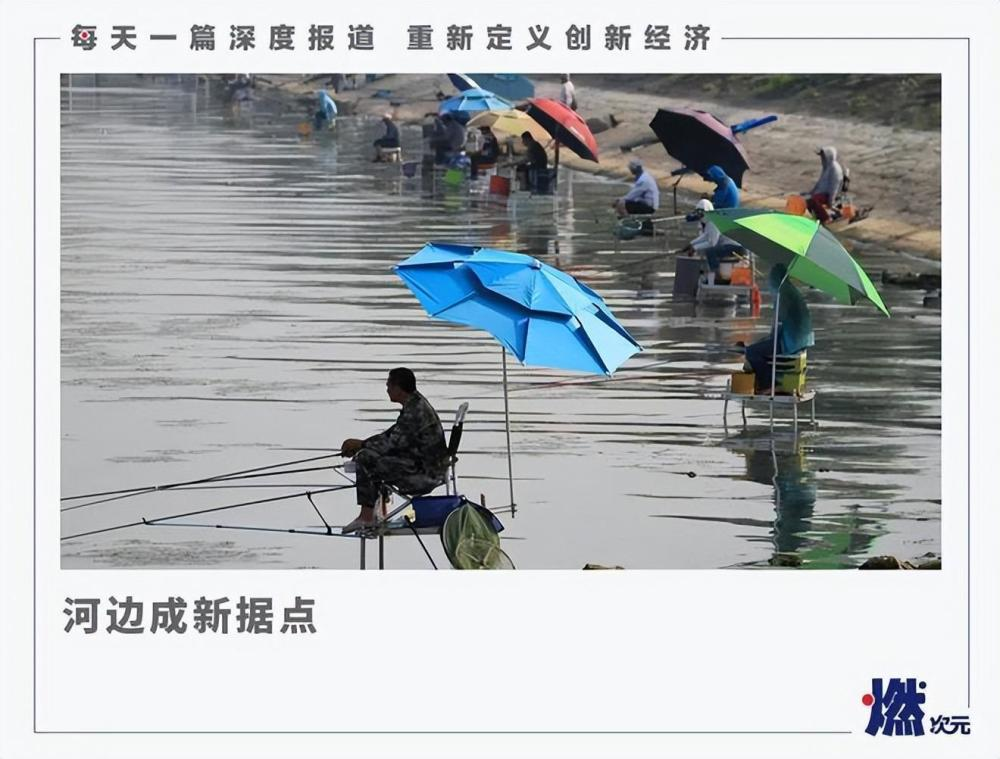
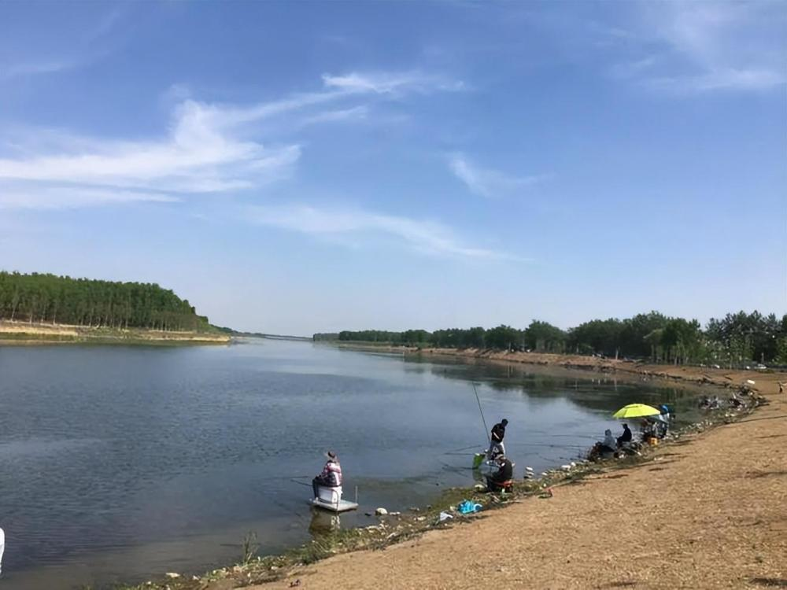

# 五一连钓5天！这届年轻人钓鱼上头：豪掷四五千买鱼竿“吓坏”大爷

燃次元（ID:chaintruth）原创

作者｜张 琳

编辑｜曹 杨

这届年轻人为了钓鱼有多拼？

不仅池塘、水库、河流、湖泊、大海，只要有水的地方就有年轻钓友们的身影。不少年轻钓鱼发烧友更是直言，这个五一小长假，要连钓5天鱼，好好过一把瘾。

90后男生Ken的5天假期，都在钓鱼，钓鱼路线分别是北京市通州大运河、潮白河、温榆河和密云某水库，“和朋友约好了一起在河边露营钓鱼，看看青山绿水放松一下。”

Ken对燃次元表示，“钓鱼是一项成瘾性活动，平时我的每个周末几乎都用来钓鱼了，五一假期也不例外，可以一次过足瘾。”

Ken强调，一方面是因为钓鱼充满了不确定性，另外，钓鱼也是个技术活儿，不断提升技术的过程充满成就感，“很多资深钓鱼人士都会在短视频平台发布钓鱼技巧或直播钓鱼，不钓鱼的时候我就一边看一边自己摸索。”

如今，和Ken一样的年轻人正在成为钓鱼大军中不可忽视的群体。

京东运动发布的“2023垂钓消费趋势”显示，过去被视为“中老年休闲标配”的垂钓项目，
近几年在年轻群体中悄然兴起，近4年间26岁以下的垂钓消费人群数量增长了4倍。

钓鱼群体逐渐年轻化背后，与互联网的助推，尤其是短视频的发展不无关系。

在抖音和快手等短视频平台，钓鱼直播间不仅吸引了钓鱼群体，也有不少非钓鱼用户前来围观“云钓鱼”，不少直播间的观看人数都超过1万。快手数据显示，平台上有超四成钓鱼相关的创作者是00后和90后。而早在2021年，快手就宣布与中国钓鱼运动协会就共建“快手钓鱼生态社区”达成战略合作。

没开始钓鱼之前我就特别喜欢看别人发布的钓鱼短视频，觉得特别解压。”已经成为钓鱼爱好者的Ken表示，现如今，钓鱼已经成为很多年轻人放松的方式之一，“我在休息时间，不是去钓鱼，就是在短视频平台上看别人钓鱼。五一假期，我和朋友一起去北京市通州区的通州大运河钓鱼时，发现河边差不多一半都是年轻人。”

_图/北京市通州大运河河边钓鱼的年轻人
来源/Ken供图_

Ken透露，尽管都是钓鱼，但年轻人的钓鱼方式和“老年人”还是略有不同的。

不可否认，对于充满活力的年轻人来说，钓鱼不必墨守成规。钓鱼不一定非要很安静，因此“动起来”的路亚（取名来源为Lure的音译，是一种钓鱼方法，是模仿弱小生物引发大鱼攻击的一种方法。）比传统台钓更受年轻人欢迎；钓鱼不必灰头土脸，因此时尚的渔夫穿搭从钓鱼的年轻人火到了非钓鱼人群。当然，钓鱼也可以更有科技感，于是，摄像头、探鱼器，甚至飞行器都用在了钓鱼中。

“如今钓鱼的方式越来越多样化，有的年轻人喜欢去‘黑坑’，体验鱼不停上钩的刺激；有的则钟情于野钓充满不确定性的快乐。”95男生刘琦告诉燃次元，钓鱼的人都比较纯粹，不比设备只看技术，“我刚开始钓鱼的时候也有‘技术不够装备凑’的想法，买了根千元的鱼竿。现在玩明白点了，反而买的基本上都是三四百元的了。”

事实也的确如此，作为一项亲民运动，钓鱼爱好者可以拿着百十来块钱的鱼竿，在家门口的小河体验“抽白条”（北方一种白色的鱼）的快乐。相反，作为高端运动，爱好者也可以花上万元租下游艇，带着海竿去远海“搏大物”。

对此，河南太平洋渔具总监安国勇表示，新加入钓鱼人群的90后和00后，与之前的80后群体不同，受互联网影响，他们更愿意尝试新鲜事物，“很多年轻人不拘于传统台钓钓法，新兴的路亚、海钓和黑坑都有尝试，比其他任何一个年龄段的人入坑的速度都要快很多。”

大量年轻人的加入，使垂钓成为一个备受瞩目的消费新“蓝海”。但燃次元与多位从业者交流后了解到，目前看来，年轻人的加入并没有给整个行业带来巨大的变革。

不过，从业者们也纷纷表示，“因为年轻人与中老年群体的消费观念和钓鱼理念不同，作为主力消费群体的年轻人的加入对于整个行业而言是利好的，也必将推动行业发展。”

**热度不减，更爱野钓**

周末的通州大运河边，挤满了钓鱼的年轻人。90后男生Ken便是其中一员，从喜欢上钓鱼开始，3年来，Ken的周末基本上都是在河边度过的。

“如果是自己去钓鱼，我基本上就是天亮起床，到附近水域寻找钓位。如果是跟朋友约着一起去远郊水库，我的起床时间可能要提前到4、5点。”Ken直言，“睡懒觉”这件事早就从自己周末计划中消失了。

在Ken看来，钓鱼是个技术活，“天时地利人和”缺一不可。“鱼开口的时间一般在上午9-11点。到了中午鱼基本就不吃食了，很多钓友也都会在这个时候收杆。下午4点之后，鱼又开始吃东西，也因此有了很多喜欢夜钓的爱好者。”

到达河边之后，Ken开始整理钓具、打窝、准备饵料，接着就是等鱼上钩，“等鱼上钩时，我一般会盯着鱼漂，大脑也是‘一片空白’的状态。想‘上鱼’，观漂是很重要的事情，不同的‘漂相’（鱼漂所呈现的状态）代表的意思各有不同。”

_图/Ken的鱼获
来源/Ken供图_

Ken直言，自己盯着鱼漂能盯一天，“钓鱼让人觉得既安静又兴奋。说安静，是因为钓鱼的时候心态很放松；说兴奋，是因为等着鱼漂有漂相的瞬间、等鱼咬钩的瞬间，总是充满未知和期待。”

每一次钓鱼结束，在返程前，Ken都会清点鱼获、拍照，然后放生，“鱼获有时候差别很大，好的时候能钓到六七十条，差的时候也就十来条，冬天也可能是‘空军’（钓友们对于一条鱼没钓到的自嘲）。”

Ken告诉燃次元，事实上，鱼获多还是少都不太会影响自己的心情，“毕竟我们钓了鱼之后，大多都会放生。用老钓友的话说，‘钓鱼不为鱼多少，而是图一份心情舒畅’。”

如Ken所说，90后男生齐睿是一名科技老师，或许是平时课堂过于喧闹，每每钓鱼，齐睿都很享受这种安静。而至于是否有鱼获，则并不十分在意，“我钓鱼主要是为了放松解压，和专业钓手讲究上鱼的乐趣不同，我更享受在这比较安静垂钓的过程，钓不钓得到鱼不重要。”

谈到喜欢钓鱼的原因，齐睿直言，是受到了父亲的影响，“我爸特别喜欢钓鱼，小时候就经常带着我去钓鱼，一来二去我也就喜欢上了。再者，钓鱼也能满足人的征服欲，在古代钓鱼是一种为了生存的狩猎行为，后来才演变成娱乐项目。”

也因为受到父辈的影响，齐睿从一开始就选择了更为传统的台钓方式。“每个人的需求不一样，所以选择的钓法也不同，我的工作环境比较吵，因此更想在钓鱼的时候享受一个人独处，那种什么都不想，在河边放空的感觉。”

与Ken和齐睿喜欢台钓的方式不同，95男生刘琦在钓鱼时基本是站着，并不停地在河边走来走去，寻找目标。

4月中旬的一个周六，刘琦和女朋友一早就来到了北京市西坝河柳芳桥西段的河边，“快咬啊”“怎么不吃啊”……与传统的台钓方式不同，刘琦沿着河边一边走一边甩杆，女朋友则跟在旁边加油助威，与很多人对钓鱼“需要安静”的刻板印象不同，刘琦的钓鱼方式甚至有些“聒噪”。

刘琦选择的钓鱼方式是当下备受年轻人喜欢的路亚。

路亚是一种仿生钓法，传统垂钓需要的鱼饵是蚯蚓、小鱼等，但路亚是用塑料或金属制成的假鱼饵来吸引鱼上钩，这种鱼饵没有味道很干净。同时，传统台钓是一直坐着，但路亚是人找鱼的过程，会一直动且甩竿动作较酷，更有主动性。也因此受到了年轻钓者的喜爱。

在刘琦的印象中，钓鱼在年轻群体中火起来某种程度上也受到了疫情的影响，“那段时间出不去，不是跟朋友组队打游戏，就是窝在家里刷手机，最终得了颈椎病和腱鞘炎。我也是从那个时候开始有意识地想要培养一些健康的娱乐活动。”

很快，刘琦发现短视频平台上的钓鱼视频越来越多，随便一个河边也能看到钓鱼的年轻人。“我性子比较急，但钓鱼需要耐心。我当时就想不如试试，正好可以磨磨自己的性子，顺便戒了打游戏的瘾，也算培养了一个健康的爱好。”

如今，刘琦的空闲时间都被钓鱼填满，因为钓鱼，还结交了一些新的朋友。“钓鱼这个圈子还挺纯粹的，不管你是做什么的，大家更看重的是你的技术，互相学习切磋，基本不会盲目攀比渔具。”

在钓鱼用品零售行业有着多年销售经验的“小谢渔具行”老板小谢表示，“从大分类上来看，黑坑和野钓应该是钓友们最熟悉的钓鱼方式。而年轻人，选择门槛较低的野钓的比较多。所谓野钓，指的是在自然水域中钓鱼，无论台钓、抛竿钓还是路亚，都是野钓的细分方式；黑坑则大都是有人挖坑放鱼，然后按时间收费让大家来钓鱼。”

**钓鱼不再只是钓鱼**

事实上，相比较于其他户外活动，钓鱼所需的装备和场地花费相对较少，算是一项低成本活动。因此，可以非常轻松地参与到钓鱼活动中，也是年轻人“入坑”的主要原因之一。

ken表示，在钓鱼装备方面的费用，大头在鱼竿上，但丰俭由人。“一根鱼竿，再加上鱼漂、线组和饵料，只需要购买一些简单的钓具和饵料，就可以在湖泊、河流等水域进行钓鱼。钓鱼的装备从几百元、上千元直至上万元不等，最便宜的几十元的也有。”

ken告诉燃次元，自己3年来在钓鱼上的花费不足2000元，基本上主要花销就在鱼竿上，鱼竿属于耗品，“我一共买过7根鱼竿，目前完好在用的就只有3根了。”

当然，也有不少年轻人会花钱去钓鱼场钓鱼。此时，钓场就成了一笔较大的开销。

燃次元了解到，钓鱼场一般分为休闲型和竞技型两种。以北京为例，休闲钓场每半天的收费大约在100-200元，相对亲民。但竞技钓场的收费就高了很多，通常一天的收费超过2000元。

虽然自己不去，但齐睿告诉燃次元，身边有很多年轻钓友喜欢去钓场钓鱼，“尤其是那些刚入门的年轻人，特别愿意去，因为通常钓场的鱼比较密集，新手在技术还不够成熟的时候，能在钓场享受上鱼的乐趣和成就。”

齐睿回忆，小时候父亲也经常带他去钓鱼场钓鱼，但那时候钓场的收费明显比现在便宜很多，“那个时候钓场收费平均每天50元，且当天无论你钓了多少鱼都能拿走。现在一些渔场半天就要收几百到上千元的费用。”

Ken的钓鱼地点也基本锁定北京市内外的野河，从不去钓场，“钓场都是撒的鱼，我觉得没有什么意外的惊喜。尤其是附近可以免费钓鱼的优质水域也不少，我总觉得没有去钓场花钱钓鱼的必要。”

_来源/视觉中国_

与此同时，正是因为年轻人的加入，原本传统的垂钓活动变得丰富了许多。

燃次元了解到，还有一些年轻人为了能钓上来鱼，开启了“科技”钓鱼模式。比如，有的年轻人在鱼竿上装上了摄像头，进行可视化钓鱼；有的买来了探鱼器；还有的用飞行器“打窝”。

“的确是有这样一部分年轻人，在钓鱼的时候‘花活儿’很多，不过在整体钓友中占比还是小的。”Ken直言，钓鱼的乐趣之一就在于不确定性，探鱼器或者摄像头会让自己失去这种乐趣，“我更喜欢跟有经验的人学习，通过经验去判断哪儿有鱼，而非科技手段。”

除此以外，年轻人还把钓鱼和户外活动更好地结合在了一起。比如，驾车去市郊，把钓鱼和露营相结合，组团度过周末是很多年轻钓鱼爱好者的选择。

“我并没有仔细算过交通费用，因为包括我在内的一些钓友都认为，不应该把交通费用全部算在钓鱼的头上。毕竟即便不钓鱼，也会想找个山清水秀的地方呆一天，也是有交通成本的。”刘琦告诉燃次元，周末天气好的时候，自己经常跟钓友组队去山里的水库钓鱼，顺便就地野营，“大家一起钓鱼、烧烤和露营，度过一个完美的周末。”

CBNData数据显示，90后、95后购买钓竿的常见关联购买中有支架、钓鱼服、沙滩帐篷/钓鱼遮阳帐篷等玩乐装备，一场由垂钓衍生开来的户外party初见雏形。而在70后、80后的关联购买中，竿止、钓鱼报警器、垂钓望远镜等专业工具装备占比较大。

**年轻人为钓鱼行业带来了什么？**

根据中国钓鱼协会的不完全统计，目前中国大约有1.4亿钓鱼人群（每年至少参加4次钓鱼活动），其中18岁以下的钓鱼爱好者占总数的12%，18岁至24岁占10%，25岁至44岁的中青年已经成为钓鱼的主力军，为46%，占比接近一半。而“曾经的王者”45岁以上的“大爷团”群体只占32%。

而随着钓鱼人群的年轻化以及消费群体消费力的升级，人均钓具消费也在进一步提升，并为钓具行业打开了更大的潜力空间。据渔具行业协会不完全统计，目前国内规模较大的钓竿生产厂约有360家，渔线轮生产厂近40家。

开店6年，“小谢渔具店”的老板小谢明显感觉到最近几年喜欢上钓鱼的年轻人越来越多了。

“年轻人在装备上更舍得投入，钓鱼开销的上限有了显著提高。”小谢告诉燃次元，因野钓对装备的要求不高，所以年轻人的消费行为变化体现得并不明显。但对于玩“黑坑”的年轻人而言，一根一两千元的竿子说买就买，有的哪怕花上四五千元也绝不手软。“很多上了年纪的资深钓鱼爱好者，千元以上的鱼竿都是犹豫再犹豫的。

但小谢也直言，尽管现阶段钓鱼人群年轻化并没有给实体渔具店带来很明显的收益变化，但不可否认，钓鱼吸引了越来越多年轻人，对整个行业而言是利好的。

“渔具不同于普通消费品，握感、轻重和其他一些细节是网购所无法感知的，所以资深爱好者基本不会选择网购，而是需要到店购买。而沉淀下来的年轻钓者就是实体渔具店的未来用户增量。”小谢进一步表示。

_来源/视觉中国_

与此同时，年轻钓鱼爱好者的加入也催生了一系列新需求，这就需要业者们不断提高自己的经营能力。

安国勇指出，对受短视频平台影响入坑的年轻人而言，钓鱼达人对他们影响很大，顺应这种消费模式的变化，经营者们的传统经营思路也要随之改变，开始线上直播或找达人带货，展现更多的产品性价比，以货找人的模式去拥抱年轻消费者。

除了营销方式，安国勇还强调，更重要的是要在产品设计和研发上满足年轻消费者的需求。与传统钓鱼群体只看重渔具功能性不同，年轻一代的钓鱼爱好者除了产品的功能需求，也关注产品的时尚度。“配色炫酷的产品和有钓鱼明星达人参与推广的品牌，更受年轻人青睐。”

新需求也诞生了新模式。

“受到短视频、直播等产业的发展带动，垂钓行业逐渐向年轻化方向发展。年轻钓鱼爱好者的消费能力更强，对钓鱼体验感的追求更高。”垂钓巴士运营经理梁天成告诉燃次元。

梁天成指出，年轻人的加入使得整个行业上下游产业链都在不断创新。“当下路亚钓法受到年轻人的青睐，仅以北京为例，现在路亚钓场大概有将近20家，此前只有不到5家。”

在梁天成看来，国内垂钓市场还有很大发展空间。“在美国，休闲垂钓已经成为国民运动，而且形成了成熟的产业链。未来我们还将上线精品垂钓游等产品，为年轻钓友提供更好的垂钓体验。”

*题图及部分内文配图来源于视觉中国。

*文中Ken、刘琦、齐睿均为化名。

*免责声明：在任何情况下，本文中的信息或所表述的意见，均不构成对任何人的投资建议。

