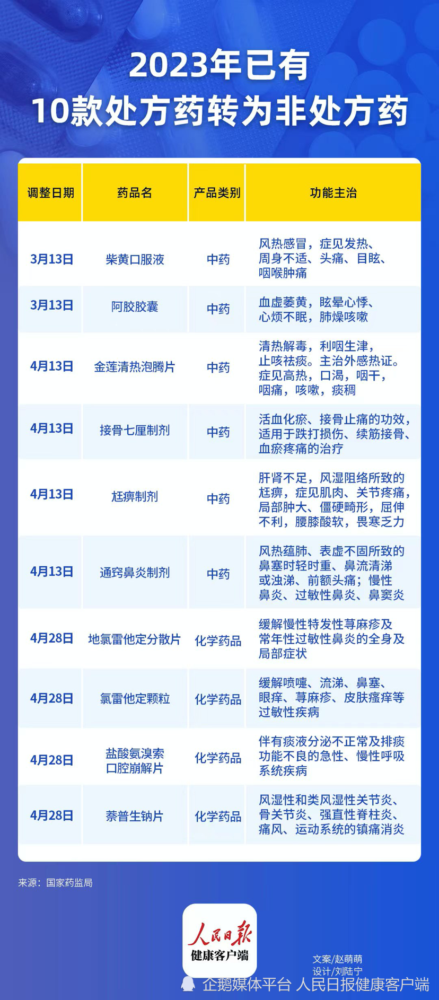

# 今年10款处方药转为非处方药，是否会影响医保报销？专家：无直接关系

**人民日报健康客户端记者 王艾冰**

“处方药转为非处方药和医保报销没有直接关系，是否处方药是由国家药监部门决定的，药监局批准将一款药物转为非处方药，主要是考虑其药物安全性和患者的方便性。”5月2日，中华医学会医院管理专业委员会会员徐毓才告诉人民日报健康客户端记者。

4月28日，国家药监局发布通告，地氯雷他定分散片、氯雷他定颗粒、盐酸氨溴索口腔崩解片、萘普生钠片由处方药转换为非处方药。据人民日报健康客户端统计，今年以来，经国家药品监督管理局组织论证和审定，有10款药物，由处方药转化为非处方（OTC）药，其中6款为中成药。

针对该情况，多位网友发出疑问，“处方、非处方是否等同于报销不报销？”“这一举措是否会影响我们的医保报销？”

据国家医保局2020年7月31日发布的《基本医疗保险用药管理暂行办法》显示，不纳入药品目录的药品包含：主要起滋补作用的药品，含国家珍贵、濒危野生动植物药材的药品，保健药品等，并未明确提到非处方药。而在直接或经专家评议后调出《药品目录》的条件中也并未对处方药和非处方药有相关规定。但是在第三十六条中有明确规定，原则上《药品目录》不再新增非处方（OTC）药品。

“其实将这些规定综合下来看，大家的担心也是有一定的道理，对于原本在医保药品目录内的非处方药品，应该可以报销，而对于原本没有在医保药品目录里的非处方药品，原则上确实不能进入医保目录。”徐毓才表示，需要注意的是，如果一款药物由处方药变为非处方药，患者就可以自由购用，从而会会加大该药物滥用的概率，这一“变化”会影响到该药物是否继续留在医保目录里。

徐毓才说到，“总之，将药物从处方药转换为非处方药与是否可以医保报销并没有直接关系。与高价药品相比，非处方药的药价通常较低，治疗的疾病也都较为基础，对于医保报销的需求型并不高，我们应该从药物的可及性和安全性方面合理的看待这一问题”。

