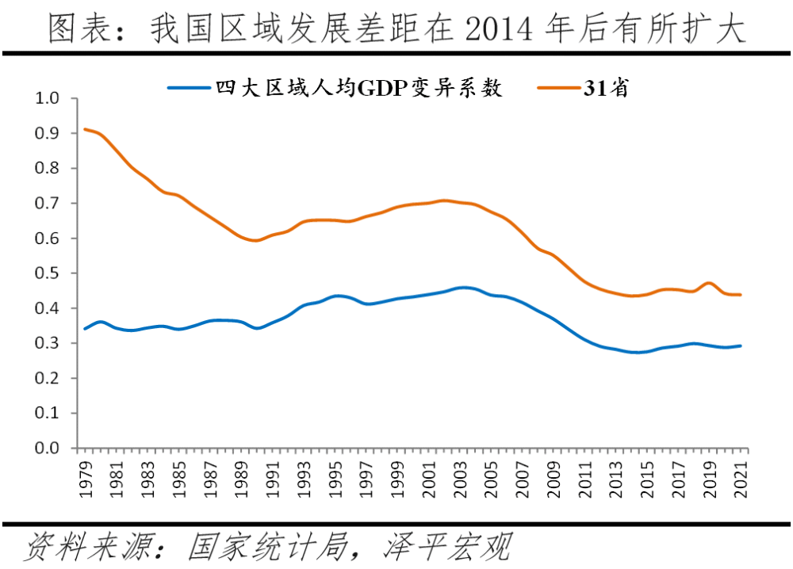
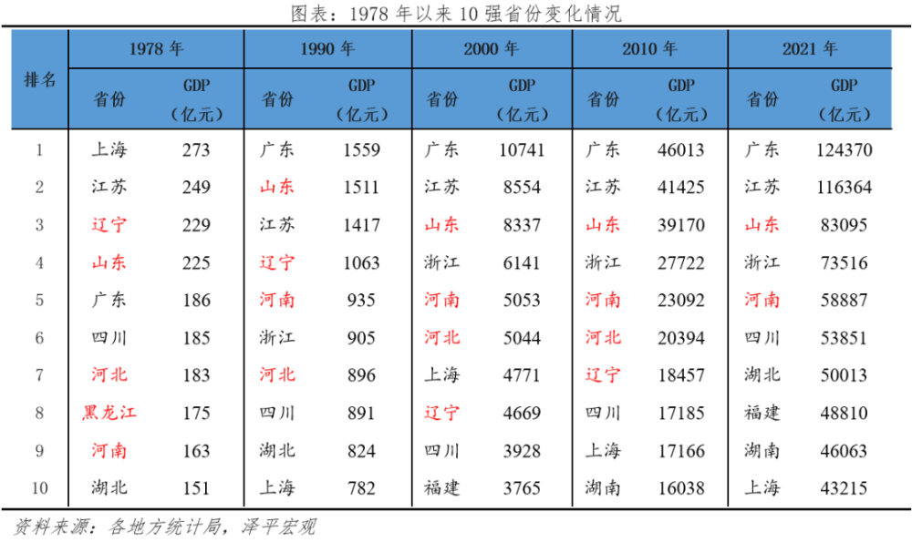
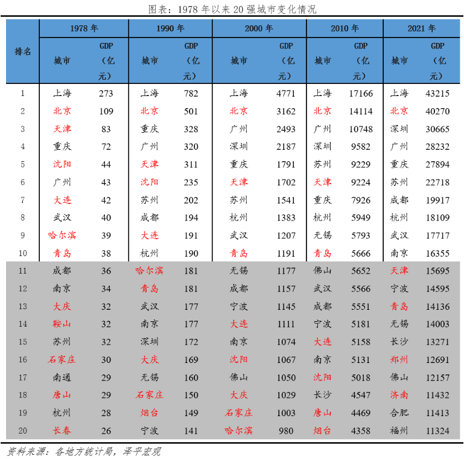
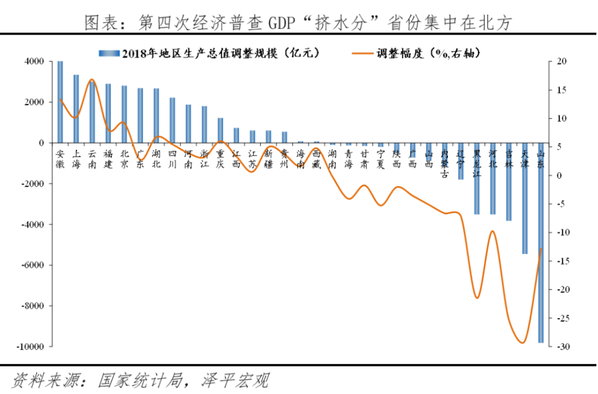
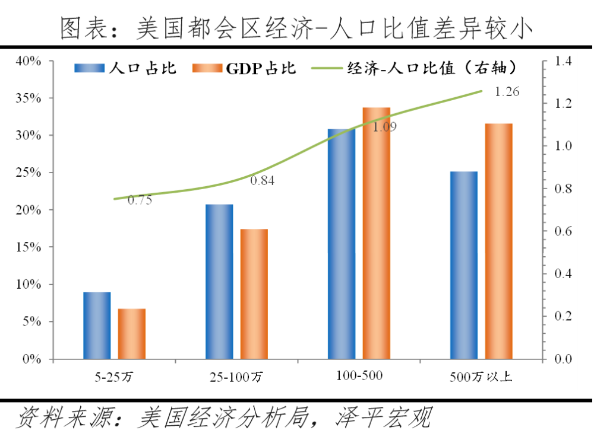

# 任泽平：淄博烧烤出圈，暴露了山东产业短板

最近淄博烧烤火爆出圈，而且热度持续，灵魂烧烤三件套、进淄赶烤等刷遍朋友圈，为近年转型压力倍增的山东赢得难得的加分。作为经济学者，三点思考和建议：

1、淄博烧烤，考的不仅是肉，更是城市营商环境。过去有的城市经常出现在假期期间借机宰客现象，天价龙虾，天价酒水，等等，游客和店家纠纷，地方政府不作为，伤害的不仅是消费者信心，更是城市的形象和营商环境，此前曾经爆出负面新闻的三亚和青岛应该好好反思和整改。淄博，一个没有过硬的自然环境的工业老城靠自己过硬的真诚感动了大众。这次淄博赢得的不仅是名气，更是大众对淄博营商环境的好口碑，烟火气、不宰客、不大幅涨价、不短视、注意治安、诚信经营等，在新媒体时代，这些很容易得到传播并获得正面反馈。希望淄博继续加油，让诚信扎根，让更多人到淄博安心投资兴业。正心正念，坚持做长期正确的事，最终就会开花结果。

2、淄博烧烤，展现的是大山东工业老城迫切谋求发展的进取心，值得点赞。以前山东自居工业基础雄厚，自然环境优越，人口大省，在重化工业往创新驱动高质量发展阶段，落下了脚步，出现了危机感，甚至负面新闻不断，一度被认为将成为下一个东北，跟江浙的差距拉大。在新时代新发展阶段，山东面临重化工业转型滞后、官本位文化、市场化程度不高、民营经济不发达、营商环境亟待提升等一系列问题，但是这些年山东各界对发展的危机感明显提升，对发展的进取心明显提升，淄博是一个典型案例。相信只要坚持市场化方向、深化改革、加大招商引资力度、改善营商环境、提振民营经济信心，山东一定能凤凰涅槃。

3、这次淄博出圈的是烧烤，而不是某项重大技术突破或重大高新技术产业集群形成，暴露了山东产业短板。这些年，长三角、珠三角在新基建、新能源、锂电、半导体、生物医药、互联网经济等领域突飞猛进，实现了产业转型升级，而且产业配套能力明显提升并建立优势，这些年长三角、珠三角长出了一批新能源新基建领域的万亿市值的全球龙头企业，长出了一批批新经济独角兽企业，反观山东，大的企业和产业还是那老三样，在创新驱动高质量发展，缺少新经济、新产业、新技术、新思路。希望山东能够拿出勇气和魄力，推动新一轮改革开放，抓住新一轮产业技术革命的新机遇，实现换道超车。

南北差距根本上是市场化程度的差距

文：任泽平团队

**导读**

**当前我国南北差距明显拉大。2010-2021年北方经济占全国总量从42.8%快速下降至35.2%，南北经济总量差距从14.4个百分点迅速扩大至29.6个百分点，人均GDP差距从0.97扩大为1.25。**

**南北差距原因：从自然地理差异到市场发育差异。**
从五千年历史看，由于北方因农耕、游牧两大文明长期冲突融合导致战乱频发及南北气候差异等，中国人口和经济重心逐渐从黄河中下游向长江中下游转移。计划经济时期，北方因资源富集等形成重化工业优势而领先南方。改革开放后，北方依靠要素和投资驱动继续阶段领先，但也导致市场化改革内生动力不足；而南方依托便利的海运和长江内河航运优势，通过市场化改革大力发展外向型经济而逐渐崛起。
**2012年后，中国经济转向依靠创新驱动的高质量发展阶段，南北市场发育差异问题凸显，南方较快转型升级，而北方逐渐乏力。**

**南北差距拉大，这是市场经济的胜利，证明北方加大市场化改革的必要性和紧迫性。**

**二十大报告指出，市场化层面要构建全国统一大市场，深化要素市场化改革，建设高标准市场体系。区域经济发展层面要促进区域协调发展，深入实施区域协调发展战略、区域重大战略、主体功能区战略、新型城镇化战略，优化重大生产力布局，构建优势互补、高质量发展的区域经济布局和国土空间体系。**

**解决南北差距要针对北方短板加快市场化改革，同时从全国层面基于市场规律统筹推进区域协调发展。**
落实到南北区域协调上：一方面，北方要大力向南方学习，加快深化产权、要素等市场化改革，加快打造亲清新型政商关系以优化营商环境。另一方面，要充分尊重人口和产业向优势区域集聚的客观规律，立足各地区比较优势顺势而为，加快都市圈城市群建设，在集聚中促进平衡。

**相信如果能够推动国际化市场化导向的新一轮改革开放，发力新基建、新能源、激发企业家精神、调动地方积极性等，各界将不断增强对中国经济前景的信心。**

**目录**

**1 我国区域发展新特征：南北差距明显拉大**

**2 南北差距原因：从自然地理差异到市场发育差异**

**3 推进区域协调发展的国际经验**

**4 启示：北方加大市场化改革，全国统筹推进区域协调发展**

**正文**

**1 我国区域发展新特征：南北差距明显拉大**

**改革开放以来，我国区域发展差距总体呈缩小态势，但2014年后区域差距有所扩大。**
由于历史原因，新中国成立初期北方尤其是东北重工业基础良好、经济基础较好，20世纪50年代苏联援助也主要集中在东北。20世纪60年代基于国防安全考虑的“三线建设”促进了中西部地区经济发展，1960-1977年人均GDP最高的东北与最低的西部的差距由3.06降至2.20。1978年改革开放后，东部基于区位优势率先发展，大量人口从内地向东部集聚，1991年东部人均GDP超过东北居四大区域之首，其人均GDP与最低的西部的比值一度扩大至2003年的峰值2.61。2003年后，随着西部开发、东北振兴、中部崛起等区域发展战略的实施，以及2008年金融危机后沿海地区向内地转移产业，各区域人均GDP相对差距逐渐缩小，但2014年后有所扩大。

**从全国看，**
以反映各省人均GDP整体相对差异水平的变异系数看，31省人均GDP变异系数从1978年的0.966快速下降至1990年的谷值0.593，随后在东部率先发展的带动下爬升至2002年的峰值0.708，再回落到2014年的0.435，之后又攀升至2019年的0.472，2021年又小幅回落至0.439。
**分地区看，** 四大地区人均GDP变异系数的发展趋势与全国较为一致，2014年达谷值后有所扩大。

**当前区域差距的扩大主要在于南北差距，2010-2021年南北经济总量差距从14.4个百分点迅速扩大至29.6个百分点，但人口份额变化很小，导致该时期南北人均GDP差距由0.97迅速增至1.25。从经济看，**
1978-2012年南北经济份额（以地区GDP合计为分母）分别从53.7%、46.3%变化至57.1%、42.9%，差距从7.5个百分点扩大至14.2个百分点；其中1995年南北经济份额差距一度达17.2个百分点。2013年起，南北经济总量差距迅速拉大，2021年经济份额分别为64.8%、35.2%，差距扩大至29.6个百分点。

**从人口看，**
改革开放以来，我国人口流动的主要方向是从中西部到东部的珠三角、长三角和京津地区，1978-2021年东部人口份额从34.0%增至40.1%；南北人口份额变化较小，1978-2021年南北人口份额分别从57.8%、42.2%变化至59.6%、40.4%，变化仅1.8个百分点。

**从人均GDP看，**
我国北方人均GDP长期高于南方但逐渐缩小，1978-2010年南北人均GDP差距由0.85缩小至0.97。之后，南北人均差距迅速扩大至2021年的1.25。但在扣除东北地区之后，南北人均GDP差距长期在1值左右波动，自2015年起南方人均GDP超越北方，并在之后迅速拉大差距，由2015年的1.02扩大至2021年的1.20，这表明
**东北的相对衰落对2015年前的南北人均差距具有较强的解释力，但在2015年后有其他因素影响了南北人均差距的持续且迅速的扩大。**

**从10强省看，1978-2021年北方从5个降至仅剩山东、河南2个。**
1978-2021年，我国10强省经济份额从54.9%提升至61.0%。在改革开放初期，北方在我国10强省中占据5席，其中东北占两席（辽宁、黑龙江）。之后，东南沿海省份迅速崛起，1984年浙江取代黑龙江进入前10。此后，北方的山东、辽宁、河南、河北长期位居前10。由于2010年后经济转型缓慢，辽宁、河北先后在2016、2018年跌出全国前10。目前北方在全国经济10强中仅剩山东、河南两省。其中，山东从1980年起一直位列前3，2007年开始持续位居第三，但与第二名江苏的差距从2007年的242亿元持续扩大2021年的3.3万亿元。
**2018年，山东生产总值迎来改革开放后首次负增长，与2017年相比下降了8.2%，这是因为当年山东设立新旧动能转换综合试验区，正在经历经济转型的阵痛；2021年，成功转型为山东经济增长注入了新动能，地区生产总值达8.3万亿元，增长13.6%，山东稳固了经济大省的地位。**

**从20强城市看，1978-2021年北方从11个降至5个，其中10强城市从6个降至仅剩北京1个。**
1978-2021年，我国20强城市经济份额从29.7%上升至34.6%。改革开放初期，北方在20强城市中占11个，其中东北6个。随着改革开放后深圳、无锡、宁波等东南沿海城市陆续崛起，1990年20强城市中北方减至9个，东北的长春、鞍山陆续掉队。2010年
20强城市中北方降至8个，且有3城位居倒数，哈尔滨从1978年的第8名降至第20名。
**2001年加入世界贸易组织后，以出口为导向的东南沿海地区进一步融入全球经济体系，佛山、东莞等制造业城市崛起，哈尔滨、石家庄、大庆逐渐掉出20强。**
2010年，北方在
20强城市中降至7个。2014年后，北方的唐山、大连、沈阳、烟台先后掉队。2017-2018年，北方在20强城市仅剩北京、天津、青岛、郑州4个，10强中仅剩北京、天津2个；2019年济南在合并莱芜后进入20强。2020年，南京取代天津进入10强，北方在10强城市中仅剩北京。不过，北方城市中济南表现亮眼，GDP一直保持较高位增长率，继2019年挺进20强后，2020年晋级“万亿俱乐部”，2021年升至第18名。

**2 南北差距原因：从自然地理差异到市场发育差异**

**从五千年历史看，因农耕技术进步、北方战乱频发、南北气候差异等，中国人口重心逐渐从北方黄河中下游向南方长江中下游转移，南方逐渐从山地密林的蛮荒瘴气之地开发成宜居宜业之地，在南宋时期彻底取代北方成为经济重心。**
不可否认，长江与黄河都是华夏文化的摇篮，但位于黄河中下游的中原地区无疑是早期中心，夏商周等王朝核心范围均位于此，原因可能在于南北气候差异，北方干燥缺水、温差大，南方湿润、温差小，这使得在农耕时代初期，相对干旱、疏松的黄土沉积平原，比南方的黏土湿地更容易开发耕作。在秦汉时期，关中平原是全国经济重心，北方经济、人口长期领先，而南方不少地区仍是蛮荒瘴气之地。

但北方长期处于王朝更替的中心和农耕文明与游牧文明的冲突融合，战乱频发，从东汉末年开始北方人口大量移居南方，南方地区逐渐开发并快速发展，特别是在两晋南北朝时期。江南经济的快速发展，使得隋炀帝开凿北起涿郡、南到杭州的大运河，主要目的在于把江南丰富的物产往北运调。唐朝安史之乱后，南方人口和经济开始超过北方。到南宋时期，岭南快速开发，南方绝对取代北方成为中国经济和人口重心，西北陆上丝绸之路让位于东南海上丝绸之路，南方领先格局基本延续至今。尽管清朝中期开始闭关锁国，但仍保留了广州一地作为通商口岸。

**计划经济时期，资源富集等奠定北方重化工业优势，因而领先于南方。**
在计划经济时期，中国经济发展基本依靠内循环，北方依托丰富的煤炭、石油、铁矿资源和苏联援助等逐渐形成了以资源型和重化工业型为主的产业结构，以货运为主的铁路建设更使得北方区位优势凸显，经济发展水平明显超过北方。东北地区作为我国重工业基地，发展水平更是居前，辽宁GDP长期位居全国前三、一度位居第一。而南方资源相对匮乏，经济发展较为落后；东南沿海更处海防前线，重工业、大项目的布局较少。改革开放前，北方GDP占比长期在46%-49%之间，1960年更是一度高达49.9%，而南方人均GDP仅相当于北方的80%-90%。

**改革开放后，南方依托便利的海运和长江内河航运优势、通过市场化改革大力发展外向型经济而逐渐崛起，而北方在重化工业需求拉动下通过要素和投资驱动仍保持了较长时期辉煌、但也造成市场化改革内生动力不足。**
1978年后，我国逐渐从计划经济体制向社会主义市场经济体制转型，但南北市场化改革进展差异明显。 **从自然地理角度，**
改革开放要求融入全球化体系，东南沿海较北方沿海具有更为便利的海运优势，并通过长江、珠江较易形成广阔市场和腹地。而黄河水量少河道浅，通航能力差，使得北方省份经济联系明显不如南方，在发展外向型经济时面临劣势。

**从制度演化角度，**
改革开放初期南方珠三角地区利用毗邻港澳优势等，大力发展加工制造业，广东经济总量在1980年代末开始跃居第一；该时期江苏、浙江也快速发展。1990年以上海浦东开发开放为标志，长三角和长江流域明显带动。在北方，尽管东北地区因强大的计划经济惯性、沉重的计划经济包袱和资源逐渐枯竭等在1990年代开始衰落、大量国企倒闭，但大规模铁公基建设对钢铁、水泥、石化、煤炭等重化工业需求巨大，使得北方经济仍保持了较长时间辉煌，特别是山东、天津、河北、山西等地区；山东经济总量在2004、2006年两次超过江苏位居全国第二，山西煤老板风光全国。

**南北市场发育差异在2008年末“四万亿”投资后凸显，南方较快转型升级发展高新产业，而北方逐渐乏力。**
2008年全球金融危机后，两年“四万亿”投资使得北方经济再延续了短暂辉煌。但之后，全球经济长期低迷，国际大宗商品和能源价格一度进入漫长熊市；中国经济发展进入新常态，依靠要素和投资驱动的老路难以为继，波切需要转向创新驱动。2015年末，中央提出大力推进供给侧结构性改革；2020年，中央要求，加快形成以国内大循环为主体、国际国内双循环相互促进的新发展格局；2022年，强调加快建设高效规范、公平竞争、充分开放的全国统一大市场，促进商品要素资源在更大范围畅通流动。
**在南方，**
东南地区因日益发育的市场机制快速出清过剩产能，大力腾笼换鸟推动经济转型升级，南方内陆省份依托长江等承接沿海产业，近年贵州、云南、西藏、江西等省份经济增速持续领跑全国。在北方，因市场机制改革滞后，营商环境相对较差，新经济新动能培育缓慢，产业转型升级艰难。

**从经济普查等情况看，南北差距拉大的情况可能发生更早，但被北方较多的数据注水掩盖。**
2014年，中央巡视组发现东北地区经济数据注水严重；在“挤水分”之后，2016年辽宁名义GDP较2015年缩水22.4%。2018年第四次全国经济普查后，全国GDP比初步核算数增加2.1%；其中，南方16省有14省上调、2省下调，北方15省有12省下调、3省上调。下调超过10%的有天津、吉林、黑龙江、山东，均为北方省份，分别为-29.0%、-25.3%、-21.5%、-12.8%。山东调整幅度超过甘肃省2019年GDP（8718亿元），天津调整幅度超过海南GDP（5309亿元）。部分地区GDP的大幅调整，虽然有统计标准规范和调整的因素，但更与挤掉多年累积的GDP“水分”有关。（注：第五次全国经济普查将在2023年进行。）

**3 推进区域协调发展的国际经验**

**总体上看，发达国家区域人均差距长期较小，关键在于各类要素在市场机制下充分流动，进而在集聚中走向平衡。**
比如，人口迁移的基本逻辑是人往高处走，人随产业走。理论上，较高的人均收入将不断吸引区外人口净流入，直至该地区人均收入与其他地区持平，即各地区经济份额与人口份额的比值趋近1，形成区域发展的相对平衡。
**从美国、日本和德国的经验来看，政府主要通过四类措施促进协调区域发展：（1）设立专门机构，强化政府调控区域经济发展的能力；（2）加强立法，以制度来保障落后地区的开发；（3）加强落后地区的基础设施建设；（4）利用财政税收金融政策，构建纵向和横向转移支付制度。**

**在美国，区域人均差距长期较小，地区人口份额与经济份额变化比较一致。从总体看，**
1963-2019年美国不含阿拉斯加的49个州人均GDP变异系数0.193波动变至0.185，基本保持在0.15-0.20之间，因受内外部多重因素影响，2020-2021年人均GDP变异系数超0.38，但仍低于中国当前的0.439。
**分州看，** 2021年美国50个州中有45个州的经济-人口比值在0.7-1.3之间，人口合计占比约90.3%；其中有21个州的经济-
人口比值在0.9-1.0之间。而中国2021年31省中只有19省经济-
人口比值在0.7-1.3之间，人口合计占比仅64.7%；其中北京、上海在2.2以上，甘肃、黑龙江在0.6以下。

**从都会区看，**
1910-2015年美国都会区人口比重从28.4%增至85.6%，其中人口向大都会区化集聚态势明显。2015年5-25万、25-100万、100-500万、500万人以上都会区经济-
人口比值分别为0.75、0.84、1.09、1.26，差异较小。

**从重点地区看，**
得益于美国国会在19世纪60-90年代对南部、西部落后地区做出的系列协调区域发展措施，如颁布《地区再开发法》、《人力发展与训练法案》、《公共工程与经济发展法》，成立专门的区域发展管理机构，给予在落后地区投资的企业以税收优惠，大力投资落后地区的基础设施与教育事业等，以加利福尼亚、佛罗里达、德克萨斯三州为代表的“阳光地带”得以发展，并逐渐吸引产业的聚集和人口的流入，尤其在1972-1981年，三州经济快速发展，地区生产总值增长率超10%。此外，1970-2021年加州、佛州和德州三地的经济份额由19.3%升至28.8%，人口份额由18.7%升至27.3%，经济-
人口比值从1.03略升至1.06。

**在日本，人口随产业持续向东京圈、大阪圈、名古屋圈“三极”集聚1973年左右后转为向东京圈“一极”集聚，三大都市圈人口-经济比值逐渐趋近于1.0。**
日本三大都市圈土地面积合计3.8万平方公里，占日本的10.2%，当前经济份额、人口份额分别为56%、52%。在1970年代日本经济增速换挡以前，因三大都市圈收入水平较高且经济持续集聚，人口大规模流入。1955年东京圈、大阪圈、名古屋圈GDP占全国份额分别为23.8%、15.3%、8.6%，人口占比分别为17.3%、12.3%、7.7%，经济-
人口比值为1.38、1.24、1.12。到1973年，三大都市圈GDP占比分别增至29.1%、16.9%、9.4%，人口分别达2607、1636、918万人，占比分别达23.9%、15%、8.4%，经济-
人口比值分别为1.22、1.13、1.12。

**1973年之后，名古屋圈大阪圈人口迁入基本停滞、主要依靠自然增长。**
1983年4月，日本颁布《技术聚集城市法》，明确规定必须在三大经济圈外建设技术聚集城市，欠发达地区的技术开发活动增多，产生了创新扩散效应，促进了区域经济的协调发展。此外，日本还投入大规模的财政力量支持欠发达地区的高速公路、信息系统等基础设施的建设，以此作为区域协调发展的突破口。2014年东京圈、大阪圈、名古屋圈经济份额分别为32.3%、13.9%、9.9%，人口分别为3592、1836、1132万人，占比分别为28.3%、14.4%、8.9%，经济-
人口比值分别为1.14、0.96、1.11，形成了相对平衡的区域发展格局。

**在德国，区域协调发展政策上升到基本法高度，16区域人均差距较小，2000-2015年16个州人均GDP变异系数从0.32缩小至0.27。**
德国联邦政府将区域协调发展上升到基本法高度，规定保证人们“生活价值和生活条件的同一性”，其中，财政平衡政策是联邦政府促进区域协调的主要手段。早在19世纪70年代，《联邦财政平衡法》规定通过纵向与横向的转移支付制度实现各州各地区财力的均等，2006年，德国根据欧盟的《地区补贴指南》制定了五年“扶持区域图”，为落后地区的新工商业项目、经济基础设施建设，以及制订地区发展方案、产业集群管理机构等非投资类项目提供补贴与资助，以确保资金最大程度地支持落后地区的发展。根据德国统计局数据，2000-2015年，德国16个州人均GDP变异系数从0.32波动至0.27，区域间较平衡发展。

**4 启示：北方加大市场化改革，全国统筹推进区域协调发展**

**我们认为，解决南北差距要针对北方短板加快市场化改革，同时从全国层面基于市场规律统筹推进区域协调发展。相信如果能够推动国际化市场化导向的新一轮改革开放，发力新基建、新能源、激发企业家精神、调动地方积极性等，各界将不断增强对中国经济前景的信心。**

**一方面，北方要大力向南方学习，加快深化产权、要素等市场化改革，大力转变政府职能并加快打造“亲”“清”新型政商关系以优化营商环境。**
北方地区应大力向东南沿海地区学习，进一步解放思想、破除体制机制障碍，加快深化产权改革、要素改革、国企改革等市场化改革。理顺政府和市场关系，大幅减少政府对资源的直接配置，强化事中事后监管，给市场发育创造条件。进一步推动简政放权、放管结合、优化服务，建立健全权力清单、责任清单制度。打造“亲”“清”新型政商关系，培育有利于民营经济发展、有利于新经济发展的市场环境，消解民企发展面临的歧视性限制和隐性障碍。

**另一方面，要充分尊重人口和产业向优势区域集聚的客观规律，立足各地区比较优势顺势而为，打破地区行政分割、破除要素流动障碍、完善财政转移支付机制和生态补偿机制等，加快都市圈城市群建设，在集聚中促进平衡。**
推进区域协调发展的目标促进人民生活水平大体相当，绝不能是追求各地区经济总量均衡，也不可能要求各地区在经济发展上达到同一水平。二十大报告提到“深入实施区域协调发展战略、区域重大战略、主体功能区战略、新型城镇化战略，优化重大生产力布局，构建优势互补、高质量发展的区域经济布局和国土空间体系”，从而促进区域协调发展，加快构建新发展格局。城市群和都市圈有着多个中心或圈层，集聚着创新集群、产业集群、商务集群和商业集群等，并辐射周边城市或地区，形成新的分工体系和产业体系，促进更大范围的经济社会发展。

**一是进一步打破地区行政分割，全面破除要素流动障碍，加快形成全国统一开放、竞争有序的商品和要素市场。**
经过40多年改革开放，中国商品市场发育较为充分，商品和服务价格97%以上由市场定价，但仍存在地区分割问题；土地、劳动力、资本、技术、数据等要素市场发育相对滞后，市场决定要素配置范围有限、要素流动存在体制机制障碍、新型要素市场规则建设滞后等，影响了市场对资源配置决定性作用的发挥。要树立全国经济“一盘棋”的思想，消除歧视性、隐蔽性的区域市场壁垒，打破行政性垄断，坚决破除地方保护主义；加快促进土地、劳动力、资本、技术、数据自由流动，提高要素配置效率。养老保险全国统筹对维护全国统一大市场、促进企业间公平竞争和劳动力自由流动具有重要意义，要加快养老保险全国统筹进度、提高统筹水平，在全国范围内实现制度统一和区域间互助共济。

**二是深化土地制度改革，建立健全宅基地自愿有偿退出机制，以常住人口增量为主要标准供给城镇用地，推进市场化的跨省换地。**
土地是各项要素中市场化改革最为滞后的领域，潜力极大。 **从城乡角度看，**
应加快建立健全宅基地自愿有偿退出机制，进而加快推进农业转移人口市民化，并推行新增常住人口与土地供应挂钩，对人口增长的地区加大建设用地供应，对人口减少的地区要减少土地供应。

**从地区角度看，**
应通过市场机制优化城镇用地指标在地区和城市之间的空间配置。中国补充耕地潜力主要在西部、东北地区，而需求主要在东部；人口、资本、技术等各种要素基本可以跨省流动，但耕地占补平衡、城乡建设用地增减挂钩等土地要素配置目前仍主要局限在省域乃至市域内部。2018年3月，国务院发布《跨省域补充耕地国家统筹管理办法》和《城乡建设用地增减挂钩节余指标跨省域调剂管理办法》，开始允许在中央统筹下的小规模跨省换地；但规定由中央统一下达调剂任务，统一确定调剂价格标准，统一资金收取和支出，本质仍是计划配置。2022年1月，国务院发布《要素市场化配置综合改革试点总体方案》，进一步探索土地管理制度改革，允许符合条件的地区探索城乡建设用地增减挂钩节余指标跨省域调剂使用机制；同时完善市场机制，鼓励以市场化方式盘活存量用地，推进合理有序用海，提高了土地要素的配置效率，“人地挂钩”看到曙光。

**三是充分尊重人口和产业向优势区域集聚和城市发展的客观规律，立足各地比较优势顺势而为。**
推进区域协调发展的目标是促进人民生活水平大体相当，决不能是追求各地区经济总量均衡，也不可能要求各地区在经济发展上达到同一水平。习近平总书记2019年12月在《求是》发表文章《推动形成优势互补高质量发展的区域经济布局》指出，要尊重人口和产业向优势地区集聚的客观规律，增强中心城市和城市群等经济发展优势区域的经济和人口承载能力，增强其他地区在保障粮食安全、生态安全、边疆安全等方面的功能，形成优势互补、高质量发展的区域经济布局。近年中国城镇发展战略逐渐调整为“以中心城市为引领，以城市群为主体形态，以都市圈建设为突破口，对中小城市分类施策”，但任重道远，共识还未形成。

**四是完善财政转移支付机制确保基本公共服务全覆盖，完善生态补偿机制确保受益者付费、保护者得到合理补偿。在转移支付方面，**
根据地区间财力差异状况，通过转移支付将常住人口人均基本公共服务支出差异控制在合理区间，特别是要对森林草原湿地等重点生态功能区、农产品主产区、困难地区提供足够转移支付。
**在生态补偿方面，** 要按照区际公平、权责对等原则，鼓励区际开展资金、产业、人才等多种补偿，加快建立健全市场化、多元化生态补偿机制。

