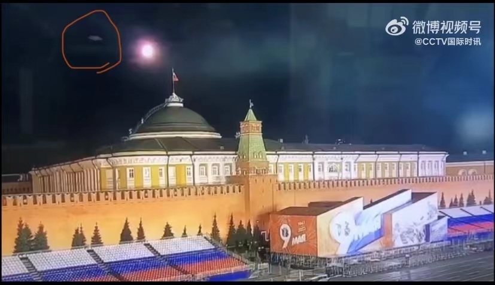
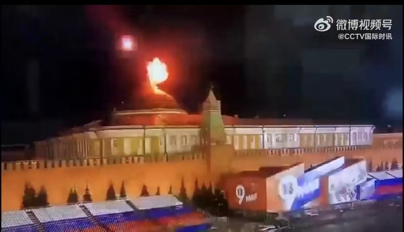
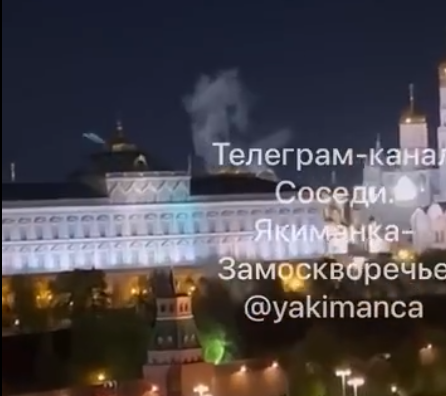
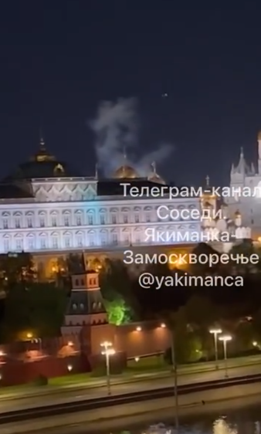
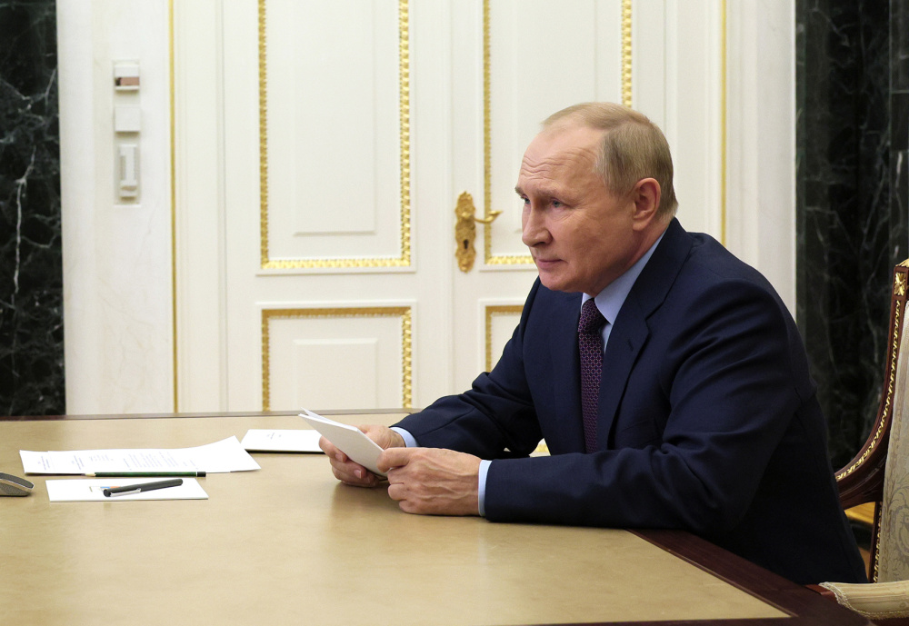
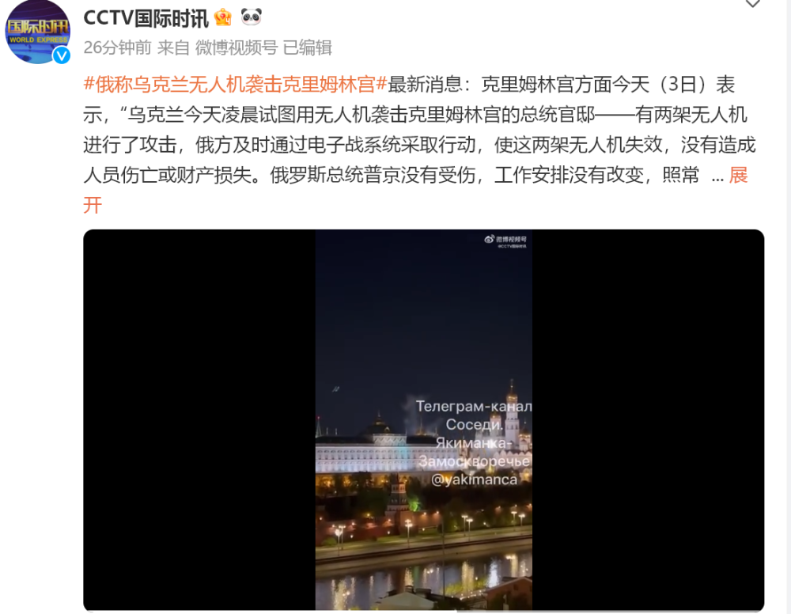

# 俄方：基辅无人机袭击克宫是对普京的恐怖袭击和暗杀，保留报复的权利

每经编辑：李泽东

据央视新闻报道，当地时间5月3日， **克里姆林宫表示，有两架无人机对克宫进行了攻击**
。俄方及时通过电子战系统采取行动，使试图袭击克宫的无人机失效，没有造成人员伤亡或财产损失。

克里姆林宫方面表示， **俄罗斯总统普京在袭击中没有受伤** ，工作安排照常进行。

另据环球网援引俄新社5月3日最新报道，克里姆林宫发布消息称，
**基辅试图出动两架无人机袭击克宫，俄罗斯相关部门及时采取行动后，这两架无人机出现异常，未能达到袭击目的。**

**俄罗斯卫星通讯社称，克宫表示，空袭未对普京造成伤害，无人机在克里姆林宫所在地坠落，四溅的弹片没有造成人员受伤和财产损失。俄罗斯保留自己在认为需要的地方和时间对基辅政权试图攻击克里姆林宫采取回应措施的权利。**

_现场出现火光 图片来源：CCTV国际时讯微博视频截图_

_现场白烟升起
图片来源：CCTV国际时讯微博视频截图_

另据CCTV国际时讯报道，对于此次事件， **俄罗斯总统新闻秘书佩斯科夫表示，“乌克兰无人机袭击时普京总统本人不在克里姆林宫”。**

**克里姆林宫方面称，“俄方认为乌克兰的行动是对俄罗斯总统的恐怖行为和暗杀企图。俄方保留在其认为合适的地点和时间进行报复的权利”。**

目前乌克兰方面表示“没有参与”对克宫的袭击。

另据央视新闻报道，俄罗斯总统新闻秘书佩斯科夫3日表示，5月9日莫斯科红场胜利日阅兵将照常进行，没有变化，不受无人机袭击事件影响。

此外，莫斯科市长索比亚宁当天表示，没有当地政府特别批准， **禁止在莫斯科使用无人机**
。索比亚宁称这一决定是为了防止未经授权使用无人机，避免妨碍执法机构的工作。

每日经济新闻综合央视新闻、环球网、CCTV国际时讯微博

