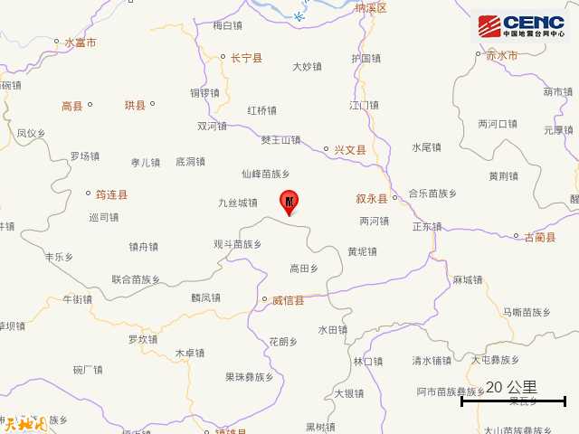
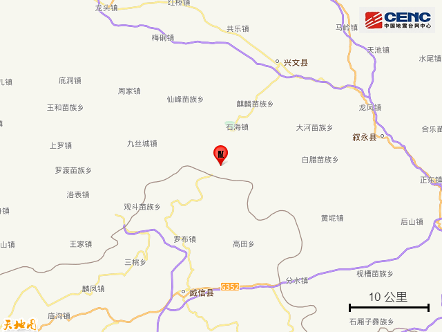
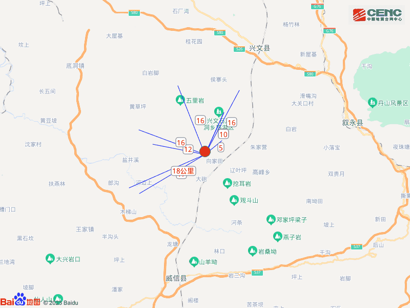
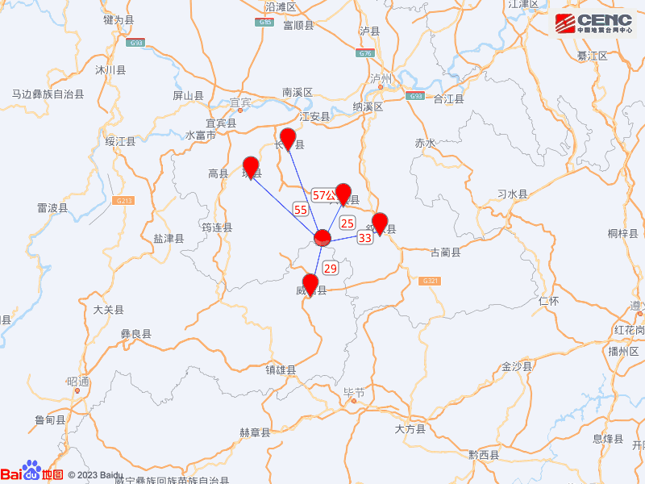
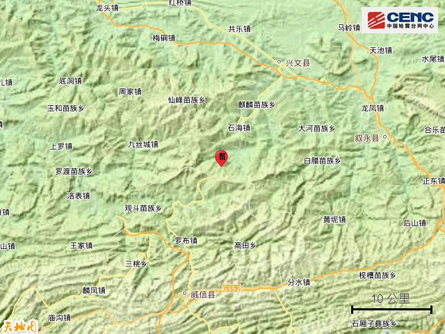
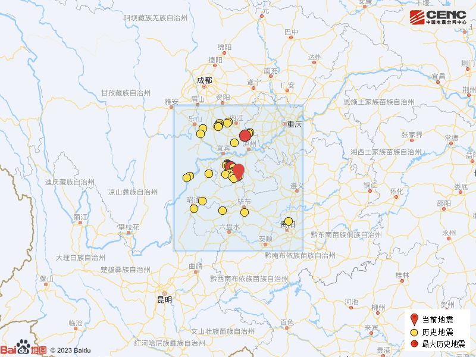

# 四川宜宾市兴文县发生4.5级地震，一小时前刚发生4.0级地震

据中国地震台网正式测定，5月3日13时4分在四川宜宾市兴文县发生4.5级地震，震源深度8公里，震中位于北纬28.10度，东经105.12度。

本次地震周边5公里内的村庄有王家沟、白果村、猴子山、小塘、龙塘村、两岔路、六合村、沙坝村、刘家山、石坝子，20公里内的乡镇有大坝苗族乡、石海镇、石林镇、文印乡、九丝城镇、麒麟苗族乡、仙峰苗族乡、观斗苗族乡、中兴乡。

震中距兴文县25公里、距云南威信县29公里、距叙永县33公里、距珙县55公里、距长宁县57公里，距宜宾市86公里，距成都市294公里，距重庆市215公里。

震中5公里范围内平均海拔约896米。

根据中国地震台网速报目录，震中周边200公里内近5年来发生3级以上地震共285次，最大地震分别是2021年9月16日在四川泸州市泸县发生的6.0级地震（距离本次震中124公里）和2019年6月17日在四川宜宾市长宁县发生的6.0级地震（距离本次震中34公里），按震级大小前50次历史地震分布如图。

【早前消息】中国地震台网正式测定：05月03日12时08分在四川宜宾市兴文县（北纬28.12度，东经105.15度）发生4.0级地震，震源深度10千米。

