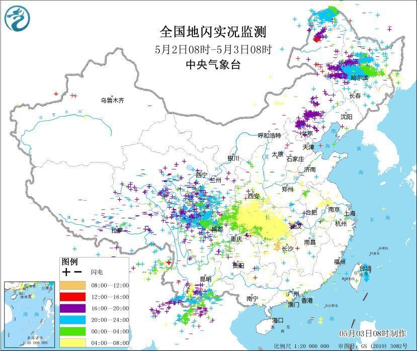
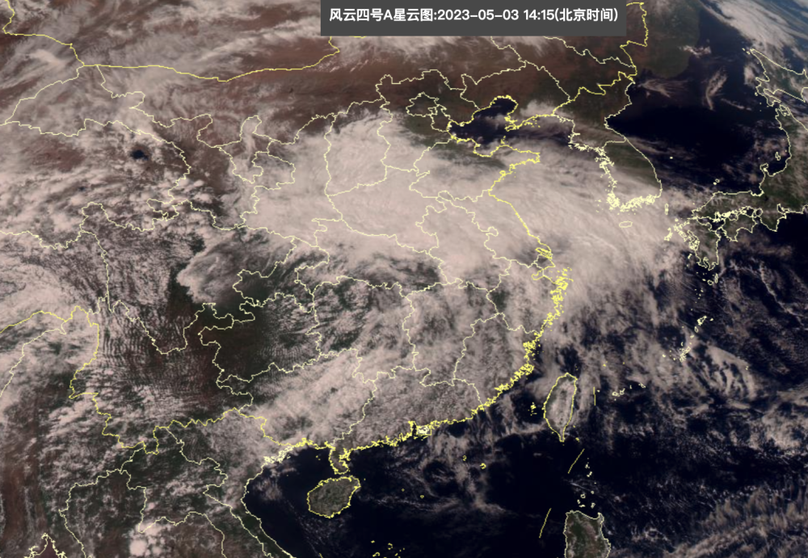
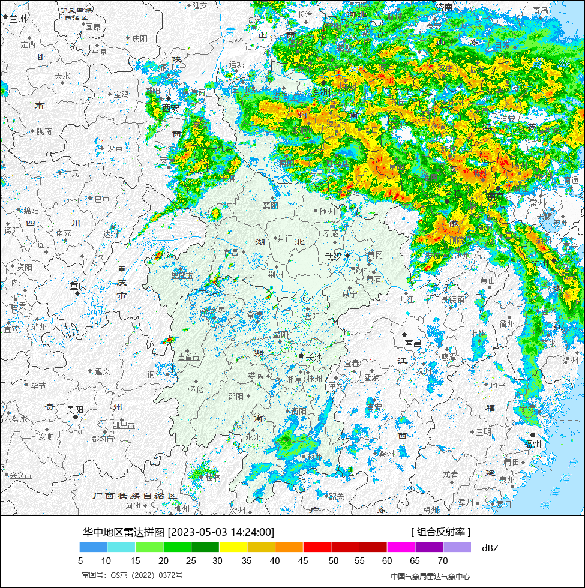
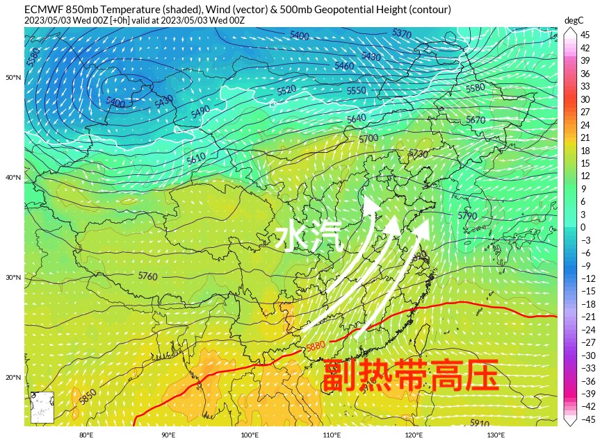
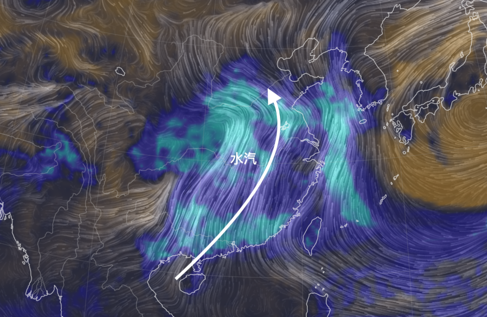
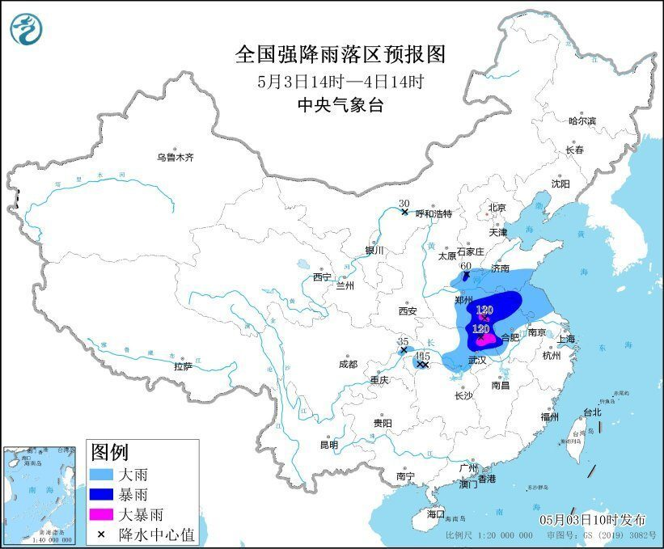
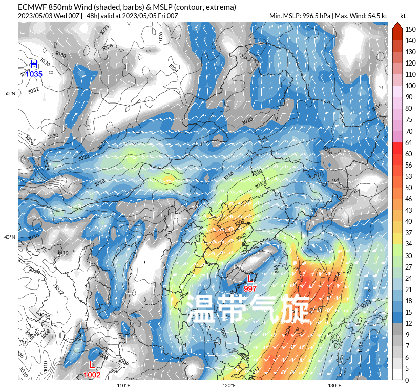
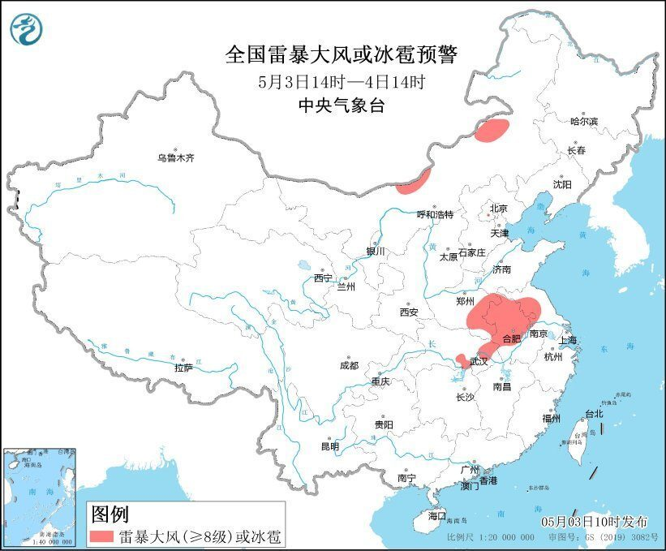
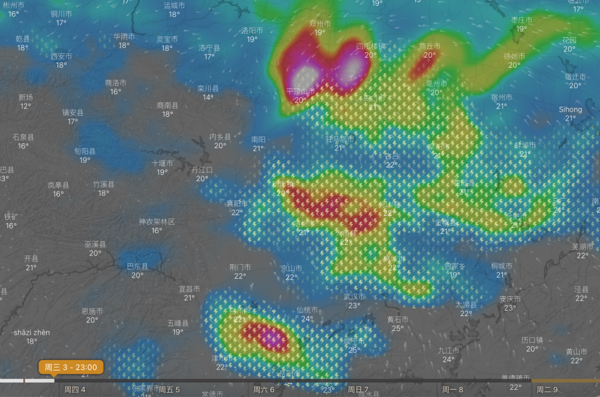

# 国家级预警双发，大范围狂风暴雨来袭，五省需警惕危险天气

从5月2日夜里开始，大片强盛的对流云团从巫山出发，一路向东北方向挺进，所到之处电闪雷鸣风雨大作。中央气象台地闪监测实况显示，到5月3日上午8点上四川重庆湖北多地已经被密密麻麻的闪电符号覆盖，显示出在强盛的暖湿气流和西南涡作用下，大量强对流天气已经从西南地区出发，掀起中东部新一轮大范围的强降雨天气。

一、国家级预警双发

5月3日下午，从风云四号高清可见光卫星云图上可见，今天在我国长城以南，已有大片浓厚的降水云系出现，覆盖在陕西山西河南湖北安徽江苏等地，在这当中，部分地区的云团还显得粗糙有立体感，这是部分地区的对流活动还比较激烈。

据中央气象台消息，从5月3日开始，我国中东部地区将出现大范围的强降水和大风天气，部分地区有暴雨，大暴雨，局地可能伴有雷暴、冰雹等强对流天气。因此，中央气象台今天已经发布了暴雨蓝色预警和强对流蓝色预警，提醒广大公众注意防范。5月3日下午，从雷达图上可见，对应着大范围的浓厚云层，大范围的的降水回波已经在中东部多地出现，显示出河南山东安徽等地下午已经开始遭遇降雨影响。

二、大范围狂风暴雨来袭

这次大范围降雨的一个重要因素，是目前我国中东部地区强盛的暖湿气流。在五一长假的最后一天，副热带高压和水汽的强势超出预期。强势的南风不仅在长江中下游平原、华北平原畅通无阻，还爬上了云贵高原和青藏高原，甚至已经大举吹入东北平原。

暖湿气流是由南海和西太平洋输送而来的，它具有很强的上升运动和湿润性质，能够促进对流发展和降水形成。但此次大范围降雨过程中，因为冷空气参与的比较少，暖湿气流强盛的时候冷空气主力还在我国新疆磨蹭，因此此次大范围降雨带来的降温并不是特别显著，部分地区雨中温度还比较高，会隐约有种初夏“热黄梅”的感觉。

根据中央气象台的预报，5月3日14时至4日14时，湖北中东部、河南中东部、山东南部、安徽中北部和西南部、江苏中北部、重庆北部等地部分地区有大到暴雨，其中，河南东南部、安徽西部、湖北东部等地局地有大暴雨（100～120毫米）。上述部分地区伴有短时强降水（最大小时降雨量20～40毫米，局地可超过50毫米），局地有雷暴大风等强对流天气。

除了强降水外，本次天气过程中还将伴有大范围的大风天气，这是因为有温带气旋的生成——此前从四川盆地东移的西南涡，将逐步在我国东部地区发展成为温带气旋系统。中央气象台的预报中指出，期间，受地面气旋影响，黄淮、江淮、江汉、华北东部等地将有大风天气，阵风可达7级左右。

三、五省警惕危险天气

本次天气过程中，除了狂风暴雨，强对流天气也会给人们带来不少麻烦和危险。中央气象台5月3日10时发布的强对流天气蓝色预警中指出，预计5月3日14时至4日14时，内蒙古中北部、河南东南部、安徽中北部、江苏中北部、湖北东部等地的部分地区将有8-10级雷暴大风或冰雹天气；山东南部、河南东南部、安徽中北部、江苏西部、湖北东部和西南部、四川东北部、重庆东北部等地的部分地区将有短时强降水天气，小时雨量20-40毫米，局地可达40毫米以上。预计，强对流的主要影响时段为午后至夜间。

像是超级计算机的模拟中指出，到5月3日深夜，河南、湖北、安徽等地将出现激烈的强对流天气，部分地区闪电活动非常密集的同时，还会伴有非常强的短时强降雨。总的来说，这场雨有一些危险性，但对干燥的北方来说，如果防御得当，这场雨对补充水分、缓解干燥、预防干旱非常有利。

