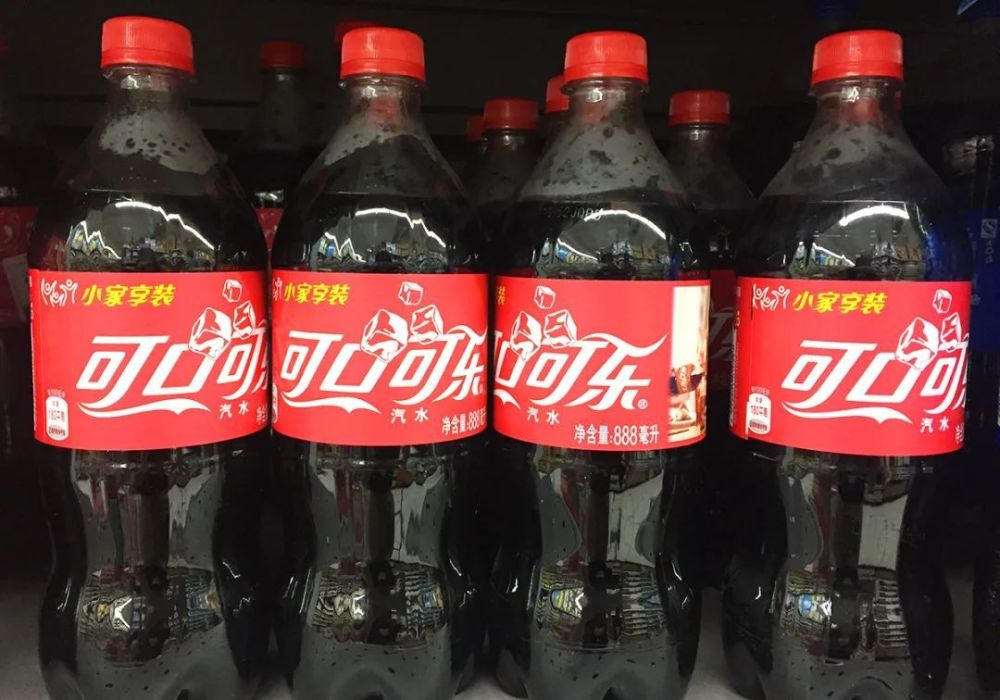

# 外媒：苏丹冲突波及关键材料供应，可乐雪碧3至6个月或面临断市风险

据参考消息网援引路透社报道，苏丹武装冲突，不仅酿成人道危机，也让全球的碳酸饮料制造商焦虑。因为苏丹盛产的阿拉伯胶是碳酸饮料的关键材料。
**如果阿拉伯胶出口中断，你我常喝的一众碳酸饮料，包括可乐、雪碧、芬达等在3到6个月内可能就会面临断市风险。**

_每日经济新闻资料图_

据阿拉伯胶美国公司表示，因为战乱关系，他们没法前往购买阿拉伯胶，进口出现困难。

报道称，由于担心苏丹紧张局势，像可口可乐公司和百事公司这些依赖阿拉伯胶的企业，长期都有储备阿拉伯胶。但是，全球碳酸饮料的消耗庞大。据路透社报道，若苏丹的战火持续令阿拉伯胶出口中断，全球的库存很可能在3到6个月内消耗殆尽，届时将冲击全球的碳酸饮料生产线。

可口可乐与百事暂时未对原材料进口问题发表评论。但路透社引述业内人士表示， **对这些碳酸饮料公司来说，没有阿拉伯胶他们就没办法生存。**
位于苏丹首都喀土穆的萨凡纳生活公司表示，他们手上有60至70吨的阿拉伯胶采购订单，但由于内战关系，他们正担忧能否如期出货。

据科普中国，阿拉伯胶产自非洲萨赫勒地区，一种名为金合欢树的植物。成龄植株每株可产胶0.9公斤，苏丹生产的这种胶占世界总产量80%以上，年出口量约4万吨。

阿拉伯树胶被用作乳化剂、增稠剂、悬浮剂、胶黏剂成膜剂、上光剂和稳定剂。比如吃的巧克力，在剥开的时候有种暗暗的亮色，这就是阿拉伯树胶的作用，它让巧克力在入口即化的同时却不黏手；
**在碳酸饮料里，如果没有阿拉伯树胶的作用，香精和色素就有可能会跟溶液分离，**
形成凝在瓶颈部位的类似于茶锈的色素圈。在口香糖或是木糖醇这类消遣食品中，阿拉伯树胶是良好的包衣剂和水溶糖类。

据界面新闻，行业人士称，由于担心苏丹持续的不安全局势，依赖该产品的公司，如可口可乐和百事可乐，已加大该产品储备，有些储备了三到六个月的用量，以避免供应短缺。

**编辑|** 王月龙 杜恒峰

**校对|** 孙志成

每日经济新闻综合自参考消息、科普中国、界面新闻

