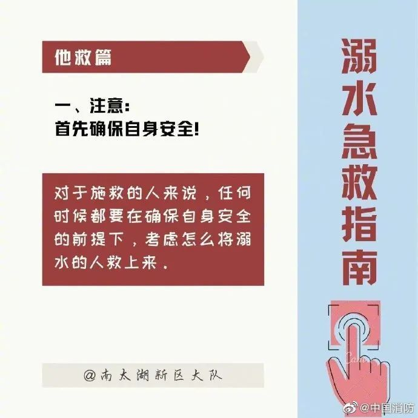
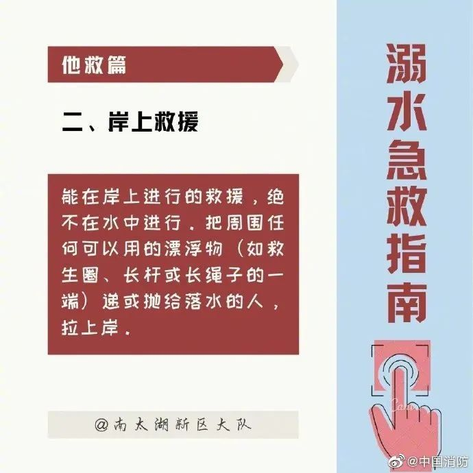
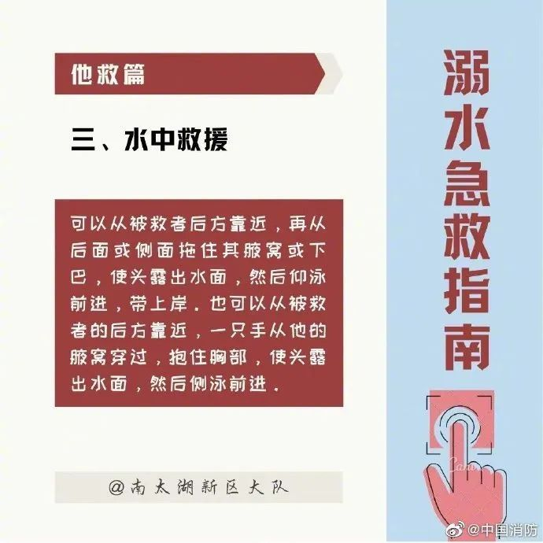

# 痛心！广西一家长带4名孩子去水库边摸螺蛳，3人不幸溺亡

**南国早报全媒体记者颜强**

5月1日，来宾市象州县石龙镇一水库发生溺水事件，3人不幸溺亡。

据网友介绍，事发后，当地村民在微信群发布信息，寻找知情人。

_▲事发后，当地村民在微信群里发布信息，寻找知情人。_

5月3日中午，象州县委宣传部相关负责人告诉南国早报全媒体记者，确有溺水事件发生，但不是学生前往水库游泳导致的。事发后，当地有关部门展开救援，遗憾的是，落水的3人被打捞上岸时已无生命体征。

经调查——

事故原因系家长刘某珍（女，30岁）带4名小孩到水库边摸螺蛳，其中2名女孩不慎落水，刘某珍在救人过程中也不慎落水，最终3人不幸溺亡。

溺水3人均为石龙镇大蒙村委老石排村居民，其中2名女孩分别是12岁、6岁，刘某珍是她们的姑姑。

目前，事件处置及善后工作正在有序进行中。

天气渐热，进入溺水事件高发期，早报妞提醒广大家长，务必教育、监管好家里的孩子，远离水库、池塘等野外危险水域，不要私自去危险水域游泳戏水，珍爱生命，预防溺水。

**若不幸发生溺水，该如何进行自救？若遇到他人溺水，又该如何正确施救？请收好这份溺水急救指南，希望大家都用不上，但这些急救知识一定要了解↓↓**

