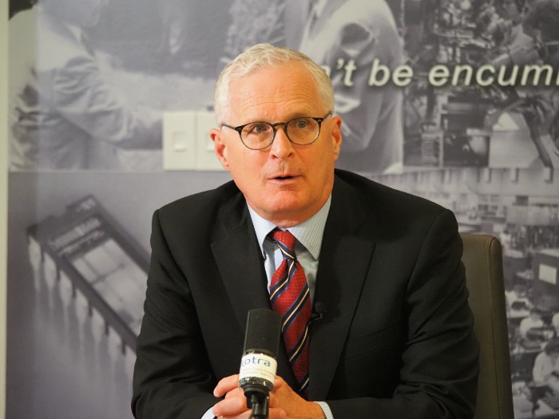

# 美半导体协会总裁：中国是我们最大的市场，我们不能缺席

【环球网报道】据彭博社3日报道，美国半导体行业协会称，尽管美国政府存在所谓“国家安全”方面的顾虑，但美国半导体公司仍希望进入中国市场。

“（中国）是我们最大的市场，我们不是唯一提出这一主张的行业，”美国半导体行业协会总裁兼首席执行官约翰·纽菲尔在接受彭博社采访时称，“我们的观点是，我们不能缺席中国市场”
。

_美国半导体行业协会总裁兼首席执行官约翰·纽菲尔 资料图 图源：外媒_

根据美国的《2022年芯片和科学法案》，华盛顿将向芯片企业提供500多亿美元的行业补贴，邀请它们在美国建厂，华盛顿还为它们提供投资税抵免优惠。美国不仅想通过补贴方案在2030年前创建至少两个先进制程芯片的制造业集群，而且希望以此遏制中国大陆芯片行业以及经济的发展。相关补贴方案规定，获得美国补贴的企业未来10年在中国大陆的先进半导体产能扩大幅度不得超过5%，现有通用半导体产能扩大幅度不得超过10%；如果企业与中国等“受关注国”共同研究或共享技术许可，须返还全部补贴金。

关于美国的《芯片和科学法案》，据彭博社报道，纽菲尔表示，他乐观地认为美国政府将务实地处理此类障碍，以确保芯片计划成功并且相关企业能够获得资金。

此外，报道称，美国半导体协会全球政策副总裁古德里奇也表示，“我们只是希望有明确的‘交通规则’，对于什么是国家安全问题，美国政府应该有明确的定义，并且透明和可预测”。他抱怨道，“坦率地说，在过去两届政府中，在国家安全和贸易限制方面，我们有点像在坐过山车。”“对于试图制定五年规划的半导体企业来说，不知道未来六个月可能会发生什么，会带来很多不确定性和挑战”。

据此前报道，拜登去年8月9日将《芯片和科学法案》签署成法律，他当时在法案签署仪式上的讲话中多次明确提到中国。该法案向在美国的芯片制造企业提供巨额补贴的同时，要求这些企业必须同意“不在中国发展精密芯片的制造”。

对此，中国外交部发言人汪文斌去年8月10日斥责，美国这个法案宣称旨在提升美科技和芯片业竞争力，但却对美国本土芯片产业提供巨额补贴，推行差异化产业扶持政策，包含一些限制有关企业在华正常投资与经贸活动、中美正常科技合作的条款，将对全球半导体供应链造成扭曲，对国际贸易造成扰乱，中方对此表示坚决反对。该法所谓“保护措施”，呈现出浓厚的地缘政治色彩，是美国大搞经济胁迫的又一例证。

中国商务部新闻发言人束珏婷去年8月18日表示，美方出台《芯片和科学法案》，对美本土芯片产业提供巨额补贴和税收优惠，是典型的差异化产业扶持政策。其中部分条款限制有关企业在华正常经贸与投资活动，具有明显的歧视性，严重违背了市场规律和国际经贸规则，将对全球半导体供应链造成扭曲，对国际贸易造成扰乱。中方对此坚决反对。美方法案的实施应符合世贸组织相关规则，符合公开、透明、非歧视的原则，有利于维护全球产业链供应链安全稳定，避免碎片化。中方将继续关注法案的实施情况，必要时采取有力措施维护自身合法权益。

