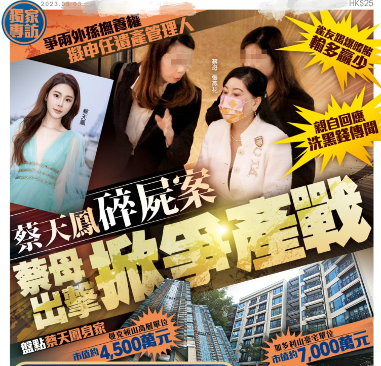
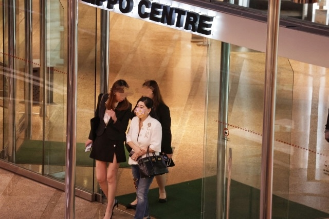
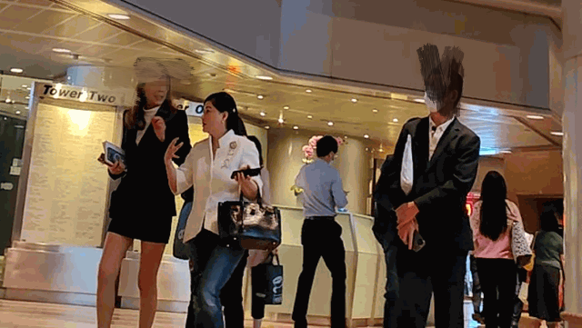
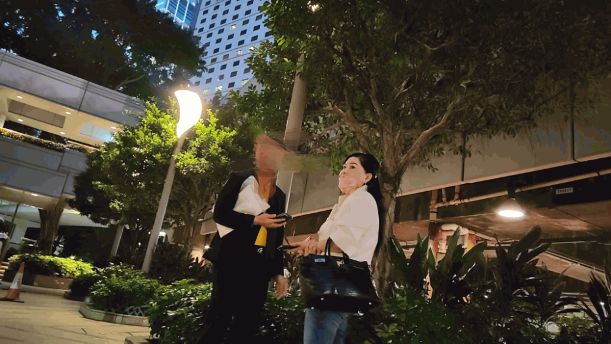
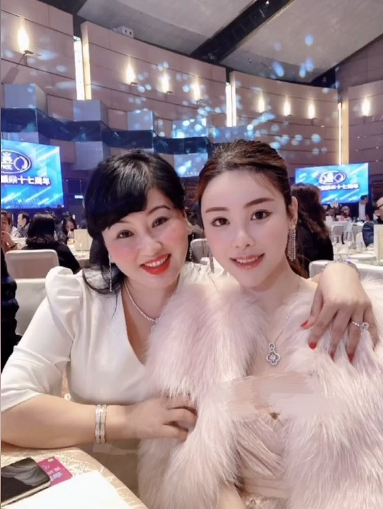
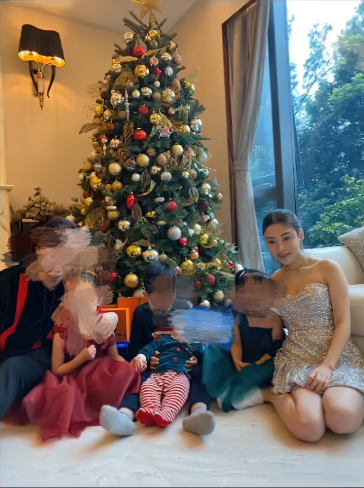
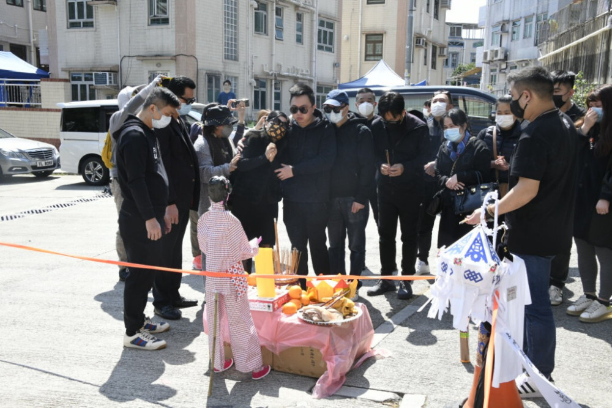

# 香港名媛碎尸案被害人离世3个月：其母开始争夺外孙抚养权与亿元遗产

蔡天凤离世3个月，虽然案件还没有最后的结果，但是她的遗产由谁继承一直都是外界关注的焦点，蔡天凤的母亲最近已经出手争遗产了。

5月2日，据港媒报道，蔡天凤的母亲张燕花和老公在上周频频找律师，还现身律师事务所被媒体拍到，张燕花和老公的对话也被媒体录了下来，从两人的交谈得知，张燕花找律师是为了争夺女儿蔡天凤的遗产管理权以及两个外孙的抚养权。

港媒报道称张燕花和老公离开律师事务所时，表情都非常凝重，不时眉头紧皱，心事重重，张燕花和老公在大夏门口等车接的时候，媒体录到了两人的一些对话，两人是用海南的家乡话对话，张燕花的老公应该是某些登记没有登记身份证，张燕花埋怨他没有用身份证登记，还称要先给孩子找住的地方，蔡天凤的老公则回她，压根就没他的名字，登记也没用，从两人的对话中得知，两人所说的登记可能涉及一些房产登记。

据知情人透露，蔡天凤的母亲张燕花频繁和律师接触，主要是为了处理女儿的身后事和女儿的遗产分配问题，还有就是两个外孙的抚养权，以及拟申请正式担任遗产管理人。

早在蔡天凤去世不足半个月，蔡天凤的遗产分配就成为焦点，当时蔡天凤的母亲率先向法院申请，申请禁止蔡天凤前夫的父亲出售蔡天凤留下的房产，据悉这处房产的市值约7000万元，蔡天凤还有一处房产价值4500万元。

蔡天凤的遗产涉及到三个家庭，最少有4名的合法继承人。

港媒就此事采访了张燕花，张燕花表示在女儿离世后，她都很少出家门，除非是配合警方调查，一般她都不太愿意出门见人，她承认近日频繁出入律师事务所，去律师事务所是因为两个外孙由她照顾，她去办理两个外孙的抚养权，对于是否申请担任遗产管理人，张燕花并没有否认，只说是因为涉及女儿，所以不想回应太多。

之前张燕花向法院申请禁止出售蔡天凤留下的房产，引起不小的热议，外界称张燕花喜欢赌博，且赌的很大，争夺遗产目的不纯，对此张燕花回应称，她确实喜欢打麻将，平时和朋友在一起玩，一场输50万，50万在其他人面前可能是全部身家，但是对她来说都在自己能支付的经济范围内，言外之意，就是没有女儿的遗产，她也有钱。

目前，蔡天凤一案仍在审理之中，蔡天凤的前公公，前大伯以及前夫均被控一级谋杀罪，案件将于5月8日再提堂审理。

