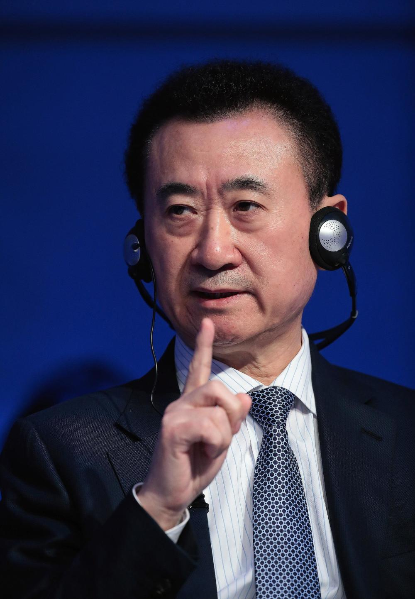

# 70岁王健林，面临最关键的7个月

五一假期，正是商业地产公司热火朝天做业绩的时候。然而，在万达内部，一股焦躁不安的情绪却在不断蔓延。大家都在担心，万达商管的未来究竟会怎样？

4月21日，万达集团掌门人王健林在公司高层会上表态：“集团确实因商管上市拖延，遇到了阶段性困难。”三天后，万达商管IPO招股书又一次失效。

去年还被视为最幸运的行业大佬，能不能迈过这道坎？

年底能否上市成大考

2016年，因股价长期低迷等原因，大连万达商业（即，万达商管前身）最终选择在港股私有化退市，但A股大门苦等多年未果后，王健林又调整了方向，重新瞄准港股市场，吹响上市号角。

为了更好的满足上市要求，大连万达商业先后实现了去地产化、轻资产化，并引进了珠海国资，把上市主体重组为“珠海万达商管”等多个举措，但变来变去，还是未能踏入那个阔别已久的港交所大门。

万达商管的上市究竟卡在了哪个环节？其实，早在2021年10月11日，万达商管就已获得中国证监会赴港上市“小路条”，完成了港股上市的先期注册程序。

但令许多人不解的是，万达商管却迟迟未能拿到所谓的上市“大路条”（即H股发行批复）。

中国社会科学院大学研究生院导师柏文喜分析道：“通常情况，港股上市公司从取得“小路条”到取得“大路条”只需3-6个月，过去很少出现因批复原因导致企业上市周期超过半年的企业。”

由于迟迟未取得“大路条”，万达商管的上市时间被一再延期。而最近的第三次招股书失效，导致各类偿债危机跟着纷至沓来。

这一次，王健林依旧没有气馁，他给万达内部高管和员工打气道，“万达绝不会躺平，也不会破产”。

不愿躺平的王健林，开始很积极努力的筹钱还债了。为此，他重新启动了发债、减持等融资方式。

4月19日，万达电影公告了一笔减持计划，以当日收盘价计，减持市值约9.53亿元，按公司最新市值计算，套现金额超过9亿元。

而在之前，万达系已经开始频频融资。年初，王健林将万达酒店65.04%股份质押给淡马锡作为贷款担保；1-2月，万达商管相继发行了两笔合计7亿美元的境外债，息票率为11%，并向上交所提交注册一笔60亿规模的公司债；到了3月份，万达商管又宣布，拟发行20亿元的银行间债券。

这一系列动作，展现了王健林想要再次力挽狂澜的决心，但与此同时，也让外界对整个万达帝国的资金情况画上了一个大问号。

首当其冲的是证监会的问询。针对万达今年拟发行的一笔60亿元公司债，证监会提出要求，对其短期偿债能力和现金流大额为负的原因作出说明。

截至目前，万达商管方面暂未回复这份问询函，而这笔60亿元的公司债也暂被中止发行。但市场对于万达商管的上市质疑声，随之被放大。

万达商管上市究竟能否成功，这不仅仅关乎着万达系的经营问题，同样也关乎着王健林当年签下的那份对赌协议是否会造成兑付压力。

2021年，碧桂园、蚂蚁金服、腾讯、PAG太盟投资集团等机构，一起掏出了380亿元，换取万达商管21%股权。当时万达商管的估值已高达1800亿元。

然而，从引入战略投资人启动港股上市至今，机构投资者们已等待了近3年。而2023年底，将是Pre-IPO投资者所能等待的最后期限。

根据对赌协议要求，王健林最晚必须赶在2023年底让万达商管上市。一旦上市失败，他需要掏出300多亿元回购公司股份作为赔偿。

留给王健林的时间只有7个月左右。目前来看，万达商管仍需要再次递交招股书。根据香港上市规则，招股书再次递交六个月到期后，三个月内重新递交的，属于原申请的延续，不会影响上市进程的推进。

而对赌协议并不是王健林面临的唯一压力。除了机构投资者外，王健林还对个别银团也同样承诺了上市期限。但这一时间并不完全依照2023年底的对赌截止日，反而要更早一个月。

▲（图源/视觉中国）

此前，据媒体报道称，倘若珠海万达商管未能在5月底前上市，万达集团共计13亿的三笔离岸贷款将被要求提前还贷。

目前，上述条款已被三分之一参贷行同意豁免，并将约定的上市日期调整为2023年11月30日，而这一消息也得到了万达方面的确认。

严厉的绩效考核

赶在上市之前，即将70岁的王健林仍须维持着这艘巨轮的正常运转。

在最近一次内部高管会上，王健林表示，公司要全线转变战略策略，万达投资不再拿地，商管也要停一停。他甚至做好了再次出售资产的最坏打算。

王健林的信心，来自于遍布全国各地的万达广场。租费收缴率100%、招商率近100%，是万达独步于商业市场的“必杀技”。

这些实打实的商业资产，给了王健林挺过难关的信心。但这些资产的回报，真有那么实在吗？

今年3月，一位自称在万达工作两年多的员工，在网络上发布了一篇名为《说说2023年的万达商业》的文章，并指出万达商管旗下商户业绩、出租率、客流等数据都存在造假。

这份帖子在万达内部引起了轩然大波。一位接近万达的内部人员对「市界」表示，“帖子刚出来的时候就引起了内部很大的讨论。”

众所周知，部队出身的王健林，用军事化管理打造了一个职业化和执行力超强的铁血万达，单单在开会一项上就规定了六大原则。王健林曾说：“万达执行力不敢说在世界，至少在中国是第一。”

许多年来，王健林通过建立一套精细、严格的执行能力，让万达像一台高效运转的机器一样，运转自如。

拥有上万员工的万达商管，则成为万达帝国最庞大的机构，让万达广场的收缴率多年保持着超高水平，即使在疫情影响下也未降低。

在从事商业地产十余年的Mark看来，这样的成绩是不可想象的，“近几年我还没有见到哪个商场是100%开业的，基本上90%以上的开业率就已经很不错了，因为招商比以前要难很多。”

然而，在万达，很多看似不可能的事情，都在严厉的绩效考核要求下实现了。

「市界」了解到，自2020年起，万达商管启动了全国范围的招商比武大赛，考评的核心增长指标是招商数量及租金水平。这期间，全国各大区、城市公司会对招商经理进行排名，实行末位劝退。

据万达前员工陈亮透露，为了完成绩效目标，一些员工开始在招商系统上动心思。

▲（图源/视觉中国）

“招商人员的很多空铺都是用多经点位填的，报上的出租数据很好看，但一查实时，空铺就可能对不上。”陈亮说道。

所谓多经点位，是指从商场的公共区域划分出来、用于增加租金的经营点位，通常包括场地展位和广告位两大经营模块。

“这是一种系统内部的操作手法，把多经点位的商户放到原本要租的空铺里，可以明显提升出租率，但是实际上总的收入还是不变的，只不过是换了一种操作方式。”一家天津的商业招商从业人士对「市界」解释道。

除了要保证出租水平的数据稳定外，对商户100%收缴率的考核，更是令许多员工头大。

一位万达东部区域的员工对「市界」透露，“为了完成本月指标，员工们会向商户推荐万达的金融贷，但如果商户实在没钱还了，员工们就得自己往里垫钱”。

在北方区域，Mark发现万达经理有时会为商户垫付租金，“ 万达考核很严，经理不得已去开很多信用卡，用自己的信用卡去帮商户垫租金，再慢慢的跟商户把钱要回来。”

对收缴率和出租率的严格考核，尽管让万达实现了异于同行的优异数据，但过于追求绩效的结果导向，让压力无处不在。

「市界」了解到，万达商管的组织架构共分为四层，分别是总部-大区-城市公司-单店。在总部之下，万达共设了4大区域，分别是东西南北区。

然而，尽管各个大区的业绩基数不同，但对于每一区的业绩，则会提出相近的业绩增幅。这就导致了，业绩完成最高的区域，反倒成了绩效压力的重灾区。

据万达前员工王辰透露，四大区中，绩效压力最高的是东区的上海公司，“上海的13家万达店，总共有30亿的收入指标，比成都28家店的收入指标还要高” 。

“上海的业绩基数大，总部也认为上海有购买力，所以可以在上面增加一定比例，导致业绩压力最大。”王辰说道。

目前，对于外界提出的经营数据质疑，万达并无明确的官方回复。万达商管数据显示，2022年，万达商铺出租率达98.7%；租金收缴率100%；开业55个万达广场，完成年计划的100%。

彪悍管理的两面性

在以冲刺IPO为阶段性大目标的王健林看来，万达商管更紧要的任务是让万达广场在轻资产运营模式下一路开挂。

据万达官方业绩快报，2022年万达商管新开业55座万达广场，成为去年唯一一个开业量在20个以上的企业。

根据第三次递交的招股书显示，截至2022年6月30日，万达196个储备项目中，有175个来自独立第三方业主，占比89.3%。

全面转型轻资产的万达，已经是业内巨无霸的企业。按照弗若斯特沙利文的数据，截至2021年12月31日，按在管建筑面积计算，万达商管全球排名第一，在管建筑面积超过了第二名至第十名的总和。

轻资产模式的优势，王健林早在2015年就已经想明白了。和商业地产的重资产模式不同，轻资产模式下的万达广场，可以低成本快速扩张。

万达只需要输出轻资产管理运营方案，就能赚取租金收入和商户运营收入，现金流要比做开发稳定得多。

而在商业项目运营上，万达积累了一套高标准化、高执行力的解决方案。成立以来，万达300多家商业体开业，无一延期。

这让万达在三四线的下沉市场，有了很高的议价能力和美誉度。在商业市场环境尚未成熟的早期，靠这套高执行力、高标准化的管理模式，万达得以较低成本迅速抢占市场。

实力越强，名气越大，谈判的筹码越多，这也是万达广场规模化的关键所在。

招股书显示，万达商管的400多座万达广场，六成（267座）都位于三四线。近百家万达广场在全国各地如雨后春笋般开工、开业，许多品牌供应商都是长期跟着万达走。

然而，风险和挑战并存。消费能力不足和人口发展趋势的下行，决定了三四线市场的商业竞争也将更加残酷。万达招股书曾提到，三线以下城市人口消费能力可能不足，很多城市商业广场可能早就供过于求。

▲（图源/视觉中国）

而到了需要精耕细作的存量市场里，扩散效应小、运营效率差的商场，却对万达资产经营能力和竞争优势形成了阻碍。

“现在整体的商业项目越来越多，品牌商换店的速度也很快。不像之前，品牌求着商场要进，现在反过来是商场求着品牌进。”Mark对「市界」说道。

为了达成招商任务，万达和很多品牌商打包谈合作，这种打法适合商业起步初期的三四线的时候，因为它确实很快，也适合复制，但在商业竞争更充分的一二线城市，却令很多品牌商头疼。

“万达提出的一个要求是，如果品牌商想在经营好的万达广场开，也要支持另外几个不太好的广场，也要去那几家开店，这么一算品牌商大概率是要赔钱的，那么在商言商，品牌商也宁愿直接不开了。”Mark说道。

而为了保持较高的招商率，万达广场的部分商场中，店铺的品牌层级要差一截。

如今，区别于以往单纯的租赁关系，商场与商户之间“唇齿相依”的关系愈发凸显。一家商业公司的发展，除了自身的市场地位和运营能力，也离不开众多的消费者、合作商家、员工，一个庞大的“商业生态系统”才能生生不息。

“其实商场和商户是一种合作共赢的模式，商户经营得好，才会更愿意给商场交租金，商场才能活下来。所以商场管理者还要站在更高的层面去看，做更多帮扶商户的动作。”Mark表示。

（应受访者要求，文中陈亮、王辰、Mark为化名）

作者 | 李 逗

编辑 | 孙春芳

运营 | 刘 珊

