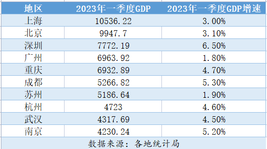
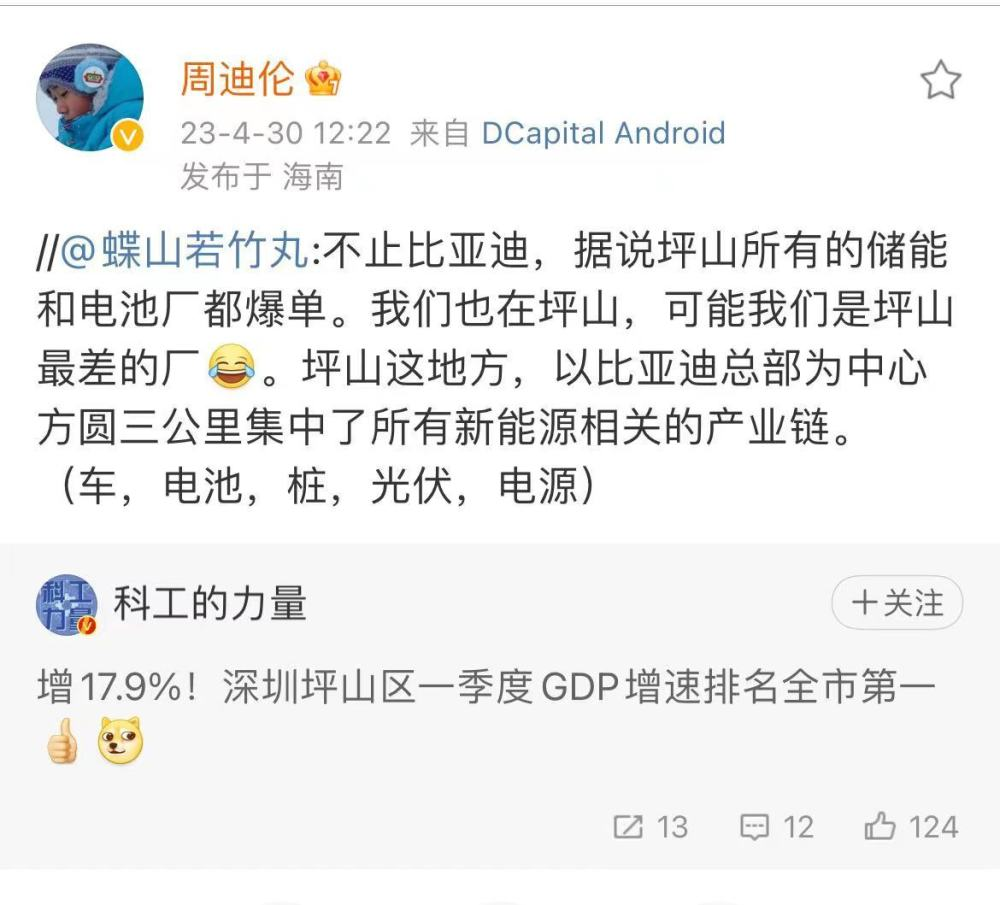
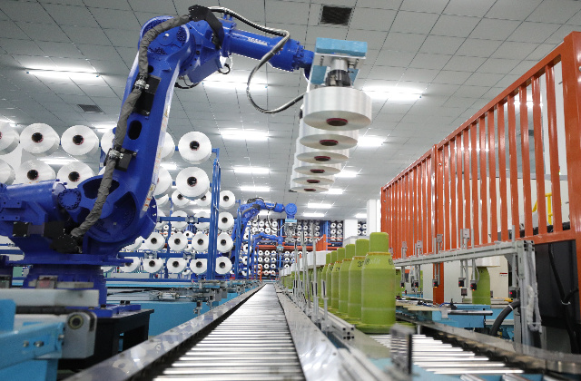

# GDP十强城市一季度成绩出炉：深圳增速领跑，广州垫底

4月30日，苏州市统计局发布数据显示，一季度苏州实现地区生产总值（GDP）5186.64亿元，同比增长1.9%。至此，GDP十强城市一季度经济数据全部出炉。

从增速上看，深圳以6.5%的增速位居十强增速第一；从总量来看，一季度又上演城市排名的激烈卡位，三组选手围绕第四、第六和第八位再度出现反转，广州反超重庆、成都再超苏州、杭州反超武汉。

深圳领跑广州垫底

在GDP十强城市中，深圳、成都、南京、重庆、杭州和武汉等6个城市一季度的GDP增速超过全国平均增长水平（4.5%），其中，深圳以6.5%的增速领跑。而广州和苏州分别是1.8%和1.9%的增速垫底。

数据显示，深圳之所以增长领先，工业加快恢复是主要的亮点。一季度，深圳市规模以上工业增加值同比增长4.5%，较1-2月提高3.7个百分点。在主要行业大类中，规模以上汽车制造业增加值增长75.8%。另外，新能源汽车、充电桩产量分别增长127.6%、89.2%。

这一组数据在深圳市坪山区体现明显。

5月4日，深圳市坪山区统计局发布，一季度GDP为262.78亿元，同比增长 17.9%。其中，坪山区规模以上工业增加值增长
24.5%，规模以上工业总产值增长 36.4%。汽车制造业、专用设备制造业等前十大行业合计产值增速达47.8%，高于规上工业平均水平 11.4 个百分点。

针对坪山区的一季度的经济数据，有网友在社交媒体上称，“不止比亚迪，据说坪山所有的储能和电池厂都爆单。”“以比亚迪总部为中心方圆三公里集中所有新能源相关产业链。”

坪山区以新能源汽车和生物医药产业为主导产业，拥有国家生物产业基地、国家新能源（汽车）产业基地。比亚迪就在坪山区。这里有从动力电池装备、正负极材料、电池电解液到动力电池成品制造，从电机、电控、点动力总成到整车制造的产业链和产业集群。

而与此相对应的是，广州和苏州的增速落后则因为是工业恢复面临需求不足的压力。

一季度，广州第二产业增加值为1654.16亿元，同比下降4.0%；其中，规模以上工业增加值同比下降5.8%。苏州第二产业增加值2287.47亿元，下降0.7%，其中，规模以上工业增加值同比下降2.7%。

广州市统计局解读称，受市场需求不足等因素影响，一季度，广州汽车制造业实现增加值同比下降12.0%；电子产品制造业同比下降8.9%，使全市工业增长承压。

5月4日，苏州市统计局发布的月报数据显示，1-3月，苏州的电子信息产业、装备制造产业、先进材料产业和生物医药产业等四大产业的规模以上工业总产值分别增长-3.9%、1.2%、-13.8%和-5.2%。

_3月15日，在恒力（苏州）产业园内的高性能涤纶工业丝智能车间内，机械手臂将检验合格的丝饼放上丝车，转运至智能立体仓库。新华社图_

三组六城激烈卡位

随着苏州一季度的数据发布，GDP十强城市的座次也已经排定。除了北京、上海和深圳位居前三和南京位居第十的位置稳定外，涉及到三组六城出现座次反转，广州、成都和杭州分别超过重庆、苏州和武汉，分列第四位、第六位和第八位。

一季度，广州市GDP为6963.92亿元，而重庆市GDP为6932.89亿元，广州反超重庆31.03亿元，重回全国第四的位置。预计在未来一段时间，广州和重庆将围绕“第四城”的位置进入持续的胶着竞争。

广州和重庆的“第四城”之争发酵于2019年。但是，第一财经根据两地统计年鉴梳理，其实早在2017年，重庆经济总量已经超过广州。2019年-2021年，广州又反超重庆。2022年，重庆又再次超过广州。

第二组选手则是成都和苏州。一季度，成都GDP为5266.82亿元，同比增长5.3%，相比苏州的5186.64亿元，成都的经济总量略微领先80亿元，因此，苏州失守第六位，成都则晋升一位排名全国第六。

这不是成都第一次超过苏州，在新冠疫情暴发的2020年一季度，成都也曾领先苏州101亿元。不过，此后苏州迅速回升，在2020年第二季度就反超成都，捍卫了自己第六的位置。去年苏州的经济总量仍高出成都3000多亿元，因此，成都挑战苏州的地位还需时日。

第三组选手则是武汉和杭州。2020年，武汉受疫情的冲击，GDP出现负增长，而杭州一跃超过武汉晋升第八位。2021年，杭州仍领先武汉近400亿元。不过，2022年，武汉反超杭州113亿元，重回第八位。

这三组城市的位次已出现多次反转，显示双方激烈的竞争状态，可以预计，未来仍然格局难定，相互竞争前行。实际上，重庆、成都和武汉为代表的中西部城市与广州、苏州和杭州为代表的东部沿海城市的竞争，反映了两股力量正在重塑城市格局。

