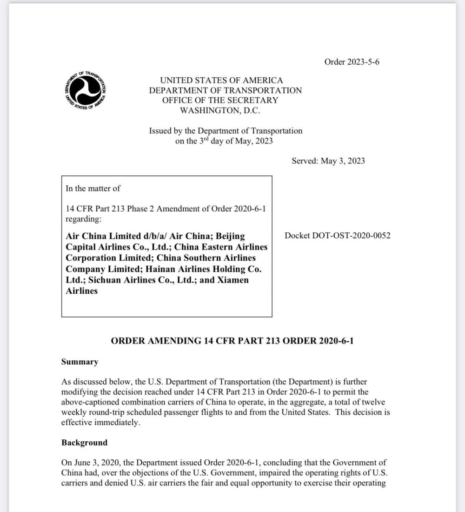

# “乙类乙管”后中美航班量有了更进一步的突破，每周往返量增至24班

界面新闻记者 | 薛冰冰

当地时间5月3日，美国交通部发布新的指令，对2020年6月份的原指令进行第四次调整，允许中国航空公司每周运营12班往返美国的航班，指令即刻生效。

图片来源：美交通部网站

在此之前，中国航空公司每周运营8班中美往返航班，美国航空公司每周运营12班中美往返航班。新指令生效后，中方承运的中美航班每周将增加4班。从总量来看，中国航司、美国航司每周运营的中美航班合计达到24班。

界面新闻注意到，除了每周航班量增加以外，中方承运航司也从4家增加到7家。在指令宣布之前，国内承运航司为中国国航、中国东航、南方航空、厦门航空。美国交通部在最新文件中表示，修改后的指令适用航空公司达到7家，除了前述4家，新增了首都航空、海南航空、四川航空。

过去三年时间，受新冠疫情影响，中美航班大范围削减。2020年1月底，由于中国疫情较为严重，美联航、达美航空、美国航空等先后暂停了中美航线运营。国内航空公司在民航局“五个一”政策限制下，只保留少量中美航班的运营。

随着疫情缓解，中美双方为复航做出政策调整。2020年6月16日之后，中美航班由每周4班扩容至每周8班；8月中旬中美航班继续增加，在此前基础上翻番，达到每周16班，即中美航司每周各运营8班往返航班。

从班期密度来看，中美直飞航班大多为每周1班、部分达到每周2-5班，天天班尚无。而在2019年，仅达美航空一家在中国运营的航班就达到每天6班。

2023年1月8日起，中国民航局宣布，“五个一”、入境隔离等国际客运航班管控措施悉数取消。东南亚、日韩、澳洲等国际航班量显著增加，但是中美航班量仍和“乙类乙管”前保持一致，无任何新增，约为疫情前水平的6%。

针对国际客运航班政策的调整，美国交通部在这次文件中也谈到，2022年12月30日中方致信美国交通部，告知国际客运航班恢复的相关举措：自2023年1月8日起，中外航空公司可以根据协定恢复国际客运航班，同时取消对国际客运航班数量和客座率的临时限制。自1月8日起，航空公司可以恢复2019年国际航协北半球冬航季期间运营的所有航班，并可以申请在2023北半球夏航季（3月26日开始）增加额外的航班。

美国交通部称，随着中方取消疫情相关的限制，从2023年3月起，美国的航空公司每周额外增加两个航班的运营（达拉斯-
上海），使得美方航司每周运营的中美航班数量达到12个。

鉴于当前市场情况以及中国民航局批准美国航司的航班，美国交通部对Order
2020-6-1进行第四次调整，允许中国航司每周同样运营12个中美间往返航班，即刻生效。

就在中美航班宣布增加之前，今年的3月中旬，美国疾病控制与预防中心（CDC）宣布，取消针对中国赴美旅客的强制性新冠病毒检测要求。国内搭乘直飞航班赴美的旅客，不再需要提交新冠阴性证明或康复证明。

但是受限于中美航班供给量，往返美国的机票价格仍保持在万元的水平。界面新闻此前通过携程了解到，2019年中国飞往美国经济舱均价只需5029元，美国飞往中国经济舱均价仅为4289元。疫情期间中美航班价格大涨，目前直飞航班价格仍在万元以上。

美国交通部指令生效后，意味着“乙类乙管”后中美航班量有了更进一步的突破。但是由于增加的数量较少，对整体航班供给量及票价水平的改善作用比较有限。

疫情以来，中美直飞航班的增减一直遵循对等原则，在对等原则下两国航空公司的航班数量保持一致。未来中美航班能否突破瓶颈、实现量的增加，还要视双方航权谈判情况而定。

