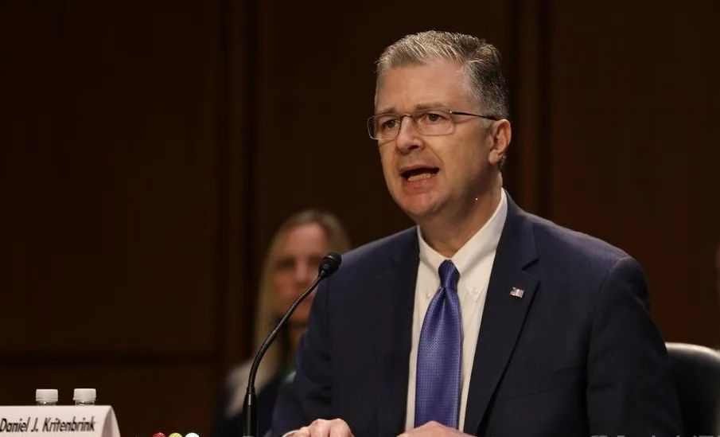
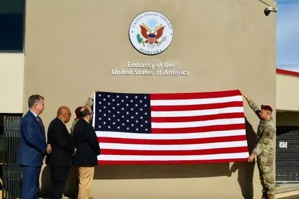
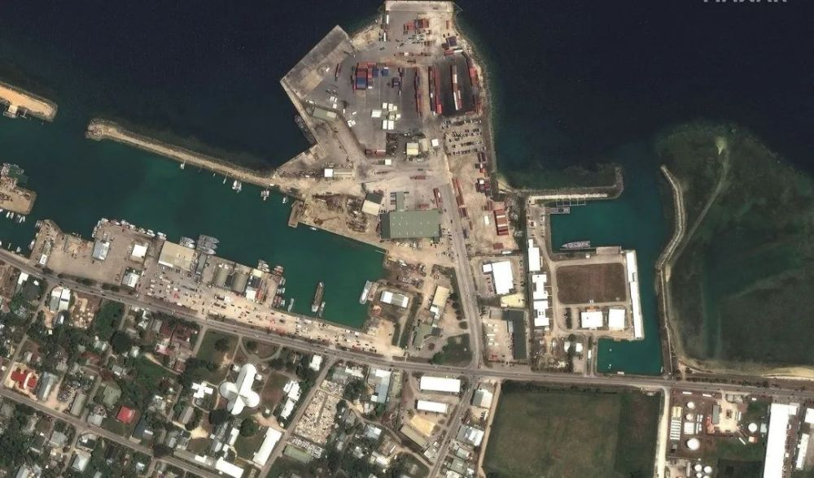
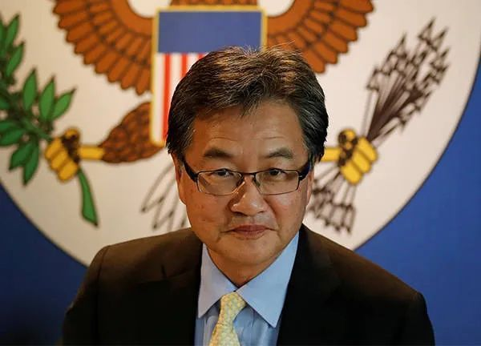

# 为“追赶中国”，美国继“重返”所罗门群岛后，又盯上汤加

继时隔30年“重返”所罗门群岛后，美方又盯上了汤加等国。

据路透社3日报道，美国国务院负责东亚和太平洋事务的助理国务卿康达（Daniel
Kritenbrink）2日在美国参议院外交关系委员会上称，美国将于本月在汤加开设大使馆。

_康达资料图_

报道称，康达还向美国参议院外交关系委员会的一个小组委员会表示，美国仍在继续与瓦努阿图和基里巴斯就开设大使馆进行接触。

而就在4月底，美国总统拜登将对巴布亚新几内亚进行访问的消息刚被曝出。

据法新社报道，南太平洋岛国巴布亚新几内亚官员表示，拜登将于5月22日对巴新进行“短暂的、历史性的访问”。根据美国国务院的记录，自1901年罗斯福执政以来，还没有在任的美国总统访问过巴新。

路透社在上述报道中，将美方的举动解读为，“美国加强其在太平洋地区的外交存在，是为对抗中国日益增长的影响力所作出的努力的一部分”。

_今年2月，美国重新开放了其驻所罗门群岛大使馆。图源：美国驻巴布亚新几内亚、
所罗门群岛和瓦努阿图大使馆官网_

**“追赶中国”**

从地理位置上看，巴布亚新几内亚、所罗门群岛、瓦努阿图、汤加等岛国仿佛一串断了线的珍珠，撒在了南太平洋上，松散地围在澳大利亚的北方。

因火山喷发而为人知晓的汤加，是由173个岛屿组成的岛国，其中36个有人居住，其余大部分为珊瑚岛，陆地面积747平方公里，大约相当于北京市海淀区加丰台区的总面积。因工业不发达，生产力水平较低，相对依赖国际援助。此前，美国并未在此专设大使馆。

汤加鸟瞰图。图源：路透社

美国与瓦努阿图的外交往来更为“久远”，可以追溯至二战时期。瓦努阿图拥有31万人口，分布于80个岛屿上，在第二次世界大战期间，瓦努阿图的最大岛屿是美国在太平洋上的最大军事基地。1986年，瓦努阿图与美国正式建立外交关系。而目前，在该国的外交事务仅由美国驻巴新的外交官兼任。

可以说，在过去很长一段时间里，这些区域并未受到美方的重视。

“在与美国印太战略保持一致的情况下，在瓦努阿图的永久外交存在，将使美国政府加深与瓦努阿图原住民官员和社会的关系”。美国务院在此前的一份声明中称，美方在瓦努阿图开设大使馆，将促进两国在潜在双边合作和援助领域上的发展。

就在拜登访问巴新的消息传出后，拜登政府任命的太平洋岛国谈判特使尹汝尚表示，美国在太平洋地区的影响力落后于中国。

“让我们面对现实吧，这是中国与我们之间的战略竞争，我们正在进行一些追赶，但还需要加快追赶的速度。”彭博社4月29日报道，尹汝尚称，美国与该地区有着文化联系，这将提高美国在与中国拉锯战中的胜算。

而事实上，这是一场“没有对手”的竞争。对于美国与太平洋国家发展关系一事，中方多次表明立场。

2月，外交部发言人毛宁就美国重新开放驻所罗门群岛的大使馆回应表示，“中方对各国同太平洋岛国发展关系不持异议，我们愿同有关各方一道，发挥优势，形成促进岛国发展振兴的国际合力。我还想强调的是，中国无意同任何人在太平洋岛国地区比拼影响力，也没有兴趣搞地缘争夺。”

这样一场“脑补”出来的竞争背后，是美方对太平洋岛国越伸越长的手。

**“对外援助”只是糖衣炮弹**

据央视新闻报道，2日，康达出席了美国国会参议院外交关系委员会东亚、太平洋与国际网络安全政策小组委员会的听证会。会上，他被要求就美国政府向国会提交的2024财年预算申请中，用于推进与东亚和太平洋地区国家外交关系的款项作出说明。

据康达介绍，在2024财年中，美国政府向国会申请5.33亿美元预算用于同东亚和太平洋地区国家进行外交接触，同时申请13.6亿美元预算用于向上述地区国家提供对外援助。他表示，美国政府提出的预算申请有助于拓展在“印太地区”的外交存在。

这样的“对外援助”，美方早已开始酝酿。

去年3月，美国国务院确认任命前朝鲜事务首席谈判代表尹汝尚为新任太平洋岛国谈判特使。这一新职位的设立，被认为是拜登政府想要重新增加与太平洋岛国接触努力的一部分。

_尹汝尚资料图。图源：视觉中国_

据美媒报道，尹汝尚一直在领导美国恢复与马绍尔群岛、帕劳和密克罗尼西亚联邦之间“自由联合协定”（COFA）的谈判。他表示，美国现在还计划在未来20年向密克罗尼西亚、帕劳和马绍尔群岛投资65亿美元。

根据该协议，美国保留对这些岛屿国家的“防御责任”。代价是，太平洋大片战略地带的独家使用权归美国所有。这些协议将于今年和明年到期，若得到续签，美国有望在当地维持甚至增强“独家”军事能力，甚至包括使用基地的能力。

可以说，美国对太平洋地区这一系列突然热络的举措，只是披着“对外援助”外壳的地缘争夺，对于太平洋国家真正关心的问题，美方并不关心。

据美媒此前报道，今年1月，美国与帕劳和马绍尔群岛的代表在洛杉矶签署了谅解备忘录。此举被视为，美国与这两个太平洋岛国续签《自由联系条约》铺平了道路。而马绍尔群岛国内对于政府匆忙签署备忘录存在着反对声音。马绍尔群岛前总统希尔达·海因认为，双方在应对气候变化等议题上缺乏共识。

“华盛顿正尝试为在该地区进行核试验做出弥补。”此前，尹汝尚曾表示，美方将重点关注曾受核试验影响的地区，例如马绍尔群岛。但他也承认，军事战略是美国想维持在该地区影响力的主要动机之一。

