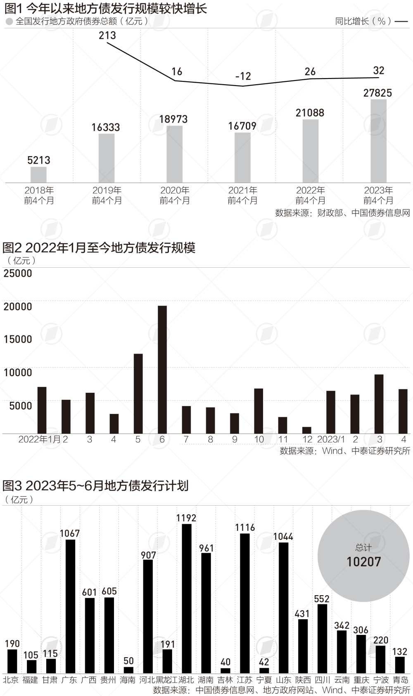

# 前4个月地方债发行近2.8万亿，增速创三年来新高

地方政府债券加速发行稳经济。根据公开发债数据，今年前4个月全国发行地方政府债券27825亿元，同比增长32%。

中央财经大学教授温来成告诉第一财经，今年以来地方政府债券发行速度快，这是因为今年经济恢复基础仍不牢固，需要发挥债券资金对稳投资、扩内需、补短板的重要作用。

地方政府债券按用途分为新增债券和再融资债券。新增债券是新发行的债券，资金主要用于基础设施等重大项目、民生项目等的建设。而再融资债券则主要用于偿还到期债务本金，属于“借新还旧”。

今年前4个月，全国地方发行新增债券19520亿元，同比增长约15%。再融资债券8306亿元，同比增长99%。

“今年地方偿债压力比较大，目前偿债本金主要靠发行再融资债券来筹资，因此前4个月增速高。”温来成说。

根据财政部数据，今年一季度地方政府债券到期偿还本金3624亿元，其中发行再融资债券偿还本金3385亿元，剩余的靠安排财政资金等偿还本金。

多地财政部门公开表示，用足用好再融资债券可以有效平抑政府债务波动，缓解地方财政偿债压力，有利于防范债务风险，让地方腾出更多财力用于其他重大项目建设。

今年地方政府债券发行进度快，也得益于去年底提前下达的新增债务限额明显高于往年。

为了尽快发债，改变以往地方政府债券发行集中在下半年的情形，充分发挥地方政府债券资金效应，2018年底全国人大授权国务院提前下达部分新增地方政府债务限额，这也使得2019年前4个月发债规模远高于上年同期。此后，除了2021年初提前下达地方债较晚而导致当年前4个月发债规模下降外，其他几年前4个月发债规模均保持两位数增长。

当然，观察地方政府债券资金效益更多地要看新增债券。前4个月地方政府新增债券发行逼近2万亿元，约占总规模的70%；其中新增专项债券约1.6万亿元。

专项债是投向有一定收益的公益性项目，一般来说收益能够偿还本息。目前专项债是政府带动扩大有效投资、稳定宏观经济的重要手段。

目前新增专项债主要投向市政和产业园区基础设施、交通基础设施、社会事业、保障性安居工程、国家重大战略项目等。

多位专家告诉第一财经，新增专项债加快发行对带动扩大有效投资，保持经济平稳运行发挥了重要作用。比如，受专项债资金等助力，今年一季度基础设施投资增长8.8%，保持了较高增速。

不过，近期公布的中国采购经理指数运行情况显示，4月份，制造业采购经理指数（PMI）为49.2%，比上月下降2.7个百分点，低于临界点，制造业景气水平回落。相关指标的回落，也折射出经济恢复仍不牢固。为此，积极财政政策仍需要发力。财政部明确下一步工作重点之一，是加快地方政府专项债券发行和使用。

近期，财政部已经将今年地方政府新增债务限额及时下达到地方，多位地方财政人士也向第一财经确认，已经收到剩余的新增债券额度。

目前，部分省份已经公布了5月和6月的发债计划。根据中泰证券研究所梳理，截至4月28日，共有21个省份披露2023年5～6月地方债发行计划，披露总额共计10207亿元。其中，新增债券4734亿元，再融资债券5473亿元。

当然，实际发行规模可能会超过计划发行规模。

粤开证券首席经济学家罗志恒预计，后续专项债发行进度会进一步加快，在三季度以内基本完成全年3.8万亿元发行任务。专项债尽快发行，可以更快地形成实物工作量，带动社会投资，并带动相关产业链，稳定总需求，促进经济稳定，更好提振市场信心。

