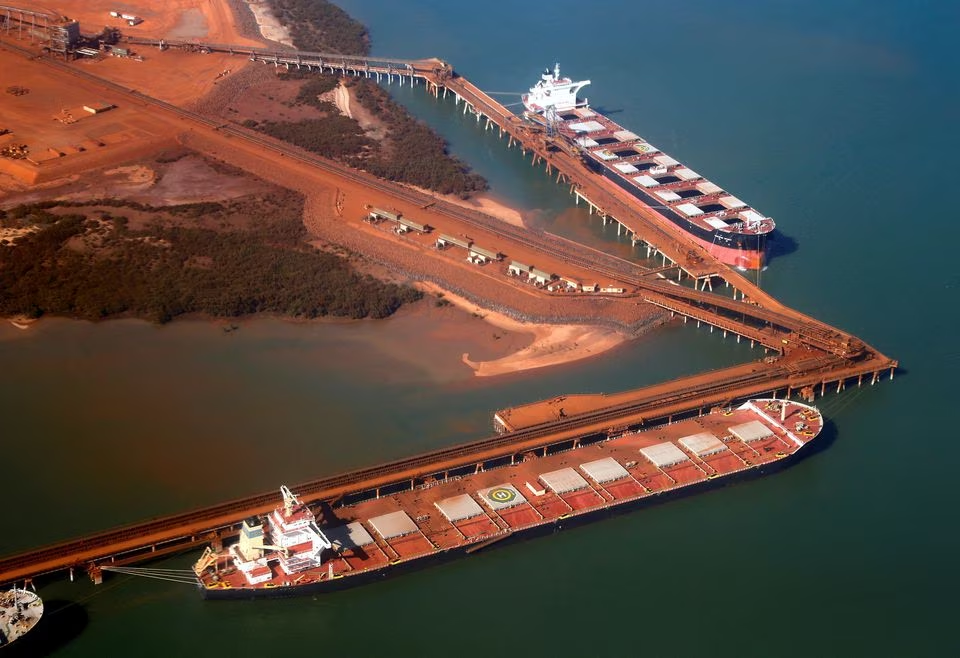

# 因中国进口铁矿石，澳大利亚对华出口创近两年来新高

【文/观察者网 周弋博】

据路透社消息，当地时间5月4日，澳大利亚统计局（ABS）发布的数据显示，澳大利亚3月份对华出口飙升至近两年来高位，达到约190亿澳元（约合人民币875.98亿元），较上年同期增长31%，但低于2021年6月的217.6亿澳元（约合人民币10041.5）历史峰值。

据报道，澳大利亚对华出口的增长，使该国贸易顺差达到约153亿澳元（约合人民币705.07亿元），创历史第二高水平。

_西澳大利亚皮尔巴拉地区黑德兰港等待装载铁矿石的船只
图源：路透社_

路透社称，中国为其钢铁行业增加澳大利亚铁矿石进口是导致该情况的原因之一。ABS数据显示，澳大利亚对中国的铁矿石块和铁矿粉出口量分别较上月增长24.3%和17.7%。

另一方面，澳大利亚3月份对华动力煤出货量较2月份激增125%，抵消了该国对日本煤炭出口下降的影响。

值得一提的是，中国海关数据显示，今年2月，中国进口炼焦煤约691.4万吨，进口动力煤（其他烟煤、其他煤和褐煤）约2060.2万吨。

其中，中国从澳大利亚进口煤炭20.7万吨，同比增加约两成，包括炼焦煤约7.3万吨、动力煤约13.43万吨，分别占各煤种当月国内进口量的1.06%和0.65%。1月，这一数值为零。

在3月16日举办的新闻发布会上，商务部新闻发言人束珏婷在回应澳煤进口问题时表示，中国对煤炭进口实行自动许可管理，煤炭自动进口许可证可正常申请。

4月11日，澳大利亚外交部长黄英贤和澳贸易部长法瑞尔在新闻发布会上宣布，澳方现已暂停就中方对澳大麦征收“双反”关税一事向世贸组织（WTO）提起的申诉。

黄英贤表示，澳大利亚政府希望加快解决大麦关税问题，目前正在寻求与中方就此达成协议，以找到较WTO申诉更快速的解决方法。

大麦是澳大利亚向中国出口的三大农产品之一。澳政府数据显示，澳大利亚约70%的大麦出口到中国，2018年贸易额一度高达15亿澳元（约合人民币70.5亿元）。彭博社援引澳农业组织Grain
Growers估算数据，中方“双反”关税可能会在五年内给澳市场造成高达25亿澳元（约合人民币114.9亿元）的损失。

**本文系观察者网独家稿件，未经授权，不得转载。**

