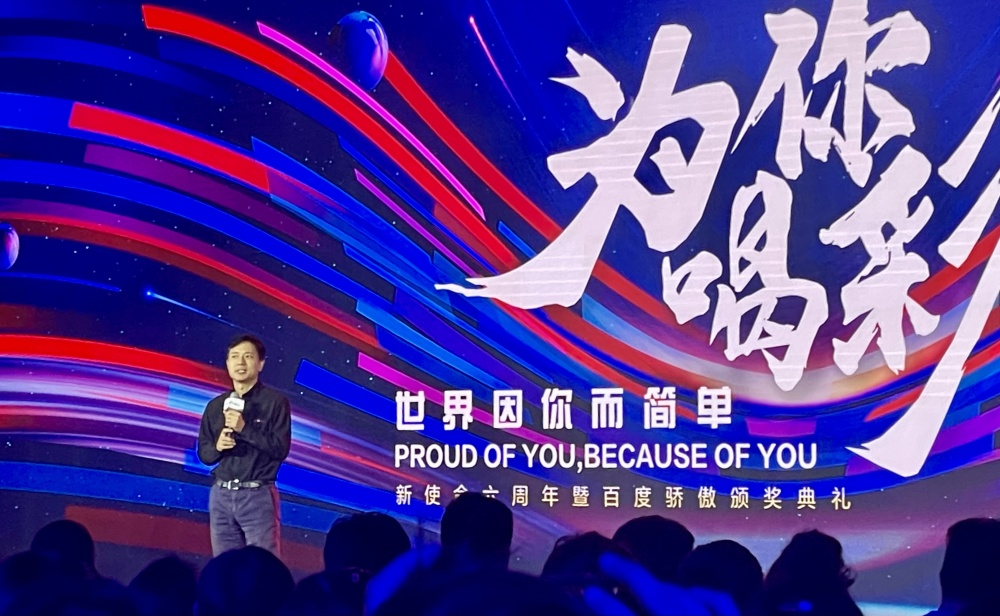

# 李彦宏最新内部讲话曝光：算力能买，创新不能买

腾讯新闻《潜望》张小珺 发自北京

5月4日晚6点，百度创始人、董事长兼CEO李彦宏在一次内部活动上发表演讲，就大模型话题表态。

李彦宏回顾了百度和人工智能的发展历程。他表示，算力不能保证百度在通用人工智能技术上领先，算力是可以买来的，而创新的能力是买不来的，需要自建。

他分享了百度在2013年参与了Geoffrey
Hinton和他的两位博士生Alex和Ilya团队的竞标。“看到有自媒体说百度不懂商业谈判，错失了首先做出ChatGPT的机会，其实不然啊，”他说，“Google比我们当时多付了4000多万美金，不是也没有做出来吗？Ilya
Sutskever转身就离开Google去参与创建了OpenAI。”

李彦宏提到未来需要培养的是原生AI的思维模式。自己和团队都不是AI的原住民，大部分人经历了移动互联网时代，一部分人甚至经历了PC时代，思维方式可能被固化。所以要改变思维方式，要用毅力克服惯性，用发现和探索的眼光看待新世界。

**以下为李彦宏演讲：**

6年前的今天，也是在这里，我们正式发布了百度的新使命，用科技让复杂的世界更简单，正式吹响了百度向人工智能公司转型的号角。但我要说的是，我们对于创新的执着是一贯的，我们对于技术的投入是长期的，从来没有动摇过。

10年前，也就是2013年，我们意识到，人工智能技术的发展，会让无人驾驶有一天可以实现，从此我们开始了对自动驾驶技术的十年如一日的压强投入。今天，萝卜快跑单量已经远超200万单，是世界最大的无人驾驶运营商。也是在那一年，
**我们参与了Geoffrey
Hinton和他的两位博士生Alex和Ilya团队的竞标，我看到有自媒体说百度不懂商业谈判，错失了首先做出ChatGPT的机会，其实不然啊，Google比我们当时多付了4000多万美金，不是也没有做出来吗？Ilya
Sutskever转身就离开Google去参与创建了OpenAI。**

8年前，也就是2015年，我们意识到人工智能正在逐步变成一项核心通用技术和基础技术，势必催生多个领域的变革和跨越式发展。那一年，我在全国两会上，在人民大会堂有一个大会发言，叫“中国大脑计划”，那时候人工智能还没有出圈，AlphaGo要到2016年才出来。我当时的建议是从国家层面去开发建造一个全球最大的人工智能平台，这个平台可以开放给政府机关、企事业单位、科研院所等，使大家可以在这个平台上进行相应的技术创新。近几年，各地风起云涌的智算中心，多少体现了这一思路。与此同时，百度我们也开始了构建属于我们自己的全栈式人工智能技术。

4年前，我们首次推出了大语言模型文心1.0，参数过亿，那个时候亿级参数就是大模型的定义。而且我们不断通过核心应用搜索、小度，来打磨我们的大模型技术。

**2年前，我们意识到人工智能技术发生了方向性的改变，从辨别式的人工智能走向生成式的人工智能，AIGC从此成为我们重点发力的一个方向，资源也逐渐向这个方向倾斜。**

今年3月16号，百度在全球大厂中首先发布对标ChatGPT的大模型产品文心一言，赋能千行百业，让所有产品因此而重构。我们之所以能够在Google、Meta、Amazon等大厂之前先做出来，是因为我们在芯片、框架、模型、应用四个层面做到全球唯一全栈布局、层层领先，我们在进行联合优化的时候，多数友商还躺在上个时代的芯片、操作系统和应用这样的三层架构上。

可喜的是，今天，四层架构的理念已经开始被业界认可。端到端优化让我们在大数据、大模型、大算力上如鱼得水，左右逢源。最近我看到一个数据，说全球算力规模，美国占34%，中国占33%，算力差不多。

我要说，算力不能保证我们能够在通用人工智能技术上领先，算力是可以买来的，创新的能力是买不来的，是需要自建的。

文心一言内测一个多月，就完成了4次大的技术升级，大模型推理成本已经降到了原来的十分之一，或者说推理性能提升近10倍。当别人刚刚开始思考如何进行训练的时候，我们已经在推理上冲出了很远。

当然，这场科技竞赛才刚刚开始。 **真正的AI时代，新的应用会基于大模型来开发，就像十几年前各种基于安卓、iOS的应用大量涌现一样。**
所以，我多次说过，大模型是Game
Changer，它会彻底改变云计算的游戏规则。过去，云计算主要卖算力，看速度、看存储，今天，客户购买云服务，是要看框架好不好、模型好不好，而不是仅仅看算力怎么样。未来，企业基于大模型开发应用，会发现百度智能云是最方便、最快捷的，成本还低。

所有过往，皆为序章。随着移动互联网的日益成熟和内卷，今天的人工智能领域，竞争比以往任何时候都更加激烈，我们面临的挑战也是前所未有的。

**前一段时间我接受采访时说：我们跟ChatGPT的差距大约是两个月，但说实话这有点断章取义，我后面紧接着还说：这不是重点，重点是这两个月的差距我们要用多长时间才能赶上，也许很快，也许永远也赶不上。**

这取决于我们自身的努力，取决于我们把握机会的能力，取决于我们的执行力。我们的战略、人才、组织机制和文化能不能适应新的形势，我们在新的环境下能不能持续创新，生死攸关。

未来， **我们要有意识地培养AI原生应用的思维方式和理念，需要我们用新的理念去重构我们现在的每一个产品，每一个业务。**
这并不容易，这很难，因为我们现在这些人，我们四万百度人，没有一个是AI时代的原住民，我们都经历了移动时代，不少人还经历的PC时代，我们的思维方式某种意义上被固化了。

我记得我第一次使用浏览器的时候，感觉那个东西效率很低呀，明明通过命令行一秒钟可以解决的问题，为啥要等着一个个图片load完了才能开始操作，但后来我明白过来了，普通人点击鼠标比让他学习盲打要容易的多；

我也记得刚开始使用苹果手机的时候，觉得这个屏幕好小啊，用户为啥要用这么个东西来上网啊，但我看到几岁的孩子很快就学会了使用触摸屏上网的时候，我下定决心用两年的时间，让百度的移动搜索流量超过了PC搜索流量。

这一次生成式AI的来临，我们第一感受也是敲一两个关键字，点击一下鼠标就能解决的问题，为啥要用一大段话来描述自己的需求，才能获得想要的内容。

但是我们要意识到，有多少工程师辛辛苦苦开发出来的功能被藏在一层层的菜单下永远无人问津，有多少苦思冥想都无法获得的灵感通过一些简单的提示词可以被激发出来，我们应该有勇气去改变自己的思维方式。

当然，改变思维方式会是痛苦的，会经历各种挫折和煎熬，需要我们用毅力去克服这种惯性，用发现和探索的眼光来看待这个新的世界。

当今世界，没有一个伟大的产品是靠一个人做出来的，需要一个有活力的组织。一个人的改变尚且如此之难，一个组织的改变就更不容易。这需要我们心往一块想，劲往一处使，需要各个部门充分沟通，开放讨论，通力协作，互相支持，互相帮助，不断推出最有市场竞争力的产品和技术。

这是一次综合能力的较量，需要我们统一思想，积极思考，勇于创新，抓住这次机遇，全情投入，一往无前。

