# 游客手机掉西湖被要1500元打捞费，打捞人员日薪可过万，网友吵翻了

这个“五一”，全国各大景区开启“人从众”模式，全国各地不少景区人流如织。堵车、堵人已经是基本操作。出门在外，出现物品遗失在所难免，尤其是游湖的时候，经常出现手机等物品掉落在水中的情况。

昨天‍，话题 **“游客手机掉西湖被要1500元打捞费”**
冲上了热搜。5月2日，浙江杭州，有游客发布视频称，手机掉到西湖里，被一位衣服上写着“应急救援”的男子要价1500元捞起，他还称若未捞起半价。

对此网友们看法也不一样，有人认为， **这钱收的很合理。**

也有人认为， **价格太高了，而且这个人看着不像是专业的救援队员。真的要打捞，还是得找景区的工作人员。**

5月3日，杭州市西湖水域管理处发布《关于游客手机掉落西湖支付高额打捞费的回应》，原文如下：

5月2日，有游客发布视频“手机掉落西湖，打捞人员要求支付高额打捞费”情况，西湖景区已组织相关部门进行调查核实，
**目前初步查明视频中出现的打捞人员不是景区相关应急救援队伍中的工作人员，如存在违规违法行为将会及时处置。**

多年来，西湖景区一直致力于为游客提供各类人性化的帮助与服务，一旦接到游客求助，都会利用自制的打捞杆等工具想方设法进行免费打捞。仅今年五一期间，景区就帮助游客免费打捞手机等物品30余件，目前以“西湖捞哥团队”为代表的志愿服务队伍也在不断壮大，如果游客在西湖边游玩时，遇到手机落湖等突发情况，可就近向景区工作人员或志愿者求助，我们会立即派员协助打捞。

因西湖平均水深2米多且淤泥较深，存在较大安全风险，景区不建议游客或非景区工作人员自行下水打捞。在此也特别提醒，游客朋友们在欣赏西湖美景的同时，请保管好自己的随身物品，注意安全。

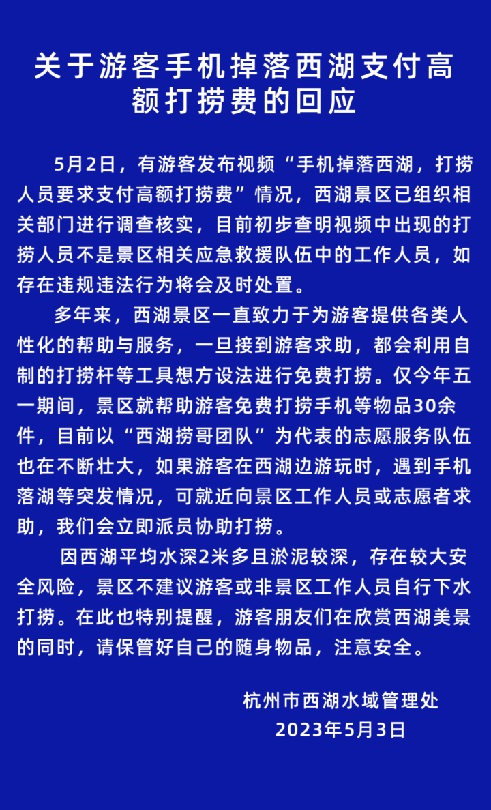

随后，话题“ **湖南男子在西湖捞手机日入约一万”** 也冲上了热搜、

据潮新闻·钱江晚报5月3日报道，今年40岁的黄易勇，来自湖南郴州，曾经干了20年钢筋工，去年3月转行做潜水打捞，他曾在广东当过兵，水性极好，他的工作就是在西湖边打捞游客掉落的物品。

具体价格视物品的贵重程度而定， **手机这样的一般一单1500-2000元不等，**
平常一天可以接2-3单。时值旅游高峰，黄易勇接到的打捞单子也比平时翻了一番， **每天可以接到5-6单，据说日入可以达到约一万元。**

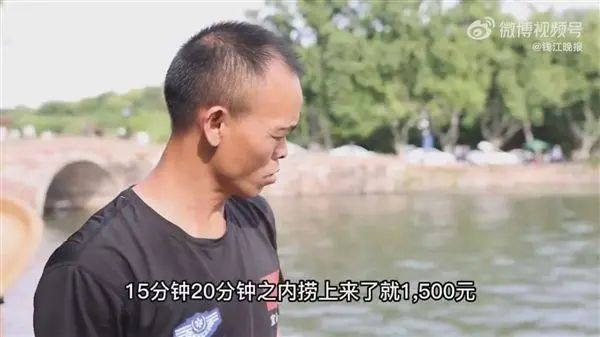

这个事件引起了广泛关注，有游客质疑打捞费太贵了，但黄易勇解释说， **水下打捞是个高危行业，需要专业的技能，设备投入也很大。**

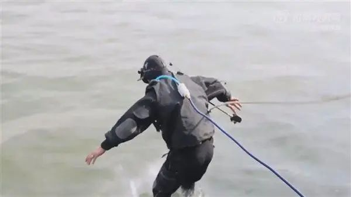

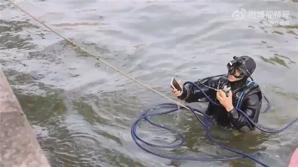

事实上，虽然每个月能赚3万，但黄易勇一个人在杭州过得还是很节俭， **每个月他都要给在老家的妻子和5个孩子寄去至少一万多元的生活费。**
5个孩子，4个在上学，还有一个要吃奶粉，黄易勇肩上的担子很重。“男人就是要把这个家扛起来，苦一点累一点没关系”黄易勇说。

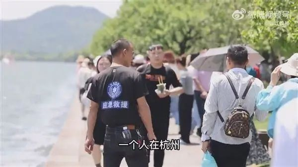

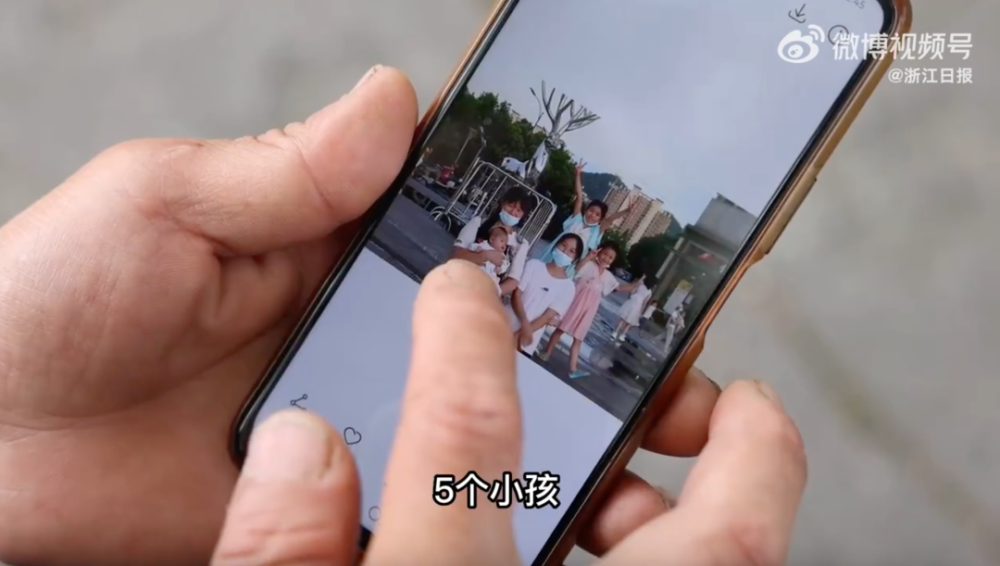

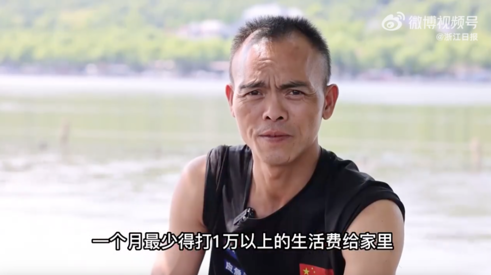

据潮新闻·钱江晚报，从打捞师的角度来看，这项工作确实需要成本。潜水打捞不仅需要耗费大量的时间和精力，而且还需要专业的技能和设备。在黄易勇的工作中，如果设备没有足够的保障，其生命和健康会受到极大的威胁。除了成本之外，这项工作也存在着高风险，因此黄易勇和其他潜水打捞师往往要支付高额的保险费。

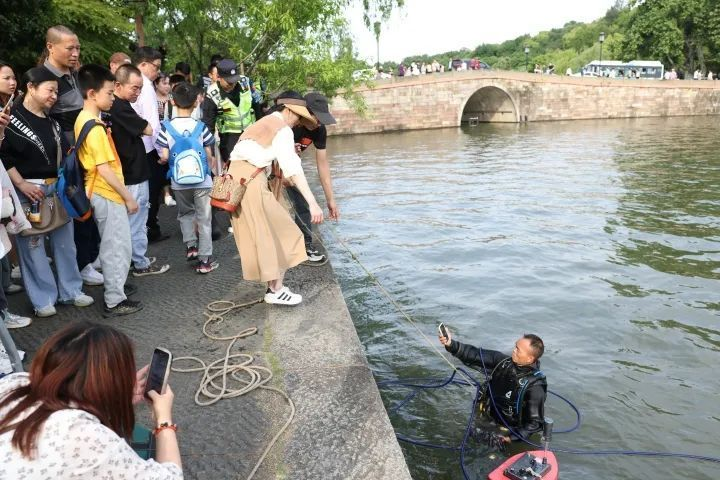

从游客的角度来看，如果手机掉入西湖的深水区，可能需要花费大量的时间和精力来寻找和捞回手机。此外，游客们可能会面临失去手机和贵重物品的风险，这也是一个巨大的成本。在这种情况下，如果游客需要支付一定的费用，他们将获得专业的照顾和及时的救援服务。

此外，我们还应该看到黄易勇所背负的家庭责任。在他的老家，有妻子和5个孩子。他们需要黄易勇为他们提供生活费用，这是黄易勇日常工作的一个重要动力。在这种情况下，我们应该更理解和尊重潜水打捞师黄易勇所做出的努力。

对此，大部分网友都认为：‍‍

**只要是双方提前商量好的价格‍‍，就没问题。**

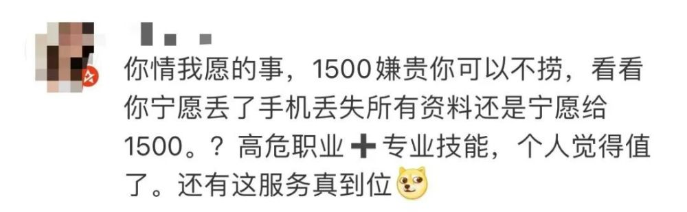

但也有网友表示， **这个打捞价格还是太贵了，不值得。**

**西湖“捞哥”团队刚被央视点赞**

值得注意的是， **西湖边有一支被群众称作“西湖捞哥”的民警队伍。**

就在4月底，央视新闻报道了这支被称作“西湖捞哥”的民警队伍。如果游客把物品掉落湖里，“西湖捞哥”就会来到现场提供帮助，他们有自制的“打捞神器”——打捞杆上有摄像头可以看到水下的情况，能精准快速地将掉落水中的手机等物品捞起。
**根据粗略统计，从2020年到现在，西湖景区打捞各类物品880余件，总价值有450余万元。**

昨天的事件发生后， **有部分网友将职业打捞者误认为是“西湖捞哥”，在这里也要做个澄清。**

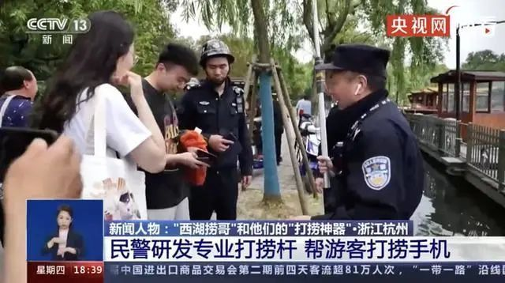

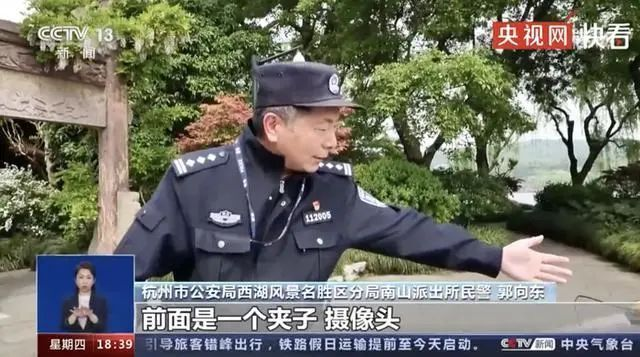

来源：潮新闻·钱江晚报综合自 潮新闻 记者 王建龙 、 朱冬艳、通讯员 沙姝慧、极目新闻、沸点视频、九派新闻、新黄河 、每日经济新闻、微博、网友等

值班编辑：倪王镇

