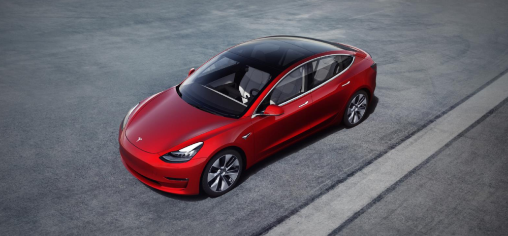
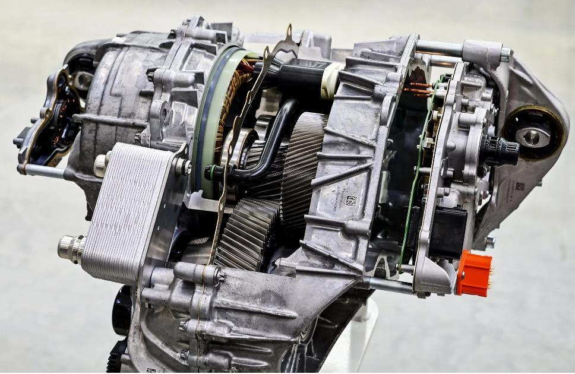
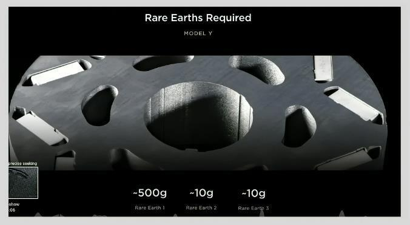
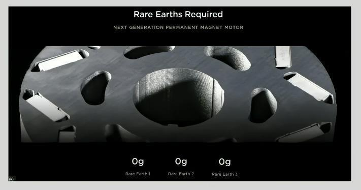

# 特斯拉电机或考虑用性能低的铁氧体取代稀土磁铁

**划重点**

  * _1_ 由于存在供应链问题和环境问题，特斯拉动力总成部门正努力从电机中剔除稀土磁铁，并在寻找替代方案。
  * _2_ 特斯拉尚未发明全新的磁体材料，因此其可能使用现有技术将就一下，最有可能的是使用便宜而容易制造的铁氧体。
  * _3_ 通过仔细定位铁氧体磁铁和调整电机设计的其他方面，可以复制稀土驱动电机的许多性能指标。在这种情况下，电机的重量只增加了30%左右，相对于汽车的整体重量来说，这个差异可能很小。
  * _4_ 新磁体材料需要具备以下三个基本特征：1）需要具有磁性；2）在其他磁场存在的情况下继续保持磁性；3）能承受高温。

腾讯科技讯 5月4日消息，电动汽车制造商特斯拉表示，其汽车电机中将不再使用稀土元素，这意味着特斯拉的工程师将不得不充分发挥创造力寻找替代方案。

上个月，在特斯拉投资者日活动上，埃隆·马斯克发布了“总体规划第三部分”。其中，有个小细节在物理领域引发轰动。特斯拉动力总成部门的高管科林·坎贝尔宣布，他的团队正在从电机中剔除稀土磁铁，理由是供应链问题和生产稀土磁铁带来的负面影响过大。

为了实现这一目标，坎贝尔展示了两张涉及三种神秘材料的幻灯片，这些材料被巧妙地标记为稀土1、稀土2和稀土3。第一张幻灯片代表特斯拉的现状，该公司在每辆车中使用的稀土数量从半公斤到10克不等。在第二张幻灯片上，所有稀土元素的使用数量都降为零。

对于研究某些材料由于电子运动而产生神奇力量的磁学家来说，稀土1的身份很容易辨别，那就是钕。当被添加到常见元素（如铁和硼）中，这种金属可以帮助创建一个强大的、始终开启的磁场。但很少有材料具有这种品质，而产生足以移动重量超过2000公斤的特斯拉汽车，以及从工业机器人到战斗机等许多其他东西的磁场的稀土元素就更少了。如果特斯拉计划从电机中去除钕和其他稀土元素，它会用哪种磁铁来代替呢?

对于物理学家们来说，有一件事可以肯定：特斯拉并没有发明出一种全新的磁体材料。NIron
Magnetics战略执行副总裁安迪·布莱克本说：“100多年来，我们可能只有几次机会得到新的商业磁铁。”NIron
Magnetics是为数不多的几家试图抓住下一次机会的初创公司之一。

布莱克本和其他人认为，更有可能的是，特斯拉已经决定可以用一块功率小得多的磁铁将就一下。在众多可能性中，最明显的候选者是铁氧体：一种由铁和氧组成的陶瓷，与少量的金属(如锶)混合起来。它既便宜又容易制造，自20世纪50年代以来，世界各地的冰箱门都利用这种方式制造。

但按体积计算，铁氧体的磁性只有钕磁铁的十分之一，这就提出了新的问题。特斯拉首席执行官埃隆·马斯克向来以不妥协著称，但如果特斯拉要转向铁氧体，似乎必须做出某些让步。

人们很容易认为电池是电动汽车的动力，但实际上是电磁驱动了电动汽车。特斯拉公司和磁性单位“特斯拉”都以同一个人的名字命名，这绝非巧合。当电子流过电机中的线圈时，它们会产生电磁场，推动相反的磁力，使电机的轴带动车轮旋转起来。

对于特斯拉汽车的后轮来说，这些力是由带有永磁体的电机提供的，永磁体是一种具有稳定磁场的奇怪材料，没有任何电流输入，这要归功于电子在原子周围的巧妙自旋。特斯拉大约在五年前才开始在汽车上添加这些磁铁，以便在不升级电池的情况下延长续航里程并提高扭矩。在此之前，该公司使用的是围绕电磁铁制造的感应电机，电磁铁通过消耗电力而产生磁性。那些配有前置电机的车型目前仍在使用这种模式。

特斯拉放弃稀土和磁铁的举动看起来似乎有点奇怪。汽车公司通常痴迷于效率，尤其是在电动汽车的情况下，他们仍在努力说服司机克服续航里程里程的恐惧。但随着汽车制造商开始扩大电动汽车的生产规模，许多以前被认为效率太低的工程正重新出现。

这促使汽车制造商（包括特斯拉在内）生产更多使用磷酸铁锂(LFP)电池的汽车。与那些含有钴和镍等元素的电池相比，这些车型的续航里程往往更短。这是一种更老的技术，重量更大，储电能力更低。目前由低速动力驱动的Model
3续航里程为272英里（约合438公里），而配备更高级电池的远程Model
S则可以达到400英里（640公里）。但采用磷酸铁锂电池可能是一个更明智的商业选择，因为它避免了使用更昂贵甚至存在政治风险的材料。

不过，特斯拉不太可能只是简单地用更糟糕的东西取代磁铁，比如铁氧体，而不做其他改变。乌普萨拉大学物理学家阿莱娜·维希娜说：“你将在汽车里携带一块巨大的磁铁。”幸运的是，电机是相当复杂的机器，有很多其他部件组成，理论上可以重新排列，以减轻使用较弱磁铁的影响。

在计算机模型中，材料公司Proterial最近确定，通过仔细定位铁氧体磁铁和调整电机设计的其他方面，可以复制稀土驱动电机的许多性能指标。在这种情况下，电机的重量只增加了30%左右，相对于汽车的整体重量来说，这个差异可能很小。

尽管有这些令人头疼的问题，但汽车公司还是有很多理由放弃稀土元素，当然前提是他们能做到的话。整个稀土市场的价值和美国鸡蛋市场差不多，而且从理论上讲，稀土元素可以在世界各地开采、加工并转化为磁铁，但事实上这些过程存在许多挑战。

矿产分析师、颇受欢迎的稀土观察博客作者托马斯·克鲁默说：“这是个价值100亿美元的产业，但每年创造的产品价值在2万亿到3万亿美元之间，这是一个巨大的杠杆。汽车也是如此，即使它们只含有几公斤这种物质，但把它们剔除出去，意味着汽车不再能行驶，除非你愿意重新设计整个发动机。”

美国和欧洲正试图使这条供应链多样化。21世纪初关闭的加州稀土矿最近重新开放，目前供应全球15%的稀土。在美国，政府机构（尤其是国防部）需要为飞机和卫星等设备提供强大的磁铁，它们热衷于在国内和日本、欧洲等地区投资供应链。但考虑到成本、所需的技术和环境问题，这是一个缓慢的过程，需要持续几年甚至几十年。

与此同时，在汽车和风力涡轮机等脱碳工具中嵌入磁铁的需求也在上升。市场研究机构Adamas
Intelligence的数据显示，目前，12%的稀土用于电动汽车，这是一个刚刚起步的市场。与此同时，稀土价格经常出现剧烈波动，而外部企业往往无法预测这些因素。

在德克萨斯大学奥斯汀分校研究磁性材料的物理学家吉姆·切利科夫斯基说，总而言之，如果你所处的行业可以找到替代产品，那可能具有非凡的意义。但他表示，寻找比铁氧体更好的稀土磁铁替代品有各种各样的理由。挑战在于找到具有三个基本特征的材料：1）需要具有磁性；2）在其他磁场存在的情况下继续保持磁性；3）能承受高温。热磁铁不再是磁铁。

研究人员非常清楚哪些化学元素可以制造出好的磁铁，但潜在的原子排列方式有数百万种。有些所谓的磁铁猎人采取的方法是从数十万种可能的材料开始，剔除那些含有稀土等有缺陷的材料，然后使用机器学习来预测剩下的材料的磁性。去年年底，切利科夫斯基等人使用该系统制造一种含有钴的新型高磁性材料。

通常最大的挑战是找到易于制造的新磁铁。乌普萨拉大学的维希娜解释说，有些新开发的磁铁，比如含有锰的磁铁，很有前途，但却不稳定。在其他情况下，科学家们知道一种材料具有极强的磁性，却无法批量制造。其中包括四方辉石，一种只从陨石中发现的镍铁化合物，它必须经过数千年的缓慢冷却才能精确地将其原子排列到正确的状态。在实验室中，试图更快地推进这个过程的努力正在进行中，但尚未取得成果。

磁铁初创公司Niron在这方面走得更远一些。该公司表示，其生产的氮化铁磁铁理论上比钕更具磁性。但它也是一种易变的材料，很难以理想的形式制造和保存。布莱克本表示，该公司正在取得进展，但无法生产出足够强大的磁铁用于特斯拉的下一代汽车。他说，第一步是将这种新磁铁放入音响系统等较小的设备中。

矿产分析师、颇受欢迎的稀土观察博客作者托马斯·克鲁默说，目前还不清楚其他汽车制造商是否会效仿特斯拉放弃稀土的举措。有些公司可能会坚持使用成熟的材料，而另一些公司则会使用感应电机或尝试新的东西。即使是特斯拉，也可能会在未来的汽车上使用几克稀土，散布在自动车窗、动力转向和挡风玻璃刮水器等地方。

在特斯拉的投资者日活动上，对比稀土含量的幻灯片实际上是将一整辆当前一代汽车与未来电机进行了比较，这可能是一种宣传噱头。像特斯拉这样的变通办法正在开发中，替换电机中的稀土材料可能是件好事，但正如克鲁默所说：“恐怕我们没有足够的时间。”（金鹿）

