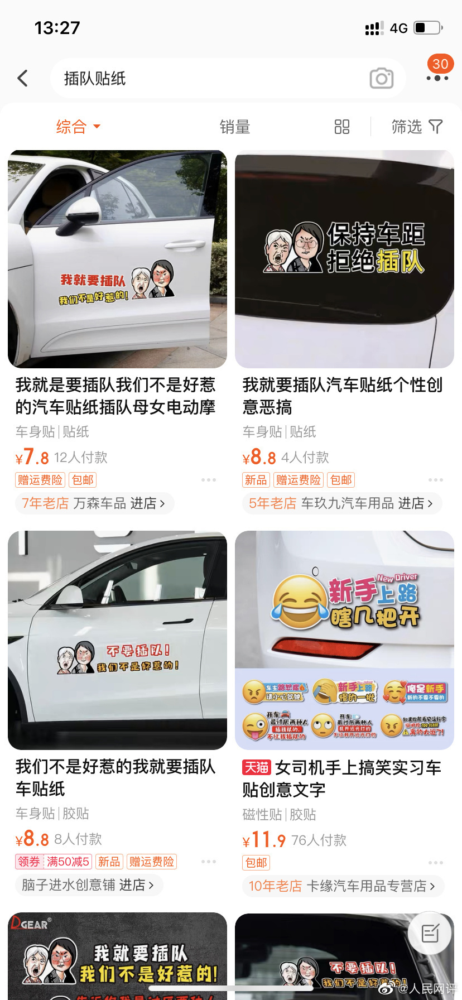

# 疑似“插队婆孙”形象被制成卡通车贴，媒体：事件不能滑向违法边缘

“平移插队”事件仍在发酵。起因是，此前，两女子被指插队当场发飙？当事人：遭男子大力拉扯，被对方冤枉插队相关视频被传上网后引发热议。当事人称，当时是排错队后“平移”换队。如今，两人行踪疑被偷拍，且形象被恶搞成表情包，更有商家借此牟利。

是插队还是换队？并不难判断。此事之所以在舆论场中形成热点，一个重要原因是，公众对插队行为颇为反感，尤其对插队后仍振振有词、喋喋不休的行为，更是抵触。应该说，这是共识。

但如今，两名当事人的形象被做成表情包、做成车贴等，如此丑化，则需警惕。

名为创意车贴，实为恶意车贴。纵观这些车贴，内容是疑似两个人的肖像，再配以“我就要插队，我们不是好惹的!”等文字，指向性显然很明确。

一码归一码。涉事女子如果被坐实插队，当然该受批评，但是，可以批评她们，不能网暴她们，不能采取非法手段污名化她们。创作漫画讽刺她们，要把握住度。将她们的形象做成表情包，且在网上销售，更是一种法律冒险。

民法典明确规定，不得使用侮辱性言辞等贬损他人名誉。具体到这一事件，作为自然人，婆孙两人享有应有的肖像权、名誉权，她们的合法权益受到法律保护。制作表情包恶搞她们，通过污言秽语网暴她们，则触犯了法律。

如果说一些网友嘲讽她们，乃至较为尖刻的言辞贬损她们，属于无意识，那么在相关平台上兜售她们表情包的商家则属于有意识地消费她们。无论制作表情包的人，还是销售她们表情包的人，都应该承担相应的责任。

令人费解的是，如此可恶的车贴等，为何能够堂而皇之地在网上销售？这类产品明显侵犯他人权益，属于问题产品，为何未被禁止？由此不能不提平台责任。身为平台，当尽到主体责任，做到守土尽责。如果对此睁一只眼闭一只眼，乃至视而不见，客观上就起到了鼓励作用，扮演了不光彩的角色。

诚然，商家借此牟利该受谴责，平台默不作声同样该受谴责。对于商家来说，不得销售或者提供法律、行政法规禁止交易的商品或者服务，这是底线要求。对于平台来说，一旦发现商家销售违法商品，应当依法采取必要的处置措施，并向有关主管部门报告，这也是底线要求，且写入了电子商务法。

由此可看，面对那些侵权网暴商品，平台不能作壁上观，更不能任其热销而乐见其成。

“平移插队”事件可以引发有关文明的讨论，但是不能失焦，不能跑偏，不能滑向违法边缘。期待相关平台早日担起责任，将问题产品尽快下架。

