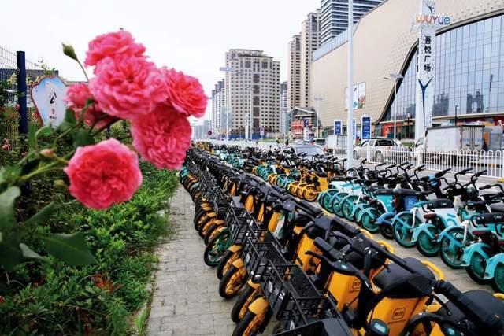

# 高价拍卖之风被叫停！这些城市靠共享单车创收？

早在2021年，北方的一个地级市，一次共享电单车骑行之后，国际关系学院法学院教师祖博媛惊讶地发现，系统显示她要支付的骑行费用为十几元，已经超过了家乡出租车的起步价。这次骑行距离并不长，经停两三个地点，这个价格让祖博媛感到奇怪，她还记得第一次使用共享电单车的体验，“很便宜，一块钱一次”。

祖博媛长期关注共享经济，发现共享电单车涨价，她觉得“挺不正常”。很快，祖博媛通过新闻得知，全国多地的共享单车都已上调了收费标准。共享单车涨价后，多地对共享单车企业收取市场准入费用的消息，就在关注共享经济的学者之间流传。

2022年5月11日，石家庄市以线上拍卖方式，公开拍卖长安区、桥西区等五城区共享两轮车“占用公共资源3年有偿使用权”，曾引发广泛的舆论关注。

“在市场准入方面，目前我们约有70％的业务需要获得政府批文，以与政府签订协议的方式进入，有20％通过招投标进入，还有10％是继承原品牌、中标商转包等其他方式进入。”一家不愿具名的共享单车企业告诉《中国新闻周刊》。

如今，公开招投标或拍卖等方式陆续被叫停。将市内10万辆共享两轮车运营权高价拍出还不满一年，4月3日，石家庄市交通局网站发布落款为“河北金正拍卖有限公司”的公告，宣布废止《石家庄市互联网租赁自行车及互联网租赁电动自行车占用公共资源市场化配置
3 年有偿使用权项目拍卖公告》。

至此，备受舆论关注的“石家庄共享两轮车运营配额天价拍卖事件”暂告段落。作为对共享两轮车“以卖代管”的典型案例，石家庄的自我纠正，亦因其示范效应，引发广泛关注。

各地竞相违法、违规为共享两轮车设置市场准入障碍背后，是作为新业态及“公共交通有益补充”的共享两轮车，为城市管理、政府监管带来的难题，仍待破局。

**十倍于底价成交的拍卖**

“便捷和便宜，这是共享经济被大家接受的重要原因，尤其是共享单车，锁定的是价格敏感人群。当骑行价格超过打车费用，就意味着共享单车的市场会逐渐缩小，直至消失。”祖博媛本能地感到警觉，地方政府针对共享单车行业的行动，成了她重点研究的一部分。

争议最大的，是遵循“价高者得”逻辑的拍卖，而直接或变相拍卖的对象，就是当地的共享单车运营权。

_湖北襄阳市街头的共享电单车。图/视觉中国_

石家庄于2022年5月进行的拍卖共设5个标的，面向全国的共享两轮车企业，共有11家企业报名，最终有9家企业通过资格审查。全国公共资源交易平台产权交易信息显示，10万辆共享两轮车的分配组合基本在“12000辆共享单车+8000辆共享电单车”这个基准上下浮动，而每个标的的起拍价则设定在340万元上下。

经过长达3小时、共计285轮的激烈竞价，最终由哈啰单车、青桔单车、人民出行、石家庄圣庄交通科技4家企业竞得。拍卖结束后，有媒体披露，5个标的的成交价高达1.89亿元，石家庄市对此并未置评，一家参与竞拍的企业向《中国新闻周刊》证实了这个数字。

“这是我市解放思想观念，创新城市管理的一次积极探索，有利于推动城市资源价值发现，促进省会互联网租赁自行车行业规范管理和健康发展，更好地满足广大人民群众出行需求。”石家庄市政府在其网站刊文评价此次拍卖。据文章介绍，这次拍卖的目的是“深化经营城市理念、推进城市公共资源市场化配置”。

几乎在同一时间段，2022年4月，湖南省张家界市发布城区共享电单车 5 年特许经营权拍卖公告，4500 辆共享单车被分成 2000 辆、1500
辆、1000 辆 3 个标的，竞拍底价分别为 187 万元、141 万元和 94 万元，并于 2022 年 5 月进行网上拍卖，成交金额超过 4500
万元，其中底价为187万元的标的，成交价为1877万元，是竞拍底价的 10 倍以上。看到这个案例，祖博媛发现，这使得每辆车每天支付的拍卖费成本大概在6元。

再往前，2020年，云南省瑞丽市住房和城乡建设局就以特许经营权拍卖方式，将瑞丽市城区、姐告城区 2500 辆共享电单车 5
年特许经营权及瑞丽市城区、豌町城区 2300 辆共享电单车 5 年特许经营权分为两个标的进行拍卖，起拍价格分别为 228 万元、209
万元，未中标企业退出当地市场。其中，城区、姐告城区 2500 辆共享电单车 5 年特许经营权成交价高达 6500 万元。

“在不计算单车本身成本和运营成本的情况下，每辆车每天特许经营最高准入成本约为14元，这个价格远远超过很多城市车辆的单日营收总额。”前述共享单车企业告诉《中国新闻周刊》。

企业对高价拍卖引起各地争相效仿的担忧不是空穴来风。仅从国家发改委的通报来看，拍卖共享单车运营配额的，还先后有福建省福鼎市、湖北省随州市曾都区、福建省南平市延平区。

“拍卖获得配额，是纯粹的‘价高者得’逻辑。一方面，企业不能通过拍卖以外的方式进入市场，存在一般禁止的情形；另一方面，拍卖成交价必然高昂，实质上为企业设置了资金实力的过滤条件。”《中国共享两轮车规制主要法律问题分析》（下称《规制报告》）报告分析，祖博媛是报告的主要作者之一。

**形形色色的准入障碍**

事实上，比吸睛的拍卖更为常见的，是各地政府通过招投标出售运营配额。

实践中，这些配额出售所使用的名目各不相同，有的是直接出售“共享单车运营份额”，有的是出售“共享单车特许经营权”，还有的是“占用市政道路基础设施资源使用权”。

“通过招投标来获得经营配额是共享两轮车常见的准入方式。”前述《规制报告》指出，各地招投标的条件各不相同，很多地方通过招标设置了诸多企业经营条件，有的还要求企业向监管机关付高额费用才能进入当地市场。

以湖北省随州市曾都区为例，除了将共享单车运营份额分成3到4个资源包拍卖，曾都区城市管理执法局发布的《随州市曾都区共享单车特许经营准入实施方案（征求意见稿）》公告，还规定共享单车企业准入条件为在本地设立独立法人企业，并授权该企业独立运营管理权限（含批量锁车和开启权限），有固定办公、中转维修场地。

同样要求中标运营企业在本地注册登记或设立分支机构的，还有云南曲靖。2022年1月，曲靖中心城区共享单车5年经营权被北京阿帕科蓝科技有限公司和云南捷行汽车租赁有限公司分别以
950 万元/年、1000万元/年的价格中标。

除了直接以运营权名义收取准入费用，也有地方在招标时，以管理名义收取准入费用。其中包括含义不明的“基础管理费”“公共资源使用费”，以及相对明确的“停放秩序管理费”“占道费”“垃圾清运费”。

福建省龙岩市长汀县将2000辆共享单车拆分为各含1000辆车的合同包，以每辆车基础管理费最低限价50元/月的条件，向社会公开招标。最终有两家共享单车企业分别以每辆基础管理费57元/月、68元/月中标。

云南省华宁县600辆共享电单车3年经营权的招标，要求中标企业支付市政公共资源有偿使用费，报价按每辆每天 1 元起步，中标企业还要缴纳每辆每天 0.1
元垃圾清运费（固定价格，不在报价范围内）。

值得注意的是，亦有地方政府将特许经营权直接或变相转让给国有企业，由国有企业直接向共享单车运营企业分润抽成。

比如，云南省文山市，据参与文山市招标的企业介绍，合同写明，文山市城市交通服务公司抽取营业流水的15％。而在云南大理，招标直接由大理市城市更新置业有限公司开展，共享单车企业须将营业流水的
10％上缴给城市更新置业有限公司，作为市政基础设施特许经营权合作服务费。

还有些城市的主管部门与企业签订独家战略合作协议。比如，2017年12月，山东省滨州市城市管理局通过招投标方式，确定哈啰单车为滨州市城区唯一运营品牌。双方签订的《战略合作协议》约定：“为避免单车同行无序投放，控制城市车辆总数，甲方不再引进乙方以外的共享单车品牌。如有其他品牌的单车未经甲方许可就随意投放，甲方将联动相关部门进行车辆管控”。协议有效期为5年。

无独有偶，2019年11月，山东省高密市综合行政执法局委托山东诚德信项目管理有限公司，以公开招标方式，确定潍坊快跑网络科技有限公司为中标单位。高密市综合行政执法局与潍坊快跑网络科技有限公司签订《共享助力自行车运营合同》，合同有效期为
5 年，以此指定潍坊快跑公司为高密市区域内唯一一家共享单车运行企业。

《中华人民共和国反垄断法》第四十条规定：“行政机关和法律、法规授权的具有管理公共事务职能的组织不得滥用行政权力，通过与经营者签订合作协议、备忘录等方式，妨碍其他经营者进入相关市场或者对其他经营者实行不平等待遇，排除、限制竞争。”签订独家战略合作协议的做法，涉嫌行政垄断。

**被滥用的“行政许可权”**

据红星新闻报道，云南省内的共享单车市场准入障碍，是在国务院第九次大督查背景下，国务院第十四督查组于2022年8月，赴云南开展共享单车市场准入情况督查调研时摸排到的。督查组当时指出，云南共享单车市场企业难“共享”。

地方政府为共享两轮车设置市场准入障碍的做法，也正是在2022年在全国各地快速蔓延开来直至爆发。

国家发改委也在当年出手治理。2022年11月，国家发改委在《违背市场准入负面清单典型案例的通报》中，通报了15起地方政府为共享两轮车设置市场准入障碍的案例，在这次共有23起典型案例的通报中，共享两轮车相关案例占比65％。这是中国自2018年底全面实施“市场准入负面清单制度”、国家发改委2021年底建立“违背市场准入负面清单案例归集和通报制度”以来，国家发改委首次通报共享两轮车行业遭遇市场准入障碍。

今年3月16日，国家发改委发布最新一批《违背市场准入负面清单典型案例的通报》。22起案例中，又有6起共享两轮车企业遭遇市场准入障碍的案例。

“违规设置准入障碍”“滥用行政权力排除其他企业准入经营”“变相、违规增设市场准入条件”“变相、违规转让特许经营权”……梳理国家发改委的通报不难发现，针对不同的准入障碍情形，发改委有不同的判定。但除了明确高密市综合行政执法局的行为违法外，其他判定多停留在“违规”或事实陈述层面，没有进一步做出这些行为是否违法的判断。

国家发改委通报前述典型案例时，还对主动开展案例排查、整改的云南省发展改革委、云南省西双版纳州、丽江市，山东省发展改革委、山东省滨州市，河南省发展改革委、河南省安阳市提出了表扬。

值得注意的是，被通报案例中，仍有不少案例仍在整改中。而通报之外，亦有效仿被通报案例设置障碍的地方政府还在观望。

“国家发改委作为国务院的职能部门，与各级地方政府之间的关系较为复杂。《立法法》就提到，地方性法规和国务院的部门规章具有同等效力，当它们之间发生冲突，需要由国务院来裁判。也就是说，国务院职能部门与地方，并不是‘前者发出命令后者只能服从’这么简单，央地关系中间存在博弈。”祖博媛分析。

2018年底，中国开始全面实施市场准入负面清单制度。祖博媛介绍，在“清单制度”实施以前，行政许可权处于不断“收缩-
膨胀”的怪圈。“如果不对行政许可进行严格控制，它就会在各个环节产生你很难事先预想的变形。在这种情况下，推行‘清单制度’，行政审批事项到底是增了还是减了，就一目了然。”祖博媛解释。

在今年2月召开的以“完善市场准入制度，优化营商环境”为主题的研讨会上，住建部原副部长仇保兴表示，相关地方如果违背市场准入负面清单限制企业经营，不仅损害了市场主体权益，而且也限制了市民选择出行方式的自主权。

中国政法大学副校长时建中认为，特许经营分为商业和政府两类，政府特许经营应面向提供公共产品的公用事业。共享单车解决了居民交通出行最后一公里不便的问题，干的是政府干不了也不愿意干的事情，纳入特许经营于法无据，损害了市场竞争和消费者权益。

《规制报告》认为，特许经营权的法源是《行政许可法》第12条第1款第2项规定，本质上也是一种行政许可。

从各地规制共享两轮车的举措来看，受访专家均表示，应回归行政许可设定的法理和权力来源分析地方政府的行为。

“行政许可设定权的规定是非常严格的。”温州大学法学院教授茅铭晨告诉《中国新闻周刊》，就地方政府而言，要省一级政府的规章才能够设定临时性的行政许可，临时性行政许可只能实施一年。“所以，比省级政府更低层级的地方政府，或者地方政府的职能部门都无权针对共享单车设置行政许可。”

在省级以下政府的职能部门无权设置行政许可的情况下，各地行政机关出现多种多样的未经法律和法定程序授权，利用招标、拍卖公共资源等方式，实质上设立市场准入审批、许可条件，达到与行政许可相同的效果，这就是所谓的“变相设置行政许可”。

“共享两轮车本身的定位是模糊的，比如它作为公共交通的有益补充，是否可以适用公共事业的特许经营？在答案不明确的时候，就会出现行政机关对此随意解释的问题。”祖博媛分析，“互联网+”经济浪潮之后，很多的经济行为都为亟须监管，但传统的行政法理论又不能为监管提供充足的、合适的、有效的措施或手段。

茅铭晨曾经担任某市政府的高级法律顾问，他发现，在监管共享单车行业时，一些地方政府会明显出于保护本地企业的目的而采取排除、限制竞争的做法，另一些地方政府则是从共享单车影响市容的角度出发，试图直接取缔。

“我当时就建议该市政府，如果共享单车企业运营不规范，政府可以按照有关规定进行整治甚至依法处罚，但是不能直接采取禁止进入或者取缔的方式来管，因为这种事前限制的行为就具备行政许可的性质，名堂、名义再多，实质都是设置行政许可，这个行为肯定违法。”茅铭晨回忆。

**监管难题待破局**

共享两轮车的市场准入问题为何会集中爆发？

有学者分析认为，共享两轮车市场被部分地方政府视为新的财源。石家庄市“推动城市资源价值发现”的表述似乎也侧面印证了这种判断。

从共享两轮车行业来看，其早期发展过程中带来的无序投放等城市管理问题，也为今天的情形埋下了伏笔，为地方政府的规制带来了“合理性”。

相比于共享单车被普遍接纳，共享电单车面临更复杂的管理博弈。

“中央层面，有关部门在不同时期对共享电动车行业发展的政策内容截然不同；地方层面，各地准入、监管规范差异巨大。”《规制报告》举例，2017年8月，交通运输部等10部门联合发布的《关于鼓励和规范互联网租赁自行车发展的指导意见》以安全风险和铅酸蓄电池污染问题为由，提出“不鼓励发展互联网租赁电动自行车”。而2019年3月，国家发改委等七部委联合印发《绿色产业指导目录（2019
年版）》，提出要将互联网租赁电动自行车纳入共享交通设施建设和运营之中，并指出“互联网电动车租赁作为共享交通的典型代表……是促进交通出行领域供给侧结构性改革的新兴力量”。到了2019
年3月，市场监管总局等三部门联合出台的《关于加强电动自行车国家标准实施监督的意见》指出要“按照国家有关政策要求，清理共享电动自行车”。

这也导致各地政府“无所适从”。宣威市市长许韶发就表示，对共享电单车的特许经营进行公开招投标是公平竞争的体现，“共享电单车作为新业态，方便了群众出行，但也带来管理难题。管好了是城市风景线，管不好，变成了城市的负担。”

“按照《行政许可法》的精神，共享两轮车行业可能带来的问题，可以通过事中、事后监管来规制，而不是一味选择行政机关认为比较方便的方式，一刀切地限制、取缔。”茅铭晨表示。

但眼下，共享两轮车的监管问题仍待破局。“国家发改委连续通报之后，地方政府无论是寻求通过立法，合法设立行政许可，还是变相设置行政许可，压力都是比较大的，市场准入方面的行政违法不那么容易了。接下来各方要面临的挑战是共享单车到底应该怎么管，涉及的是合理、精准、科学监管的问题。”祖博媛分析。

《规制报告》梳理发现，在对共享两轮车进行法律规制的城市中，上海、北京和宁波都通过市人大常委会颁发“非机动车安全管理条例”的方式展开行政管理，也意味着它们都可以对非机动车安全管理事项设置常设性行政许可。但事实上，三部地方性法规中都没有设立特许经营。

《上海市非机动车安全管理条例》确立了对共享两轮车实行“总量调控”。在祖博媛看来，“各地在立法时还是要秉持包容审慎的态度，因地制宜，因城施策。当前行业格局已然不是共享两轮野蛮生长的时期，行业的商业逻辑也发生了根本性的变化。但由于城市道路空间有限，政府对共享单车的停放秩序也存在监管必要性，很难简单得出‘总量控制不合理’的结论。只能说，不要过早地做出定论，这对行业不一定是好事。比如总量限制下，可能就会过滤掉一些有创新能力的小微企业。”祖博媛说。

值得注意的是，将“总量控制”写进《管理条例》的上海建立的总量调控管理机制，提出城市道路运输管理部门建立共享两轮车行业信息服务平台，会同公安、城管执法等部门实施服务质量评价制度，并根据评价结果，对互联网租赁自行车运营企业的车辆投放数量进行动态调整。

祖博媛认为，这种动态调整和服务质量评价制度是事中、事后监管的创新。地方政府需要进一步探索如何通过数字化的方式来实现精细监管和科学监管，有必要对共享电单车与共享自行车进行分类监管，在未来城市发展中重视共享两轮的绿色价值，尤其需要挖掘共享两轮在城市碳中和方面的贡献和潜力。

“《国务院关于加强和规范事中事后监管的指导意见》提出，对于新技术、新产业、新业态、新模式，要按照鼓励创新的原则，留足发展空间。所以我们需要给新业态一些时间，也根据各地的创新活力和尝试，来判断究竟适用哪一套规则来监管才更加合适。我们都还处在探索过程中，让子弹再飞一会儿。”祖博媛说。

发于2023.5.1总第1090期《中国新闻周刊》杂志

杂志标题：被叫停的共享单车“配额拍卖”

记者：王宇

