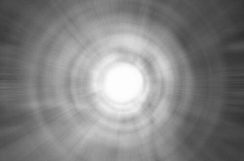

# “灵魂”真能出窍？研究表明：心脏停止跳动后大脑活动突然爆发

_起死回生的人经常有“灵魂出窍”的经历。图片来源：MAX2611/GETTYIMAGES_

许多濒临死亡或起死回生的人都有过类似的经历：难忘的时刻在脑中回放，还可能会发生“灵魂出窍”，感觉自己在房间的其他地方看着自己。

5月1日，一项发表于美国《国家科学院院刊》的小型研究绘制了4个人在死亡时的大脑活动图。结果显示，他们在心脏停止跳动后，大脑活动突然爆发。

作者表示，这一发现可能解释了一个人的大脑如何在心脏停止跳动后回放有意识的记忆。

“这表明人们正在确定一个清醒意识的标志。”未参与这项研究的美国纽约大学朗格尼医学中心肺科专家SamParnia发表评论说。

尽管死亡在医学上被定义为心脏不可逆转地停止跳动的那一刻，但最近的研究表明，许多动物和人类的大脑活动可以持续数秒到数小时。“我们关于生死的二元观念既古老又过时。”Parnia说。

论文通讯作者、密歇根大学神经学家JimoBorjigin表示：“我震惊地意识到，我们对死亡过程中的大脑活动几乎一无所知。”她和团队研究了4位处于昏迷状态并依靠设备支持的病人的医疗记录。

医生给这4位病人戴上了脑电图帽。在医生取下呼吸机之前和之后、每位病人最后一次测量心跳期间以及大脑所有的活动停止前，脑电图帽持续监测病人大脑表面的电信号。在呼吸机被取下几秒钟后，其中两位病人的大脑突然被一种称为伽马波的高频神经元活动照亮。

路易斯维尔大学神经外科医生AjmalZemmar表示：“在濒临死亡的人身上看到伽马波，表明大脑在最后时刻回放难忘事件存在生物学机制。”

对于这项研究中只有两人显示出伽马波活动，比利时列日大学生物医学家CharlotteMartial并不感到惊讶，因为并非所有在死亡边缘幸存下来的人都有记忆回放或“灵魂出窍”的经历。

Borjigin指出，大脑显示出伽马波活动的两个人有癫痫发作史，这可能会使他们的大脑经历异常节律。

研究小组还发现，病人大脑中颞顶枕交界区的活动增加。该区域被认为与意识有关，在做梦、癫痫发作和“灵魂出窍”时被激活。

Borjigin认为，大脑活动的爆发是一种生存模式。对脑死亡动物的研究发现，器官开始释放大量信号分子，并产生不寻常的脑电波模式，试图使自己苏醒。（原标题《“灵魂”真能“出窍”吗》）

相关论文信息：

https://doi.org/10.1073/pnas.2216268120

（来源：王方/中国科学报）

