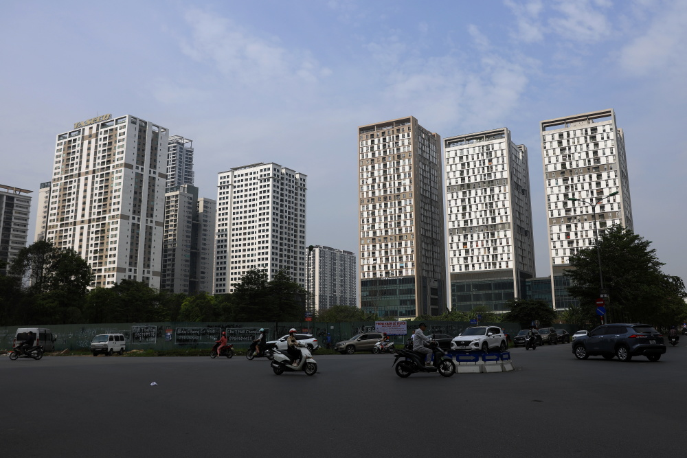

# 出口下滑、企业停业、房地产震荡，越南“经济寒意”下欲瞄准中国市场

【环球时报特约记者黄东日 环球时报记者
赵觉珵】在2022年创下过去25年来最高经济增幅后，越南经济在2023年开年被认为踩下了刹车。根据越南统计总局最新公布的数据，该国今年一季度国内生产总值（GDP）同比增长3.32%，低于市场的普遍预期。过去一年里，越南凭借8.02%的经济增速成为地区乃至全球的经济发展亮点之一。越南经济缘何减速？它的基本面到底如何？与中国的经济合作会怎么走？为此，《环球时报》近日采访了来自中越两国的人士和专家。

_越南：房地产行业仍困难重重，一季度停业企业同比增近61%（IC
photo）_

**一季度停业企业达4.29万家**

越南经济在2023年一季度遇到的阻力，该国政府很大程度归因于国际环境导致的出口下滑。越通社援引该国总理范明政的话称，越南受到全球经济恶化的影响，面临的困难多于机遇。公开资料显示，越南的出口占整体GDP比重约80%，一旦出口不利，经济增长必然受到影响。

越南统计总局称，今年第一季度越南出口同比下降11.9%。其中，纺织品和鞋类订单下降70%—80%，电子产品出货量也同比下降10.9%。

经济下行，也让当地民众感受到寒意。在河内一家银行工作近8年的裴德幸告诉《环球时报》记者，最近两个月，她都没有奖金，在外贸公司当主管的丈夫工资下降一半，“一下子感觉家庭生活压力大了很多，都不敢多买化妆品了”。裴德幸还表示，她的妹妹在北宁省一家韩国工厂上班，由于上个月工厂停产，现在也失业了。

北宁省是越南制造业和外商投资的中心之一，韩国三星在北宁设有工厂。但从去年下半年开始，多家外媒就报道三星越南工厂将减产的消息。越南工贸部统计显示，一季度全国停业企业达4.29万家，同比增长20.1%；约1.28万家企业停业等待解散，同比增长13.1%；完成解散的企业4600家，同比增长6.5%。

越南中国商会副会长兼胡志明市分会会长缪仁赖对记者表示，今年一季度，受欧美市场消费不振影响，越南进出口整体出现下滑，一些外资工厂也有裁员、停工情况，市场确实存在不乐观情绪，但越南经济依然存在潜力。

**外贸与房地产**

不少分析称，越南经济近期的挑战与国际环境有关联。越南问题专家、海南热带海洋学院东盟研究院院长古小松在接受《环球时报》记者采访时表示，越南有着明显的外向型经济特点，出口对于经济有着重要的拉动力。一段时间以来，疫情影响仍未完全消退，加之地区冲突带来的影响，这些因素拖累全球经济复苏，也让越南出口受到较大影响。

一些经济学家分析称，越南面临的外部风险还包括持续的全球通胀压力、央行货币紧缩趋势、主要贸易伙伴的经济放缓比预期更严重，以及全球价值链持续中断等，这些因素均加剧了越南出口面临的压力。

古小松说，越南与进出口直接关联的第二产业在一季度也表现不佳，下降0.4%，使经济总量下降4.76%。近一两年来，受疫情影响，胡志明等地的工厂开工率不足，疫情后也没有完全恢复，这也导致越南整体就业受到影响，进而影响其国内消费。

除上述因素外，越南房地产市场的震荡也依然余波未散。《日本经济新闻》报道称，由于2022年有关公司债券发行的违规行为曝光，越南政府加强监管，加大力度整顿房地产市场，融资难叠加高利率导致该国房地产市场销量下降。

胡志明市房地产协会主席黎黄洲称，“情况非常困难，越南房地产公司经营不善将对国家税收和经济增长产生负面影响”。

**瞄准中国14亿多人口的巨大市场**

越通社称，越南设定的2023年经济增长目标为6.5%，是一项具有挑战性的任务。古小松认为，越南今年经济增速在5%左右的可能性比较大，是否能够达到6%依然要看越南政府的措施。目前，越南正加大基础设施建设，以弥补高速公路、机场、港口等方面不足，这对于拉动经济也有促进作用。

古小松说，越南能够利用的另一优势是其加入的一系列自贸协定，包括《区域全面经济伙伴关系协定》（RCEP）和《全面与进步跨太平洋伙伴关系协定》（CPTPP）。他认为，越南通过吸引外资、扩大出口的发展路径目前看是不会改变的，而未来扩大欧洲和中国市场都会对其经济起到重要作用。越南正在扩大其农产品出口，尤其是要瞄准中国14亿多人口的巨大市场。

越南蔬果协会秘书长邓福元告诉《环球时报》记者，一季度越南蔬果出口达10亿美元，同比增长7%，预计第二季度将增长10%以上，因为对中国市场出口会大幅增加。“我们计划把今年越南蔬果对中国市场出口额提升至25亿美元，占全国出口总额的62.5%”。

越南也是中国企业对外投资的重点国家。越通社称，2015-2022年期间，来自中国的投资注册资金持续增长，年均复合增长率达17%。

缪仁赖告诉《环球时报》记者，他经常接待来自国内的考察团，中国企业对越南仍然抱有很大兴趣，尤其是业务主要面向美国的企业，获得越南的产地证可以规避一定的出口风险，RCEP的生效也推动了这一趋势。“但并非所有的企业都适合来到越南。一方面企业应该深入了解当地情况和政策；另一方面，企业也需要拥有核心技术和一定规模，中小企业盲目走出去很容易被取代。”

