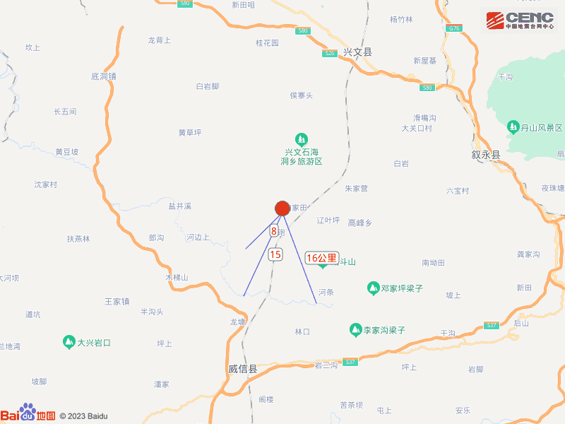

# 四川宜宾市兴文县发生4.3级地震，震源深度8公里

据中国地震台网正式测定，5月5日20时33分在四川宜宾市兴文县发生4.3级地震，震源深度8公里，震中位于北纬28.08度，东经105.12度。

本次地震周边5公里内的村庄有碗厂、月亮田、四里坪、半坡、八字山、杉树、柏杨村、大砲、河坝场、天蓬寨，20公里内的乡镇有旧城镇、罗布镇、高田乡。

震中距兴文县27公里、距云南威信县27公里、距叙永县33公里、距珙县57公里、距长宁县59公里，距宜宾市88公里，距成都市296公里，距重庆市216公里。

震中5公里范围内平均海拔约1082米。

根据中国地震台网速报目录，震中周边200公里内近5年来发生3级以上地震共286次，最大地震分别是2021年9月16日在四川泸州市泸县发生的6.0级地震（距离本次震中127公里）和2019年6月17日在四川宜宾市长宁县发生的6.0级地震（距离本次震中36公里），按震级大小前50次历史地震分布如图。

