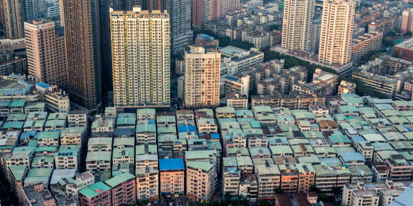

# 大规模棚改重启？住建系统人士：没听说

**经济观察网 记者 陈月芹** 5月5日，一张写着“21个特大及以上城市允许棚改
还有平急两用基础设施建设”等字眼、没有来源出处的截图在地产圈内流传。当日，地产股大面积翻红。

一位头部房企IR负责人从投资人处了解到，棚改重启和平急两用基础设施建设的传闻是引起地产股上扬的其中一个因素，此外，5月4日晚，融创中国披露约85%的债权人已加入债务重组支持协议，让其他爆雷房企同行看到出路，也一定程度上给予了市场信心。

从单日涨跌幅看，融创中国（1918.HK）以17.7%的涨幅排名第一，中交地产涨10%，龙光集团、金地集团、华发股份、合景泰富、碧桂园、新城控股、佳兆业集团、滨江集团、中骏集团等涨幅在5%以上。50强房企中仅正荣地产等8家股价出现下跌。

近两日，正是4月房企月度销售和“五一”假期销售数据密集面世的时间。克而瑞的报告显示，“五一”假期整体市场成色一般，26个重点城市成交环比下降48%，近乎“腰斩”，在2022年较低基数上同比增33%。

与此同时，4月楼市延续了3月下旬的降温势头，百强房企销售环比下滑14.4%，50强房企的4月销售金额、销售面积环比分别下降18%、22%。

但在不景气的销售数据之上，5月5日的地产股几乎全线上扬。

对于网传的“21个特大及以上城市允许棚改”、“平急两用基础设施建设”政策利好，经济观察网求证了多位不同层级住建系统人士，得到的反馈为：没听说。

“平急两用基础设施建设”最新的公开官方说法来自于4月28日政治局会议，会议指出，在超大特大城市积极稳步推进城中村改造和“平急两用”公共基础设施建设，规划建设保障性住房。

一位地方住建局官员对网传消息真实性存疑，“资金没有出路，有出点消息就借机炒作的嫌疑”。首先，棚改在2014年前后大规模启动，经历数年，已经基本谢幕，而且棚改要配合PSL专项贷款，如果银行端不放，用处不大；其次，“平急两用”虽是新提法，但和楼市买卖没有直接关系。

4月18日，国家发展改革委“平急两用”设施建设调研在北京平谷召开。会议上，北京市副市长高朋表示，推动建设“平急两用”设施是统筹城乡融合发展、构筑城市安全防线的重要途径，侧重于探索应对公共安全突发事件和自然灾害“平急两用”体系，统筹公共安全保障。

也有地产分析师认为，超大特大城市“平急两用”的基础设施缺口较大，或带来较大体量的投资机会。

