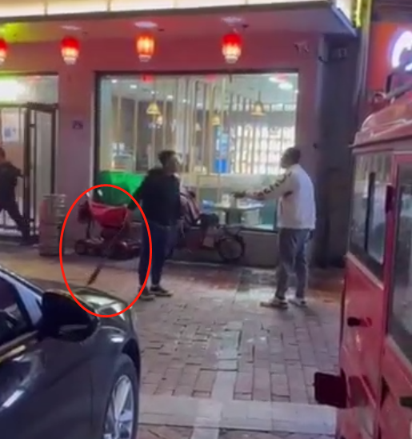

# 山东青岛网红“直播约架”被当街持刀砍伤？网友质疑是剧本，警方回应

5月4日晚，有数位网友爆料，在山东青岛即墨区一饭店门口，发生一起当街砍人事件。视频中一名黑衣男子持长刀砍向白衣男子。有网友称，被砍白衣男子疑似当地网红“xx老九”周某某。

5月5日，附近商户告诉潇湘晨报记者，事情发生在4日晚上七八点钟左右。所属辖区通济派出所工作人员对此回应记者称，案情详细信息不方便透露。

网传视频显示，在街道处，黑衣男子与白衣男子先是相互叫嚷，随后走到了一家饭店门口，黑衣男子手持长刀，砍向了白衣男子，白衣男子则抬起胳膊挡刀。此时饭店内有人出来关上店门。随后两人在饭店门口交涉，白衣男子右手流出鲜血，衣袖被染红，他称：“你想要弄死我？”持刀的黑衣男子扇了他一巴掌。随后白衣男子不停地说：“这个事情与我无关”，“跟我一毛钱关系没有”……

另一段视频显示，白衣男子脱掉外套身着短袖瘫坐在地上，警方正在帮忙处理伤口，随后被警方带走。此外还有数段不同角度的视频在网络流传。

有上传视频的网友称，“过程太突然了，没来得及，听说直播约架，那哥们直接提刀来了。”有网友称，被砍男子是青岛即墨区的网红“xx老九”周某某，“此前他也曾因为感情问题被人殴打过”。不少网友质疑“是不是有剧本”，许多网友被黑衣男子持有的长刀吓到，表示必须要“严惩砍人者”。记者私信“xx老九”短视频账号，对方称不方便回应，未对是否是被砍男子本人作出正面回应。

5日，周边商户告诉潇湘晨报记者，事情发生在4日晚上七八点钟左右，但具体情况不太了解。随后所属辖区通济派出所工作人员告诉潇湘晨报记者，案情详细信息不方便透露。

记者多次致电青岛市公安局即墨分局，电话一直未能接通。事发地所在的通济街道办事处工作人员回应称，“暂未收到相关情况反馈，我们马上去了解。”

潇湘晨报记者陈梦娟

