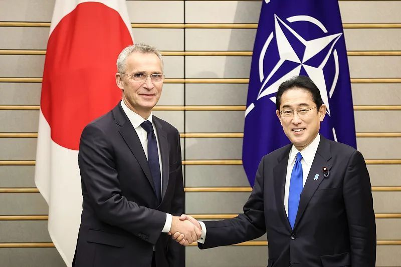

# 新动作，日本把北约引到中国家门口

据《日本经济新闻》3日报道，日本政府和北约相关人士分别在采访中透露，日本与北约拟提升合作关系，包括制定新的安全保障合作计划，并于2024年底前在东京开设联络处。

据悉，这是北约在亚洲开设的第一个联络处，用于与日本、韩国、澳大利亚、新西兰等地区主要伙伴进行定期磋商，并联络其他亚洲国家，例如印度和东盟国家。

虽然北约在世界多地设有类似联络处，如格鲁吉亚、乌克兰、波黑等，但在亚洲以及所谓“印太地区”，日本还是头一个。

参与协调的丹麦驻日大使称，此举不是“面子工程”，而是“一种非常直观、真实的方式”。

丹麦驻日本大使馆是北约在日本的联络点大使馆，丹麦驻日本大使彼得·塔克索-延森表示，设立新的联络处绝不是象征性的行为，因为北约与亚太地区伙伴保持关系非常重要。

他指出，自2010年北约发布上一版“战略概念”以来，全球地缘政治格局发生了巨大变化，曾经俄罗斯还是潜在的合作伙伴，但去年北约峰会出台的新文件将俄罗斯视为敌人。新文件还首次提到中国，宣称“中国崛起或对跨欧洲安全产生影响”。

日本庆应义塾大学综合政策系副教授鹤冈路人声称，乌克兰战争改变了北约对中国的看法。

鹤冈声称，北约在日本设立联络处将有重大意义。“这意味着，北约将通过东京的棱镜审视亚洲，包括中国。当驻日代表向北约总部发回信息时，它总是会经过东京。”

至于未来日本和北约在其中扮演什么角色，日本是否需要为联络处提供办公场所，以及北约是否为此提供资金等细节仍在谈判中。

如果日本为一个西方军事联盟的立足点提供资金，这将象征着防务合作的一个新阶段。

据悉，这项合作将在未来几周内正式确定，北约希望邀请日本首相岸田文雄出席7月的北约领导人峰会，并在此之前与日本签署“个别针对性伙伴关系计划”（ITPP），深化应对网络威胁方面的合作，协调针对新兴和颠覆性技术的立场，并就打击虚假信息交换意见。

报道称，ITPP是双方于2014年签署的“个人伙伴关系与合作计划”（IPCP）的升级版。ITPP标志着北约与“印太地区”的更深入接触。

_1月31日，北约秘书长斯托尔滕贝格(左)与岸田文雄握手。图源：视觉中国_

长安街知事（微信ID：Capitalnews）注意到，北约近来屡屡炒作所谓“中国挑战”，
北约秘书长斯托尔滕贝格在访问日本期间多次提到中国和俄罗斯的“危险”，这与日本将中国定位为“前所未有的最大战略挑战”的政策臭味相投。

在去年6月的北约峰会上，岸田文雄成为第一位出席北约峰会的日本领导人，他以俄乌冲突为由，宣称日本打算大幅提升与北约的伙伴关系，因为“欧洲的安全与亚洲的安全密不可分”。

今年1月底，斯托尔滕贝格到访日本，首次讨论了开设新联络处的想法。岸田还当面介绍了他的计划——将目前的日本驻比利时大使所兼任的驻北约代表职务独立出来，以设置日本驻北约专职大使。

4月5日，日本外相林芳正在北约外长会期间宣称，由于“中国在该地区的军事力量越来越强硬”，
日本无法独自实现安倍晋三提出的“自由开放的印太”目标，他欢迎北约成员国多多参与印太事务。

一个是冷战产物、俄乌冲突的始作俑者，搞乱了欧洲还企图搞乱亚太；一个是历史罪孽深重，不仅不思悔改，反而大肆扩军备战，盼着“亚洲有事”的“华盛顿工具”，二者的勾连愈发大胆。

正如俄罗斯总统普京今年3月在采访中所言，“西方政客谈论建立的这个新集团，就像上世纪30年代德国、意大利法西斯政权和军国主义日本所建立的轴心。”

历史和现实都表明，日本积极充当北约染指亚太的同伙，妄图借北约及其背后的美国，换取对日本“大国身份”的认可，以重塑“亚洲军政大国”地位的野心，注定是拿国运当赌注、为他人火中取栗罢了。

在4日的中国外交部例行记者会上，发言人毛宁表示，亚洲是和平稳定的高地、合作开发的热土，不应成为地缘争夺的角斗场。北约持续东进亚太、干预地区事务，势必破坏地区和平稳定，促推阵营对抗，应引起地区国家高度警惕。

