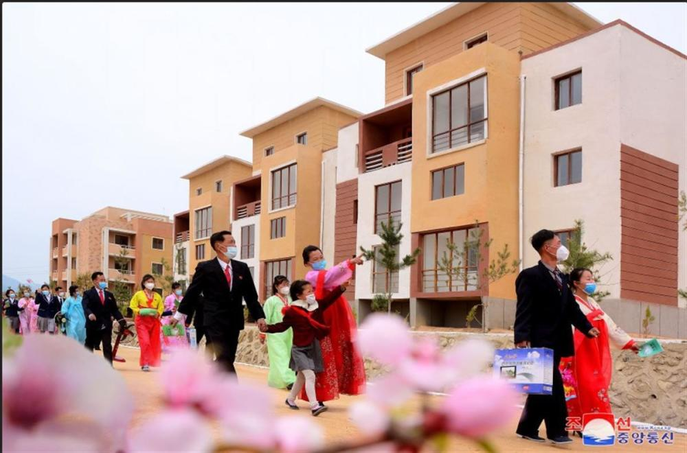

# 朝鲜多个农村迎来新房交接，村民载歌载舞庆祝

极目新闻记者 李曼英

据朝中社5月5日报道，朝鲜平安北道上坛洞、古城市、先村郡、运河那里、云东郡、东林郡宝城里等多个农村迎接新房交接庆典。

_报道截图（图源：朝中社）_

据报道，乔迁新居启动会上，先是祝贺词环节，接着是房屋使用证的发放以及相关座谈。

_报道截图（图源：朝中社）_

乔迁新居的欢乐声在村庄回荡。舞蹈表演，让村里热闹非凡。

（来源：极目新闻）

