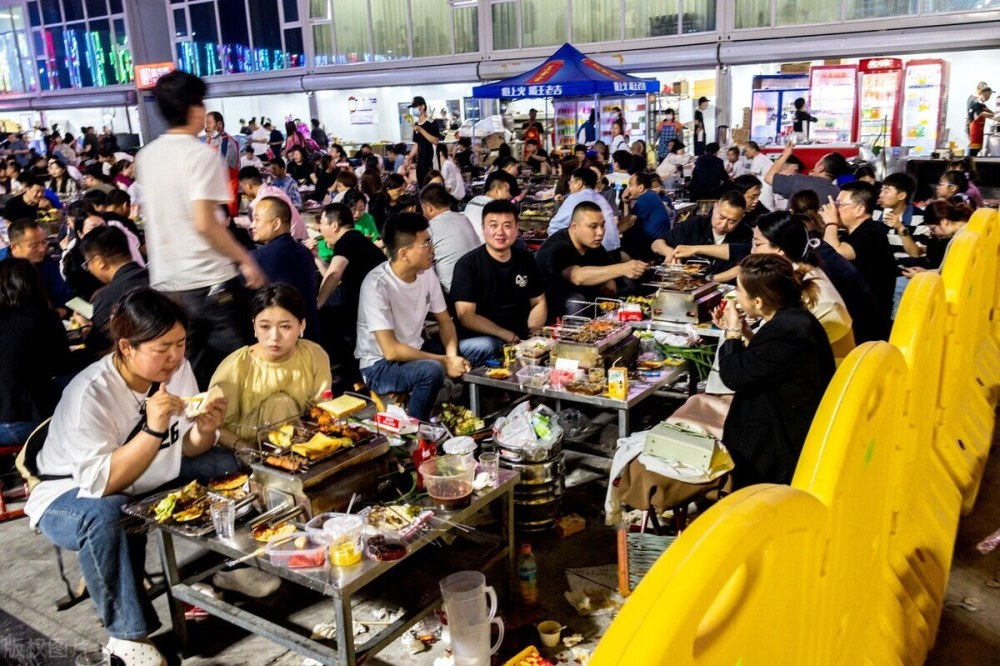

# 柯洁又口出狂言！称去淄博吃烧烤的人脑子有问题，智商堪忧

四月份，淄博烧烤突然火了，全国各地的游客争先恐后前往淄博打卡美食。数据显示，淄博“五一”整体旅游订单将较2019年上涨441%。在淄博的很多烧烤店，顾客们凌晨两三点还在排队。

近日，一向快人快语的围棋八冠王柯洁也对淄博烧烤也发表了自己的看法。

在一场直播中，柯洁直言，跟风到淄博排队吃烧烤的人脑子有问题。

柯洁表示：“最近看新闻说淄博烧烤根本吃不上，早上五六点去排队，一味难求。其实我觉得这帮人脑子应该是有问题，跑去淄博吃烧烤，花大价钱、排队挤着吃烧烤，我觉得脑子是有问题的。这帮人没有任何的自我意识，就是从众！”

“烧烤，即使是人均1500的、2000的，也没什么技术含量。大葱卷大饼，这玩意你自己不会弄吗？卷个大饼有那么难吗？无非就是把羊肉串往膜里面一夹、一扯，这不是最糙的吃法吗？我真的没法理解！”

“如果我的直播间有人在淄博排队吃烧烤，连住宿都挤不进去。我说实在话，你们的智商是堪忧的。”柯洁滔滔不绝表达自己的不解，“你为了吃一口烧烤，跑到一个城市，然后啥也没有的，我是真的难以理解，彻底陷入疯狂。我对淄博没意见，我就是无法理解这种从众心理。”

也许是言论引起争议，5月2日晚，柯洁又发布了一条动态，话锋一转盛赞淄博烧烤：“淄博烧烤天下第一！等空了有机会一定要去现场感受一下氛围，尝一口地道的淄博烧烤！”

有粉丝评论说：“我还是喜欢你桀骜不驯的样子。”

柯洁求生欲极强，回复说：“这个假期没有和众人一起在淄博享受氛围确实是一大遗憾，希望下个五一还有这样的机会。”

今天5月5日，“衢州烂柯杯”世界围棋公开赛在浙江衢州开始首轮争夺，柯洁首轮对阵赖均辅，但他因为迟到两分钟被处罚，两小时常规比赛用时被减去四分钟。

