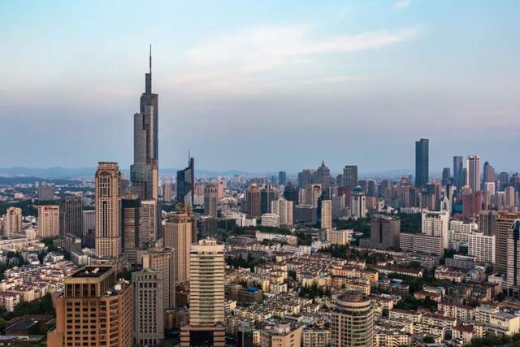

# 楼市大杀器重出江湖

房票安置政策，正成为越来越多城市的选择。

近日，南京出台房票安置办法，将政策范围扩展至主城六区，成为全面推出房票安置政策的又一省会城市。

在此之前江西省会南昌、云南省会昆明、贵州省会贵阳、河南省会郑州，以及厦门、无锡、温州等城市，已纷纷公布并实施房票安置政策。

房票安置作为特殊的货币化安置方式，被认为是将资金定向导入本地房地产市场，实现去库存的重要方式。因此，诸多城市对其寄予厚望，甚至将之视作激活房地产市场的“救命稻草”。

目前，各地普遍的做法是，将被征收房屋按货币补偿金额量化，以房票形式核发给被征收人用以抵充购房款，并给予一定的政策性奖励、契税减免、购房补贴等。

业内专家认为，房票安置有利于区域楼市定向去库存，促进房地产市场流通效率，有助于房地产市场企稳回升，但对市场的提振作用相对有限。

**为什么是“房票”**

实际上，南京2022年就先在溧水、浦口、六合等城市外围区域推行房票安置，今年则将政策范围扩展至主城六区，江北新区和新五区可参照执行，于4月18日起施行，有效期2年。这意味着房票安置办法将在南京全市推行。

4月中旬，江西南昌印发《关于推进中心城区房屋征收补偿房票安置的实施意见》，自5月11日起实施，在四个中心城区范围内全面推行房票安置。自出具房票三个月内使用买票的，给予10%的购房补助。

3月7日，厦门也推出拆迁款房票补偿政策。自房票核发之日起12个月内使用房票购房的，可按该时段实际使用的房票金额给予不高于5%
的房票购房奖励；第13个月至24个月使用房票购房的，可按该时段实际使用的房票金额给予不高于2%房票购房奖励。

除了上述这些城市之外，无锡、贵阳、重庆等多个城市，都正在公示或已经印发房票安置方案。据中指研究院监测数据，2022年以来，全国已有近30个省市（县）推行房票安置政策。

不难发现，房票安置政策正成为各地激活楼市的重要工具。

目前各城市推出的房票政策，大致遵循相同的模式，为鼓励被征收人使用房票，各地通常会给出政策性奖励、契税减免、限购放宽等优惠，有效期从6个月至24个月不等。比如，南昌发布的房票安置政策显示，用房票购买新房会有补贴，而且越早买补贴越多，足见房票政策的导向性。

部分城市还放松房票流通转让的限制。厦门允许房票进行流通转让，即在满足户人均居住面积不低于35平方米的前提下，房票可以转让给第三人使用，同时一张初始房票可以分割金额转让给多人。

易居研究院研究总监严跃进向中国新闻周刊表示，若是房票推进工作到位，房票产生的购房需求释放，保障了此类购房资金留在住房领域，刺激房地产市场去库存，带动所在区域和城市的住房消费市场。同时，也可以减轻安置房建设压力，客观上可以减轻地方政府财政压力。

而这恰恰是多地当前不得不面对和迫切需要解决的问题。

2022年以来，房地产市场处于深度调整期，不少地方楼市表现低迷，成交下行明显，虽然各地陆续出台诸如降低房贷利率、下调首付比例、放松限购等支持政策，但效果不及预期。

易居房地产研究院近日发布的《2023年3月百城住宅库存报告》显示，2023年3月，全国100个城市新建商品住宅库存去化周期为17.4个月，存销比指标已显露了下行的趋势，说明去化速度在加快。但同时，从去化周期的绝对值来看，远远大于14个月的合理值，说明尚未完全走出风险区。

以南京为例，作为长三角中心城市之一，其楼市过去一直以“稳健”著称，但去年上半年就先后13次出台楼市调控政策，逐步放开限购政策，并在外围区域推行房票安置，该政策对于加速存量房源去化起到了一定的积极作用。

据我爱我家统计数据，南京市新建商品住宅成交量3月份超过7000套，创下近15个月来的新高。但进入4月份以来，南京楼市成交量有所下滑。此外，南京的新房库存整体仍处于高位，网上房地产数据显示，目前南京的新房库存量跌破7.5万套，但依然保持在“7”字头的水平线上，同时去化速度减慢，且有大批楼盘待开盘。

_南京城市风光。图/图虫创意_

全国房地产商会联盟主席、住建部住房政策专家委员会原副主任顾云昌向中国新闻周刊表示，全国楼市总体上回暖的速度比较缓慢。他说，“去年下降幅度比较大，现在仍然在下降，但是下降幅度变小，无论是投资还是销售，显示出有回暖的趋势。”

“各地的城市情况不一样，比如一二线热点城市回暖相对较快，大多数三四线城市回暖缓慢，但都没有出现预期的强烈反弹。”顾云昌说。

易居房地产研究院前述报告也显示，截至2023年3月底，全国100个城市新建商品住宅库存面积按一、二、三四线城市分类，分别为3217、25312和22364万平方米，环比增速分别为0.7%、-0.4%和-1.0%，同比增速分别为10.0%、-2.8%和-0.7%。报告指出，部分三四线城市交易依然陷入低谷。

**能否重现高光时刻？**

实际上，“房票”并非新词，早在2015年，就有城市在棚户拆迁安置中推出房票制度。当时的房地产市场同样面对着较大的去库存压力，库存高企的鄂尔多斯、绍兴、金华、义乌、湖州等地，最具代表性。

当时，短时间内大量购房人涌入市场，有效帮助了楼市复苏。以鄂尔多斯为例，2016年1月鄂尔多斯市东胜区推出房票制度，到当年5月底，东胜区已消化住宅存量13566套、184万平方米，占住宅库存套数的40%、总面积的30%，去库存效果明显。

广东省规划住房政策研究中心首席研究员李宇嘉表示，2015年开启棚改、去库存以后，鄂尔多斯楼市逐步回归正轨。

据克而瑞统计，2015年至2017年，全国棚改开工量连续3年保持在600万套以上，高峰期拉动全国21.5%的住房销售。

不过，2018年后，随着棚改货币化权限被强制收回，房票制度暂时退出了历史舞台。

受房票安置过往成功经验的影响，有观点认为，当前的房票政策也将对楼市形成强有力的推动作用。

河南郑州，是此轮房地产去库存中，首个推行房票安置政策的省会城市。2022年6月，河南郑州发布了大棚户区改造项目房票安置实施办法。但从目前的情况来看，房票政策并未带动市场的有效恢复。

据中指院统计，郑州推出房票安置政策首月，即2022年7月，郑州商品住宅周均销售由6月前三周的1191套降至1016套，市场在6月传统旺季销售短暂回升后再次下滑，房票安置政策实施对成交无明显拉动效果。

2023年一季度，郑州楼市迎来了“小阳春”，商品住宅成交面积同比增长七成左右，其中3月成交面积超90万平方米，同比增长约一倍，环比增长近三成。但郑州库存量较大，目前仍面临较大的库存去化压力。中指研究院数据显示，截至今年2月末，郑州可售面积仍处高位，出清周期超20个月。

此外，克而瑞数据显示，3月郑州共17次开盘，推货2143套，去化829套，去化率39%。因多个优质新项目首开集中成交量高，3月开盘市整体数据优于2月。但市场整体认购量缩减近两成，积压客户需求集中入市后，客户量有所下滑。

_郑州郑东新区房楼盘建筑景观。图/图虫创意_

业内普遍认为，当前的房票安置政策的成效，已难以复刻当年的高光时刻。

严跃进表示，“从历史上看，肯定是有助于去库存，但效果并没有想象中那么好”，“没有看到哪个城市，因为房票就实现了房地产库存的去化。”

中指研究院表示，在当前市场环境下，房票安置是一种可以缓解地方政府财政短期集中支出，同时定向将资金导入本地房地产市场的去库存方式，对房地产市场的企稳回升有一定帮助。但受行业周期、棚改规模等众多因素影响，该政策对市场的提振作用相对有限。

值得一提的是，并非所有的被征收人都会选择房票安置。中指研究院指出，当前部分房企资金链仍处在较为紧张的阶段，仍不断有房企风险暴露、楼盘停工现象发生，一定程度导致房地产市场信心下滑，购房者普遍担忧所购期房能否如期交付，被征收人受此影响或更倾向于选择便于资金支配的货币补偿方式。

在顾云昌看来，当前房地产市场之所以总体回暖速度较慢，主要原因在于对市场依然缺乏信心，即便各地通过降低利率、减少首付、推出房票等各种手段激活房地产市场。

“当前很多地方政策比较雷同，没有针对本地的购房市场矛盾出台细化政策。从后续去库存的动力来说，要把有购房意愿、购房能力等群体进行挖掘，落实更实惠、更直接、更容易消化的政策，进而激活合理住房消费需求。”易居房地产研究院报告指出。

**淄博楼市火热的启示**

值得一提的是，在众多三四线城市中，近期因烧烤出圈的淄博楼市备受关注。

据淄博市新闻办披露，今年一季度，全市新建商品住宅网签面积大涨，达到120.6万平方米，同比增加61.9%；商品住宅网签均价8020元/平方米，同比上涨3.1%。

易居房地产研究院报告显示，淄博今年以来的楼市表现，在三四线城市中最热。该报告对今年1～4月份全国50个重点城市新建商品住宅成交面积同比增速进行排序。其中，楼市行情表现较好的5个城市分别为长春、杭州、南宁、淄博和惠州，同比增速均超过了50%的水平。

报告显示，2022年1月1日～4月16日淄博全市新建商品住宅成交套数为5961套，成交面积为75万平方米；而2023年1月1日～4月16日成交套数为10417套，成交面积为133万平方米，成交套数和成交面积同比增速分别为75%和77%。

淄博楼市火热，是否是烧烤带动的还难下定论。但有当地中介表示，自己的咨询量相较于去年同期增长了5倍。严跃进分析，“淄博烧烤”成为近期网友关注的热点事件，淄博城市名片就此打响，客观上增加了置业信心和置业能力。

他表示，严格来讲淄博烧烤的出圈与楼市的活跃没有直接关系，“但间接关系肯定是有的”，“无论是吃烧烤，还是卖房子，其实关键都是人，是被低估、被压抑的需求的释放，这是值得挖掘的”。

顾云昌表示，淄博烧烤的出圈，吸引更多的人前去旅游、从业，推动淄博城市经济和社会的发展，必然会增加购房需求，促进供求关系的改善。

那么，淄博现象对于其他城市来说，有没有什么借鉴意义？

顾云昌认为，关键是想办法把城市经济搞活，吸引人来。“人们现在完全是用脚投票的，什么地方能就业，什么地方收入高，什么地方生活好，就到哪里去，就看当地政府能否把优势充分发挥出来。”他说。

严跃进说，淄博烧烤的出圈背后，是对年轻人的关注。无论从房地产层面，还是对于城市发展而言，“把年轻人的工作做好，就会有很大的促进”。

作者：孙晓波

