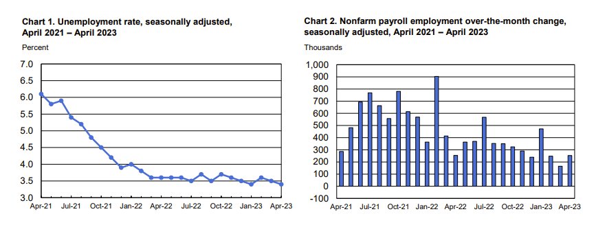

# 美国4月非农新增就业25.3万人远超预期 失业率续创1969年以来新低

**财联社5月5日讯（编辑 赵昊）** 周五（5月5日）美股盘前，美国劳工部公布的就业形势报告显示，美国4月非农超预期增长，同时失业率竟不升反降。

具体数据显示，美国4月季调后非农就业人口增加25.3万人，显著强于市场预期的18万人，表明在美联储试图放缓经济增长之际，劳动力市场依然强劲。3月份的增幅从23.6万人下修至16.5万人，2月份从32.6万人下修至24.8万人。

数据还显示，美国4月失业率录得3.4%，较3月的3.5%下降了0.1个百分点，市场先前预期该数据将升至3.6%。值得一提的是，3.4%是1969年5月以来的最低失业率，上一次达到这一水平是在今年的1月份。

就业参与率维持在62.6%不变，与预期一致，U6失业率降低0.1个百分点至6.7%。通胀的关键晴雨表——4月平均时薪环比上涨0.5%，同比上升4.4%，分别高于市场预期的0.5%和4.2%，可能令美联储在一段时间内维持高利率。

美国劳工统计局在报告中写道，在主要劳动者群体中，成年男性的失业率为3.3%，女性为3.1%；青少年为9.2%、白人为3.1%、非裔为4.7%、亚裔为2.8%和拉美裔为4.4%。

在专业和商业服务、保健、休闲和招待以及社会援助领域，就业人数继续呈上升趋势。

统计局还表示，非劳动人口中目前想找工作的人数比上个月增加了34.6万人，达到530万人。这些人不被计算为失业人员，因为他们在调查前4周内没有积极找工作，或者无法找到工作。

**市场分析**

财经网站Forexlive分析师指出，3.4%的失业率表明就业市场异常紧张，同时非农就业人数连续第13个月超过市场预期。“这无疑是一份鹰派的非农报告，让美联储陷入了真正的困境。”

两天前，美联储宣布将联邦基金利率目标区间上调25个基点，是去年启动本轮加息进程以来的第十次加息。美联储本轮已经累计将利率调高了500个基点，联邦基金利率目标区间已升至5%-5.25%，是2001年3月以来的最高水平。

同时，美联储在声明中暗示，本次加息可能是本轮紧缩行动的最后一步。财经网站Forexlive分析师表示，美联储希望暂停加息，甚至可能很快就需要降息，但就业市场并不配合。

有观点认为，虽然表面上劳动力市场依然紧张，但美联储褐皮书等证据表明，薪资压力正在缓和，JOLTS职位空缺数据也表明需求已经放缓。这就引发了一个问题——非农数据到底可不可靠？“我倾向于认为，这不足以推动美联储再次采取行动。”

美国短期利率期货交易商也认为，非农就业数据公布后，美联储6月加息的可能性很小。

另有分析称，美国股指期货的涨幅在非农公布后仅略微收窄，预示现在股市的形势似乎发生了变化。现在，强于预期的就业报告反而会让人们放心，因为这表明，在银行业动荡的压力下，经济实际上表现良好。不过，信贷形势所反映出来的情况还处于早期阶段。

《巴伦周刊》则指出，“临时支援服务业”这个月减少了23000个工作岗位。这一类别有时被当作劳动力市场走向的领先指标，因为雇主往往会先裁掉临时员工，然后再进行更大规模的裁员。

（财联社 赵昊）

