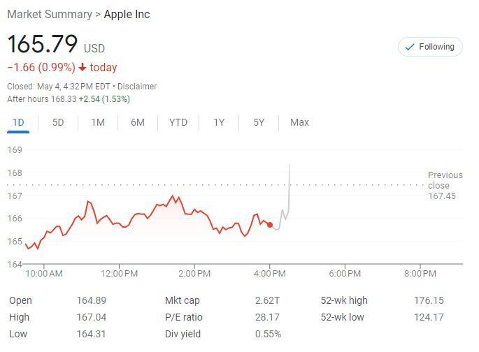
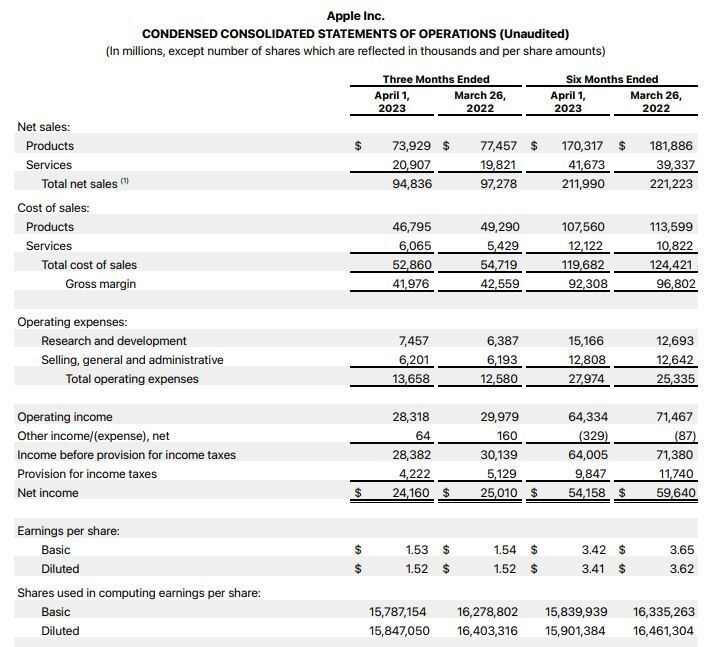
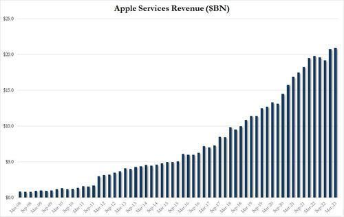
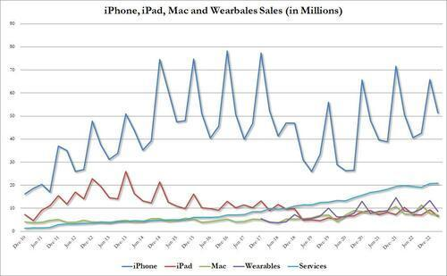
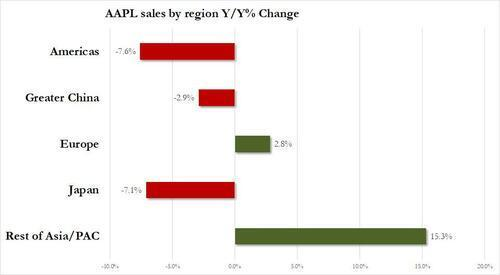

# 苹果一季报超预期，iPhone收入同比不降反升，盘后一度涨3％

5月4周四美股盘后，市值2.6万亿美元的全球最大上市公司、消费电子与科技巨头苹果发布了第二财季财报（2023自然年第一季度业绩），这也是明星科技股本次财报季的终结篇章。

苹果一季度营收948.4亿美元，高于预期的926亿美元，“拳头产品”iPhone营收513.3亿美元，高于预期且同比不降反升，服务收入再创新高，美股盘后一度涨近3%，随后涨幅收窄。

周四苹果盘初跌近2%后收跌1%，报165.79美元，从上周五所创的逾八个月新高连跌四日，但今年累涨超27%，同期标普500指数累涨6%，苹果作为成分股的道指年内转跌，纳指累涨近15%。

华尔街看好该股，FactSet统计覆盖该公司的41位分析师中，有32人（占比78%）评级为“买入”，7人评级“持有”，只有2人建议“卖出”，平均目标价为172.22美元。

四年里首次营收连续两个季度同比下滑，iPhone收入创第二财季最高，服务收入再新高

苹果第二财季总营收948.4亿美元，高于分析师预期的926亿美元，较上年同期创下的历史营收最高973亿美元下降了2.5%，公司原本预警会同比跌约5%。

**这是苹果连续第二个季度录得收入同比下滑，为2019** **年3** **月以来首次**
，第一财季收入曾为2019年来首次同比下滑，也是2016年以来的六年季度跌幅最大。

第二财季的EPS为调整后每股收益1.52美元，与上年同期持平，高于预期的1.43美元。净利润241.6亿美元，同比降超3%。毛利率44.3%，高于预期的44.1%和上年同期的43.7%。

苹果营收和盈利超预期， **主要得益于“拳头产品”** **iPhone** **智能手机的销售收入同比不降反升，并创下自然年一季度的公司历史最高，**
以及另一收入增长引擎“服务业务”收入再创新高。

当季iPhone销售额513.3亿美元，显著高于预期的489.7亿美元，同比增1.5%，市场原本预期会同比下跌3%。苹果CEO库克也称，“相对市场数据而言，iPhone收获了相当不错的季度表现。”

据数据提供商IDC估计，今年一季度全球智能手机出货量下降了14%且连续第五个季度下滑。有分析称，这说明过去几年阻碍该产品增长的零部件短缺和供应链问题终于得到缓解。

去年四季度（即苹果2023财年第一财季所在的年末重磅节假日购物期），iPhone销售额曾同比跌8%，为2020年三季度来首次同比回落，主要由于报告期内的高端旗舰手机生产被疫情中断。

目前，iPhone仍是苹果最大的收入来源，占2023财年第二财季总营收的54%，但低于上一季度的占比56%。同时，服务业务在第二财季收入209.1亿美元，占总营收比重升至22%。

**苹果的第二财季服务收入创下公司历史最高，**
环比增0.7%，至少连续两个季度都创新高，同比增5.5%，但小幅低于分析师预期的211.1亿美元，上年同期的服务收入曾大涨17%。据Visible
Alpha统计，若服务收入同比增约6%，将是至少自2017财年第一财季以来的第二低增长率。

**值得注意的是，** 最近几个季度包括App
Store、流媒体订阅、产品保修和来自谷歌等搜索引擎许可收入的苹果服务增速降至个位数百分比，虽然表明该公司利润率最高的业务仍在继续增长，但也令投资者越发担心被视为“消费者需求现行指标”的服务增长放缓。上一季度的服务收入同比增6.4%，曾创苹果年末节假日购物季历史上的同比增幅最低值。

Mac电脑收入同比跌超31%弱于预期，iPad收入降近13%，可穿戴设备下滑0.7%

其他硬件产品中，第二财季Mac电脑销售额71.7亿美元，低于预期的77.4亿美元，同比跌超31%，上年同期曾同比大增14%。

库克解释称，造成Mac销售额不佳的原因有两个：“一个是总体宏观经济形势不振，另外苹果与上年同期搭载M1自研芯片的MacBook Pro业绩对比很困难。”

据IDC统计，今年第一季度全球个人电脑出货量下降了近30%，其中苹果产品降幅高达40%。不少消费者在新冠疫情期间已经升级购买了新的电脑和手机，还有人因为高通胀或对经济衰退的担忧而削减开支，都导致电子产品销量大幅下滑。

第二财季iPad平板电脑销售额66.7亿美元，基本符合预期的66.9亿美元，同比下降12.8%，上年同期曾同比下跌2%。苹果年初曾警告称iPad销量会部分受到零部件短缺的影响。

包括无线耳机、智能手表和智能音箱在内的可穿戴设备、家居产品和配件的收入为87.6亿美元，高于预期的85.1亿美元，但同比下滑0.7%，上年同期曾同比增超12%。

加上手机在内，第二财季苹果的硬件产品营收739.3亿美元，高于预期的719.1亿美元，此前华尔街预计硬件产品销售额会同比下降7%。 **但**
**iPhone** **收入同比转涨，打破了市场对于“苹果将创该公司历史上首次所有硬件产品线的收入都同比下滑”的预期** 。

苹果大中华区收入同比跌近3%但超预期，包括印度在内的亚太地区同比增15%

**分地区来看**
，贡献了苹果近五分之一年收入的第三大市场：大中华区收入为178.1亿美元，高于市场预期的171.6亿美元，同比下滑近3%，环比跌超25%。

第一大市场美洲地区收入也同比下跌7.7%，日本市场收入同比跌7%，但第二大市场欧洲的收入增近3%，包括印度在内的亚太地区收入同比增15%至81.2亿美元。库克评价称，印度地区从安卓手机首次切换成iPhone的指标，以及首次购买苹果手机的数据“都看起来非常好”。

今年一季度，苹果在印度开设工厂来多元化供应链，将制造基地拓展到东南亚之外，有报道称，当季苹果在印度创造了近60亿美元收入，较2022年的水平增长近50%。公司还在新德里和孟买开设首家零售门店，券商Wedbush估计，到2025年印度市场将为苹果贡献年收入200亿美元。

**同时，今年一季度的亮点是：销售额仅次于美洲和欧洲的苹果第三大市场大中华区正在强势复苏** 。瑞银分析师David
Vogt发现，第三方数据显示iPhone在美国销量“特别疲软”，3月份同比下降近4%，欧洲趋势也不佳，但中国趋势加速了。华尔街寄希望于今年中国领跑电子产品需求。

券商D.A. Davidson分析师Tom
Forte预计，iPhone的中国市场销量将逆市上升，“从供应链和消费者需求的角度来看，中国经济解除疫情封锁都对苹果公司有利。”券商Wedbush分析师Dan
Ives也认为，“中国主要地区的需求明显上升”有助于推动iPhone销量增长，令其收入达标。

苹果如期授权900亿美元股票回购并提升股息，称AI功能散布在多种苹果产品中

与市场预期相符，苹果董事会批准了900亿美元的进一步股票回购，并将股息提高4%至每股24美分，高于预期的23美分。苹果称，第二财季支出230亿美元用于股票回购和股息分红。

公司CFO Luca
Maestri指出，与第一财季相比，苹果的年度同比经营业绩有所改善，产生了286亿美元的强劲运营现金流，并决定连续第十一年提高季度股息。

市场普遍认为，苹果会用大型股票回购授权来展示对自己股票的信心。在2012至2022年底的十年间，苹果用于股票回购的金额超过5720亿美元，在所有公司中位居首位。排名第二的是谷歌母公司Alphabet，过去十年回购1785亿美元股票，其董事会刚批准了今年700亿美元的回购额度。

**但苹果依旧没有给出下一季度的业绩指引，**
自2020年以来，该公司便援引经济不确定性而拒绝提供正规官方展望。有的分析师认为苹果在2023自然年第二和第三季度的收入会继续下滑，但也有人认为，苹果下一季度收入可能同比增2%至847亿美元；预计EPS为每股收益1.21美元。

库克在财报声明中提到，尽管宏观经济环境充满挑战，苹果服务收入再创新高，iPhone收入创下3月份所在季度的新高，活跃安装设备数也再破纪录。他还称苹果暂不考虑大规模裁员。

在财报电话会上，苹果公司高管提到需要围绕人工智能（AI）解决大量的问题；AI拥有无限的潜力，AI功能散布在多种苹果产品中；将继续有序地将AI融入设备中。

苹果财报为何重要？

鉴于供应改善，投资者高度关注去年四季度的iPhone 14
Pro高端型号短缺，能否顺延推动今年一季度的需求增长。作为最大消费电子巨头之一，苹果财报能反映出全球高通胀和加息时期消费者需求的变动趋势，甚至影响到外界揣测的15周年纪念版iPhone
15新机销售，因而格外重要。

在2022自然年四季度，苹果发布了iPhone 14 Plus和Pro旗舰手机系列、新款智能手表和AirPods Pro、11英寸第四代iPad
Pro、12.9英寸的第六代iPad Pro、第十代iPad和第三代Apple TV 4K。

今年一季度，该公司推出了搭载更高级自研M2和M2 Pro芯片的Mac Mini主机、搭载M2 Pro和M2 Max芯片的MacBook
Pro笔记本电脑，以及第二代家庭智能音箱HomePod。

市场等待苹果今年秋季之前推出的混合现实头显设备，以及外界传闻秋季推出的15周年纪念版iPhone 15旗舰手机和更新款智能手表Apple
Watch。还有人预言可折叠屏iPad推出在即。

华尔街怎么看？

**在看涨阵营中，** 摩根大通分析师Samik
Chatterjee认为即便苹果财报前景疲软，该公司也能以高利润率销售大量设备，符合市场青睐的“避险”定位。

他承认，苹果财报后的股价变动可能单纯是由下一季度指引推动，但该公司在宏观经济形势严峻的当下，业绩下行空间会比较有限，这一点本身便受到投资者欢迎。若苹果预言下季度收入的同比降幅不足5%，便可能被股东们视为“基本面获胜”：

“由于对全球经济的担忧，投资者年初以来纷纷涌向苹果等大型科技股。在避险情绪持续高涨的当下，对苹果股票的兴趣可能会超过这家iPhone制造商的近期基本面。

更广泛的投资者群体正转为防御型持仓，并青睐持有大型科技公司的头寸，作为对抗重大不利因素的避风港， **苹果恰好符合这种‘逃向安全’的定位。**

在‘逃向安全’的思路中，投资者认为拥有大量用户群或已安装设备基数的公司最安全，这些公司与他们运营的生态系统高度相关，将限制业绩的预期下行幅度。

具体到苹果公司而言，其拥有全球20亿部已安装设备，可以通过用户多元化和这一庞大的基础来支持用户更换设备所引领的销量趋势，进而限制销售下行空间。”

