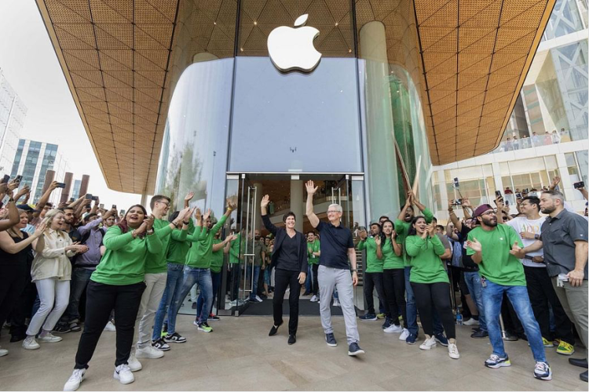
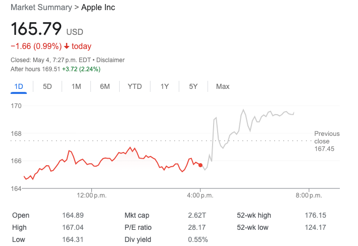

# 苹果稳了：iPhone还在热卖，大笔现金回购，没有计划裁员

在上周微软、谷歌、Meta、亚马逊还都算平稳地交出成绩单之后，苹果今天带着财报压轴登场。但显然，苹果面临的压力要比其他几个硅谷巨头要更大，因为截至目前，消费硬件相关公司的一季度业绩几乎都是一片萧条。

先是三星利润暴跌96%，创2009年金融危机以来最低记录，接着英特尔第一季度收入同比下降 36%、PC 芯片业务收入下降
38%，AMD的芯片收入在本季度暴跌了64%，昨天高通的财报显示营收整体下滑 17%，其中手机营收下滑 17%。

在疲软的消费大环境下，苹果此前也多次给市场打“预防针”，表示本季度包括iPad、Mac在内的一些核心产品销量可能会出现不同程度的下降。
**因此市场普遍认为，苹果此次的财报数据不会好看，营收同比降幅预计在4.4%左右，整个销售额会下降超过5%。**

然而，嘴上喊的凶的苹果，实际的业绩表现却并没有那么糟糕。今天苹果的财报不仅全面超出了市场预期，甚至最关键的iPhone业务不降反升。

业绩疲软但未恶化，iPhone成为重要支撑

财报数据显示， **苹果一季度录得营收948.4亿美元，高出市场预期的926亿美元，同比下降3%，摊薄后每股收益为 1.52
美元，同比持平，高于市场预期的1.42美元。** 虽然没有预期下降的那么厉害，但苹果本季度的表现也谈不上优秀，营收已经是连续第二个季度出现下降。

图片来自appleinsider

**此外，从分项业务来看，Mac和iPad业务下跌明显。其中，Mac收入71.7亿美元，同比下降 31%，iPad 收入66.7亿美元，同比下降13%。**
此前，市场调研机构IDC的研究报告就显示，今年第一季度全球PC出货量下降29%至5690万台，已经低于2019年初的水平，其中，苹果的出货量跌幅居首达40.5%。

虽然此前苹果就提前警告受零部件短缺、消费疲软和产品迭代的影响，Mac和iPad的出货量会出现下降，但此次的降幅仍然超出了市场预期。

**虽然Mac和iPad表现不佳，但好在此次iPhone用亮眼的表现“拯救”了苹果。**

iPhone本季度的表现可以说完全出乎了市场意料。此前，Canalys的最新统计数据显示，2023
年第一季度全球智能手机出货量连续第五个季度下降，同比降幅达
13%。而本季度三星电子的智能手机总销量同比下滑高达33%。因此，此前市场曾认为iPhone难以在大环境中独善其身，销量下滑难以避免。

但此次，iPhone录得营收513.3 亿美元，远超出市场预期的 488.4
亿美元，同比增长2%。增长的主要原因，一方面是随着全球工厂的全面复工，疫情期间阻碍iPhone产品的零部件短缺和供应链问题得到了缓解，另一方面则是亚太地区成为了新增长点。

本季度
**，虽然北美和大中华地区的销售额都出现了萎缩，但包括印度在内的其他亚太地区的销售额出现了15.3%的同比增长。特别是印度地区，是苹果最重要的增长点。**

图片来自华尔街见闻

本季度包括大陆、台湾和香港在内的苹果中国地区业务的销售额为 178.1 亿美元，低于去年的 183.4
亿美元。但在截至3月底的整个2022财年，苹果公司在印度地区营业收入达到了60亿美元，增长近50%。

今年一季度，苹果进一步实施多元化供应链策略，除了将制造基地拓展到东南亚之外，也在印度开设工厂，此外还在新德里和孟买开设首家零售门店，库克亲自揭幕并在印度会见了政商代表。

有分析称， **印度正在成为苹果的“下一个中国”**
。2022年，苹果包括在中国大陆、香港和台湾地区的大中华区销售额为740亿美元，约占同期苹果总收入的18%。而印度与其他亚太地区2022财年销售额仅为290亿美元，发展潜力巨大。

在财报会上，库克也专门提到了印度市场的增长，他表示“印度的转换者和首次购买者指标看起来非常好。”此前，苹果一直难以打破安卓手机在印度的垄断地位，但现在苹果明显开始在印度发力，并对其前景持乐观态度。有分析预测，到2025年印度市场将为苹果贡献年收入200亿美元。

库克在印度孟买第一家苹果公司旗舰店开幕现场，图片来自苹果官方

宣布回购900亿美元股票，没有裁员计划

除了iPhone、Mac、iPad等几大支柱产品之外，此次苹果的其他支线业务的发展状态总体比较平稳，没有太大的亮点也没有怎么拖后腿。

包括流媒体订阅、App Store 的收入、维修以及搜索许可收入等在内的服务收入为 209 亿美元，同比增长 5.5%。
**虽然刷新了历史收入记录，同时也是苹果目前利润率最高的业务线，但其增长速度明显放缓，在上一个季度之前，该板块业务一直保持着2位数的增长。**

包括 Apple Watch 和 AirPods
等耳机在内的可穿戴设备部门仍然难逃大环境的影响，家居产品和配件的收入为87.6亿美元，虽然高于预期的85.1亿美元，但同比下滑0.7%，而这一业务上年同期曾同比增长超12%。

苹果表示，本季度服务业收入、iPhone的营收也刷新了过往的一季度记录，同时活跃设备安装基数达到了历史最高水平。
**展望下一季度，苹果表示，在宏观经济环境不恶化的情况下，其业绩表现会基本与本季度相似，继续保持在平稳区间。**

总体来看，苹果对于业绩前景都持以乐观的态度。本季度，苹果已批准追加 900 亿美元用于股票回购，并连续第十一年提高了季度股息，宣布派发公司普通股每股
0.24 美元的现金股息，增幅为 4%。股息将于 2023 年 5 月 18 日支付给截至 2023 年 5 月 15 日登记在册的股东。

在这一消息的推动下，苹果股价盘后上涨超过2%。

统计显示，在过去十年间苹果用于股票回购的金额超过了5720亿美元，在所有科技公司中位居首位，而排在第二位的谷歌，过去十年回购了1785亿美元股票，不到苹果的三分之一。

针对当前火热的人工智能热潮，库克表示苹果并不会掉队，目前正在有序地将AI技术融入到产品之中。

虽然当前消费环境疲软，但市场仍然对于苹果今年的新品充满期待。其中包括传闻已久的苹果混合现实头显设备，以及猜测秋季将推出的iPhone
15周年纪念版手机，以及新款Apple Watch和有折叠屏功能的iPad等。

最后， **尤其值得注意的是，虽然科技行业一波接一波的裁员潮正在进行，但库克在此次电话会上表示，苹果目前仍然没有大规模裁员计划。**
“我认为这是最后的手段，因此大规模的裁员不是我们目前正在考虑的事。”库克说。

注：封面图来自于Pexels，版权属于原作者。如果不同意使用，请尽快联系我们，我们会立即删除。

